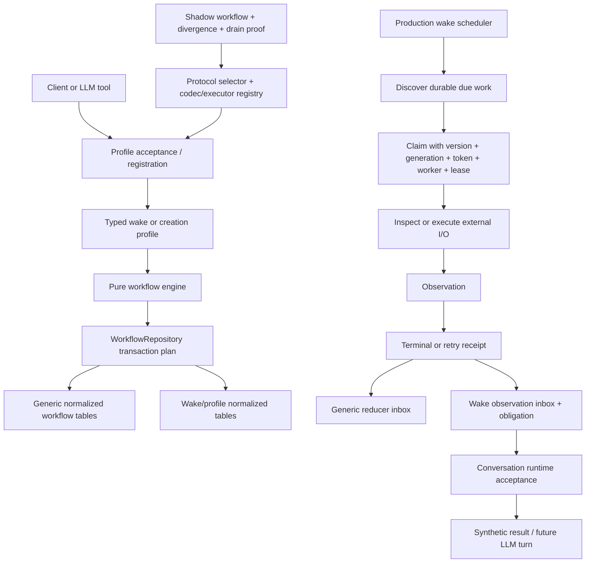
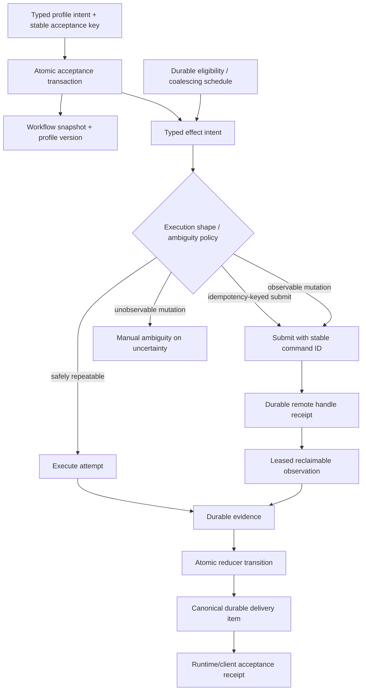

# Durable workflow grand-vision review

**Reviewed stack:** PRs [#485](https://github.com/scottopell/phoenix-ide/pull/485), [#486](https://github.com/scottopell/phoenix-ide/pull/486), [#488](https://github.com/scottopell/phoenix-ide/pull/488), and [#489](https://github.com/scottopell/phoenix-ide/pull/489)  
**Primary implementation under review:** `feat/workflow-persistence-engine-wake` at `0409841aa5`  
**Deployment target:** one Phoenix API-server binary, one bundled SQLite database, one scheduler authority  
**Decision status:** architecture review; no stack code or GitHub review comments changed  
**Evidence snapshot:** GitHub queried at `2026-07-17T21:13:00Z`; exact refs and counting method are recorded below

## Executive judgment

The durable-workflow program is solving a real problem. Phoenix accepts work whose outcome may cross process crashes, user turns, continuations, external processes, and eventual delivery back to an LLM. Durable intent, explicit ambiguity, idempotent acceptance, atomic transitions, durable deadlines, and stale-result fencing are not distributed-systems cosplay. They are the foundation of a reliable local application.

The current stack nevertheless overgeneralizes that foundation in two directions:

1. It makes **multi-worker leased authority universal**, although Phoenix has one server/scheduler authority and many effect phases do not become safely repeatable when a lease expires.
2. It makes **protocol selection, shadow authority, rollback, coexistence, and exact drain** permanent generic engine semantics, although Phoenix's chosen upgrade contract is to migrate versioned intent/evidence and restart under current semantics.

Those choices create a large state space that the implementation must keep synchronized across pure engine state, normalized generic rows, wake-profile rows, conversation state, tool state, runtime acceptance, and client projections. The review history repeatedly finds mismatches at exactly those seams. This is not an argument against correctness by construction. It is an argument that the construction currently includes states Phoenix does not need to represent.

### Recommendation

Keep a shared durable-workflow core, but narrow its contract to the current topology and actual product promise:

- one scheduler authority per SQLite database;
- workflow ownership begins when Phoenix durably acknowledges intent while still owing independently recoverable execution, observation, compensation, or delivery;
- atomic intent and transition commits;
- typed effect identity, generation, attempt, evidence, receipt, ambiguity policy, and durable eligibility time;
- explicit submit-then-observe shape for long-running remote work;
- leases only for **reclaimable phases**, where takeover is permitted by the effect's typed policy;
- one canonical durable inbox/outbox boundary for reducer/runtime delivery;
- profile kind/version plus schema migrations, not a permanent protocol deployment platform;
- coalescing latest-state schedules as an explicit first scheduling profile;
- temporary, profile-local shadow or drain tooling only when a migration's risk justifies it.

This is a middle path, not the minimal bespoke wake implementation. It preserves the reliability vision and the reusable substrate needed by direct turns, wake, creation, scheduled coordinator loops, and remote executors, while deleting machinery that pays rent only under a different deployment or upgrade promise.

## Product contract established during review

The user, acting as product oracle, selected these constraints:

| Question | Decision |
|---|---|
| Current topology | One server/scheduler authority per SQLite database |
| Remote execution authority | Remote commands use stable command IDs and receipts; remote executors do not independently claim Phoenix's database work |
| Purpose of fencing | Reject stale results and recover abandoned work; future remote execution matters |
| Lease scope | Only reclaimable work; expiry restores permission to make policy-allowed progress, not proof that an external action stopped |
| Ambiguous non-idempotent mutation | Inspect, never blindly repeat; unobservable ambiguity requires manual resolution |
| Long-running command shape | Durable submit, durable remote-handle receipt, then reclaimable observation to terminal receipt |
| Workflow adoption boundary | Durable acknowledgment while Phoenix still owes independently recoverable work |
| Direct-turn acknowledgment | After durable acceptance, keyed by client message ID |
| Scheduled-loop semantics | Latest-state/coalescing; make that behavior an explicit profile |
| Upgrade contract | Migrate versioned intent/evidence and restart under current semantics |
| Protocol rollout machinery | Move out of permanent core; retain typed profile version and migration tests |

These are product-oracle decisions from this review, not claims about the current code or normative artifacts. They imply amendments to the current requirements and Allium before implementation changes. In particular, the design-history conversation records explicit earlier selections of “lease every claimed step” and “general model, two proven workflows.” The refined decisions preserve the general shared model but narrow what a lease means and which rollout semantics are permanent.

## Architecture in the current stack

### Implementation footprint

`git diff --stat origin/main...origin/pr-488` reports 32 changed files and **15,753 insertions**. Independent `git show origin/pr-488:<path> | wc -l` counts for the principal workflow/wake source files are:

| Surface | LOC |
|---|---:|
| Pure engine, types, protocol, validation, wake profile, simulator | 5,261 |
| Pure-engine tests | 4,671 |
| Generic SQLite workflow repository | 6,609 |
| Wake SQLite adapter | 2,166 |
| Production wake runtime | 1,362 |
| **Subtotal** | **15,398 implementation + 4,671 tests** |

Counting `CREATE TABLE IF NOT EXISTS (workflow_*|wake_*)` declarations in `origin/pr-488:crates/phoenix-db/src/migrations.rs` yields **30 tables** in addition to indexes, constraints, and triggers. The generic repository exposes separate APIs for protocol registration, external acceptance, transition plans, claims, renewals, retries, manual resolution, due discovery, takeover, observations, receipts, inbox events, and divergence resolution. The wake adapter adds registration fences, registration/replay, claim, evidence, receipt, retry, deadline promotion, cancellation, lifecycle closure, continuation transfer, and scope rekeying.

Size alone is not a defect. The relevant cost is the number of independently mutable representations of one semantic operation.

## Root invariants

The following are the smallest root invariants supported by the settled product contract.

| Root invariant | User-visible failure prevented | SQLite / one-process contribution | Required mechanism |
|---|---|---|---|
| Durable acknowledgment creates one durable obligation | Phoenix says “accepted,” crashes, and silently forgets the work | One transaction and uniqueness serialize acceptance | Stable client key, intent fingerprint, typed receipt, obligation row committed before acknowledgment |
| One authoritative workflow snapshot | Runtime, scheduler, and UI disagree about what is owed | SQLite is the single durable source | Versioned typed state; profile projection derived from canonical rows or atomically committed with them |
| A stale completion cannot advance current state | Cancelled/retried work later overwrites the current turn | Conditional update serializes commit | Workflow generation + attempt identity + state/version predicate; process incarnation where useful |
| External ambiguity is never converted into guessed success | A timed-out mutation is duplicated or falsely reported complete | SQLite preserves intent/evidence but cannot observe the outside world | Structural policy: idempotency-keyed, observable/reconcilable, safely repeatable, or manual-only |
| Takeover never grants more authority than the effect policy | Lease expiry duplicates a still-running remote mutation | No database can revoke external work | Lease only reclaimable phases; takeover action constrained by typed policy |
| Terminal evidence and deadline have deterministic precedence | A command completed on time but delayed polling reports expiry | Durable timestamps and transaction order help | Authoritative occurrence time, one clock model, typed precedence |
| Delivery is durable and accepted exactly once semantically | Receipt commits but model never sees it, or sees it twice | Atomic inbox/outbox writes and unique keys | One canonical durable delivery item; idempotent runtime acceptance receipt |
| Cancellation cannot race terminal completion into contradiction | UI says cancelled while terminal output resumes the agent | A single transaction can choose the winner | Typed arbitration transition and explicit disposition of every owed delivery |
| Restart reconstructs all owed work from rows and time | Progress depends on an in-memory kick or timer | SQLite survives process loss | Durable eligibility/deadline; startup reconciliation before normal dependent operations |
| Persisted shape prevents invalid combinations | A receipt has no attempt, or profile/core rows disagree | `NOT NULL`, FK, `CHECK`, unique constraints | Normalize queryable authority and use profile-specific sum shapes where variants differ |
| Unsupported guarantees are explicit | Raw SSH appears “exactly once” after a disconnect | SQLite cannot fill an information gap | Typed `Ambiguous`/manual state and capability logging/presentation |

### Two useful derived rules

#### Workflow adoption rule

> If the initiating stack frame disappeared immediately after durable acknowledgment, would a durable row prove that Phoenix still owes execution, observation, compensation, or delivery?

- **Yes:** use a durable workflow profile.
- **No:** direct I/O is normally appropriate. Failure remains part of the current request/task and no accepted obligation survives.

This places long builds, direct conversation turns, creation, remote commands, and scheduled coordinator loops inside the perimeter. It leaves bounded reads, config loading, list queries, and indivisible SQLite CRUD outside.

External ambiguity by itself still requires sound error/idempotency handling, but it does not require a durable workflow unless Phoenix carries an obligation across the acknowledgment/crash boundary.

#### Lease rule

> A lease expires local authority; it does not terminate or undo external reality.

A lease is appropriate only when the successor action is structurally permitted:

- observation or reconciliation may be reclaimed;
- safely repeatable work may be repeated;
- idempotency-keyed work may be resent under the same key;
- an unresolved non-idempotent mutation may only be inspected or moved to manual ambiguity.

## Failure-mode matrix

| Failure | Current stack | Minimal wake-specific design | Recommended middle path |
|---|---|---|---|
| Crash before acceptance commit | No acknowledgment / rollback | Same | Same |
| Lost response after acceptance commit | External acceptance binding replays receipt | Needs explicit registration key | Stable profile acceptance key retained |
| Crash after intent, before execution | Due discovery recovers | Pending wake scan recovers | Durable obligation + eligibility recovers |
| Old local task returns after cancel/retry | Generation/token/worker/lease fences result | Row status/version CAS | Generation + attempt + state/version fence; lease only if phase reclaimable |
| Local I/O task hangs while server remains alive | Lease expiry allows takeover and reconciliation | Router timeout/retry logic | Timeout plus reclaimable-phase lease/deadline; no unconditional duplicate mutation |
| Server crashes during remote submission | Ambiguity policy + reconciliation/manual path | Usually feature-specific and incomplete | Stable command ID; submit receipt if known; inspect by ID/handle; otherwise typed ambiguity |
| Remote command continues across server restart | Profile inspection reconstructs evidence where supported | Handle-specific recovery | Submit→observe contract; remote executor owns durable command ledger |
| Missed in-memory kick | Durable earliest deadline + bounded poll | Startup/periodic scan | Durable next eligibility; kicks optimize latency |
| Evidence occurs before deadline but observed after | Typed evidence timestamp wins | Must implement handle-specific timestamp | Preserve occurrence evidence; deterministic precedence |
| Receipt commits, runtime is busy/crashes | Generic inbox + wake inbox + owed acceptance | One delivery/outbox row required | One canonical delivery item with typed acceptance disposition |
| Continuation races wake ownership transfer | Intended profile/fence machinery; current implementation has open defects | Feature-specific transaction | Transfer obligation in the same continuation transaction or use immutable delivery owner indirection |
| Binary upgrade with active work | Old protocol executor retained until exact drain | Ad hoc migration/restart | Typed profile version; migration transforms rows or makes reconciliation/manual state explicit |
| Long server downtime with recurring loop | Not a concrete profile yet | N/A | Coalesce to one latest-state occurrence; compute next schedule after completion/restart |
| Multiple server processes share DB | Designed toward competing claims | Unsupported | Explicitly unsupported by current topology; revisit storage/authority contract before enabling |

## Findings

F1–F6 are architectural interpretations and recommendations based on the observed stack plus the product decisions above. F7 is a separate exact-head merge-readiness snapshot. The report does not claim that the current normative requirements already describe the recommended narrower model; F1 and F2 explicitly recommend changing them.

### F1 — Permanent protocol lifecycle does not match the chosen upgrade contract

**Severity:** high architectural cost  
**Confidence:** high

`REQ-DWF-014`, `REQ-DWF-016`, and `REQ-DWF-019`–`022` require accepted protocol executors to remain available, selector-controlled coexistence, shadow authority, divergence inventories, rollback, exact drain proof, and mixed-authority parity. The schema and repository implement protocol selections, codecs, executors, shadow divergences, and drain-related identity.

The settled product promise is different: persist typed profile kind/version and evidence, migrate active rows, and restart under current semantics. An incompatible row must become an explicit reconciliation/manual state rather than silently disappear, but Phoenix need not execute arbitrary old protocols indefinitely.

**Why this matters:** rollout mechanisms become permanent branches in every acceptance, mutation, query, test, and profile. They increase invalid combinations even when no rollout is active.

**Recommendation:** amend the normative contract, then move selector/admission/executor-registry/shadow/drain semantics out of the steady-state engine. Do not delete the current safeguards before their replacement is normative and verified. Retain:

- profile kind and schema version on workflow rows;
- total migrations with active-row tests;
- explicit `NeedsReconciliation` or manual state for unsupported transformations;
- optional temporary profile-local shadow comparison for risky migrations;
- a migration-specific drain query only when deletion of old data/code requires it.

**What is lost:** instant selector rollback after new work has crossed the cutover, indefinite old/new executor coexistence, a generic production divergence inventory, and a universal proof that old authority is empty before code removal. Those are valuable in rolling multi-version deployments. For one stopped/restarted local binary, typed backup/migration/rollback and explicit incompatible-row handling are a better fit.

### F2 — Universal leases conflate stale-result fencing, failure detection, and retry permission

**Severity:** high semantic risk  
**Confidence:** high

`REQ-DWF-006`, task 47003, the pure engine, and `WorkflowRepository::{claim_effect, renew_claim, take_over_expired_claim}` put workflow version, generation, token, worker, and finite lease on every claimed external step.

These fields solve different problems:

- generation/version/attempt identity rejects stale commits;
- a lease suspects that an executor stopped making trusted progress;
- ambiguity policy determines what another executor may safely do.

A local lease cannot cancel a remote process or prove a timed-out mutation did not happen. Universal takeover therefore does not create universal recoverability; the policy-specific reconciliation path does.

**Recommendation:** first amend `REQ-DWF-006` and its Allium/ADR consequences, then model execution shape structurally. Until that happens, every current claimed step must retain the existing finite-lease authority contract. The replacement must preserve stale-result rejection, authority invalidation, and bounded recovery while distinguishing:

- `ReclaimableObservation` — leased and safely taken over;
- `IdempotentSubmission { command_id }` — resend only under the same key;
- `ObservableSubmission` — on uncertainty, transition to inspect/reconcile;
- `SafelyRepeatable` — repeat is permitted;
- `ManualOnAmbiguity` — no automatic retry after uncertain execution.

In the current one-authority topology, process incarnation + attempt/generation fences are enough to reject completions from pre-restart or cancelled local tasks. Keep an expiring lease only where the same live server may legitimately launch another task after a hang.

### F3 — Parallel generic and wake delivery state creates contradiction surfaces

**Severity:** high correctness risk  
**Confidence:** high

The design represents terminal delivery through generic observations/receipts/reducer inbox/owed acceptance and also through wake terminal receipts, wake observation inbox, runtime obligations, and obligation items. This is not merely normalized detail: multiple rows carry overlapping lifecycle/disposition facts and must advance together.

Current exact-head review threads repeatedly identify one side advancing without the other, including generic reducer inbox rows remaining pending after wake acceptance and cancellation inbox rows with no runtime obligation. Examples include [discussion_r3591280576](https://github.com/scottopell/phoenix-ide/pull/488#discussion_r3591280576), [discussion_r3592838057](https://github.com/scottopell/phoenix-ide/pull/488#discussion_r3592838057), and [discussion_r3592838063](https://github.com/scottopell/phoenix-ide/pull/488#discussion_r3592838063).

**Recommendation:** one canonical, normalized durable delivery item owns identity, payload codec/reference, intended consumer, disposition, and acceptance receipt, enforced with `NOT NULL`, FK, `CHECK`, and uniqueness constraints. “Canonical” does not mean an opaque JSON aggregate. Wake-specific tables may own non-overlapping typed payload detail such as bash/tmux tails, but not a second delivery lifecycle. Profile views should derive presentation from the canonical item.

### F4 — Correctness checks are duplicated appropriately in some places, but semantic state is duplicated in others

**Severity:** medium architectural cost  
**Confidence:** high

Valid duplication:

- pure engine validates a proposed transition before I/O;
- the repository repeats authority predicates inside the transaction;
- SQLite constraints remain the final structural authority.

This is defense across trust boundaries and should remain.

Invalid or costly duplication:

- core and profile inbox disposition;
- workflow terminal status and profile obligation status with independent transitions;
- protocol authority plus workflow authority plus profile binding authority where the current topology has only one active execution model;
- profile payload fields copied into multiple JSON/row projections.

**Recommendation:** use the “same semantic value, one authoritative representation” rule. Duplicate validation, not mutable truth. Every profile table must have a non-overlapping consumer contract.

### F5 — The stack's review history is evidence of both rigor and complexity-induced defects

**Severity:** medium program risk  
**Confidence:** high

The four PRs contain 953 top-level inline review comments/findings in the cached corpus: 282 on #485, 308 on #486, 238 on #488, and 125 on #489. Automated review repeatedly revisited the same categories:

- lifecycle, cancellation, and terminal arbitration;
- observation, receipt, inbox, acceptance, and delivery linkage;
- authority/generation/claim/lease fencing;
- deadline, retry, and polling semantics;
- shadow projection and divergence;
- schema/identity/codec parity.

Many findings were fixed, some are duplicates, and the volume partly reflects unusually aggressive repeated review. It is therefore not a defect count. It is evidence that the hardest failures cluster at boundaries created by the model itself.

The correct response is not less testing. It is to reduce the number of independently representable facts so fewer tests are required to prove they agree.

### F6 — The user-facing outcome remains the program's real completion gate

**Severity:** high product risk  
**Confidence:** high

PR #485's central program log frames #485–#489 as infrastructure that does not deliver the intended user outcome independently. Its acceptance sentence is:

> The agent kicked off a 40-minute build, parked without burning a turn, I could see the pending wait from any client, and the conversation woke itself when the build finished.

PR #488 intentionally has no complete public SSE/status/resume surface. Current review threads also flag missing registration status events and per-contract cancellation. The architecture should be judged by how cheaply and reliably it delivers this sentence, not by engine milestone completeness.

**Recommendation:** do not expand adoption to another I/O boundary until the wake vertical slice is observable and proven end-to-end from at least two clients.

### F7 — PR #488 is not merge-ready independently of the architecture decision

**Judgment:** not merge-ready at the reviewed snapshot  
**Confidence:** high for thread status; individual comments require normal triage

At `2026-07-17T21:13:00Z`, a paginated GitHub GraphQL `reviewThreads` query reported 242 review threads on #488, with 74 live unresolved and non-outdated. Several are duplicate rediscoveries, but current high-confidence themes include:

- continuation commit and wake ownership transfer are not one transaction ([discussion_r3592745449](https://github.com/scottopell/phoenix-ide/pull/488#discussion_r3592745449));
- execution receipts can be persisted without an attempt under the current schema constraint ([discussion_r3606115910](https://github.com/scottopell/phoenix-ide/pull/488#discussion_r3606115910));
- wake acceptance can persist `LlmRequesting` before CAS-accepting the owed item ([discussion_r3592745441](https://github.com/scottopell/phoenix-ide/pull/488#discussion_r3592745441));
- generic and wake inbox states can diverge after acceptance;
- cancellation can create durable evidence without deliverable runtime obligation;
- the complete user-facing status/cancel surface is absent.

Do not post or resolve comments mechanically. Re-triage exact-head threads after the architecture decision because simplification may delete several affected paths.

## Three coherent models

| Dimension | Current stack | Minimal one-process wake | Recommended middle path |
|---|---|---|---|
| Scope | General engine + permanent rollout platform | Wake contracts only | Shared crash-spanning obligation engine |
| Durable acceptance | Strong, typed, idempotent | Registration uniqueness | Strong, typed, profile acceptance key |
| Execution authority | Version + generation + token + worker + lease universally | One router + row CAS | Generation + attempt universally; lease only reclaimable phases |
| Ambiguity | Excellent typed family policy | Hand-coded per handle | Typed policy retained and tied to execution shape |
| Persistence | 30 generic/wake tables | Roughly contracts + delivery + typed payload tables | Normalized canonical workflow/effect/attempt/evidence/receipt/delivery plus profile intent/payload |
| Delivery | Generic inbox plus wake inbox/obligation | One wake outbox | One canonical typed delivery item |
| Upgrade | Old protocol remains executable to exact drain | Current code interprets rows | Typed profile version + migrations + explicit incompatible state |
| Rollout | Selector, shadow, divergence, rollback, drain | Feature flag/manual | Temporary profile-local shadow when justified |
| Scheduled loops | Possible but not concrete | Separate scheduler likely | Explicit coalescing schedule profile over same obligation core |
| Remote executors | General lease vocabulary, no settled executor protocol | Redesign needed | Stable command ID; submit receipt; reclaimable inspect; manual ambiguity fallback |
| Invalid-state surface | Largest | Smallest, but duplicates future scheduler | Moderate and aligned with actual promises |
| Feature tax | High | Low per wake, high when second workflow arrives | Moderate; profile implements intent/reducer/reconciliation, not deployment platform |
| Operational debugging | Rich but distributed across many rows | Simple but feature-specific | Canonical timeline by obligation/effect/attempt/evidence/receipt/delivery |

### Why not choose the minimal model?

A three-table wake router can make bash/tmux waiting reliable in one process. But Phoenix already has multiple crash-spanning protocols: creation, direct turns, wake, and soon scheduled coordinator work. Building each as its own scheduler repeats the exact acceptance, deadline, ambiguity, recovery, and delivery bugs the shared engine is intended to eliminate.

The reusable engine is justified. The permanent distributed rollout substrate is not.

## Recommended core model

### Suggested canonical entities

This is a conceptual target, not a demand to rewrite all migrations in one pass:

1. **workflow** — ID, profile kind/version, authority scope, status, generation, state version, typed profile-state reference.
2. **acceptance binding** — scoped client key, intent fingerprint, workflow ID, typed receipt.
3. **effect** — stable ID, workflow/generation, family/version, role, execution shape, ambiguity policy, status, next eligibility.
4. **attempt** — effect ID, ordinal, process incarnation, attempt token, status; optional lease only for reclaimable attempts.
5. **evidence/receipt** — typed immutable facts linked to exact effect/attempt or explicit manual origin.
6. **delivery item** — exact source receipt, consumer, payload codec/reference, disposition, acceptance receipt.
7. **profile intent/payload tables** — only non-overlapping domain data, such as wake target identity or terminal tail detail.
8. **schedule** — profile-owned schedule policy and next occurrence; first policy is `CoalesceLatest`.

DAG dependencies, barriers, compensation, and manual resolution remain justified when a profile uses them. They need not be mandatory fake structure for single-step workflows.

## Scheduled coordinator loops

The immediate use case is a latest-state loop, not a ledger of every missed tick.

A suitable profile contract is:

- persist schedule identity, profile/version, next eligible time, and `CoalesceLatest` policy;
- at most one active occurrence per schedule;
- downtime or repeated kicks coalesce into one due occurrence;
- when that occurrence reaches a terminal disposition, compute the next time from current durable state;
- missed ticks are not backfilled as independent business events;
- kicks only reduce latency;
- coordinator state mutation remains reducer-owned and atomically linked to the occurrence receipt/delivery.

Do not add cron catch-up modes, occurrence backlogs, or distributed scheduler ownership until a named product use case requires them. The profile abstraction is still valuable because it makes coalescing explicit rather than accidental.

## Remote executors and environments

The future remote-executor seam should be a command protocol, not shared database leasing.

### Required contract

1. Phoenix durably accepts typed intent and allocates a stable command ID.
2. The executor's `submit(command_id, spec)` is idempotent or returns a typed conflict for changed intent.
3. The executor durably records command ID before or atomically with starting the command.
4. Phoenix persists the returned remote handle/submit receipt.
5. Observation is a separate reclaimable phase: `inspect(command_id or handle)`.
6. Terminal evidence includes executor identity, command ID, occurrence time, exit/result metadata, and output handles.
7. A disconnect before a submit receipt triggers inspection by command ID; if the executor cannot answer authoritatively, the workflow becomes `Ambiguous`, not automatically retried.
8. Raw SSH can be a transport, but raw `ssh host command` without a remote command ledger cannot promise recoverable exactly-once submission.

This design supports SSH-backed and container-backed environments without pretending the remote machine participates in SQLite's lease authority.

## Keep / simplify / delete / defer

### Keep

- pure deterministic reducer/decision logic;
- stable typed IDs and profile-owned semantics;
- external acceptance keys and intent fingerprints where clients retry;
- atomic transition plans and failpoint/crash tests;
- normalized authority, attempts, evidence, receipts, deadlines, and delivery;
- generation/version/attempt stale-result fencing;
- explicit ambiguity policies and manual resolution;
- durable deadlines with optimization-only kicks;
- deterministic evidence-versus-deadline precedence;
- database constraints as final authority;
- reducer-derived capabilities and cross-client presentation parity;
- submit→observe shape for remote long-running work.

### Simplify

- claims: separate attempt identity from optional reclaimable lease;
- worker identity: represent one scheduler/process incarnation today, not an implied cluster member;
- delivery: collapse generic/wake inbox and obligation lifecycle into one canonical item;
- profile persistence: retain only non-overlapping intent/payload data;
- scheduler: one authority, one due-work loop, profile-specific eligibility policy;
- profile interface: intent validation, transition/reduction, effect policy, payload codecs, and presentation—not executor registration/deployment lifecycle;
- DAG/barrier use: capability-driven rather than universal ceremony.

### Delete from permanent core after normative replacement and migration verification

These are not safe mechanical deletions under the current requirements. Each requires the profile-version/migration/manual-reconciliation replacement described above, plus proof that no accepted current workflow depends on the removed state.

- active protocol selector;
- permanent profile executor registry;
- accepted-work retention of arbitrary old executors;
- generic shadow authority and authoritative/shadow workflow pairing;
- generic divergence severity/action lifecycle;
- universal rollback selector;
- universal exact drain proof;
- mixed-authority semantic parity as a steady-state invariant;
- independent inbox consumer framework until a concrete second durable consumer exists.

Temporary migration tools may reintroduce narrowly scoped shadow comparison or drain inventory without making every workflow permanently carry those states.

### Defer

- multiple Phoenix server processes sharing workflow storage;
- remote executors claiming the Phoenix database directly;
- every-missed-occurrence scheduling;
- public workflow language/plugin registry;
- migration of bounded direct I/O;
- broad runtime adoption before wake's complete user journey ships.

## Sequenced path

### 0. Stop expansion and establish the revised contract

- Treat this review's oracle decisions as proposed normative changes.
- Do not merge #485's current universal lease/protocol lifecycle unchanged.
- Do not start another profile conversion while #488 lacks its user-facing completion surface.

### 1. Amend the normative stack base

Revise the durable-workflow requirements/Allium/ADRs so they state:

- one scheduler authority per SQLite database;
- the durable-acknowledgment adoption boundary;
- attempt fencing separately from optional reclaimable leasing;
- takeover constrained by execution shape/ambiguity policy;
- profile kind/version + migration contract;
- protocol shadow/drain as migration-local, not permanent core;
- canonical single delivery disposition;
- submit→observe remote command model;
- coalescing schedule profile.

This must happen before implementation simplification so code is not made to contradict current normative artifacts.

### 2. Reshape the pure engine before persistence hardens

- Split `ClaimAuthority` into universal attempt authority and optional reclaimable lease authority.
- Remove selector/shadow/drain transitions from the steady-state `WorkflowState`.
- Preserve effect DAG, transition validation, ambiguity, cancellation/compensation, deadlines, manual resolution, and simulator schedules.
- Add schedules proving a lease expiry never authorizes a policy-forbidden duplicate mutation.

### 3. Simplify unreleased migrations and repository APIs

Because migrations 041–043 are unreleased, change them rather than creating compatibility debt:

- remove protocol selector/codec/executor and generic shadow tables unless another released consumer exists;
- collapse overlapping delivery lifecycle rows;
- make attempt/receipt origin constraints structural;
- make leases nullable only through a typed table split or variant-specific child table, not a convention-heavy nullable tuple;
- retain profile version, acceptance binding, workflow/effect/attempt/evidence/receipt/delivery, and wake payload tables;
- rerun FK checks, failpoint tests, and true multi-connection SQLite races.

### 4. Repair the wake vertical slice against the smaller model

- atomic registration/checkpoint behavior;
- exact continuation ownership transaction;
- cancellation/terminal arbitration and delivery;
- one acceptance disposition;
- pending/status REST + SSE projection;
- per-contract cancellation;
- web, iOS, and `phoenix-client.py` presentation parity;
- real end-to-end build park/wake test across at least two clients.

Triage the 74 live #488 threads after the rewrite; close only those made obsolete or concretely fixed.

### 5. Convert direct turns

Use client `message_id` as the stable acceptance key. Atomically persist turn intent and workflow obligation before returning accepted. Keep runtime acceptance and terminal delivery explicit; do not infer owed work from transcript shape or `LlmRequesting`.

### 6. Add the coalescing schedule profile

Prove one coordinator loop end to end. Do not add missed-tick replay modes until needed.

### 7. Add a remote executor protocol experimentally

Start with one executor that provides durable command-ID deduplication and inspection. Treat raw SSH uncertainty as typed ambiguity. Validate server restart, observer takeover, disconnect during submit, duplicate submit, and manual resolution before generalizing environments.

## Final adversarial conclusion

The grand vision is sound when stated as:

> Phoenix should never acknowledge crash-spanning intent without durable proof of what it owes, and it should never convert uncertainty at an external boundary into an invented success or unsafe retry.

The current stack goes beyond that vision by embedding a generic multi-version deployment and universal leased-worker model into a single-authority local product. That extra machinery does not merely cost code. It creates more authorities, dispositions, and lifecycle combinations that must agree, and the review history demonstrates the resulting defect pressure.

The right correction is not to retreat to ad hoc callbacks or a wake-only table. It is to make the shared engine smaller and more truthful:

- durability begins at acknowledgment;
- attempts fence commits;
- leases only authorize reclaimable progress;
- ambiguity policy governs external recovery;
- one row family owns each semantic fact;
- migrations own version evolution;
- profiles own product meaning;
- the engine owns only execution facts that every admitted profile genuinely needs.

That model still supports the stable-software ambition. It is more likely to achieve it because fewer incorrect states are representable in the first place.
