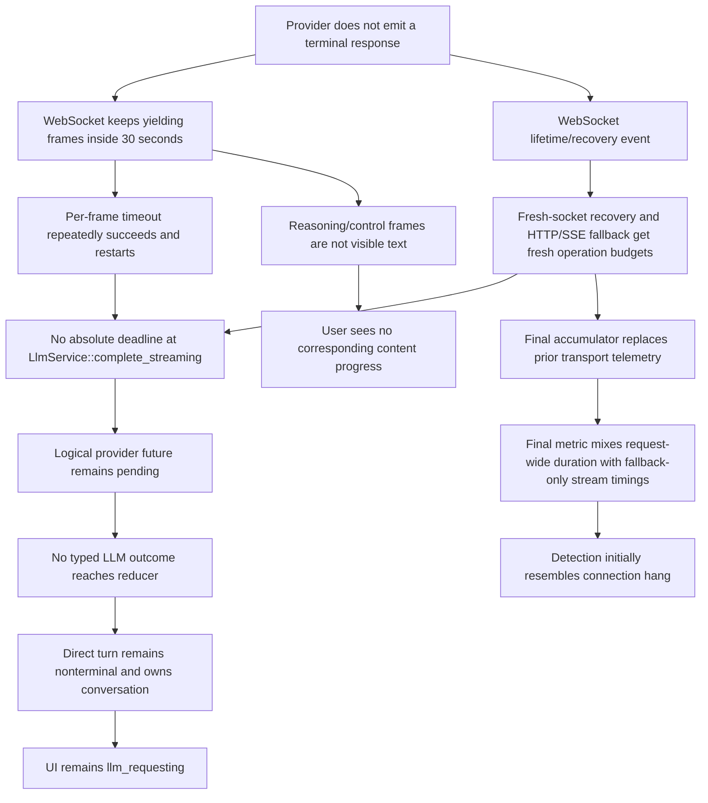

# Postmortem: unbounded LLM request retained direct-turn ownership for 72.2 minutes

- **Incident date:** 2026-09-09
- **Severity:** P0
- **Status:** Root cause validated; remediation implementation paused pending review of this postmortem
- **Affected request:** `d0fbdd57-c131-4175-b4ab-e90b8be38613`
- **Affected durable turn/workflow:** turn `1293`, workflow `1471`
- **Affected conversation:** `c4fa51ec-8853-4354-83a2-bc1631ca268c`
- **Production action taken:** none; the request completed without intervention
- **Production evidence policy:** the conversation, WorkScope, turn, workflow, request, and their persisted rows remain read-only evidence

## Executive summary

An OpenAI/Codex streaming request remained nonterminal for `4,329,732ms` (about 72.2 minutes). Phoenix stayed alive and continued to await the provider operation. The request ultimately succeeded after the WebSocket path ended, Phoenix attempted its supported fresh-socket recovery, and the adapter fell back to HTTP/SSE.

The first violated boundary was `LlmServiceImpl::complete_streaming`: it owned the logical provider attempt but imposed no absolute total deadline. Lower layers had guards for individual connection, send, frame-read, and HTTP operations. Those guards did not compose into a bound on the logical operation:

1. every WebSocket `socket.next()` received its own 30-second timeout;
2. any text, ping, pong, binary, or other frame completed that individual wait and started a fresh 30-second wait;
3. a WebSocket lifetime/reconnect event started another socket operation rather than consuming a shared budget;
4. fallback created a new HTTP client request with a fresh per-request timeout;
5. no deadline surrounded the sequence from original dispatch through WebSocket activity, reconnect, fallback, SSE parsing, and terminal normalization.

Therefore an active-but-nonterminal provider stream could keep a direct turn owned indefinitely. The state machine and UI did not invent a completion: they correctly remained in `llm_requesting` while no typed result existed. However, the UI label and current telemetry could not distinguish “no response bytes” from “provider is emitting non-visible reasoning/control traffic,” and neither surface reported that the logical request had exceeded an expected lifetime.

A deterministic virtual-time reproduction now demonstrates the incident class against the actual OpenAI per-frame guard and Responses accumulator. It advances 72.16 minutes in 0.02 seconds of wall time, emits reasoning-only events that never become visible text, proves each 15-second event evades the 30-second frame timeout, replaces the stream accumulator at simulated fallback, and completes with the incident’s `288 provider / 282 generation / 0 visible text` final-stream profile. This is reproduction evidence only; it does not prove the proposed deadline fix.

## Impact

### User impact

- The conversation remained busy and retained by one accepted direct turn for about 72.2 minutes.
- The user could not start ordinary follow-up work while the turn owned the conversation.
- The UI continued to present the request as `llm_requesting`; no deadline failure, retry state, or actionable terminal error appeared.
- No visible-text events were recorded for the final stream segment, so the user had no corresponding textual progress signal.
- The request eventually completed successfully; there is no evidence that this incident duplicated a Phoenix turn, assistant response, or tool execution.

### Data and correctness impact

- Durable acceptance was preserved: turn `1293` remained the one accepted turn.
- Conversation ownership remained held while the provider task was nonterminal, then was released through normal completion.
- The final metric was persisted as `outcome=success` and `stream_completed=1` after the provider returned.
- No production recovery or mutation was performed.
- The defect was liveness, status clarity, and observability—not proven durable data corruption.

## Evidence inventory

| ID | Evidence | What it establishes | Limit |
|---|---|---|---|
| E1 | Production log entries keyed by request `d0fbdd57-c131-4175-b4ab-e90b8be38613` in `~/.phoenix-ide/prod.log` | Initial Codex WebSocket dispatch; late WebSocket failure/recovery/fallback; final success | Logs do not record every received WebSocket frame |
| E2 | Final `llm_request_metrics` row for the request | `4,329,732ms` total; first provider event `1,642ms`; first generation event `22,418ms`; `288/282/0` event counts; max gaps `18,733/13,731ms`; mixed output; completed success | The row combines logical-request duration with the final transport accumulator; it is not a full cross-transport event history |
| E3 | Durable turn `1293`, workflow `1471`, terminal-obligation, and conversation rows | The accepted turn retained ownership/nonterminal status during the incident and later completed/released ownership | Point-in-time inspection after completion cannot reconstruct every intermediate row value |
| E4 | Process status and production log continuity | Phoenix remained alive; there was no server restart or manual recovery causing completion | Does not prove every executor task was scheduled continuously |
| E5 | `openai::complete_codex_websocket`, `openai::complete_streaming`, `LlmServiceImpl::complete_streaming`, `LlmAttemptCapture`, and runtime `Effect::RequestLlm` / `llm_request_generation` | Exact timeout, fallback, metric-finalization, and generation-fencing behavior | Repository source describes the deployed behavior only where corroborated by production logs/metrics |
| E6 | `openai::tests::per_frame_timeout_does_not_bound_a_72_minute_logical_attempt` | Deterministically reproduces the unbounded class and final telemetry shape using Tokio virtual time and the real Responses accumulator | Models the transport handoff; it does not reproduce the upstream provider’s unknown frame types or exact failure reason |

## Timeline

All wall-clock times are UTC. Derived timestamps are marked **derived** rather than presented as independent log observations.

| Time | Event | Classification | Evidence |
|---|---|---|---|
| `08:43:49` | Phoenix dispatched request `d0fb…` through the Codex Responses WebSocket path. The accepted direct turn entered/continued `llm_requesting` and retained conversation ownership. | Observed | E1, E3 |
| `08:43:49`–`09:55:12` | The WebSocket operation remained nonterminal. The 30-second `socket.next()` timeout did not cause the logical request to return. Given the code’s per-frame guard, frames must have continued to satisfy individual waits; their exact types and counts are unknown. Ping/pong/control/binary frames are sufficient and are not included in Responses stream telemetry. | Causal inference | E1, E5 |
| During the WebSocket interval | No outer service deadline expired because none existed. Any successful frame read restarted the per-frame wait. | Causal finding | E5, E6 |
| Near `09:55:12` | The WebSocket path reported a lifetime/transport failure. Phoenix exercised the adapter’s one fresh-socket recovery path where applicable, then selected full HTTP/SSE fallback because no public WebSocket text had made replay unsafe. | Observed at operation level; exact upstream frame/error wording remains unknown | E1, E5 |
| About `09:55:12.7` | HTTP/SSE fallback began with a new Responses accumulator and a fresh HTTP operation timeout. | Derived from the fallback log and final completion | E1, E2, E5 |
| About `09:55:14.3` | First provider event of the **final HTTP/SSE segment** (`+1,642ms` from that accumulator’s dispatch). | Derived | E2, E5 |
| About `09:55:35.1` | First generation event of the **final HTTP/SSE segment** (`+22,418ms`). It was not visible text. | Derived | E2, E5 |
| `09:55:12.7`–`09:55:59.3` | The final segment emitted 288 provider events and 282 generation events, zero visible-text events, with maximum provider/generation gaps of 18,733/13,731ms. | Observed metrics | E2 |
| About `09:55:59` | HTTP/SSE delivered a terminal successful mixed response. `LlmAttemptCapture` combined the final stream snapshot with total elapsed time since the original logical attempt began and persisted `outcome=success`, `stream_completed=1`, `total_duration_ms=4,329,732`. | Observed plus source-backed interpretation | E1, E2, E5 |
| After provider success | The current-generation result traversed the reducer/durable settlement path. The direct turn/workflow became terminal and released conversation ownership. | Observed final state | E3, E5 |

### Why the metric timestamps do not describe the first 71 minutes

`LlmAttemptCapture::begin` starts the total-duration clock once. Each `ResponsesStreamAccumulator`, however, starts its own stream-event clock. When `openai::complete_streaming` abandons WebSocket and executes HTTP/SSE, the successful HTTP response supplies the final `stream_telemetry`; `LlmAttemptCapture::finalize` stores that final accumulator beside the original total-duration clock.

Consequently:

- `total_duration_ms=4,329,732` spans WebSocket plus recovery/fallback plus HTTP/SSE;
- `dispatch_to_first_provider_event_ms=1,642`, event counts, and max gaps describe the final successful accumulator, not necessarily the original WebSocket interval;
- the final row cannot identify the WebSocket frame types or event cadence that kept `socket.next()` live;
- interpreting `first_provider_event=1,642ms` as “the original request received its first provider event after 1.6 seconds” would be incorrect for a fallback request.

This mixed clock domain is an observability defect and a major reason the incident initially resembled a connection hang.

## Facts, causal findings, contributing factors, and unknowns

### Observed facts

1. One logical request lasted 4,329,732ms and eventually succeeded.
2. Phoenix remained alive; no restart or manual intervention completed it.
3. The request started on Codex WebSocket and ended through HTTP/SSE fallback.
4. The final stored stream segment contained 288 provider events, 282 generation events, zero visible-text events, and a terminal completion.
5. The durable turn remained owned/nonterminal during the long request and later completed.
6. The UI showed `llm_requesting` while the runtime awaited a typed provider result.
7. Existing OpenAI guards covered connect/handshake, send, each WebSocket frame wait, and each HTTP request, but no guard covered the whole logical attempt.
8. Existing tests covered a silent frame timeout and safe fallback, but not an indefinitely active nonterminal stream or the sum of WebSocket/reconnect/fallback durations.

### Causal findings

1. **First violated boundary:** `LlmServiceImpl::complete_streaming` awaited `complete_streaming_inner` without an absolute deadline. This was the first layer that owned the whole provider attempt and therefore the first layer capable of bounding it without introducing competing transport timers.
2. `complete_codex_websocket` applies `timeout(CODEX_WS_FRAME_TIMEOUT, socket.next())` inside the loop. That bounds one wait, not the loop. Every received frame starts another full wait.
3. WebSocket recovery and HTTP/SSE fallback are sequential sub-operations. Each begins without subtracting elapsed time from a shared budget.
4. The reducer cannot terminalize a provider attempt for which it has received no typed success/error/cancellation outcome. It therefore correctly retained `llm_requesting` and durable ownership under the implemented semantics.
5. Since ownership remained held, the liveness defect propagated from provider wait to durable turn and UI even though those layers were not independently hung.

### Contributing factors

- Non-visible reasoning/control traffic counts as transport progress but gives the user no textual progress.
- Ping, pong, binary, and frame messages satisfy `socket.next()` yet are skipped before `ResponsesStreamAccumulator`; they are invisible to request telemetry.
- The fallback accumulator replaces the WebSocket accumulator in final metrics, while total duration remains request-wide.
- `llm_request_metrics` is written at terminalization; there is no durable in-progress row or alertable deadline state while a request is live.
- The transport has a safe local cancellation marker for dirty WebSocket reuse, but no owner invokes it on total request expiry because total expiry does not exist.
- Retry policy is finite only after an error reaches the state machine; it cannot help an attempt that never returns an error.
- Test infrastructure in `phoenix-llm` did not enable Tokio virtual time, and tests exercised silence rather than active nonterminal traffic.

### Unknowns

- The exact type and cadence of WebSocket frames during the first roughly 71 minutes. They may have been reasoning deltas, provider control frames, WebSocket ping/pong, binary frames, or a mixture.
- The provider’s internal reason for remaining nonterminal that long.
- The exact upstream error payload that ended the original WebSocket lifetime and whether the fresh-socket recovery failed before or during request transmission.
- Whether any hidden WebSocket generation output existed before fallback. The adapter’s fallback proves no public text was emitted, but hidden reasoning/control telemetry was not preserved across the handoff.
- Whether the same upstream request continued server-side after Phoenix abandoned the WebSocket. Phoenix cannot provide provider-side exactly-once execution.
- The number of other historical attempts affected; final-only metrics cannot reliably identify cross-transport active-stream incidents.

## Causal graph



## Five whys

1. **Why did the conversation remain `llm_requesting` for 72.2 minutes?**
   Because the in-flight LLM future did not produce a terminal outcome for 72.2 minutes.
2. **Why did the LLM future remain pending?**
   Because WebSocket activity kept individual frame reads alive, and later recovery/fallback continued the same logical attempt.
3. **Why did the frame timeout not stop it?**
   Because it was an idle/per-read timeout inside the loop, reset by every frame, not an absolute deadline.
4. **Why did reconnect/fallback not consume the original budget?**
   Because no typed budget/deadline was captured at service dispatch and passed across transports; each operation owned only its local timeout.
5. **Why did durable workflow recovery/retry not repair liveness?**
   Because retry and terminal settlement begin only after a typed error arrives. The owning provider boundary never synthesized a timeout error, so generation fencing and durable settlement had nothing to arbitrate.

## UI and state analysis

### What was correct

- `llm_requesting` remained the reducer truth while a provider result was outstanding.
- The UI did not fabricate success, failure, or terminal content.
- Durable ownership prevented a second ordinary turn from overlapping the accepted turn.
- Non-visible reasoning did not get mislabeled as visible assistant text.

### What was misleading or insufficient

- “Awaiting LLM response” conflated “no first byte,” “provider active with hidden reasoning/control traffic,” and “provider operation beyond expected lifetime.”
- Provider/generation progress was not projected to the UI unless it became a visible text token or another explicitly supported chunk.
- There was no bounded transition from `llm_requesting` to retry/terminal failure.
- The UI could display elapsed time but had no authoritative deadline or terminal timeout classification.

The UI state was therefore internally consistent but operationally incomplete. The defect is not that it stayed in `llm_requesting`; the defect is that the owning backend boundary allowed that state to remain valid indefinitely.

## Durable turn, workflow, and metrics lifecycle

### During the incident

1. The direct turn had already been accepted durably and owned the conversation.
2. `Effect::RequestLlm` dispatched one process-local provider task for the current `llm_request_generation`.
3. Provider telemetry was accumulated in memory through `LlmAttemptCapture` and per-transport `ResponsesStreamAccumulator` objects.
4. No typed result reached `handle_outcome`, so no retry, terminal obligation, response commit, or ownership release could occur.
5. The workflow/runtime-delivery record could establish that runtime work had been accepted, but it did not make the remote provider operation itself a durable externally reconciled effect.
6. No final `llm_request_metrics` outcome existed to alert on while the request remained live.

### After completion

1. HTTP/SSE returned one complete mixed response.
2. The request capture finalized as success and the executor persisted the metric row.
3. The current-generation outcome entered the normal reducer path.
4. Existing generation checks prevented stale task results from mutating state; no competing result was observed in this incident.
5. Durable terminal settlement completed the accepted turn and released conversation ownership.

### Crash/recovery implication

Had Phoenix crashed before the response commit, recovery could legitimately redispatch remote computation for the same accepted durable turn. Phoenix’s durable identity, canonical message identity, generation fencing, and atomic terminal settlement are the mechanisms that must prevent duplicate Phoenix-side commitment. They do not currently bound how long a live process may await one provider attempt, and they cannot guarantee provider-side exactly-once execution.

## Deterministic reproduction

### Test

`openai::tests::per_frame_timeout_does_not_bound_a_72_minute_logical_attempt`

### Method

- Tokio time is paused; no wall-clock sleeps are used as synchronization.
- The test invokes the same `timeout(CODEX_WS_FRAME_TIMEOUT, …)` shape as the production `socket.next()` loop.
- It feeds real `ResponsesStreamAccumulator::process_event` calls with reasoning-summary deltas every 15 seconds—well inside the 30-second frame guard.
- After 285 such events and 8 additional seconds, the logical attempt has remained nonterminal for 4,283 seconds (71.38 minutes), with generation progress but no visible text.
- It then creates a new accumulator to model the production transport handoff and feeds 288 final-segment provider events, 282 generation events, and zero visible-text events before a terminal success.
- The logical clock reaches 4,329.6 seconds (72.16 minutes), matching the incident class and metric shape.

### Result

```text
cargo test -p phoenix-llm per_frame_timeout_does_not_bound_a_72_minute_logical_attempt -- --nocapture

test openai::tests::per_frame_timeout_does_not_bound_a_72_minute_logical_attempt ... ok
test result: ok. 1 passed; 0 failed; 314 filtered out; finished in 0.02s
```

### What the reproduction proves

- Per-frame timeouts do not imply a total request bound.
- Non-visible generation can keep transport progress active without producing user-visible text.
- A transport handoff can preserve a long logical lifetime while replacing stream telemetry.
- The observed 72.2-minute class requires no deadlock, process stall, database lock, or lost wakeup.

### What it does not prove

- The exact upstream WebSocket event sequence.
- The exact reconnect failure payload.
- That the proposed deadline implementation is race-safe or complete.
- Durable timeout/retry/terminalization behavior; those remain remediation acceptance tests.

## Rejected hypotheses

| Hypothesis | Disposition | Evidence/reason |
|---|---|---|
| Initial TCP/TLS/WebSocket connection hang | Rejected | The request entered the WebSocket path and remained active; the final operation included provider events and fallback. Connect has its own bounded guard. |
| Phoenix process crash or restart | Rejected | Process/log continuity spans the incident; completion required no recovery action. |
| SQLite lock prevented provider completion from becoming visible | Rejected as primary cause | The provider future itself remained outstanding until fallback success. Final metric and durable settlement persisted normally. No evidence places a DB write between frame reads. |
| State-machine lost the provider outcome | Rejected | The provider had not produced a terminal outcome during the long interval; once success arrived, the normal transition completed. |
| SSE/UI publication dropped an already-persisted terminal state | Rejected | Durable turn/workflow were themselves nonterminal/owned during the interval, not merely stale in the browser. |
| Silent stream exceeded the 30-second frame timeout | Rejected | If `socket.next()` had remained pending for 30 seconds, the adapter would have left WebSocket much earlier. Some frames satisfied the per-frame waits. |
| Final metrics prove 288 events were spread over all 72 minutes | Rejected | The final stream accumulator begins at HTTP/SSE fallback; its timings/counts are paired with a request-wide total duration. |
| Provider completed but Phoenix ignored `response.completed` for 72 minutes | Not supported | The eventual HTTP/SSE terminal event was processed successfully; no evidence shows an earlier terminal event. |
| Manual recovery fixed the turn | Rejected | Completion occurred without intervention. |

## Blast radius and recurrence conditions

### Confirmed blast radius

- OpenAI Responses requests using Codex WebSocket with recovery/fallback are directly exposed.
- Any accepted direct turn using that path can retain conversation ownership as long as the logical provider future remains nonterminal.
- Continuation LLM calls that use the same `LlmService` path share the service-level liveness gap.

### Structural blast radius

Other providers have HTTP-client timeouts, but the service abstraction itself does not require a total attempt deadline. Any provider implementation that uses repeated bounded reads, retries authentication internally, reconnects, or starts a fallback operation can exceed one local timeout or become unbounded. The demonstrated production recurrence is the Codex WebSocket path; equivalent behavior elsewhere is possible but not established by this incident.

### Recurrence requires

1. an accepted turn dispatches an LLM request;
2. the provider/transport remains nonterminal;
3. frames or sub-operation transitions occur often enough to avoid local idle/connect/read guards;
4. no user cancellation, process crash, or terminal provider result intervenes;
5. the service continues awaiting without an absolute deadline.

### Worst case

Without user cancellation or process termination, the current architecture provides no finite upper bound for this class. Finite state-machine retries do not apply until an error is returned.

## Detection, observability, and test gaps

1. **No total-attempt deadline metric or state:** there is no `deadline_at`, `timed_out`, or “budget remaining” concept at the owning boundary.
2. **Terminal-only metrics persistence:** `llm_request_metrics` cannot support live-age alerts because rows finalize only after success/error/cancellation handling.
3. **Mixed clock domains:** total duration is logical-request-wide; first-event/count/gap fields may be final-transport-only.
4. **No cross-transport history:** WebSocket telemetry is lost when HTTP/SSE provides the successful response.
5. **Unobserved WebSocket control traffic:** ping/pong/binary frames reset the read timeout but are absent from provider-event metrics.
6. **Insufficient lifecycle logs:** connect, first frame by class, reconnect start/end, fallback start, and deadline budget are not all correlated as structured request milestones.
7. **No alert:** there was no alert on owned nonterminal direct turns or active LLM attempts exceeding an operational threshold.
8. **No active-attempt durable row:** after a crash, terminal request metrics cannot distinguish “never dispatched,” “dispatched and active,” and “died before final metric” without joining other lifecycle evidence.
9. **Missing deterministic liveness test:** existing coverage tested a 60-second silent server causing a 30-second frame timeout, not frequent nonterminal events over a long logical lifetime.
10. **Missing transport-budget test:** no test asserted that reconnect/fallback receives only the remaining request budget.
11. **Missing durable race tests:** no test combined timeout with success, user cancellation, retry generation fencing, terminal obligation establishment, and restart recovery.

## Precise remediation counterfactual

This section states what the proposed design must prove; it is not a claim that the paused WIP already does so.

Assume a non-optional 10-minute absolute deadline is captured once when `LlmServiceImpl::complete_streaming` dispatches the logical provider attempt at `08:43:49`.

### Counterfactual sequence for this incident

1. WebSocket connect, send, every frame read, fresh-socket recovery, and HTTP/SSE fallback all execute beneath the same deadline.
2. Non-visible frames continue to arrive, but they do not move `deadline_at`.
3. At approximately `08:53:49`, before the observed WebSocket lifetime/fallback at `09:55`, the deadline branch wins unless a complete response has already won atomically.
4. Dropping the provider future invokes the existing `AttemptMarker` cancellation-safe dirtying behavior, so the pooled socket cannot be reused as if the timed-out request had completed cleanly.
5. The capture finalizes once as typed `timed_out`, `completed=false`, preserving the latest content-free progress. User cancellation remains a distinct typed `cancelled` outcome.
6. The runtime receives `TimedOut` tagged with the current `llm_request_generation`. Before any retry dispatch, that generation loses commit authority.
7. The existing finite retry policy may dispatch a new provider attempt for the **same accepted durable turn** and canonical user message. It must allocate a distinct request/attempt metric identity, not a new direct turn.
8. If a later result from the timed-out task arrives, generation comparison rejects it before response persistence or tool execution.
9. If a retry succeeds, exactly that current generation may atomically persist one response/tool round. If all three configured attempts exhibit the same pathology, 10-minute deadlines plus 1-second and 2-second retry backoffs produce terminal failure at about `09:13:52`, roughly 42 minutes before the actual success—not an indefinite wait.
10. On retry exhaustion, the direct-turn aggregate establishes exact terminal evidence and atomically persists the failed reducer projection while releasing `owns_conversation`. Reconnect/reload observes the same terminal error.
11. If Phoenix crashes before any provider response commit, recovery redispatches only the existing accepted turn. If it crashes after terminal evidence commits but before in-memory acknowledgement, recovery settles from that evidence without provider replay.

### Why this does not duplicate response or tool execution

- Deadline and success race at one typed result boundary; only one result is sent for that attempt.
- The timed-out generation is invalidated before retry gains authority.
- Partial reasoning/control events are not a complete response and cannot trigger tool execution.
- In this incident the WebSocket path reached HTTP fallback, which means no public WebSocket text had made replay unsafe under the adapter’s existing rule.
- Response/tool persistence remains behind current-generation checks and the direct turn’s atomic durable settlement.
- Canonical message identity and one accepted durable turn prevent retry from materializing another user turn.
- Provider-side computation may continue after disconnect; the guarantee is at-most-once Phoenix-side durable commitment, not provider-side exactly-once execution.

### Required proof before remediation is “ready”

The implementation is not ready until deterministic tests demonstrate:

- the same reproduction terminalizes at the absolute deadline despite continued non-visible events;
- reconnect/fallback cannot reset the deadline;
- timeout/success and timeout/cancel each have one winner;
- timeout metrics finalize once and remain distinct from cancellation/network error;
- stale generations cannot persist text, response blocks, tool calls, or terminal state;
- retries retain durable turn and canonical message identity;
- retry exhaustion atomically releases ownership;
- crash before response commit safely redispatches the existing turn;
- crash after terminal evidence does not replay provider work;
- compatibility and migration semantics for any persisted enum/schema change are normative and explicit.

## Corrective-action status

| Action | Status |
|---|---|
| Preserve production incident artifacts without recovery/mutation | Complete |
| Reproduce the unbounded active-stream class under virtual time | Complete |
| Explain cross-transport metric clock mismatch | Complete |
| Establish normative total-deadline and typed-outcome contract | Not started |
| Implement absolute deadline at owning service boundary | Paused |
| Implement typed timeout metrics/schema migration | Paused |
| Validate generation-fenced retry and terminal settlement | Not started |
| Add crash/recovery regressions | Not started |
| Full checks, adversarial review, PR, CI/Codex, merge decision | Paused |
| Deploy | Prohibited by commission |

## Immediate recommendation

Approve the remediation boundary only after reviewing this causal model, especially the distinction between request-wide duration and final-transport telemetry. Then resume with one absolute service-level attempt deadline, one typed timeout outcome, and existing durable generation/settlement authority. Do not add independent idle heuristics or a second conversation-level timer; those would mask the ownership defect while introducing competing terminalization authorities.
