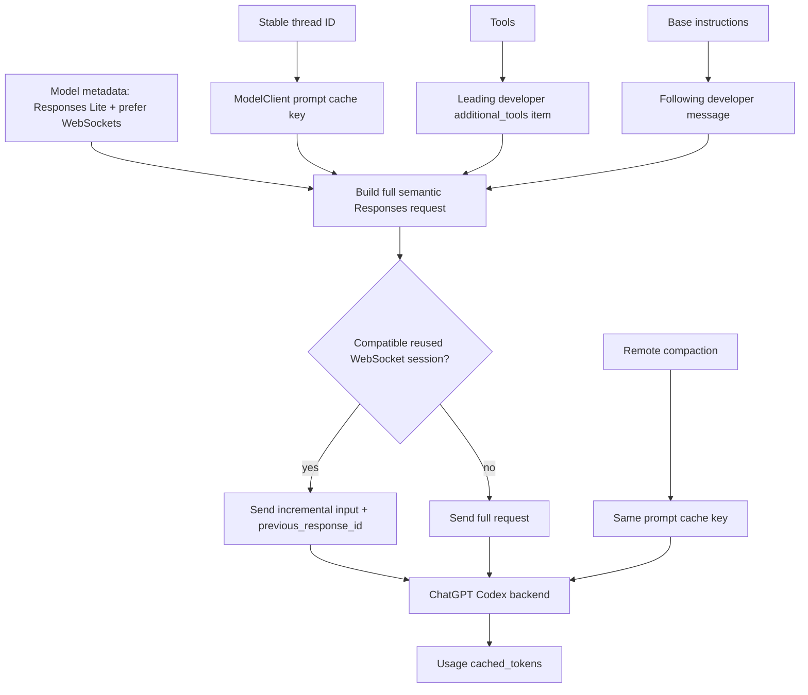

# Codex-auth prompt caching investigation

## Executive result

Keep the Codex cache-feature gate. Live requests to the ChatGPT Codex backend reject direct-platform cache controls:

- `prompt_cache_options` → HTTP 400, `Unsupported parameter: prompt_cache_options`
- `prompt_cache_breakpoint` on GPT-5.6 Sol → HTTP 400, `prompt_cache_breakpoint is not supported on this model`

Codex-auth automatic prompt caching is active without those controls. A stable `prompt_cache_key` and a stable serialized prefix are the supported cache contract. Current upstream codex-rs adds two independent optimizations Phoenix does not implement: Responses Lite prefix shaping and WebSocket continuation by `previous_response_id`.

## Pinned source baseline

Source: `openai/codex` commit [`9e552e9d15ba52bed7077d5357f3e18e330f8f38`](https://github.com/openai/codex/tree/9e552e9d15ba52bed7077d5357f3e18e330f8f38), committed 2026-07-11.

Stable runtime anchors:

- [`models-manager/models.json`](https://github.com/openai/codex/blob/9e552e9d15ba52bed7077d5357f3e18e330f8f38/codex-rs/models-manager/models.json): Sol, Terra, and Luna prefer WebSockets and enable Responses Lite.
- [`ModelClient::prompt_cache_key`](https://github.com/openai/codex/blob/9e552e9d15ba52bed7077d5357f3e18e330f8f38/codex-rs/core/src/client.rs): defaults to the stable thread ID; guardian/review sessions may override it.
- [`ModelClient::build_responses_request`](https://github.com/openai/codex/blob/9e552e9d15ba52bed7077d5357f3e18e330f8f38/codex-rs/core/src/client.rs): constructs Responses Lite prefixes and includes the stable key.
- [`responses_request_properties_match`](https://github.com/openai/codex/blob/9e552e9d15ba52bed7077d5357f3e18e330f8f38/codex-rs/core/src/client.rs): exhaustively decides whether a WebSocket request may continue incrementally.
- [`ModelClientSession::get_incremental_items`](https://github.com/openai/codex/blob/9e552e9d15ba52bed7077d5357f3e18e330f8f38/codex-rs/core/src/client.rs): requires the current input to strictly extend the previous request plus server-returned items.
- [`ResponsesApiRequest`](https://github.com/openai/codex/blob/9e552e9d15ba52bed7077d5357f3e18e330f8f38/codex-rs/codex-api/src/common.rs): contains `prompt_cache_key`, but no cache options or explicit breakpoints.
- [`ModelClient::compact_conversation_history`](https://github.com/openai/codex/blob/9e552e9d15ba52bed7077d5357f3e18e330f8f38/codex-rs/core/src/client.rs): reuses the same cache key for remote compaction.
- [`prompt_caching` tests](https://github.com/openai/codex/blob/9e552e9d15ba52bed7077d5357f3e18e330f8f38/codex-rs/core/tests/suite/prompt_caching.rs): assert key continuity across configuration overrides.
- [`compact_remote` tests](https://github.com/openai/codex/blob/9e552e9d15ba52bed7077d5357f3e18e330f8f38/codex-rs/core/tests/suite/compact_remote.rs): assert compaction and normal responses share the key.

## Upstream runtime flow

Responses Lite materially changes the prefix. It moves serialized tools into a leading `developer` `additional_tools` item, moves base instructions into the next developer message, leaves top-level `instructions` empty, omits top-level `tools`, disables parallel tool calls, and sets reasoning context to `all_turns`.

WebSocket continuation is not itself prompt caching. It avoids retransmitting an already accepted prefix when all non-input request properties match and the new input extends the previous request plus returned output. Upstream falls back to a full HTTP request when that contract cannot be proven.

## Phoenix comparison

| Concern | Upstream codex-rs | Phoenix Codex-auth | Classification |
| --- | --- | --- | --- |
| Cache cohort | Stable thread-derived `prompt_cache_key` | Stable conversation-derived `prompt_cache_key` | Equivalent |
| Cache controls | No options or explicit markers | Gated off for Codex | Correct |
| Request shape | Responses Lite leading developer items | Platform-style top-level instructions and tools | Material parity gap |
| Reasoning context | `all_turns` for Responses Lite | No equivalent field | Material parity gap |
| Transport | WebSocket preferred; incremental continuation when safe | Full HTTP/SSE request each turn | Independent transport gap |
| Compaction | Remote summary replacement; same key | Monotonic stale-result clearing; same key | Different strategy; both intentionally rewarm changed prefixes |
| System prompt | Session/model instructions are stable inputs to request construction | Rebuilt per request | Cache-bust risk; task 36009 |
| Model availability | Account/backend model metadata | All built-ins registered when Codex auth exists | Confirmed UX/runtime gap |
| Usage details | Parses cached reads; source type lacks cache writes | Parses cached reads and writes, defaulting absent writes to zero | Phoenix is more complete |

Phoenix's stale-result clearing remains compatible with automatic prefix caching: a sweep changes the prefix once, while the persisted monotonic watermark keeps later requests stable. Watermark read/write fallback can temporarily select a different safe history rendering and therefore should not be described as strict byte stability under storage failure.

## Sanitized live evidence

Environment: authenticated ChatGPT Codex backend, 2026-07-11. Credentials, account identifiers, response text, and raw request captures are not retained.

### Capability matrix

| Probe | Result | Classification |
| --- | --- | --- |
| GPT-5.6 Sol, `stream: true`, stable key only | HTTP 200 | Supported baseline |
| Same Sol request and key repeated | HTTP 200 | Supported; synthetic 7,208-token prefix reported no hit |
| Sol plus `prompt_cache_options: {mode: implicit, ttl: 30m}` | HTTP 400: unsupported parameter | Rejected |
| Sol plus valid text breakpoint | HTTP 400: breakpoint unsupported on model | Rejected |
| `stream: false` | HTTP 400: stream must be true | Codex endpoint requires streaming |
| GPT-5.6 Terra via Phoenix | HTTP 200 | Available to tested account |
| GPT-5.6 Sol via Phoenix | HTTP 200 | Available to tested account |
| GPT-5.6 Luna via Phoenix | HTTP 404: model not found | Unavailable to tested account |

The successful terminal usage payload included both `cached_tokens` and `cache_write_tokens`; cache writes were explicitly zero in all observed Codex responses.

### Raw Phoenix automatic-cache observations

All rows are individual turns; no averages hide cold/warm transitions.

| Sequence | Model | Uncached input | Cached read | Cache write | Output | Observation |
| --- | ---: | ---: | ---: | ---: | ---: | --- |
| New conversation A, turn 1 | Sol | 751 | 16,896 | 0 | 5 | Shared realistic system/tool prefix hit immediately |
| Conversation A, turn 2 | Sol | 12,031 | 5,632 | 0 | 6 | Partial-prefix hit |
| Conversation A, turn 3 | Sol | 784 | 16,896 | 0 | 6 | Large stable prefix hit again |
| New conversation B, turn 1 | Terra | 17,647 | 0 | 0 | 5 | Cold request |
| Isolated synthetic, turn 1 | Sol | 7,208 | 0 | 0 | 5 | Cold request, 3.43 s total |
| Isolated synthetic, turn 2 | Sol | 7,208 | 0 | 0 | 5 | No reported hit, 1.05 s total |

The immediate Sol hit on a new conversation demonstrates that cache reuse is not strictly isolated by Phoenix conversation key; a shared leading system/tool prefix may be reused across cohorts. The simultaneous Terra cold request shows model-specific caches are separate. The synthetic repeat proves latency improvement alone cannot be used as evidence of a cache hit.

First-byte timing is persisted by Phoenix, but this short probe did not produce a controlled multi-run latency sample suitable for statistical claims. WebSocket continuation was established from pinned source and was not live-profiled; it is tracked separately.

## Decision table

| Feature | Direct platform GPT-5.6 | ChatGPT Codex HTTP | ChatGPT Codex WebSocket | Phoenix action |
| --- | --- | --- | --- | --- |
| Stable cache key | Supported | Supported and effective | Present in full request | Keep |
| Automatic prefix caching | Supported | Confirmed by usage | Backend behavior still applies | Keep stable prefixes |
| Cache-write usage | Supported | Field present, observed zero | Source parser currently omits it | Continue parsing defensively |
| `prompt_cache_options` | Supported | Rejected | Absent from upstream type | Keep gated off |
| Explicit breakpoints | Supported | Rejected for Sol | Absent from upstream type | Keep gated off |
| Responses Lite | Not the platform shape | Upstream Codex contract | Upstream Codex contract | Implement task 36006 |
| `previous_response_id` continuation | API capability | Not used by Phoenix HTTP | Upstream incremental optimization | Implement task 36007 |
| Account model discovery | Platform model listing | Account-specific availability | Same account capability | Implement task 36008 |

## Recommendation

Retain the Codex gate for cache options and explicit breakpoints. The gate is now backed by direct runtime rejection, not inference from upstream omission.

Prioritize Responses Lite parity before WebSocket continuation. Responses Lite changes the semantic prefix sent to the cache and is therefore the more direct caching optimization. WebSocket continuation should follow as a separately measured transport optimization. Account-specific model discovery can proceed independently.

Do not change stale tool-result clearing based on this investigation. Its batched monotonic sweeps are consistent with automatic prefix caching. A separate system-prompt snapshot task is warranted because recomputing the prefix per request remains an identified cache-bust risk.

## Follow-up work

- Task 36006 — Responses Lite prefix parity.
- Task 36007 — Codex Responses WebSocket continuation.
- Task 36008 — account-specific Codex model discovery.
- Task 36009 — persisted system-prompt snapshots and explicit generation boundaries.
