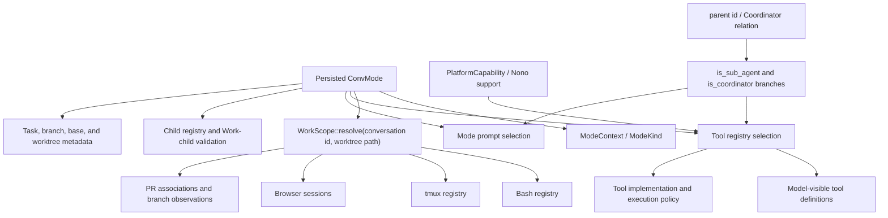
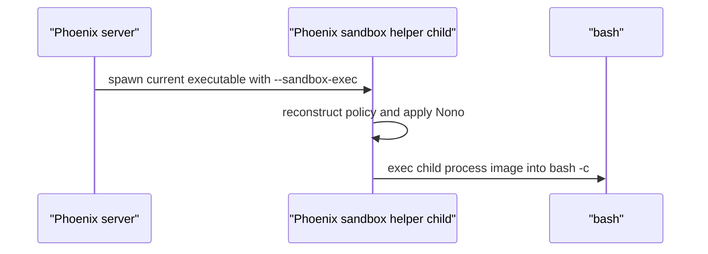
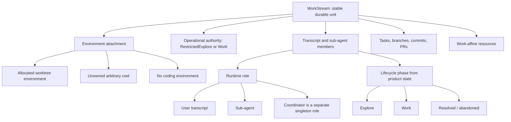
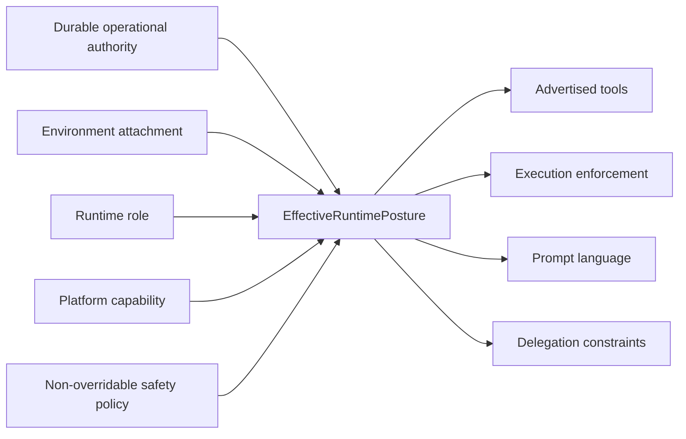
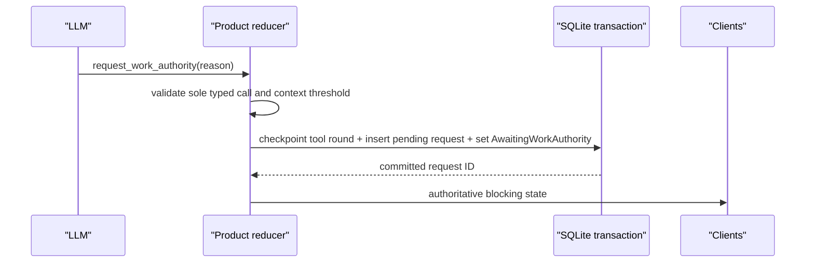

# Conversation authority and runtime posture architecture plan

## Status and purpose

This is the implementation-ready plan for allowing a Phoenix conversation to request Work privileges while it is still in the Explore phase. It is a planning artifact, not a normative specification and not an implementation.

The intended user-visible behavior is narrow:

1. An Explore agent discovers that completing its investigation requires the full Work toolset.
2. The agent requests Work privileges and explains why.
3. Phoenix blocks the conversation on a durable user decision.
4. Granting the request gives the entire work stream Work operational authority immediately while its lifecycle phase remains Explore.
5. Rejecting the request resumes restricted Explore and permits a later fresh request.
6. Neither outcome proposes, approves, creates, or promotes a task. Granting performs no branch, commit, worktree, or task lifecycle operation.

The plan also addresses architectural debt that must be resolved so this behavior has one durable authority source rather than another collection of `ConvMode` exceptions.

## Decisions resolved with the user

These decisions are inputs to the plan:

| Decision | Resolution |
|---|---|
| Grant lifetime | The grant belongs to the entire work stream. It survives turns, runtime eviction, process restart, and context-window continuation. It ends when the work stream is resolved or abandoned. |
| Granted capability | The grant is exactly Work operational authority granted early. Persistent writes within the valid environment, network, shell, browser, MCP, and Work-capable delegation are allowed. |
| Explore meaning after grant | The lifecycle phase remains Explore. Prompt guidance continues to require completing the investigation and must not imply that implementation or a task plan was approved. |
| Explore to Work | The later phase transition changes lifecycle intent; authority is already Work and does not change again. |
| Child authority | A parent may delegate authority no greater than its own. An authority-granted Explore parent may create restricted Explore children or Work-authority children attached to the same work stream/environment. |
| Work child exclusivity | The current one-Work-child rule remains a separate coordination policy for this feature. It is not intrinsic to Work authority. |
| Rejection | Rejection resolves one request, resumes restricted Explore, and permits a later request with a new explanation. |
| Durable identity | Every top-level user work stream receives a stable identity, including Direct and future no-environment/pure-chat streams. Transcript continuations remain members of that identity. |
| Tasks and Git artifacts | Task files may remain ordinary uncommitted files. Tasks, branches, commits, and PRs are plural artifacts within a work stream, not its identity. |

Revocation of a granted authority posture is explicitly deferred. The first implementation must not imply that deleting a request record revokes authority.

## Evidence reviewed

### PR #485 and the durable-workflow reshape

Only comments authored by `scottopell` were treated as review input. Automated review inventories were not processed. The early PR #485 stack proposed permanent selector, shadow, rollback, drain, and broadly leased-authority machinery. Those concepts were superseded by the later reshape recorded in the final PR #485 updates, the `task-25008-reshape-durable-workflows` stack, the accepted durable-workflow ADR, and PR #532.

The accepted constraints relevant here are:

- the product reducer remains the sole product-semantic authority;
- one Phoenix scheduler owns workflow rows for one SQLite database;
- the workflow engine owns normalized execution truth, not product lifecycle meaning;
- durable acknowledgement is the workflow adoption boundary;
- one canonical delivery lifecycle represents an owed delivery;
- runtime acceptance is represented only where a workflow delivery must enter a separately scheduled runtime;
- work completing in one synchronous local transaction with no independent crash-spanning obligation remains outside the workflow engine;
- capability classes govern retry, takeover, and ambiguity handling;
- permanent selector/shadow/drain machinery is not part of steady-state architecture.

PR #532 implements the first production vertical slice around durable Bash/tmux wake: atomic registration, normalized attempts/evidence/receipts/delivery, cancellation arbitration, continuation transfer, restart recovery, exact delivery-to-message links, and atomic adoption of linked deliveries with `LlmRequesting`.

### PR #538 continuation architecture

PR #538 makes transcript continuation explicit and crash-safe:

- `continued_in_conv_id` is the persisted linear continuation edge;
- successor creation and `continuation_dispatch_intents` are committed together;
- duplicate continuation requests converge on the existing successor;
- cleanup uses persisted live-owner facts rather than runtime-handle presence.

It does not create an explicit durable work-stream identity. Worktree-backed conversations happen to retain the same current `WorkScope` because `WorkScope::resolve` derives identity from `worktree_path`.

### Direct-continuation WorkScope finding

The durable-workflow stack exposed a foundational mismatch:

```text
Direct parent transcript    -> WorkScope::Conversation(parent-id)
Direct successor transcript -> WorkScope::Conversation(successor-id)
```

Wake delivery ownership can transfer to the successor while Bash/tmux/browser resources remain registered under the parent scope. This is delivery inheritance without resource inheritance. In-memory `rekey_scope` helpers cannot make this a durable identity model: SQLite transfer and live registry mutation cannot be one transaction, destination conflicts are only warnings, and restart cannot recover an unrecorded rekey.

This finding validates an explicit work-stream identity as a prerequisite, rather than adding chain-aware authority on top of `WorkScope::Conversation(id)`.

### Multiple-PR architecture

The PR-association architecture already rejects a singular conversation branch as PR authority:

- durable branch observations are keyed to work scope;
- one work scope can retain multiple PR associations;
- one explicit active PR is separate from current checkout and plural history;
- `ConvMode.branch_name` is not the sole discovery authority.

The new model must not restore branch or task identity as a proxy for work-stream identity.

### Production traces

A bounded seven-day TraceQL query for the current task-approval and continuation HTTP route templates returned no samples. No production behavior was inferred from absent data. Code, normative specs, accepted ADRs, and PR evidence remain the basis for this plan.

## Current-state architecture map



The design works while these correlations hold:

```text
Explore == restricted authority
Work/Branch/Direct == full authority
worktree path == durable work identity
no worktree == transcript-local resource identity
```

The requested feature and the Direct-continuation finding prove that all four are false as general invariants.

### Existing Nono enforcement

Restricted Explore Bash follows this process path:



The main server is never replaced. Nono applies to the helper child, which then retains the restrictions when it becomes Bash. The current policy broadly permits reads, permits writes only to scratch/platform temporary locations, and blocks network. Nono is an enforcement mechanism below durable authority; it is not the authority source of truth.

### Existing registry and history behavior

Before every LLM call, `RuntimeExecutor`:

1. loads persisted history;
2. obtains current built-in plus live MCP definitions;
3. builds the prompt from cached runtime context;
4. calls `strip_unavailable_tool_blocks` against the current definitions;
5. sends the normalized request.

Expansion of a registry is naturally replay-safe because historical blocks all remain available. Contraction can remove tool-use/result blocks and currently drops most historical result meaning, except for the special flattened `commission_review` case. The authority grant expands the registry, but rejection and future policy changes still require a general transcript-validity rule.

### Existing blocking decision behavior

`AwaitingTaskApproval`, `AwaitingUserResponse`, and `AwaitingCommissionReviewApproval` are durable variants inside the polymorphic `conversations.state` aggregate. Startup `reset_all_to_idle` preserves them through a hard-coded allowlist. Chat acceptability, steering, stable outcomes, notifications, and UI classifications match these states exhaustively in several separate modules.

The authority decision must be a distinct state. Reusing task approval would import task/Git semantics and make API/UI behavior misleading.

## Target conceptual model

### Product entities and dimensions



The terms have non-overlapping contracts:

| Concept | Meaning | Not authoritative for |
|---|---|---|
| WorkStream | Stable identity for one user work stream across transcript continuations and children | Filesystem location, current phase, current branch |
| Lifecycle phase | Explore, Work, or resolved/abandoned product intent | Tool authority by itself |
| Operational authority | Permission to exercise restricted Explore or full Work capabilities | Host support, resource ownership, lifecycle approval |
| Runtime role | User transcript, sub-agent, or Coordinator | Filesystem location by itself |
| Environment attachment | Allocated worktree, unowned cwd, or none | User-granted authority |
| Platform capability | What the host can enforce, including Nono/network blocking | User permission |
| Safety policy | Non-overridable deny floor such as dangerous commands or future sensitive-path rules | Positive user authority |
| EffectiveRuntimePosture | Total derivation consumed by prompt, tools, executor, history, and delegation | New persisted semantic authority |

### Legal combinations

The implementation must encode legal combinations through nested enums and constructors, not independent booleans.

Conceptual Rust shape:

```rust
pub enum RuntimeRoleContext {
    User(UserRuntimeContext),
    SubAgent(SubAgentRuntimeContext),
    Coordinator(CoordinatorRuntimeContext),
}

pub struct UserRuntimeContext {
    pub work_stream_id: WorkStreamId,
    pub phase: UserLifecyclePhase,
    pub authority: OperationalAuthority,
    pub environment: EnvironmentContext,
}

pub struct SubAgentRuntimeContext {
    pub work_stream_id: WorkStreamId,
    pub delegated_authority: OperationalAuthority,
    pub environment: EnvironmentContext,
    pub parent_conversation_id: ConversationId,
}

pub enum OperationalAuthority {
    RestrictedExplore,
    Work,
}

pub enum EnvironmentContext {
    AllocatedWorktree(AllocatedWorktreeContext),
    UnownedCwd(UnownedCwdContext),
    None,
}

pub enum EffectiveRuntimePosture {
    RestrictedExplore(RestrictedExplorePosture),
    WorkAuthority(WorkAuthorityPosture),
    Coordinator(CoordinatorPosture),
}
```

`EffectiveRuntimePosture` is derived, never persisted. Its exhaustive match owns:

- built-in registry constructor;
- whether live MCP definitions are exposed;
- prompt authority language;
- Bash implementation and Nono policy;
- patch policy;
- child delegation ceiling and cwd containment;
- history normalization policy;
- user-facing posture projection.

Coordinator cardinality remains enforced by the `coordinator` relation. Coordinator runtime behavior becomes an intentional `EffectiveRuntimePosture::Coordinator` match rather than scattered `if is_coordinator` overrides.

### Authority semantics

`OperationalAuthority::Work` is one reusable authority posture:

- Direct begins with it;
- normal Explore begins with `RestrictedExplore`;
- an approved request changes the work stream to `Work` while phase remains Explore;
- Explore-to-Work changes phase but leaves authority unchanged;
- Work-authority children may be delegated only by a Work-authority parent;
- resolved/abandoned work streams no longer produce an executable posture.

The grant does not assert that the user approved implementation. That distinction is prompt and lifecycle truth, not a fake execution restriction.

### Safety intersection



A future safety rule forbidding private SSH-key reads belongs in `SafetyPolicy`/the permission seam or process containment, not in the user authority enum. Work authority remains subject to that floor.

## Target persistence model

### Stable work-stream identity

Create normalized durable identity independent from transcript and filesystem path:

```sql
CREATE TABLE work_streams (
    id TEXT PRIMARY KEY NOT NULL,
    authority_kind TEXT NOT NULL
        CHECK (authority_kind IN ('restricted_explore', 'work')),
    created_at TEXT NOT NULL,
    updated_at TEXT NOT NULL
);

CREATE TABLE work_stream_members (
    conversation_id TEXT PRIMARY KEY NOT NULL
        REFERENCES conversations(id) ON DELETE CASCADE,
    work_stream_id TEXT NOT NULL
        REFERENCES work_streams(id) ON DELETE RESTRICT
);

CREATE INDEX idx_work_stream_members_stream
    ON work_stream_members(work_stream_id);
```

The relation means membership only. Every ordinary user transcript and every sub-agent transcript has exactly one membership row. Runtime role remains structural: Coordinator is identified by its singleton relation, sub-agents by the existing parent relation, and other members are user transcripts. Role, parent ID, environment kind, and delegated authority are not duplicated in `work_stream_members`.

A separate child-only relation stores only the fact that is not derivable from membership or parentage:

```sql
CREATE TABLE sub_agent_authority (
    child_conversation_id TEXT PRIMARY KEY NOT NULL
        REFERENCES conversations(id) ON DELETE CASCADE,
    delegated_authority TEXT NOT NULL
        CHECK (delegated_authority IN ('restricted_explore', 'work'))
);
```

The child obtains `work_stream_id` through membership, parent identity through the existing parent relation, and environment from the work stream. This avoids a second child attachment aggregate containing copies of the same values.

Rules:

- every ordinary top-level user conversation is created with a new work stream in the same transaction;
- a transcript continuation joins the predecessor's work stream in the same successor-creation transaction;
- a sub-agent joins its parent's work stream in the same child-creation transaction;
- a fork/new independent user stream gets a new work stream;
- the Coordinator does not require a fake coding work stream; its singleton relation remains its identity;
- existing continuation chains and descendants are backfilled to one stream per root user work stream;
- absence of membership for an ordinary conversation is a hard reconstruction error, not an implicit `Conversation(id)` fallback.

The existing `work_scopes(scope_type, scope_value)` table and PR-association child tables represent the old derived identity. The cutover migration must map their rows to `work_streams` and migrate PR/feedback/observed-branch/active-selection foreign keys. It must not leave path-derived and stream-derived rows as parallel authorities.

The rollout invariant is strict:

1. Schema introduction may add and backfill `work_streams`/membership while no production behavior reads or writes them.
2. One subsequent cutover changes every ownership writer and reader together. After that commit, WorkStream ID is the sole semantic resource/PR/authority owner.
3. No production path may independently infer owner identity from conversation ID, worktree path, or legacy `(scope_type, scope_value)` after cutover.
4. Legacy `work_scopes` is dropped in the cutover migration, or retained only as an explicitly read-only compatibility view derived from WorkStream/environment data. It is never dual-written.
5. The existing `work_scope_key` API name may remain during a compatibility epoch, but its value becomes an opaque encoding of `WorkStreamId`. Cached legacy `conversation:`/`worktree:` handles receive an explicit stale-handle response or bounded lookup adapter; they are never accepted as a second current identity.

This makes introduction and cutover separately shippable without a period of dual authority.

### Environment persistence boundary

The authority feature needs explicit environment derivation but does not need to complete branch/task retirement. During the feature series:

- `WorkStreamId` becomes the resource and PR owner key;
- current `ConvMode`/`cwd` fields may temporarily supply the environment descriptor;
- no identity is derived from those fields;
- one shared derivation returns `EnvironmentContext` for runtime posture.

A follow-up schema migration should move environment facts out of `ConvMode` into one discriminated normalized relation whose checks make conflicting environment kinds unrepresentable, for example:

```sql
CREATE TABLE work_stream_environments (
    work_stream_id TEXT PRIMARY KEY REFERENCES work_streams(id),
    kind TEXT NOT NULL CHECK (kind IN ('allocated_worktree', 'unowned_cwd', 'none')),
    project_id TEXT REFERENCES projects(id),
    worktree_path TEXT UNIQUE,
    cwd TEXT,
    starting_ref TEXT,
    starting_oid TEXT,
    CHECK (
        (kind = 'allocated_worktree'
         AND project_id IS NOT NULL AND worktree_path IS NOT NULL
         AND starting_oid IS NOT NULL AND cwd IS NULL)
        OR
        (kind = 'unowned_cwd'
         AND cwd IS NOT NULL AND project_id IS NULL
         AND worktree_path IS NULL AND starting_ref IS NULL AND starting_oid IS NULL)
        OR
        (kind = 'none'
         AND project_id IS NULL AND worktree_path IS NULL AND cwd IS NULL
         AND starting_ref IS NULL AND starting_oid IS NULL)
    )
);
```

The `none` kind is supported structurally from introduction even though pure-chat product creation is deferred. Branches, task files, and PRs remain child observations/artifacts rather than environment identity.

### Authority requests

Multiple requests are allowed, and decisions must be auditable. Persist them as normalized child rows:

```sql
CREATE TABLE work_authority_requests (
    id TEXT PRIMARY KEY NOT NULL,
    work_stream_id TEXT NOT NULL REFERENCES work_streams(id),
    requesting_conversation_id TEXT NOT NULL REFERENCES conversations(id),
    tool_use_id TEXT NOT NULL UNIQUE,
    reason TEXT NOT NULL CHECK (length(trim(reason)) > 0),
    status TEXT NOT NULL CHECK (status IN ('pending', 'granted', 'rejected')),
    requested_at TEXT NOT NULL,
    decided_at TEXT,
    CHECK (
        (status = 'pending' AND decided_at IS NULL)
        OR (status IN ('granted', 'rejected') AND decided_at IS NOT NULL)
    )
);

CREATE UNIQUE INDEX one_pending_work_authority_request_per_stream
    ON work_authority_requests(work_stream_id)
    WHERE status = 'pending';
```

The request row is the source for reason/status/audit. The conversation blocking state carries only the typed request ID:

```rust
AwaitingWorkAuthority { request_id: WorkAuthorityRequestId }
```

It must not duplicate the request payload inside the state blob. The API/wire projection joins the row to render its reason and timestamps. The polymorphic conversation state remains an earned aggregate for operational state; normalized request fields remain queryable and singular.

Authority is persisted once on `work_streams.authority_kind`. This column is the sole source of current authority. A granted request does not also carry an authoritative `grants_authority=true` field. Request status is append-only historical decision evidence; `AwaitingWorkAuthority` is only a typed parking pointer. Runtime reconstruction, prompt/tool derivation, continuation, and child ceiling checks must never derive current authority from request status or the conversation state blob.

`AwaitingWorkAuthority` may persist only the request ID. It must not copy reason, timestamps, status, or authority into the earned polymorphic state aggregate. Request details always join from the normalized ledger.

## Model-facing request tool

Add one reducer-intercepted tool, tentatively named `request_work_authority`:

```json
{
  "reason": "Why completing this exploration requires Work privileges"
}
```

Requirements:

- offered only to a top-level user runtime in Explore phase with restricted authority;
- not offered to sub-agents, Coordinator, Work-authority streams, or non-Explore phases;
- must be the only tool call in the assistant response;
- parsed through both `ToolInput` serde and `ToolInput::from_name_and_value`;
- malformed known-tool input is intercepted and returned as a typed tool error, never dispatched as an unknown runtime tool;
- empty/whitespace reason is structurally rejected;
- reducer interception occurs before generic tool dispatch;
- context threshold wins before parking: preserve the call in `AwaitingContinuation`, continue, then replay it against the successor;
- creation of the request row, a valid request tool round, and `AwaitingWorkAuthority` commits atomically.

The request transaction must preserve a provider-valid transcript while parked. Add one explicit repository primitive, `persist_work_authority_request(...)`, and one matching reducer effect. That repository method owns a single SQLite transaction containing the assistant tool-use, a synthetic result stating that the request is pending user decision, the pending request row, and `AwaitingWorkAuthority`. It follows the existing `persist_tool_round` / `persist_fork_proposal_with_tool_round` pattern; generic `PersistState` must not be sequenced around it.

The later decision adds one durable user-context message with the grant/rejection outcome before resuming. This avoids an orphan final assistant tool-use and makes replay independent of UI state. This “transaction” terminology is intentional: it is not a durable-workflow checkpoint, receipt, delivery, or runtime-acceptance record.

Once authority is granted, the request tool disappears because it is not meaningful. After rejection it is advertised again on the next restricted Explore turn.

## State, transaction, and recovery design

### Request transition



No durable-workflow profile is created. This product-semantic transaction finishes locally and owes no independent external execution. Its crash safety comes from SQLite atomicity and request/state compare-and-set, not workflow leases, receipts, manual resolution, or canonical delivery. Reuse of a durable-workflow primitive is conditional on a future direct-chat profile establishing a shared accepted-turn/runtime-acceptance boundary; the authority feature must not invent that boundary first.

### Grant transaction

The grant endpoint/reducer event uses request ID plus expected pending state as its compare-and-set identity. In one SQLite transaction it must:

1. verify request is pending and belongs to the current work stream;
2. verify the conversation is `AwaitingWorkAuthority` for that exact request;
3. set request status to `granted` and `decided_at`;
4. change `work_streams.authority_kind` from `restricted_explore` to `work`;
5. insert an idempotently identified user-context message stating that Work privileges were granted for the work stream while the phase remains Explore;
6. persist `LlmRequesting` (or the current reducer-authorized accepted-turn state) so decision acceptance and runtime intent cannot split;
7. commit before broadcasting success.

After commit, the live runtime derives the new posture, swaps its built-in registry in place, refreshes prompt context and clearable-tool metadata, then requests the LLM. The commit is the authority source; live mutation is only the low-latency path. Failure after commit must never roll authority back in memory—evict and reconstruct from DB-derived posture instead.

MCP requires a new posture gate. Today `ToolRegistryExecutor` merges live MCP definitions and resolves MCP execution whenever a manager is attached, independently of mode. The posture application must gate both definition merge and execution fallback; retaining the live manager must not expose MCP to a posture that excludes it.

If the process crashes after commit and before the request starts, reconstruction reads Work authority from the stream and the persisted accepted-turn state resumes with the correct registry and prompt. Recovery must never infer authority from message shape. Existing `LlmRequesting` recovery may be reused only after tests prove the committed state—not history heuristics—is sufficient, or it must be replaced by the future direct-turn accepted-runtime primitive.

This decision is product semantics, not durable-workflow manual resolution. DWF manual resolution is for an already accepted external effect whose outcome is ambiguous. The authority decision has no external effect, retry/takeover, deadline, compensation, or independent scheduler work. When direct-chat runtime acceptance adopts the durable-workflow engine, this transaction should call the shared accepted-turn transaction primitive rather than create an authority-specific workflow profile.

### Rejection transaction

In one SQLite transaction:

1. verify the exact pending request/state;
2. set request status to `rejected` and `decided_at`;
3. leave work-stream authority restricted;
4. add an idempotently identified user-context message stating that the request was rejected and restricted Explore should continue;
5. persist the accepted next-turn state;
6. commit before broadcasting/resuming.

The next prompt includes the same restricted posture and advertises `request_work_authority` again. A later request receives a new request/tool-use identity. This resumes the same Explore phase; rejection is not a lifecycle transition.

### Cross-tab and duplicate decisions

A concurrent decision uses the request row and state CAS. The winner commits one outcome. A loser receives a typed `already_resolved` result containing the committed status; it refetches and closes the stale approval surface. No endpoint reports success before the transaction commits.

### Restart and startup reset

- `AwaitingWorkAuthority` is preserved by `reset_all_to_idle`.
- Startup validates that its request ID resolves to one pending request for the same stream.
- Missing/mismatched request data becomes an explicit recovery error; it is not reset to Idle.
- A granted stream reconstructs Work authority regardless of which transcript runtime is materialized.
- A rejected request remains historical but does not affect current authority.
- Pending authority decisions are not auto-continued.

### Continuation

A blocking authority decision rejects manual continuation/chat just like other blocking decisions. Context-threshold handling occurs before parking, so normal threshold continuation does not have to transfer a pending request.

Granted authority is inherited automatically because the successor joins the same work stream. No authority copy occurs and there is no parent/successor race over two columns. Deleting, archiving, or continuing a member must not delete the stream authority row. Work-stream deletion/resolution is the only lifecycle allowed to retire it.

If a future product path permits continuation while a request is pending, it must atomically retarget `requesting_conversation_id` or introduce a separate current-presentation owner relation in the same continuation transaction. That behavior is not included in the first implementation.

### Continuation and ordering matrix

| Situation | Required result |
|---|---|
| Typed request parsed below threshold | Commit request transaction and park. |
| Typed request parsed at/above threshold | Do not create a request row. Enter the existing continuation flow with the rejected call preserved for one replay. |
| Crash after continuation commit but before replay dispatch | Existing continuation dispatch intent/recovery replays once; unique `tool_use_id` prevents duplicate request rows. |
| User attempts manual continuation while request is pending | Reject with a typed blocking-decision conflict in v1. |
| Context continuation after grant commit but before resumed LLM dispatch | Successor joins the same WorkStream and reconstructs Work authority; accepted-turn recovery dispatches once. |
| Duplicate replay reaches a stream with an already pending request | Unique pending-stream/request identity converges on the existing request or returns a typed duplicate; it never creates a second modal. |

Threshold handling is product runtime policy, not durable-workflow scheduling. The request transaction begins only after continuation has declined to take precedence.

## Effective runtime posture seam

Introduce one shared derivation service used by all consumers:

```rust
fn derive_effective_runtime_posture(
    role: RuntimeRoleContext,
    phase: UserLifecyclePhase,
    authority: OperationalAuthority,
    environment: EnvironmentContext,
    platform: PlatformCapability,
    safety: SafetyPolicy,
) -> Result<EffectiveRuntimePosture, PostureError>;
```

The service is called by:

- fresh runtime creation;
- runtime recreation after eviction/restart;
- approval-time in-place refresh;
- system-prompt inspection;
- sub-agent fresh spawn and resume;
- LLM request assembly;
- API/UI posture projection.

The request assembly must build tool definitions and prompt from the same derived value in one turn. It must not independently ask `ModeContext` whether Explore Bash is available after the registry has already selected Work Bash.

### Registry and execution profiles

| Effective posture | Built-in/MCP visibility | Execution |
|---|---|---|
| Restricted Explore | Explore registry; MCP exposure follows the explicitly specified restricted policy | `SandboxedBashTool` under Nono when supported, otherwise no Bash; scoped task-draft patch only |
| Work authority in Explore | Same full operational registry as Work, including live MCP | Work Bash/patch/browser/MCP execution bounded by environment and safety policy |
| Work phase | Same Work authority registry | Same execution as the preceding row |
| Coordinator | Coordinator-only builtin registry, no MCP | Bounded global reads and singular message delivery only |
| Restricted child | Sub-agent Explore registry | Restricted execution in inherited environment |
| Work-authority child | Sub-agent Work registry | Work execution in inherited environment, subject to current coordination limit |

The phrase “full Work toolset” must include both built-in definitions and the execution policy reached by those definitions. A registry-only grant is invalid.

### In-place mutation versus runtime recreation

Use the existing in-place registry swap for a committed authority change:

- it preserves runtime identity, SSE broadcaster, queued state, and live MCP manager;
- runtime reconstruction is unnecessarily broad for a tool-only posture change;
- if in-place refresh fails after commit, shut down/evict the runtime and reconstruct from durable posture rather than rolling authority back in memory.

Runtime recreation remains the proof path: it must derive the same posture from DB state without relying on any live swap having occurred.

### History normalization

Generalize `strip_unavailable_tool_blocks` into a loss-preserving transcript normalization policy. Current behavior strips protocol blocks based on current definitions and preserves flattened meaning specially for `commission_review`; it does not generally preserve removed result content.

- keep history unchanged when all referenced tools remain advertised;
- when a tool is unavailable, remove provider-invalid tool protocol blocks but flatten its result into labeled text unless the result is explicitly safe to discard;
- ensure the resulting first/final roles remain provider-valid;
- filter tool-search references consistently;
- never mutate DB history for request-specific normalization;
- test restricted→Work expansion, Work→restricted test fixtures, MCP enable/disable, continuation tool-less flattening, and a final history item consisting only of a removed tool call.

The authority-request result and decision message must remain meaningful even after the request tool disappears on grant.

## Prompt semantics

Replace mode-only prompt assembly with phase plus posture language.

For granted Explore, the prompt must communicate both truths:

```text
You are still completing the Explore phase. The user has not approved a task or
instructed you to begin implementation merely by granting these privileges.

The user granted Work operational authority for this entire work stream. You may
use the full Work toolset, including persistent changes within the attached
environment, network access, and Work-authority sub-agents, when useful to finish
the investigation.
```

The prompt must not claim that Nono/network blocking applies after grant. Prompt inspection must be DB-derived, not copied from a possibly stale live runtime: it loads role, phase, WorkStream authority, environment, platform, and safety inputs, calls the same pure posture derivation used by request assembly, and then the same prompt builder. A parity test constructs both paths from one DB fixture and requires identical authority claims and tool-posture language. Tool descriptions remain truthful to their actual implementations.

## Sub-agent design

Fresh spawn and resume must persist/reconstruct three separate facts:

1. runtime role is sub-agent;
2. work-stream/environment membership comes from the parent;
3. delegated authority is explicitly RestrictedExplore or Work and cannot exceed current parent authority.

Do not persist child authority by copying the parent's `ConvMode`. Add a child-specific normalized delegated-authority field/relation associated with the child conversation. The child runtime derives its registry from that fact on both fresh spawn and resume.

Spawn validation:

- restricted parent → restricted child only;
- Work-authority parent in Explore or Work → restricted or Work-authority child;
- Work-authority child cwd must remain within an allocated worktree root when one exists;
- an unowned-cwd parent cannot grant Phoenix ownership it does not have; child execution inherits the same unowned environment boundary;
- role restrictions still remove user-only tools (`ask_user_question`, authority request, task proposal, recursive spawn, where applicable);
- current one-Work-child reservation remains until its own spec/task deliberately changes it.

MCP inclusion must be derived by posture, not attached unconditionally after registry choice.

## UI and API contract

### Wire state

Add a distinct wire state, for example:

```ts
{
  type: 'awaiting_work_authority';
  requestId: string;
  reason: string;
  requestedAt: string;
}
```

The payload is a projection joined from the normalized request row; it is not a second persisted authority representation.

### Blocking surface

The conversation page shows a non-dismissible blocking review surface:

- heading: “Agent requests Work privileges”;
- concise explanation that privileges apply to the entire work stream;
- agent's reason;
- explicit disclosure: full shell, network, file-write, browser/MCP, and Work-sub-agent capabilities within the environment and safety policy;
- actions: `Grant Work privileges` and `Keep Explore restricted`;
- no task, branch, or implementation-approval language.

Composer is unavailable while the decision is pending. Sending chat through HTTP returns a dedicated approval-conflict code, never steering acceptance. The cancel endpoint returns a typed `not_cancelable_awaiting_authority` conflict while parked; it cannot race a decision into a second outcome. Entering the parked state clears or durably accounts for pre-existing steering entries under the same rule as other blocking decisions. There is no live agent work to cancel.

### Decision visibility

Grant and rejection each create a durable conversation message/context event before resume. Toasts may supplement but must not be the only evidence. Another tab deciding the request causes stale clients to refetch/consume state change, close the modal, and show the committed result.

### State classification

`AwaitingWorkAuthority` is:

- blocking;
- stable for `drive_turn`;
- attention-needing;
- not generic busy;
- not cancelable agent work;
- composer-disabled;
- model-change policy explicitly decided alongside other user-decision states;
- notification-worthy with its own dedupe/event kind, not task approval;
- distinct in Coordinator/global-read projections (“Work privileges requested”);
- preserved on reload/restart.

## Consumer-impact matrix

| Layer | Symbols/surfaces to update | Obligation |
|---|---|---|
| Core state | `ConvState`, `ParentState`, conversions, labels, `DisplayState`, `StepResult`, blocking/busy/cancelable helpers | Add exhaustive `AwaitingWorkAuthority { request_id }` handling; sub-agent state cannot represent it. |
| Tool input | `ToolInput`, serde, `from_name_and_value`, name/value conversion | Typed request and malformed-known-tool parity. |
| Events | `sm_event.rs` decision event/outcome | Exact request ID and grant/reject outcome; stale decisions typed. |
| State transition | special-tool interception and approval-state arms in `transition.rs` | Sole-call validation, context threshold ordering, blocking chat conflict, decision transition. |
| Effects/checkpoint | `effect.rs`, checkpoint persistence executor | One request transaction and one decision transaction; no generic `PersistState` sequence that exposes partial success. |
| DB schema/repository | migrations, `reset_all_to_idle`, conversation creation/continuation/sub-agent transactions | Work streams/membership/authority, request ledger, delegated child authority, atomic CAS APIs, preserved state. |
| Runtime derivation | `runtime.rs::conv_mode_to_context`, registry construction, `ConvContext`, `ToolContext` | Replace authority inference with shared posture derivation; `ConvMode` remains phase/environment compatibility input only. |
| Tool executor | `ToolRegistryExecutor::swap_registry`, `upgrade_to_work_mode`, MCP merge | Rename/generalize to apply derived posture; refresh cached clearable names and prompt context. |
| LLM request | `RuntimeExecutor` request assembly, `strip_unavailable_tool_blocks` | Prompt/tools/history from one posture; loss-preserving normalization. |
| Recovery | `determine_resume_state`, `runtime/recovery.rs`, startup reset | Preserve pending decisions; reconstruct granted posture; auto-resume committed decision turn. |
| Chat/steering | `check_user_message_acceptable`, `TransitionError`, `SendChatApplicationService`, user-facing error mapping | Dedicated conflict; never enqueue steering while awaiting decision. |
| Lifecycle API | `api/lifecycle_handlers.rs`, routing | Grant/reject endpoints with exact request CAS and cross-tab `already_resolved`. |
| Prompt inspection | `/system-prompt` handler | Same DB-derived posture as runtime; no mode-only duplicate. |
| Wire/codegen | Rust wire state, generated TS, valibot schemas, parity tests | Typed state and request payload parity. |
| UI state | `ui/src/api.ts`, `utils.ts`, XState conversation atom/machine | Exhaustive blocking/attention/display classifications. |
| Conversation UI | `ConversationPage`, new authority review component, `InputArea`, `StateBar` | Modal, composer gate, decision messages, reload/cross-tab behavior. |
| Notifications | `ui/src/notifications/policy.ts`, settings/catch-up tests | Distinct attention event and stable dedupe key by request ID. |
| Lists/global read | `ConversationList`, Coordinator current-work/global-read projection | Distinct label/signal and actionable ordering. |
| Stable outcomes | `drive_turn.rs::StableOutcome` and tests | `AwaitingWorkAuthority`; no timeout loop. |
| Analytics/deployment | exhaustive state matches in `analytics.rs`, deployment/global state formatters | Name/classify new state rather than wildcarding. |
| Sub-agents | spawn schema/validation, child persistence, fresh/resume registry | Explicit delegated authority and same work-stream membership. |
| Work resources | `WorkScope`, Bash/tmux/browser registries, inventory/resource monitor, PR association | Key by stable work stream, not transcript/path-derived fallback. |
| Specs | permissions, projects, bedrock, subagents, chains, PR association, Coordinator, durable workflows | Update exact authority/lifecycle/environment contracts and cross-spec enumerations. |

## Specifications and ADR work

Before implementation, author the following normative changes using the `specs/AUTHORING.md` pre-flight checklist.

### New authority specification

Create `specs/conversation-authority/requirements.md`, an Allium spec, and `executive.md` covering:

- restricted Explore request eligibility;
- sole typed request call and malformed input;
- pending decision and chat conflict;
- grant/reject transactions;
- work-stream lifetime/inheritance;
- phase versus authority distinction;
- child delegation ceiling;
- prompt/tool/execution agreement;
- restart, continuation, and duplicate decision behavior;
- UI/notification surfaces.

Allium is warranted because this is a multi-step blocking lifecycle with crash and continuation constraints.

### Project-wide ADRs

Write ADRs for:

1. stable WorkStream identity independent from transcript, branch, task, path, and `ConvMode`;
2. operational authority as a durable work-stream fact and `EffectiveRuntimePosture` as a derived projection;
3. authority decisions remaining product semantic transactions rather than a bespoke durable-workflow profile, with future reuse of direct-turn acceptance when that profile lands.

Do not rewrite accepted durable-workflow ADR history.

### Existing normative specs

Update:

- `specs/projects`: Explore is restricted by default but may receive Work authority early; Explore→Work no longer necessarily changes authority; branch/task retirement remains separately scoped.
- `specs/bedrock`: new blocking state, transitions, context-threshold ordering, continuation inheritance, stable outcome, conflict behavior, recovery.
- `specs/permissions`: request is reducer-intercepted; DenyGate remains the intrinsic safety floor; effective posture does not bypass it.
- `specs/subagents`: delegated authority no greater than parent, fresh/resume parity, WorkStream/environment inheritance, current writer cardinality remains coordination policy.
- `specs/chains`: WorkStream is the durable unit; transcript chain is lineage; branches/tasks/PRs are artifacts/projections.
- `specs/pr-association`: replace old path-derived WorkScope FK/key with stable WorkStream identity without changing plural active-PR semantics.
- `specs/global-recall`: Coordinator role remains singleton/bounded; current-work projection reports the new decision state and uses stable work-stream identity.
- `specs/durable-workflows`: no new profile required; add the authority decision as an explicit non-adoption example if useful, and reference future direct-turn acceptance reuse.

## Implementation sequence

Each slice must be independently reviewable and leave one authority source.

### Slice 1A: Normative architecture and inert WorkStream schema

Deliver:

- authority spec, Allium, ADRs, and cross-spec terminology;
- `WorkStreamId`, normalized `work_streams`, membership, and sub-agent-authority schema;
- migration/backfill for top-level chains, continuations, and sub-agents;
- creation, continuation, fork, and sub-agent transactions maintain membership atomically;
- no production ownership consumer reads the new identity yet.

Verification:

- migration fixtures for Direct, managed Explore, Work/Branch, continuation chains, sub-agents, Coordinator, and existing PR history;
- property: every ordinary conversation resolves to exactly one stream, all continuation members share it, all children share the parent stream, Coordinator—explicitly not a user work stream—has no accidental membership;
- schema admits `EnvironmentContext::None` even though pure-chat creation remains unexposed;
- existing WorkScope behavior is byte-for-byte unchanged.

### Slice 1B: Atomic WorkScope consumer cutover

Deliver in one ownership cutover:

- migrate PR association/feedback/observed-branch/active-selection FKs from derived scope identity;
- key Bash/tmux/browser/inventory/resource-monitor ownership by WorkStreamId;
- update `work_scope_key` APIs/wire semantics to opaque WorkStream handles with an explicit legacy-handle policy;
- Direct continuation naturally retains the same key without rekey;
- remove `WorkScope::Conversation(id)` and path-derived identity as authoritative fallbacks;
- drop/freeze the old `work_scopes` representation under the rollout invariant above.

Verification:

- Direct continuation can inspect/control existing Bash/tmux/browser resources without rekey;
- cleanup/inventory and all work-scope UI/API routes agree before and after continuation;
- PR history and active selection survive migration;
- destination-conflict behavior is no longer part of normal continuation;
- repository search finds no production owner inference from transcript ID/path outside environment resolution.

Slices 1A and 1B are prerequisites. Implementing authority first would persist a work-stream-scoped grant while resource identity still changes with Direct transcript continuation. Splitting inert introduction from atomic consumer cutover avoids a dual-authority rollout.

### Slice 2: Runtime role and EffectiveRuntimePosture derivation

Deliver:

- typed role contexts;
- `OperationalAuthority` and environment contexts;
- one shared posture derivation;
- runtime creation, prompt inspection, registry construction, MCP exposure, child construction, and request assembly consume it;
- Coordinator behavior selected by exhaustive posture matching;
- no feature behavior change yet: preserve the normative current policy from `REQ-PROJ-001`, `REQ-PROJ-016`, and `REQ-PROJ-019` by initializing Explore as restricted and Direct/Work/Branch as Work authority.

Verification:

- capability matrix tests over role × phase × authority × environment × platform;
- impossible combinations rejected by constructors;
- runtime and prompt-inspection snapshots match byte-for-byte on authority claims;
- fresh and recreated runtimes produce identical definitions;
- Nono/no-Nono Explore cases remain enforced.

### Slice 3: Durable authority request and decision backend

Deliver:

- normalized request ledger and child delegated-authority storage;
- typed request tool and parsing parity;
- blocking state/event/effect/API;
- atomic request checkpoint;
- atomic grant/reject CAS transactions;
- in-place posture refresh after grant with reconstruction fallback;
- dedicated chat conflict and stable outcome;
- recovery/reset handling;
- continuation membership inherits granted authority.

Verification:

- reducer table/property tests for request eligibility, malformed input, sole-call rule, threshold ordering, grant, reject, duplicate decisions, re-request;
- crash injection before/after every transaction commit and before/after runtime swap/request kick;
- restart pending, restart granted-before-kick, runtime eviction, and continuation tests;
- DB concurrency test: simultaneous grant/reject yields one committed outcome;
- transcript remains provider-valid in every parked/resumed state.

### Slice 4: Sub-agent authority and environment parity

Deliver:

- requested child authority explicit in spawn schema and persisted child metadata;
- ceiling check against parent posture rather than `ConvMode`;
- same WorkStream/environment attachment on fresh spawn and resume;
- Work-authority child legal from Work-authority Explore parent;
- cwd containment remains environment-derived;
- current one-writer reservation unchanged.

Verification:

- parent/child authority matrix;
- immediate versus resumed child registry equality;
- managed worktree escape rejection;
- Direct/unowned behavior does not fabricate environment ownership;
- restricted child remains restricted under a Work-authority parent.

### Slice 5: Web/UI, notifications, generated wire types, and end-to-end QA

Deliver:

- generated wire state and schemas;
- blocking review surface and API client;
- composer/chat conflict UX;
- state bar/list/Coordinator signals;
- distinct browser notification policy;
- durable decision messages;
- cross-tab reconciliation;
- prompt-inspection display/tests as applicable.

Verification:

- component tests for pending/grant/reject/already-resolved/error;
- reload with pending request;
- another tab wins grant/reject;
- notification catch-up and dedupe;
- end-to-end restricted tool absence before grant and full definition presence after grant;
- actual execution test proves Nono blocks network/write before grant and Work execution permits the intended operation after grant;
- restart/eviction E2E proves the grant survives;
- prompt says Explore plus Work authority and never claims task approval.

### Slice 6: Remove obsolete authority inference and centralize state classification

Deliver:

- delete or narrow `ToolExecutor::upgrade_to_work_mode` into generic posture application;
- delete mode-only authority matches and Coordinator prompt/registry exceptions superseded by posture derivation;
- remove stale comments/spec text claiming mode alone determines tool availability;
- centralize or exhaustively audit the scattered Rust/TypeScript classifications for blocking, stable, attention-needing, cancelable, composer-enabled, and display state;
- retain `ConvMode` only for lifecycle/environment compatibility until its follow-up migration.

Verification:

- repository search has no production `ConvMode` match deciding positive tool/write/network authority outside posture derivation;
- all capability matrix and full project checks pass.

## Explicitly deferred architecture

These are compatible follow-ups, not hidden requirements of the authority feature:

1. **Retire `ConvMode::Branch`.** Treat existing-branch selection as environment initialization, not durable mode.
2. **Move environment fields out of `ConvMode`.** Land normalized allocated-worktree/unowned-cwd relations and then remove `worktree_path`, `branch_name`, `base_branch`, task ID/title from mode.
3. **Simplify Explore→Work Git behavior.** Keep task files uncommitted; transition authority/phase without branch rename or automatic commit; begin from a recorded detached base OID/ref and let the agent create one or more branches.
4. **Plural task modeling.** Treat task files as artifacts instead of singular conversation metadata.
5. **Concurrent Work sub-agents.** Remove one-writer cardinality and revise coordination/Git concurrency specs without changing authority semantics.
6. **Broader Nono process coverage.** Apply derived environment/safety policy to browser/tmux or other owned processes only in a separately scoped effort.
7. **Sensitive-host safety profile.** Add private-key/credential path protections through the non-overridable safety layer, independent of Work grants.
8. **Authority revocation.** Define user-visible revocation, in-flight tool handling, children, remote effects, and recovery before adding it.
9. **Pure chat.** Add a user runtime with `EnvironmentContext::None`; stable WorkStream identity already supports continuation/resources without a fake cwd mode.

## Alternatives rejected

### Add `ConvMode::ExploreWithWorkTools`

Rejected because it preserves lifecycle/authority conflation and grows a combinatorial mode enum.

### Add a boolean grant to `ConvMode::Explore`

Rejected because authority belongs to the work stream, must survive continuation, applies to Direct/Work derivation, and should not duplicate environment/task fields.

### Add a per-tool/token approval system

Rejected because the user explicitly wants the full Work posture and Phoenix cannot honestly enforce arbitrary network-shell/MCP actions as a narrow read-only subset without a new general permission system.

### Reuse task approval

Rejected because authority approval creates no task/Git lifecycle and may be requested repeatedly while exploration continues.

### Implement a durable-workflow authority profile

Rejected because request and decision each complete as local product-semantic transactions and do not own external execution, deadlines, recovery leases, ambiguity, or compensation. Future direct-turn workflow adoption should supply the common accepted-turn resume boundary rather than an authority-specific scheduler.

### Key authority by continuation root ID

Rejected because fork/continuation topology and work identity are distinct, sub-agents participate in the same work stream, and Direct resource continuity should not require scanning or rewriting transcript lineage.

### Rekey Direct resources during every continuation

Rejected as the target architecture because DB ownership and in-memory registries cannot move atomically, destination conflicts lack typed semantics, and restart cannot recover an unpersisted partial move. Stable identity removes the move.

## Risks and mitigations

| Risk | Mitigation |
|---|---|
| WorkStream foundation makes the feature large | Land it as a behavior-preserving prerequisite slice with migration/property tests and no authority UI. |
| Existing path-based API consumers depend on readable scope keys | Treat public key as opaque; migrate routes and tests in one slice; retain physical path only in environment projection. |
| Runtime refresh occurs after durable grant commit | Never roll back durable authority in memory; evict/reconstruct from DB on refresh failure. |
| Pending state survives but request row is missing | Startup validation enters explicit recovery/error; schema FK and atomic request transaction prevent normal occurrence. |
| Prompt and registry diverge | Build both from one `EffectiveRuntimePosture` per request and share derivation with prompt inspection. |
| MCP broadens authority unexpectedly | Make MCP inclusion an explicit posture match and test definitions plus execution. |
| Tool-history filtering loses the reason/decision | Flatten unavailable historical results losslessly and persist a durable decision context message. |
| Work-authority Explore begins implementation prematurely | Prompt preserves Explore intent; UI copy states grant is privileges, not task approval. This is guidance, because execution authority is intentionally full. |
| WorkStream and environment become parallel identity systems | WorkStream is the only resource/PR/authority owner; environment rows describe location/ownership only. |
| PR #532 changes before merge | Rebase implementation onto the landed accepted engine; preserve the ADR's durable-ack boundary and do not bind to wake-private APIs. |

## Verification summary

The complete implementation is ready only when all of the following are proven:

- no additional tool is advertised or executable before grant;
- grant and rejection are durable, atomic, duplicate-safe, and visible;
- grant survives restart, runtime eviction, and transcript continuation;
- Explore phase and Work authority are simultaneously represented in prompt and UI;
- Explore→Work does not create a second authority representation;
- children cannot exceed parent authority and resume with the same posture they had at spawn;
- Nono remains the actual restricted Bash enforcement before grant;
- Work execution, not only definitions, is active after grant;
- WorkStream identity preserves Direct resources across continuation without rekey;
- history remains provider-valid as tool sets change;
- blocking chat is rejected as a decision conflict, not queued as steering;
- notifications and stable outcomes distinguish this decision from task approval;
- generated wire code, parity tests, Allium validation, task validation, and `./dev.py check` pass.

## Readiness for implementation tasking

The implementation should be split along the slices above. Slices 1A and 1B are prerequisites rather than optional cleanup: without stable WorkStream identity, the promised work-stream-scoped authority would coexist with transcript-scoped Direct resources and reproduce the ownership split already found by the durable-workflow stack.

No unresolved user decision remains that changes this target plan. Naming (`WorkStream` versus a renamed durable `WorkScope`) may be chosen during ADR/spec authoring as long as there is exactly one stable identity and existing path/conversation-derived keys cease to be semantic authorities.
