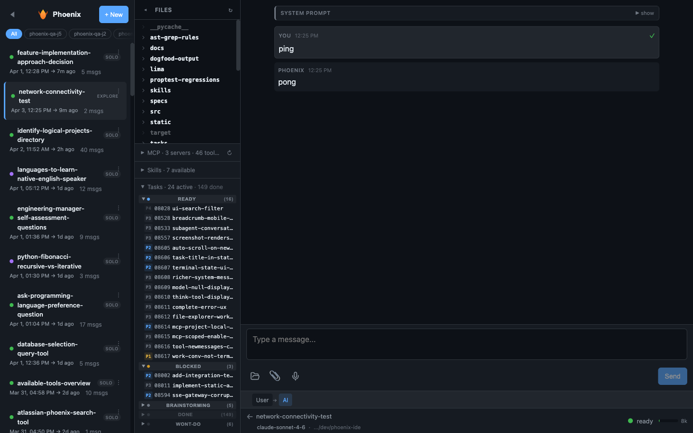
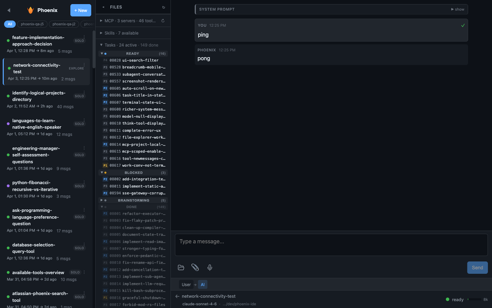

# Dogfood Report: Phoenix IDE - Tasks Panel

| Field | Value |
|-------|-------|
| **Date** | 2026-04-03 |
| **App URL** | http://localhost:8042 |
| **Session** | phoenix-ide |
| **Scope** | Tasks panel in file explorer sidebar |

## Summary

| Severity | Count |
|----------|-------|
| Critical | 0 |
| High | 1 |
| Medium | 2 |
| Low | 2 |
| **Total** | **5** |

## Issues

### ISSUE-001: Tasks panel has no max-height -- dominates sidebar when groups are expanded

| Field | Value |
|-------|-------|
| **Severity** | high |
| **Category** | ux |
| **URL** | http://localhost:8042/c/network-connectivity-test |
| **Repro Video** | N/A |

**Description**

The tasks panel body has `overflow: visible` and no `max-height`. With 16 ready tasks visible, the panel is 495px tall, pushing the file tree almost entirely off-screen. Expanding the "done" group (149 items) makes the sidebar essentially a tasks list with no file tree visible. The sidebar panels (MCP, Skills, Tasks) are all stacked below the file tree with no independent scroll, so large panels starve the tree of space.

**Repro Steps**

1. Navigate to a conversation with many tasks (e.g., phoenix-ide with 179 tasks)
   

2. Expand the "done" group -- the file tree disappears entirely
   

**Fix suggestion**: Add `max-height: 300px; overflow-y: auto` to `.tasks-panel-body`, or limit visible items per group with a "show N more" link.

---

### ISSUE-002: Task items are not clickable -- no way to navigate to the task file

| Field | Value |
|-------|-------|
| **Severity** | medium |
| **Category** | ux |
| **URL** | http://localhost:8042/c/network-connectivity-test |
| **Repro Video** | N/A |

**Description**

Task rows have a hover state (background highlight) and a cursor that implies they're clickable, but clicking a task item does nothing. Expected behavior: clicking opens the task's `.md` file in the prose reader or file viewer, similar to how clicking a file in the file tree opens it.

**Repro Steps**

1. Expand Tasks panel
2. Click any task row (e.g., "08617 work-conv-not-term...")
3. Nothing happens -- no file opens, no navigation occurs

---

### ISSUE-003: Summary count says "149 done" but doesn't include wont-do in "done" count

| Field | Value |
|-------|-------|
| **Severity** | low |
| **Category** | content |
| **URL** | http://localhost:8042/c/network-connectivity-test |
| **Repro Video** | N/A |

**Description**

The header shows "24 active . 149 done" but there are actually 149 done + 6 wont-do = 155 terminal tasks. The "done" count in the summary only counts `status === 'done'`, not all terminal statuses. This is technically accurate but misleading -- the label "149 done" suggests that's the total of completed work, but 6 wont-do tasks are unaccounted for in the summary.

Consider showing "155 closed" or "149 done . 6 wont-do".

---

### ISSUE-004: No visual distinction for the conversation's own task in a Work conversation

| Field | Value |
|-------|-------|
| **Severity** | medium |
| **Category** | ux |
| **URL** | http://localhost:8042/c/network-connectivity-test |
| **Repro Video** | N/A |

**Description**

In a Work-mode conversation, the agent is actively working on a specific task (identified by `task_id` in `ConvMode::Work`). The Tasks panel shows all tasks from the project but doesn't highlight which task belongs to the current conversation. The user has to visually scan the list to find the relevant task.

Expected: the current conversation's task should be visually distinguished (bold, accent border, or "current" badge).

---

### ISSUE-005: Collapsed sidebar doesn't show Tasks badge alongside MCP and Skills badges

| Field | Value |
|-------|-------|
| **Severity** | low |
| **Category** | visual |
| **URL** | http://localhost:8042/c/network-connectivity-test |
| **Repro Video** | N/A |

**Description**

When the file explorer is collapsed to the narrow 48px strip, MCP and Skills each show a collapsed badge button. The Tasks panel has no equivalent collapsed badge, so there's no indication tasks exist when the sidebar is collapsed.

---
