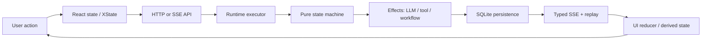

# Phoenix interaction breadth map

Load only the sections selected by cues in the request. Paths are starting anchors, not an exhaustive inventory; search current symbols because modules move.

## Conversation truth path

Ask at each arrow: identity, ordering, durability, cancellation, retry, replay, deduplication, and user-visible error.

Starting anchors:

- `crates/phoenix-state-machine/src/transition.rs`, `effect.rs`
- `crates/phoenix-ide/src/runtime.rs`, `runtime/executor.rs`
- `crates/phoenix-ide/src/api/wire.rs`, `api/sse.rs`
- `crates/phoenix-db/src/ddl.rs`, `migrations.rs`, retrieval/workflow modules
- `ui/src/conversation/`, `ui/src/machines/`, owning page/component
- `ui/src/sseSchemas.ts`, `ui/src/generated/`
- `specs/sse_wire/`, `specs/conversation-ui/`, `specs/durable-workflows/`

Checks easy to miss:

- persisted-before-broadcast and reconstruction after process loss;
- Init/replay/live overlap and sequence deduplication;
- optimistic state vs authoritative state;
- stale tool/LLM/sub-agent result after cancel or generation change;
- lazy runtime materialization vs boot-time recovery;
- hidden/display-only content vs model-visible content;
- Rust wire change → codegen → valibot → reducer/rendering.

## Async work, retries, and apparent stalls

Trace status from its authoritative timestamp/event, not the spinner component backward only.

Starting anchors:

- `specs/working-phase-visibility/`
- `specs/llm-retry-visibility/`
- `specs/stale-tool-results/`
- runtime executor/wake paths and provider retry code
- `ui/src/components/StateBar.tsx` and connection/status derivation

Questions:

- real stall, retry backoff, missing heartbeat, disconnected client, or stale derived label?
- parent state or child/sub-agent-local state?
- does cancellation interrupt wait/backoff and fence the late result?
- is time event-driven, or is a test/implementation hiding a race with sleep/timeouts?

## UI, viewers, focus, and responsive behavior

Start at the visible owner, then inspect shared primitives and scope ownership.

Starting anchors:

- owning file under `ui/src/pages/` or `ui/src/components/`
- `ui/src/hooks/useFocusScope.tsx`
- `ui/src/contexts/ViewerSlotContext.tsx`
- `ui/src/components/viewer-find/`
- colocated CSS, then global `ui/src/index.css` only for shared shell rules
- `specs/keyboard-interaction/`, `specs/viewer-find/`, `specs/viewer_slot/`

Questions:

- topmost focus scope, editable/native behavior, Escape ownership, repeated shortcut?
- logical content or only mounted/virtualized DOM?
- overlay/fullscreen state sharing or parallel state?
- loading, empty, error, archived/read-only, narrow viewport, reduced motion?
- does a fixture exercise the actual state and does browser QA verify geometry, not just DOM presence?

## Content, tools, providers, and attachments

Trace each semantic value through one typed representation per consumer.

Starting anchors:

- `crates/phoenix-core/src/domain/db_schema.rs`
- `crates/phoenix-tools/src/` and tool spec
- `crates/phoenix-ide/src/runtime/executor.rs`
- `crates/phoenix-llm/src/` provider adapter
- message attachment child tables and UI message renderers

Questions:

- model-visible, transcript-visible, or UI-only metadata?
- can the next layer represent the capability? If not, is the gap structural and logged?
- are bytes/fields duplicated in JSON and typed fields?
- do child collections have rows + ordinal rather than blob arrays?
- can stale tool results enter current LLM context after cancellation?

## Work lifecycle, Git, tasks, and PRs

A conversation branch is only one view of repository state. Inspect all worktrees and distinguish observed remote refs from owned local refs.

Starting anchors:

- `crates/phoenix-ide/src/discovery/`, Git/work-scope API handlers
- `crates/phoenix-core` Git helpers
- work-scope tables/modules and task approval/complete/continue paths
- `specs/work-lifecycle/`, `specs/projects/`, PR feedback specs
- `git worktree list --porcelain`, branch/ref status, task filename state

Questions:

- which worktree owns the checked-out branch?
- is Phoenix fetching observation data or moving a local ref?
- what survives restart: task, work scope, PR association/baseline, continuation chain?
- does cleanup preserve user-owned branches/worktrees?
- is stale PR feedback represented as freshness or incorrectly mirrored as GitHub truth?

## Persistence and durable workflows

Start from the user-visible truth that must survive, then identify schema and wake/recovery authority.

Starting anchors:

- `crates/phoenix-db/src/ddl.rs`, `migrations.rs`, workflow modules
- `crates/phoenix-workflow/`
- runtime creation/wake/recovery code
- `specs/durable-workflows/` and owning feature Allium

Questions:

- row/column constraint or convention hidden in serde?
- transactional boundary and crash point between each step?
- idempotence key/generation fencing and duplicate wake behavior?
- old-row migration and rollout defaults: true absence or hidden data loss?
- eager recovery, lazy materialization, or UI-triggered wake?

## Browser, MCP, network, and host locality

The server's view of paths and addresses is not the remote browser's view.

Starting anchors:

- `crates/phoenix-browser/`, browser session broadcasts, `BrowserViewPanel`
- `crates/phoenix-mcp/`, `specs/mcp/`
- deployment-info/local reveal API and UI consumers
- `specs/browser-tool/`, `specs/deployment-info/`

Questions:

- session owned by conversation/work scope, stopped vs disconnected, reflected over SSE?
- bind address reachable from another machine, or only resolves locally?
- server path content streamed to browser, or invalid host-local path affordance?
- same-host decision based server-side on peer/X-Forwarded-For under the trusted loopback gate?

## LLM/provider protocol

Treat “model failure” as a hypothesis until framing, accumulation, capability, and classification are checked.

Starting anchors:

- `crates/phoenix-llm/src/sse.rs`, provider adapters, error/rate-limit modules
- `specs/llm/`, retry/visibility specs

Questions:

- streaming frame parsed and accumulated correctly?
- provider-specific event mapped losslessly into common typed content?
- retryable classification based on exact error path, not generic intuition?
- cancellation during request/backoff and visibility to parent/child scope?
- provider input limit/cache semantics differ from local assumptions?

## Production evidence ladder

Use deployed evidence for deployed behavior:

1. identify exact time window, conversation/work scope, route, and service;
2. query bounded TraceQL results from local VictoriaTraces;
3. inspect collector warnings and `~/.phoenix-ide/prod.log` around the window;
4. fetch full traces only for selected trace IDs;
5. compare deployed version/config/process state with local code;
6. use Jaeger only if TraceQL cannot answer the query.

Do not dump broad production logs, full DB message bodies, or unbounded traces into the conversation. Aggregate first and redact secrets/incidental user content.

## Cross-boundary completion check

Before converging, ask only those that can alter scope:

- What creates the state? What consumes it?
- Where is it authoritative and durable?
- What happens on cancel, retry, reconnect, restart, stale completion, and partial failure?
- Does another provider/device/worktree/browser host expose a capability gap?
- Which normative rule and regression prove the intended user-visible truth?
- Is the proposed fix at the owning boundary, or relying on every caller to remember policy?
