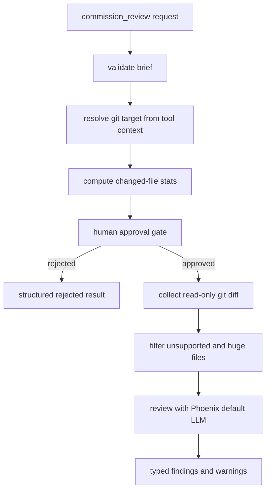

# Commission Review Design

`commission_review` is a capital-spend review request tool. Phoenix owns target resolution, diff collection, filtering, model selection, and output shaping.

## Target resolution

Worktree-backed conversations review the active worktree against its merge base with the configured base branch when available; the current implementation uses `main` as the default base name when the runtime has not supplied a stronger base. Direct conversations in a git repository review current workspace changes.

## Read-only git commands

The harness uses only read-only git commands: `rev-parse`, `status --porcelain`, `diff --numstat`, `diff --name-only`, and `diff --`. It does not stage, write, fetch, merge, commit, push, or update refs.

## Review output

The tool returns one JSON object with:

- `status`: `success`, `skipped`, `completed_with_warnings`, `rejected`, or `failed`
- `summary`: files reviewed, findings count, token usage when available, elapsed time, target, and dirty state
- `findings`: typed review findings
- `warnings`: skipped files, truncation, model failures, and collection warnings

Findings are typed Rust values before serialization; warning records are explicit and never inferred from omitted data.
