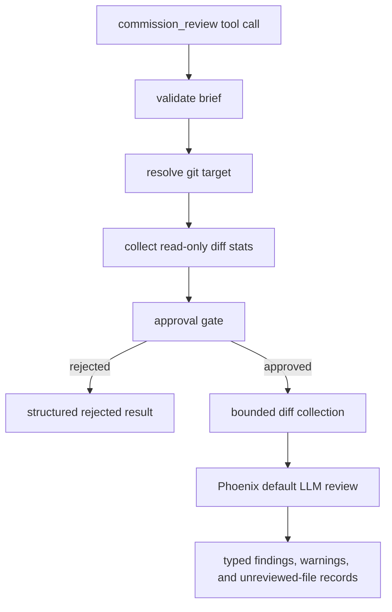
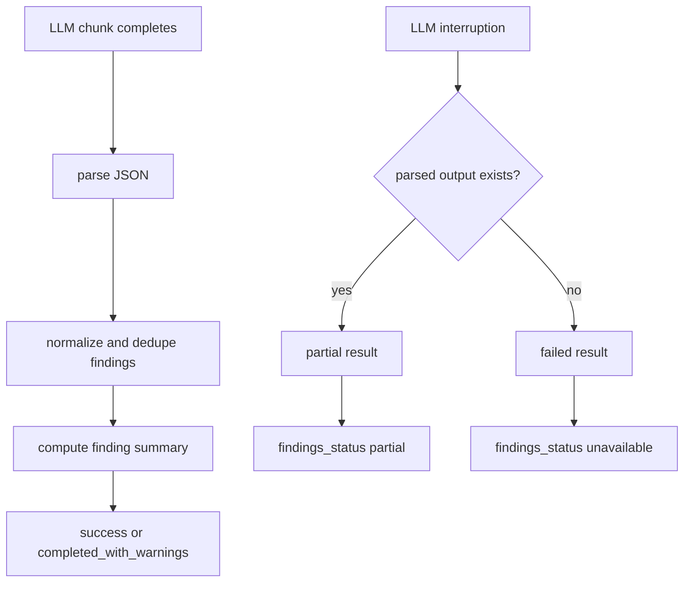

# Commission Review Design

## REQ-CR-001, REQ-CR-003: Review orchestration

`commission_review` is implemented as a Phoenix tool that validates the request,
resolves the active git target, summarizes review scope, and uses
`ToolContext::llm_selector().default_service()` for review execution after the
approval gate allows spending tokens.

The review prompt asks the model to return JSON with typed findings. Phoenix
parses those findings into Rust structs before serializing the tool result, so
review comments, warnings, unreviewed-file records, and summary metadata have
one authoritative shape.

## REQ-CR-002: Brief validation

The tool input requires `brief`. Runtime validation trims the string and rejects
empty values before git commands or LLM calls. This keeps the spend justification
available before any expensive work begins.

## REQ-CR-004, REQ-CR-005, REQ-CR-006: Target resolution and dirty state

The harness resolves the repository root from the tool context working
directory. Worktree-backed conversations review the active branch against the
base branch used for the task or worktree. Direct conversations inside a git
repository review workspace changes against `HEAD`.

The base comparator is resolved to the remote-tracking ref `origin/<base>` when
it exists, falling back to the bare local `<base>` ref otherwise. The local
`<base>` ref is only as current as the worktree last fast-forwarded it, so on a
long-lived clone it can be far behind; diffing a feature branch against a stale
local base pulls in every commit merged upstream since, inflating the review
with already-landed code and, for large files, fabricating diffs large enough to
exceed the size caps. `origin/<base>` is what the branch actually merges into,
so it is the correct comparator and matches the diff the conversation diff
endpoint shows the user. The comparator is resolved freshly at review execution
time rather than cached on the approval scope, so it cannot go stale between a
review being proposed and approved; the approval card therefore presents the
base as a proposal that resolves to its tracked remote at review time, and the
result records the concrete resolved comparator.

For worktree-backed reviews, `git status --porcelain` determines cleanliness. A
dirty worktree is rejected unless `allow_dirty_working_tree` is true. When dirty
review is allowed, the target summary records both `dirty: true` and
`allow_dirty_working_tree: true`, and that summary is included in the approval
and result payloads.

## REQ-CR-007: Availability boundary

The runtime exposes the tool only in parent conversations where Phoenix can
review git-backed work. Read-only explore contexts and sub-agent contexts do not
receive the tool in their registry. If persisted or replayed state references
the tool outside that availability boundary, the executor treats it as an
unavailable capability rather than inferring a target from incomplete context.

## REQ-CR-008: Read-only git collection

The harness uses read-only git commands: `rev-parse`, `status --porcelain`,
`diff --numstat`, and `diff`. It does not invoke commands that mutate the
working tree, index, refs, remotes, or object database.

## REQ-CR-009: Cancellation

The tool checks the cancellation token before review execution, during per-file
diff collection, and while awaiting the LLM response. Cancellation returns a
failure result instead of partial or fabricated findings.

## REQ-CR-010: Filtering and coverage reporting

Changed files are filtered before review through two channels, so an incomplete
review is never silently presented as complete:

- Files excluded by a size cap — a per-file diff overage or total review-budget
  truncation — are recorded in a typed top-level `unreviewed` list, each tagged
  with the cap it exceeded (`per_file_cap` or `total_review_cap`). A non-empty
  list forces a partial top-level status, so a run that skipped files can never
  report success. This holds even in the degenerate case where every changed
  file was excluded and none were reviewed: the result reports the coverage gap
  rather than reading as an ordinary empty-diff skip.
- Binary numstat entries and unsupported extensions produce advisory
  `warnings`. They are not reviewable as text, so they are reported separately
  from the size-driven coverage gap rather than conflated with it.

Reviewed-file and changed-file counts are reported separately so the user can
see whether the review covered every change.

## REQ-CR-011, REQ-CR-012, REQ-CR-013: Result status contract

The tool result separates top-level actionability from stage-level execution
state. Top-level `status: failed` is reserved for results with no actionable
review output. If an LLM timeout or transport failure happens after Phoenix has
parsed a finding or reviewer summary, the result is `partial` and preserves that
output. Conversation cancellation is handled by the runtime abort path, which
discards returned tool output after the shared cancellation token is set.

`review_status`, `findings_status`, `findings_trust`, and `stage_status` are
typed enums rather than free-form strings. `stage_status` records target
collection, diff collection, LLM review, JSON parse, and finding extraction so
callers can identify the stage that limited the review. Parse repair sets
`findings_trust: repaired`; parse failure sets low trust and marks JSON parsing
and finding extraction as failed.

Finding summaries are computed after normalization and deduplication. They count
total findings and counts for critical, high, medium, and low severity without an
additional model call. Warning summaries are deterministic strings derived from
typed warnings and are serialized before the full warnings list in both the JSON
result and display payload.

## REQ-CR-014: User-facing cost metadata boundary

`ReviewSummary` retains internal LLM usage only for Phoenix tool accounting via a
non-serialized field. The commission review result and display payload do not
include input tokens, output tokens, cache tokens, cost estimates, or a cost
object. The approval gate and executive brief are the user-facing spend control.

## REQ-CR-015: Finding anchors

Findings require a file path. Line number and symbol are optional navigation
hints. The review prompt asks for `symbol` when a stable function, type, module,
or other code anchor is available, and parsing preserves it as `Option<String>`
after trimming empty values.
