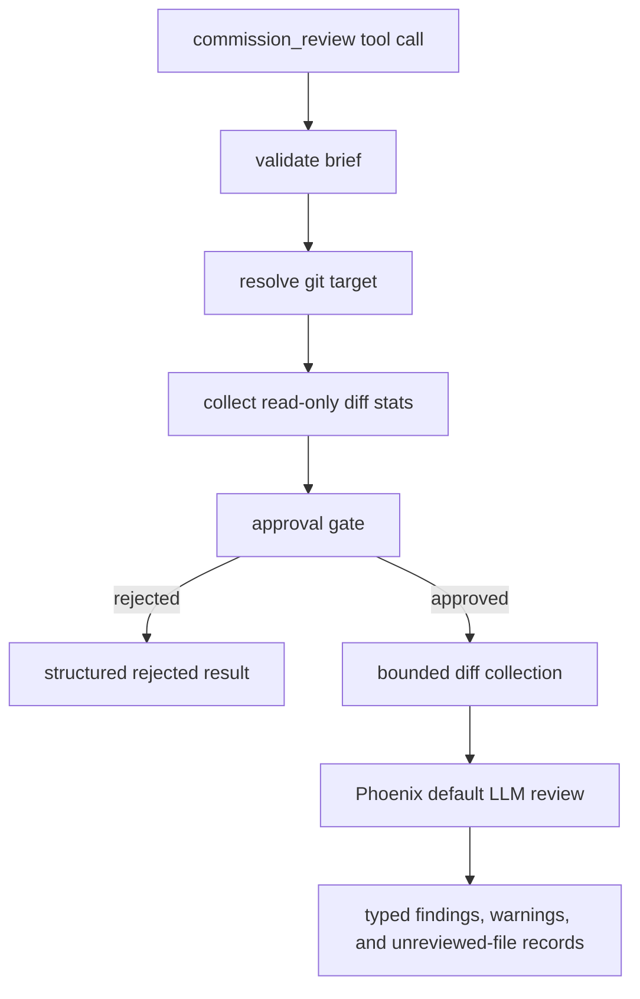

# Commission Review Design

## REQ-CR-001, REQ-CR-003: Review orchestration

`commission_review` is implemented as a Phoenix tool that validates the request,
resolves the active git target, summarizes review scope, and uses
`ToolContext::llm_selector().default_service()` for review execution after the
approval gate allows spending tokens.

The review prompt asks the model to return JSON with typed findings. Phoenix
parses those findings into Rust structs before serializing the tool result, so
review comments, warnings, unreviewed-file records, and summary metadata have
one authoritative shape.

## REQ-CR-002: Brief validation

The tool input requires `brief`. Runtime validation trims the string and rejects
empty values before git commands or LLM calls. This keeps the spend justification
available before any expensive work begins.

## REQ-CR-004, REQ-CR-005, REQ-CR-006: Target resolution and dirty state

The harness resolves the repository root from the tool context working
directory. Worktree-backed conversations review the active branch against the
base branch used for the task or worktree. Direct conversations inside a git
repository review workspace changes against `HEAD`.

For worktree-backed reviews, `git status --porcelain` determines cleanliness. A
dirty worktree is rejected unless `allow_dirty_working_tree` is true. When dirty
review is allowed, the target summary records both `dirty: true` and
`allow_dirty_working_tree: true`, and that summary is included in the approval
and result payloads.

## REQ-CR-007: Availability boundary

The runtime exposes the tool only in parent conversations where Phoenix can
review git-backed work. Read-only explore contexts and sub-agent contexts do not
receive the tool in their registry. If persisted or replayed state references
the tool outside that availability boundary, the executor treats it as an
unavailable capability rather than inferring a target from incomplete context.

## REQ-CR-008: Read-only git collection

The harness uses read-only git commands: `rev-parse`, `status --porcelain`,
`diff --numstat`, and `diff`. It does not invoke commands that mutate the
working tree, index, refs, remotes, or object database.

## REQ-CR-009: Cancellation

The tool checks the cancellation token before review execution, during per-file
diff collection, and while awaiting the LLM response. Cancellation returns a
failure result instead of partial or fabricated findings.

## REQ-CR-010: Filtering and coverage reporting

Changed files are filtered before review through two channels, so an incomplete
review is never silently presented as complete:

- Files excluded by a size cap — a per-file diff overage or total review-budget
  truncation — are recorded in a typed top-level `unreviewed` list, each tagged
  with the cap it exceeded (`per_file_cap` or `total_review_cap`). A non-empty
  list forces a `completed_with_warnings` status, so a run that skipped files
  can never report success. This holds even in the degenerate case where every
  changed file was excluded and none were reviewed: the result reports the
  coverage gap rather than reading as an ordinary empty-diff skip.
- Binary numstat entries and unsupported extensions produce advisory
  `warnings`. They are not reviewable as text, so they are reported separately
  from the size-driven coverage gap rather than conflated with it.

Reviewed-file and changed-file counts are reported separately so the user can
see whether the review covered every change.
