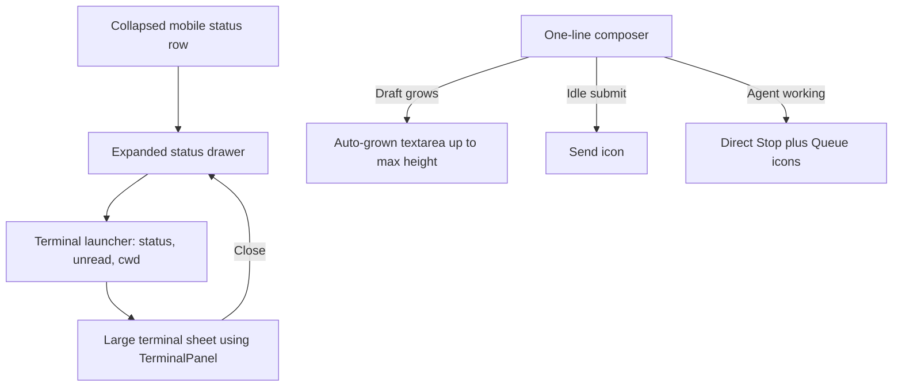

# Compact mobile conversation chrome

## Observed journey

- On a mobile conversation, the collapsed terminal header remains mounted between the composer and the bottom status bar. Even when the terminal is not in use, that orange-marked strip permanently consumes transcript height.
- The working-state composer is much taller than its empty content requires. Its textarea begins as two rows and the mobile breakpoint moves the actions onto a separate 44px-tall row, so an untouched composer occupies roughly two control rows plus padding.
- The visible `Stop` and disabled `Queue` text buttons dominate the composer even before there is a follow-up to queue.
- Reproduction target: a narrow mobile viewport (`< 480px` for composer rules, `< 768px` for the status drawer) while the agent is working and the draft is empty.

## Verified findings

- `ConversationPage` renders `terminalSplitPane` inside `.conversation-column` on mobile (`!isDesktop`) and below it on desktop. The mobile surface is therefore the same collapsed/resizable panel concept, not a drawer-specific presentation.
- `TerminalPanel` already owns terminal connection, unread, reconnect, shell, selection, and fit behavior. The presentation change should reuse it rather than duplicate terminal state or session logic.
- `StateBar` already provides the existing mobile collapsed/expanded drawer pattern, including a compact persistent row, expanded details, `aria-expanded`, keyboard activation, file-browser action, and 44px targets.
- `InputArea` renders `textarea rows={2}` and auto-resizes it from `scrollHeight` to a 120px maximum. `InputArea.css` sets a 44px control minimum, but at `<= 480px` changes the form to one column and places the action group in a second row with 44px buttons.
- While the agent is working, current behavior deliberately keeps cancellation and follow-up queuing independently available. `InputArea.test.tsx` covers Stop/Queue independence, Enter-to-queue, cancellation-in-progress, and phases that hide actions.
- `specs/conversation-ui/requirements.md` requires textarea auto-growth, independent queue/cancel access while busy, controls outside the editable region, full-width mobile layout, 44px touch targets, and safe-area handling.

## Product direction

### Terminal

Use the selected **launcher-row pattern**:

1. Remove the always-visible mobile terminal header from the conversation stack; retain the existing desktop split pane unchanged.
2. Add a `Terminal` row to the expanded mobile status drawer with connection/unread state and a short cwd summary.
3. Tapping the row opens the existing live `TerminalPanel` in a large mobile sheet/takeover with explicit close affordance, safe-area padding, and no competing status details.
4. Hiding or closing the sheet must not create a second terminal session or unintentionally discard terminal state. Reopening must fit xterm to its newly visible container.

### Composer

Use a **one-line, auto-growing composer with a contextual icon action rail**, not a generic `More` menu:

- Begin at one text line / one 44px control row and grow with content to the existing maximum; do not reserve a second action row when empty.
- Keep controls beside (not over) the editable text, aligned to the bottom as text grows.
- Replace wide text buttons with simple icon controls while preserving accessible names/tooltips and 44px hit areas:
  - idle: compact Send icon; disabled until content exists;
  - working: Stop icon remains independently available; Queue icon becomes the primary submit action and enables when content exists;
  - preserve voice and contextual quick actions without forcing a permanent second row. If they cannot fit beside the field at the narrowest supported width, disclose those secondary actions from a small overflow control, while Stop and Send/Queue remain direct.
- Keep the working-state color/status treatment subtle; agent activity is already communicated by the placeholder and status bar, so the composer should not need oversized buttons to communicate it.

A blanket `More` button for Stop/Queue is deliberately rejected: these are immediate, state-dependent actions, and hiding Stop adds delay to cancellation. A separate bottom sheet for composer controls is also unnecessary for the current small control set and risks keyboard/focus disruption.

## Interaction map

- `ConversationPage` remains the owner of terminal placement and mobile sheet visibility.
- `TerminalPanel` remains the sole consumer/owner of terminal session UI state.
- `StateBar` receives a typed terminal launcher contract rather than learning terminal internals.
- `InputArea` continues to own draft, auto-resize, send, queue, cancellation, voice, and quick-action behavior.

## Proposed scope

1. Update the conversation UI requirement/executive documentation to specify mobile terminal placement and compact composer behavior without changing desktop terminal placement.
2. In `ConversationPage`, stop rendering the split-pane terminal in the mobile conversation column. Add mobile terminal-sheet visibility and pass a terminal-launcher callback/status contract to `ConnectedStateBar`.
3. Extend the expanded mobile `StateBar` details with a keyboard- and screen-reader-accessible Terminal launcher row. Keep the collapsed status row uncluttered.
4. Mount the lazy-loaded existing `TerminalPanel` in a mobile sheet/takeover. Ensure close/Escape/backdrop policy, focus restoration, safe-area handling, mutually exclusive overlay behavior, and xterm fit after opening are explicit.
5. Refactor `InputArea` mobile presentation to start at one line, retain existing 120px auto-growth, and use a same-row contextual icon action rail. Preserve all phase/capability gating and direct Stop/Queue access.
6. Add/update component and page regression coverage for:
   - no persistent terminal strip on mobile and unchanged desktop split pane;
   - terminal launcher appears only in the expanded status drawer and opens/closes the live panel;
   - terminal reconnect/unread/session behavior survives sheet visibility changes;
   - empty mobile composer is one compact row and grows with multiline input;
   - 44px action targets and controls remain outside the textarea;
   - Stop remains directly available while working, Queue enables with content, Enter queues, and existing cancellation/awaiting phase behavior is unchanged;
   - keyboard focus returns to the launcher after closing the terminal sheet.
7. Add or extend a mobile conversation Ladle/QA fixture if no current fixture exposes a working agent plus composer and terminal launcher; capture narrow-viewport visual evidence with empty and multiline drafts.

## Acceptance journey

At a narrow mobile viewport, open a busy conversation with an empty draft. The transcript extends down to a single-row composer followed by the normal collapsed status bar; no terminal strip is permanently visible. Expand the status drawer, activate its Terminal row, use the terminal in a large sheet, close it, and return focus to the launcher without losing the session. Type a multiline follow-up: the composer grows only as needed, Stop remains immediately available, Queue enables, and submitting preserves existing queue semantics. Repeat at desktop width and confirm the resizable/collapsible terminal split pane and composer behavior remain intact.

## Risks and non-goals

- Risks: xterm fit during sheet animation, software-keyboard viewport changes, overlay stacking with file/diff/browser viewers, focus restoration, and accidentally remounting/reconnecting the terminal on every open.
- Non-goals: terminal backend/protocol changes, redesigning terminal internals, changing queue/cancel semantics, increasing the 120px composer maximum, or redesigning desktop conversation chrome.
