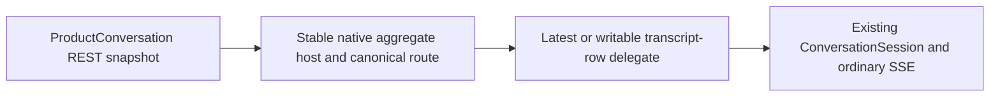

# Transition iOS vNext into minimal A/B/C workstreams

## Authority and exact baseline

This report replaces the over-decomposed proposal. It is grounded in exact main `b20ed69ab2ccf84fd27bc63eb46da538c9f96f86`, existing tasks `04004` through `04011`, the normative iOS specs, accepted ProductConversation ADRs, and the shipped REST/web delegation contract.

No blocked task is renamed and no normative file is edited before approval. No task numbered `88001` through `88010` will be created. No C task will be pre-created.

## Approved architecture boundary

The shipped ProductConversation REST snapshot owns stable aggregate identity, `canonical_route`, Open/History lifecycle, ordered transcript segments, `latest_transcript_row_id`, and nullable `writable_transcript_row_id`. Live transport remains ordinary transcript-row SSE.

The native `ConversationSession` remains the live delegate for exactly one transcript row and continues to own that row's SSE reconnect/replay, cache, reducer, outbox, and tool-use index. The ProductConversation host owns aggregate identity, history, lifecycle, refresh, and delegate rebinding. No aggregate-native SSE, new native message/outbox store, server/API/schema/database/runtime change, or parallel message authority is permitted.



## A — existing task 04005 only

### Exact taskmd transition

Immediately after approval:

```bash
taskmd status 04005 in-progress
```

This is the only immediate taskmd transition. It changes:

- `tasks/04005-p1-blocked--ios-vnext-rendering-fixture-harness.md`
- to `tasks/04005-p1-in-progress--ios-vnext-rendering-fixture-harness.md`

Do not create child tasks for A. Update the 04005 body after the command so its dependency states that deterministic fixture-only work may proceed independently using synthetic/current shipped payloads and makes no ProductConversation lifecycle, delete, provenance, live-routing, or persistence assumptions.

### A implementation and ownership

04005 owns the complete bounded fixture harness:

- DEBUG-only deterministic fixture launch/catalog selection;
- typed scenario identifiers and synthetic/current shipped payload inputs;
- fixed identities, dates, ordering, text, and explicit readiness;
- real existing SwiftUI conversation, message, typed-state, question, tool/fallback, and current inline-Markdown components;
- representative normal, loading, empty, malformed, error, offline, cached, and presentation-only read-only states where existing components can truthfully show them;
- focused registry/determinism tests;
- a separate no-server XCUITest scheme using direct Simulator events, accessibility/readiness assertions, and retained screenshot attachments;
- fixture conventions later 04006–04010 work can extend.

A owns new fixture-only source files, the minimal fixture launch branch in `PhoenixMobileApp.swift`, inspection-only accessibility identifiers in existing views, `project.yml` fixture test wiring, fixture unit tests, and fixture UITests.

A does **not** own production ProductConversation Codable/API models, aggregate list/navigation/session state, REST refresh, delegate rebinding, ordinary SSE behavior, outbox/cache semantics, renderer improvements, or later capability implementation.

A's contract scaffolding is complete when the typed registry/host seam, deterministic launch selection, and no-network/no-session-start guard are committed and tested. The remaining catalog and no-server UI coverage stay inside 04005; their completion does not block B from starting where file ownership permits.

## B — existing task 04004 as the core migration umbrella

### Exact taskmd transition

04004 remains blocked while A establishes the contract scaffolding. After that exact A commit is reviewed and available:

```bash
taskmd status 04004 in-progress
```

This changes:

- `tasks/04004-p1-blocked--ios-vnext-productconversation-migration.md`
- to `tasks/04004-p1-in-progress--ios-vnext-productconversation-migration.md`

Update 04004's dependency body after approval to replace the obsolete History/delete blanket gate: B consumes the shipped ProductConversation REST aggregate and existing ordinary transcript-row REST/SSE contracts; it depends on A's fixture contract seam, not permanent delete, follow-up/source retrieval, grounding, or comments.

### Minimal B ownership slices

Do not pre-create B leaves. 04004 owns and validates both slices. If separate workers are actually scheduled after A scaffolding, use `taskmd new` then to create **at most two** leaves—one for each slice below—with allocator-assigned IDs recorded back into 04004. Otherwise implement both directly under 04004. There is no separate validation task.

#### B1 — REST models and aggregate-keyed identity

Ownership:

- `ios/PhoenixMobile/Sources/API/Models.swift`: shipped ProductConversation list/snapshot/segment/presentation Codable types;
- `ios/PhoenixMobile/Sources/API/PhoenixAPI.swift`: existing ProductConversation REST list/snapshot calls only;
- `ios/PhoenixMobile/Sources/Store/ConversationListStore.swift`: ProductConversation-keyed list/cache projection;
- `ios/PhoenixMobile/Sources/Views/ConversationListView.swift` and list/navigation portions of `RootView.swift`: one stable aggregate entry and canonical aggregate route/reference;
- B1-focused contract, decoding, list identity, route, offline-cache, and navigation tests;
- B1 fixture scenarios added through A's registry convention.

B1 must not key user-facing identity to a transcript row and must not own live session/SSE or aggregate transcript composition.

#### B2 — latest-transcript delegation and aggregate transcript

Ownership:

- a narrowly named new ProductConversation host/store/view seam for aggregate snapshot ownership, refresh generation, selected delegate identity, segment composition, and Open/History presentation;
- `ios/PhoenixMobile/Sources/AppModel.swift`: minimal aggregate-host/session acquisition and release plumbing;
- `ios/PhoenixMobile/Sources/Store/ConversationSession.swift`: only the smallest typed host/delegate seam needed to reuse existing transcript-row behavior; no SSE/store semantic rewrite;
- `ios/PhoenixMobile/Sources/Views/ConversationView.swift` and message composition surfaces: chronological aggregate history plus exactly one delegated live tail, deduplicated by message identity;
- B2-focused delegate-rebind, former-delegate isolation, transcript dedup/order, cache, composer gating, and Open/History read-only tests;
- the existing opt-in live-server journey extended only for the shipped B contract;
- B2 fixture scenarios added through A's registry convention.

The authoritative aggregate snapshot selects `writable_transcript_row_id` when present for live interaction, otherwise `latest_transcript_row_id` for the readable tail. On an authoritative change, the host releases the old view-owned stream before the replacement owns live reduction. Events from the old delegate cannot mutate the new tail. Existing per-row SSE/init/replay/cache/outbox behavior remains unchanged.

### Concurrent ownership rule

B1 and B2 can run concurrently only after shared ProductConversation model names and fixture inputs are committed. B1 owns existing list/API files; B2 owns the new host plus session/conversation presentation files. `AppModel.swift` and `RootView.swift` are declared integration choke points: if both slices need the same region, serialize that integration rather than broadening ownership or creating another task.

Focused and journey validation belongs in B1/B2 or directly in 04004, never in a validation-only task.

## C — existing blocked umbrellas only

Do not create C tasks and do not change any 04006–04010 status now.

- `04006` remains blocked for later conversation status/action expansion, including any separately scheduled permanent-delete capability if product policy retains it.
- `04007` remains blocked for later tool-output renderer expansion.
- `04008` remains blocked for later Markdown fidelity.
- `04009` remains blocked for later grounding/files.
- `04010` remains blocked for later prose reader/comments; follow-up/source retrieval and provenance presentation remain later dependencies when scheduled.
- `04011` remains the blocked program umbrella.

Permanent delete, follow-up/source retrieval, grounding, files, reader, and comments do not block B. Existing conditional hard-delete/not-found cleanup remains valid when a definitive ordinary conversation signal is observed; B does not add a ProductConversation permanent-delete action.

## Complete taskmd transition report

| When | Command | Result |
|---|---|---|
| Immediately after approval | `taskmd status 04005 in-progress` | A starts under existing 04005 |
| After A contract-scaffolding commit | `taskmd status 04004 in-progress` | B starts under existing 04004 |
| Only if two B workers are actually scheduled | up to two `taskmd new` calls | optional B1/B2 leaves; IDs allocated then, not predeclared |
| Now | no commands for `04006`–`04011` | all later umbrellas keep current blocked status |
| Now | no C task creation | later capabilities remain in existing umbrellas |

No other taskmd transition is approved by this report.

## Normative policy edits after approval

### `specs/ios_client/executive.md`

Replace the global History/delete gate with the A/B/C policy:

- 04005 is active independently as the deterministic fixture harness;
- 04004 may start after A contract scaffolding and consumes shipped ProductConversation REST plus existing transcript-row SSE/session machinery;
- permanent delete and later capability umbrellas do not block B;
- update the program table and known-gap dependency prose to the exact task statuses as they transition.

### `specs/ios_client/requirements.md`

Make only timeless core-migration edits:

1. REQ-IOS-005: when an Open ProductConversation's authoritative latest/writable transcript delegate changes, rebind live ownership to that exact transcript row using the existing conversation SSE contract; a former delegate cannot mutate the replacement aggregate tail.
2. REQ-IOS-011: one ProductConversation retains stable user-facing identity and canonical aggregate navigation across continuation rows; aggregate lifecycle owns Open/History truth; History remains readable with chat and Open-only actions disabled.
3. Remove `AND SHALL preserve online-only permanent Delete` from the REQ-IOS-011 History clause. Permanent ProductConversation delete is not a core migration prerequisite.
4. Preserve REQ-IOS-005's conditional hard-delete/not-found local cleanup. It specifies safe reaction to a definitive signal; it does not require B to implement permanent delete.
5. Do not change REQ-IOS-019 through REQ-IOS-021 during A/B.

### `specs/ios_client/ios_client_lifecycle.allium`

Before B implementation, specify:

- one ProductConversation host has at most one active ordinary transcript-row stream delegate;
- the authoritative aggregate snapshot selects the delegate;
- changed delegate identity releases old open-view stream ownership before replacement ownership;
- former-delegate events cannot mutate the replacement tail;
- existing transcript-row init/replay/cache/outbox semantics remain unchanged;
- aggregate SSE emission and an aggregate-native message store are explicitly excluded.

No server or `sse_wire` normative edit is proposed.

### Other normative artifacts

Do not edit `ios_prose_feedback.allium` for A/B. Its later conditional deleted-scope behavior does not make permanent delete a B prerequisite.

No new ADR is proposed. ADR-026 already separates ProductConversation/WorkScope authority from latest execution-row live state, and ADR-031 keeps continuation topology in transcript rows. If B would require a new durable authority, compatibility guarantee, aggregate-native SSE/store, or server change, stop and propose a new decision instead of expanding scope.

## Validation and delivery gates

04005 and 04004 each own their focused validation. Across A/B, run XcodeGen generation, focused native tests, the full `PhoenixMobile` unit scheme, A's separate no-server fixture XCUITest scheme, B's applicable existing opt-in live journey, and full applicable repository checks.

Before handoff: proactive `phoenix-adversarial-review`, separate independent review, fixes and reruns, logical commits, immutable new PR branch, fresh CI on exact pushed HEAD, exact-head review, fully paginated review threads, and zero unresolved actionable threads. Never merge.

## Explicit non-goals

- No server/API wire/schema/database/runtime changes.
- No aggregate-native SSE or aggregate-native message/outbox store.
- No permanent ProductConversation delete in B.
- No follow-up/source retrieval, provenance presentation, grounding, files, reader, or comments in A/B.
- No status/action, tool-renderer, or Markdown-fidelity expansion in A/B.
- No live model/server in A and no foreground host mouse/keyboard control.
- No Close/repair implementation or lifecycle assumptions beyond consuming shipped Open/History truth.
