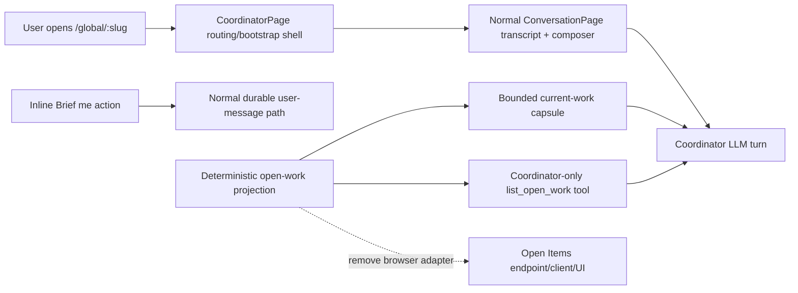

# Make the Coordinator a chat-only surface

## Observed journey

On phone-sized `/global/:slug`, the Coordinator’s duplicate page header, separate “Brief me” row, and bottom Conversation/Work selector consume a large share of the viewport. The transcript is consequently compressed even though the ordinary conversation shell already provides conversation-name navigation. The requested product direction is not merely a mobile rearrangement: desktop and mobile should both become chat-only, with the Coordinator transcript and composer occupying the surface.

Product decisions confirmed for this task:

- Remove the Coordinator header and all Open Items/Work UI at every viewport size.
- Remove the explanatory “Current work context is attached…” text.
- Put a compact visible “Brief me” action beside the mic/send controls at every viewport size.
- Preserve both the automatically injected bounded current-work bundle and the Coordinator-only paginated `list_open_work` agent tool.

## Verified findings

- `CoordinatorPage` currently owns a duplicate header/back link, desktop and mobile Conversation/Work selectors, attention/find-work rendering, browser-side query/pagination state, focus/turn-completion refresh effects, and calls to `api.getGlobalOpenWork`.
- At widths up to 1024px, `CoordinatorPage.css` allocates dedicated rows to the header and bottom mobile navigation around the conversation row. At desktop widths it allocates a second column to the Work pane.
- The Coordinator conversation itself is the normal lazy-mounted `ConversationPage` with `/global` routing and `COORDINATOR_QUICK_ACTION`; durable routing and the shared transcript/composer runtime do not depend on the Work pane.
- `InputArea` currently renders the quick action and context note in a separate row above the textarea. Mic, stop, and send/queue controls live in `.input-inline-actions` inside the composer.
- Backend work projection is shared but separable by consumer: `GlobalReadService::current_work_capsule` formats the automatically injected turn context, while `open_work_page` serves the Coordinator’s `list_open_work` tool. The browser-only `/api/global/open-work` handler is a third adapter over that projection.
- `specs/global-recall/requirements.md` currently requires a visible current-attention/find-work utility in REQ-GR-001 and REQ-GR-010, while REQ-GR-011 independently requires the injected bounded capsule and complete/paginated agent tool. The product decision therefore requires a normative spec update, not only CSS deletion.
- Existing Coordinator unit tests and Ladle capture scenarios heavily assert Work switching, refresh behavior, Work cards, and mobile navigation; these should be replaced with chat-only geometry and routing/composer assertions rather than left stale.

## Interaction map

No persistence, recovery, cancellation, streaming, or reconnect behavior should be forked: the chat-only Coordinator continues to inherit those behaviors from `ConversationPage` and `InputArea`.

## Proposed scope

### 1. Reduce `CoordinatorPage` to routing/bootstrap plus chat

- Keep singleton Coordinator creation/resolution, historical chain-member routing, stale-route replacement, readiness notification, loading/error presentation, lazy loading, and the `/global`-prefixed `ConversationPage`.
- Delete active-view state, media-query switching, Open Work browser fetching/query/pagination/refresh effects, attention summaries, result cards, duplicate header/back affordance, desktop tabs, and mobile navigation.
- Make the conversation fill the available Coordinator route at phone, tablet, and desktop sizes without adding a second bespoke conversation runtime.
- Remove CSS that exists solely for the deleted header, selector, Work pane, and result UI; retain only a minimal route shell where needed for full-height conversation and bootstrap status.

### 2. Consolidate “Brief me” into the composer

- Move the generic quick-action control into `InputArea`’s inline action group beside voice/stop/send controls at all sizes.
- Show the compact “Brief me” label while retaining the descriptive accessible name “Brief me on current work.”
- Remove the separate context-note row and remove now-unused quick-action context data rather than retaining a dead parallel API.
- Preserve the existing read-only briefing prompt, normal `onSend` path, draft contents, disabled/sending guards, queue/stop behavior, and touch-usable controls. Verify the action group remains usable at narrow widths without horizontal overflow or obscuring the textarea.

### 3. Remove the browser-only Open Work adapter, preserve agent context

- Remove unused UI API types/methods and the browser-facing `/api/global/open-work` route/handler if no non-UI consumer remains.
- Keep the deterministic projection domain/service code needed by both `current_work_capsule` and the Coordinator registry’s paginated `list_open_work` tool, including stable references, filtering, ordering, truncation, and tests.
- Keep turn-time capsule injection in the runtime unchanged and retain the `list_open_work` capability in the Coordinator-only tool registry.
- Do not alter ordinary conversation filtering, Coordinator authority, cross-conversation messaging, or open-work inclusion semantics.

### 4. Align specs and decision history

- Update timeless `global-recall` requirements so the Coordinator surface is chat-only and automatic orientation plus the agent tool replace the visible current-attention/find-work utility. Preserve the intent of REQ-GR-011.
- Record the product-direction change in a project ADR rather than rewriting prior rationale as though the Work UI never existed.
- Update the executive summary/coverage map to remove claims of a visible Work utility and responsive switching.
- Run the spec-authoring pre-flight checklist before push.

### 5. Replace regression and visual coverage

- Rewrite `CoordinatorPage` tests around durable routing/bootstrap, chat-only rendering, quick-action wiring, absence of Open Work fetches/UI, historical chain links, and error/loading placement.
- Update `InputArea` tests to verify inline placement semantics, accessible labeling, prompt submission, draft preservation, and disabled-state behavior.
- Simplify Coordinator fixtures/stories by deleting Work-only fixture data and fleet scenarios; retain useful idle and working conversation scenarios.
- Update the Coordinator capture script to assert transcript/composer geometry at 360×640, 390×844, tablet, and desktop widths, no horizontal overflow, no duplicate Coordinator header/Work selector, and an in-viewport inline Brief action.
- Run focused UI tests/captures, backend tests for capsule and `list_open_work`, then `./dev.py check`.

## Acceptance criteria

- Phone, tablet, and desktop Coordinator routes show only the normal Coordinator conversation shell; no duplicate page header/back button, Conversation/Work selector, attention card, search, refresh, result list, or Work pane remains.
- The transcript gains the space previously occupied by those controls and the conversation/composer fills the route without viewport overflow.
- “Brief me” appears in the composer action group beside mic/send (or applicable stop/queue controls) at every viewport, sends the unchanged read-only briefing prompt through the normal message path, and does not erase a draft.
- The “Current work context is attached…” UI sentence is gone.
- Opening and using the Coordinator no longer requests the browser Open Work endpoint; dead browser API code is removed.
- Every Coordinator LLM turn still receives the bounded deterministic current-work capsule, and the Coordinator still has the paginated `list_open_work` tool when more detail is needed.
- Singleton routing, historical Coordinator citations, loading/error handling, streaming, continuation, cancellation, reconnect, persistence, and ordinary composer behavior remain intact.

## Risks and non-goals

- **Risk:** Moving a generic `InputArea` quick action changes reusable composer layout. Today the Coordinator is its sole production caller, but coverage must protect narrow-width action density and future callers.
- **Risk:** Deleting shared projection code by association would silently degrade agent orientation. Preserve code by typed consumers (`current_work_capsule` and `list_open_work`), not by leaving an unused HTTP/UI adapter.
- **Non-goal:** Change how open work is selected, ordered, filtered, or serialized for the agent.
- **Non-goal:** Remove the Coordinator’s global read tools or expand its mutation authority.
- **Non-goal:** Redesign the ordinary conversation shell, state bar, conversation-list filtering, or navigation conventions.
