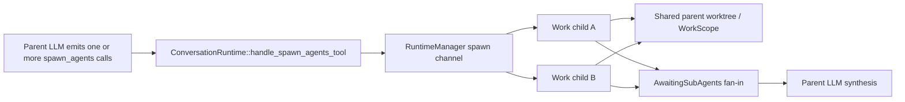

# Allow parallel Work-mode sub-agents

## Observed journey

A write-capable parent (Work, Branch, or Direct) can ask `spawn_agents` for several independent Work-mode tasks, but Phoenix rejects the whole call when more than one task resolves to Work mode:

> Only one Work sub-agent can be spawned per call. Split into separate spawn_agents calls if you need sequential Work sub-agents.

Phoenix also rejects a later Work spawn in the same parent tool round while an earlier Work child remains active:

> A Work sub-agent is already active. Only one Work sub-agent can run at a time per parent conversation.

The requested behavior is to remove both restrictions. Modern parent models should be allowed to decompose independent implementation tasks and run the Work children concurrently in the parent’s existing worktree.

This is deterministic repository behavior, not a production-only symptom; no production trace investigation is needed.

## Verified findings

- `ConversationRuntime::handle_spawn_agents_tool` enforces two distinct gates in `crates/phoenix-ide/src/runtime/executor.rs`: `work_count_in_batch > 1` rejects a multi-Work batch, and `active_work_subagents > 0` rejects Work children across spawn calls.
- `active_work_subagents` exists solely to maintain that policy. It is initialized on the parent runtime, incremented after spawn, decremented as Work results drain, and exercised by one-writer teardown tests.
- The restriction is normative, not merely prompt guidance:
  - `specs/subagents/subagents.allium` defines both rejection rules and `OneWorkSubAgentPerParent`.
  - `specs/bedrock/bedrock.allium` defines `Conversation.OneWorkSubAgent`.
  - `specs/projects/requirements.md` REQ-PROJ-008 and `specs/bedrock/requirements.md` REQ-BED-018 require one Work child at a time.
  - The subagents/projects executive and legacy design documents repeat the one-writer claim.
- The surrounding runtime already models parallel fan-out/fan-in independently of mode: pending children are vectors, `SpawnAgentsComplete` accumulates children from multiple calls, results may arrive out of order, and cancellation/timeout drains every pending child. Existing tests even construct states containing two pending Work children.
- `RuntimeManager::handle_spawn_request` creates an independent conversation/runtime for every child. The manager receives spawn requests serially, but each initialized child runtime is then spawned independently, so children execute concurrently.
- Work children intentionally inherit the parent conversation’s `ConvMode`, `ResourceScopeKey`, cwd/worktree, and writable tool registry. There is no cross-runtime filesystem lock. Each child has its own `PatchTool` instance; overlapping edits therefore use normal stale-match/write behavior, while concurrent Git or bash operations can surface ordinary process/filesystem errors.
- The parent stops at `AwaitingSubAgents` after its tool round, so the parent itself does not continue writing while its children run. The newly accepted contention is among concurrent Work children.
- The tool’s model-facing wording and UI summaries already describe tasks as parallel. One adjacent schema sentence is stale for a separate reason: it says Work children require a Work parent, while runtime correctly permits Work, Branch, or Direct parents.

## Interaction map

Persistence/recovery, result buffering, timeout, cancellation, cwd containment, model validation, and the maximum of 10 tasks per individual call remain on the existing paths. This change removes writer-count admission only.

## Owning decision

Phoenix will keep the worktree as the structural write boundary but stop treating it as a single-writer resource. A write-capable parent may spawn multiple concurrent Work children, including multiple Work tasks in one call and Work tasks spread across multiple spawn calls in one tool round. The parent model owns decomposition into independent tasks. Conflicting child operations fail or overwrite according to the existing patch/bash/Git semantics; Phoenix will not pre-serialize them.

Record this changed tradeoff in the shared ADR chain. The former single-writer rationale currently lives only in mutable requirements/Allium/legacy design prose rather than an ADR, so the new ADR should capture both the former safety choice and why bounded model-directed concurrency now wins.

## Proposed implementation

### 1. Make the specifications consistently permit parallel Work children

- Update `specs/subagents/subagents.allium`:
  - remove `SpawnRejectedMultipleWorkInBatch` and `SpawnRejectedWorkSubAgentAlreadyActive`;
  - remove writer-count preconditions/postconditions from `SubAgentSpecsResolved`;
  - remove `OneWorkSubAgentPerParent` and stale header/guidance references;
  - retain write-capable-parent validation, the 10-task per-call cap, cwd containment, independent child identity, fan-in, cancellation, timeout, and registry rules.
- Remove `Conversation.OneWorkSubAgent` from `specs/bedrock/bedrock.allium` while retaining the plural `work_sub_agents` relationship and mode-independent fan-in behavior.
- Remove the stale one-Work-child guidance from `specs/projects/projects.allium`.
- Align timeless requirements:
  - REQ-PROJ-008 should state that Work children share the parent worktree and may run in parallel.
  - REQ-BED-018 should permit parallel Work children from write-capable parents.
  - Keep REQ-SA-001’s existing requirement that all children execute in parallel.
- Update `specs/subagents/executive.md` and `specs/projects/executive.md` to describe the implemented concurrency contract and verification.
- Remove or rewrite contradictory one-writer sections in the legacy `specs/subagents/design.md` and `specs/projects/design.md`; do not leave a second, stale behavioral contract.
- Add the next project ADR under `specs/adrs/` and index it in `specs/adrs/README.md`, recording that model-directed Work concurrency within one worktree replaces runtime-enforced single-writer admission.
- Run the pre-flight checklist in `specs/AUTHORING.md` and validate every touched Allium spec.

### 2. Remove writer-count admission from the runtime

In `crates/phoenix-ide/src/runtime/executor.rs`:

- delete `active_work_subagents` and its initialization;
- delete completion/cancellation decrement logic;
- keep effective-mode resolution and write-capable-parent rejection;
- delete both multi-Work rejection branches;
- delete post-spawn writer-count increments;
- preserve validate-all-before-send behavior so one invalid child still cannot leave a partially tracked batch;
- preserve Work cwd containment for every Work task independently.

Do not serialize Work children in `RuntimeManager`, create per-child worktrees, add a filesystem mutex, or add automatic merge/reconciliation.

### 3. Align model-facing schema guidance

In `crates/phoenix-tools/src/subagent.rs`:

- keep the existing parallel task wording, which becomes accurate for both modes;
- correct the `mode` description to say Work requires a write-capable Work, Branch, or Direct parent;
- add/update schema assertions for the write-capable-parent and parallel Work guidance.

No UI behavior change is required: existing `parallel task(s)` summaries and generic sub-agent status/fan-in surfaces already fit the new contract.

### 4. Replace policy tests with concurrency regressions

- Add an executor regression proving one `spawn_agents` input containing at least two Work tasks succeeds, emits one request per task, and returns all children as pending Work agents.
- Add coverage proving separate Work spawn calls in the same parent tool round are accepted and accumulate into the same fan-in set.
- Preserve or strengthen coverage that multiple Work results can complete out of order and that cancellation/timeout drains all pending Work children exactly once. Refactor counter-specific tests into outcome/fan-in tests rather than simply deleting the useful multi-child scenarios.
- Preserve rejection tests for Explore parents requesting Work, out-of-worktree Work cwd overrides, invalid models/agent types, filesystem-root cwd, empty batches, and more than 10 tasks per call.

## Acceptance evidence

- A Work/Branch/Direct parent can submit two or more `mode: "work"` tasks in one `spawn_agents` call without either former error.
- Multiple Work children are represented in the parent’s pending set, execute as independent child runtimes against the inherited worktree, and all outcomes reach parent synthesis regardless of completion order.
- Multiple Work children created by separate spawn calls in one tool round are also accepted.
- Cancelling or timing out the parent settles every pending Work child without wedging the parent.
- Explore parents still cannot spawn Work children; every Work child from a Work/Branch parent remains contained inside the parent worktree.
- All normative specs and current-reality docs agree that the worktree is a shared write boundary, not a single-writer resource.
- `allium check` passes for touched Allium specs and `./dev.py check` passes.

## Risks and explicit non-goals

Accepted risk: poorly decomposed children may edit the same file, run conflicting Git commands, or observe intermediate sibling state. Phoenix relies on modern parent models to assign independent work and on existing tool errors/stale-match behavior to expose conflicts.

Non-goals:

- child-specific branches or worktrees;
- automatic merge, conflict resolution, file ownership declarations, or dependency scheduling;
- cross-runtime patch/bash/Git locking or hidden serialization;
- recursive sub-agents;
- changing the 10-tasks-per-call cap, model/turn defaults, timeout, cwd containment, WorkScope sharing, result protocol, or parent fan-in semantics;
- rewriting historical completed task files.
