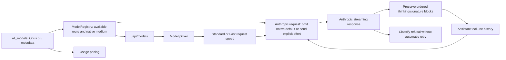

# Add direct Anthropic Claude Opus 5.5 support

## Observed journey

- A user with direct Anthropic API access cannot select `claude-opus-5-5` because it is absent from Phoenix's built-in model catalog.
- The requested product behavior is to add Opus 5.5 alongside existing models, without replacing Opus 5-era entries or making Opus 5.5 the default.
- With no conversation override, Phoenix must represent the model's known native effort default as `medium` and omit `output_config`; an explicit user choice must continue to serialize as `output_config.effort`.
- Investigation used the supplied migration guide and current official Anthropic documentation. GitHub roadmap issue #651 could not be read because Explore-mode network access was blocked.

## Verified findings

- `crates/phoenix-llm/src/models.rs::all_models` is the built-in catalog. Direct Anthropic models become available through the existing registry, `/api/models`, and model picker without a hard-coded UI model list.
- Official model contract: fixed API ID `claude-opus-5-5`, 1,000,000-token context window, 128,000 maximum output tokens, effort levels `low|medium|high|xhigh|max`, and native default `medium`.
- REQ-LLM-003b and REQ-LLM-004a require truthful typed capability metadata and omission of provider-native effort fields when no explicit override exists. `ModelRegistry::effective_effort` and `anthropic::build_request` already implement this distinction. Opus 5.5 therefore needs a model-specific supported-effort capability with native default `medium`; it must not reuse the existing Anthropic helper whose default is `high`.
- Phoenix's default selection remains `claude-sonnet-5` through `ModelRegistry::pick_default_model`. Adding Opus 5.5 to `all_models` does not make it the default, and it does not belong in the Sonnet-class or cheap-model fallback lists.
- `crates/phoenix-ide/src/api/usage.rs::model_pricing` needs Opus 5.5's distinct standard-speed prices: $4/M input, $20/M output, $5/M five-minute cache write, and $0.20/M cache read. Phoenix has one cache-write rate and existing entries use the five-minute rate.
- Opus 5.5 supports Anthropic Fast mode in research preview on the direct Claude API: request `speed: "fast"` with `anthropic-beta: fast-mode-2026-02-01`. It provides up to 2.5x output throughput and costs 2x standard token rates. It is independent of effort and is not Anthropic Priority Tier (`service_tier`). It is unavailable on Anthropic cloud-platform routes and cannot be combined with a Priority Tier commitment.
- Phoenix already persists and presents a provider-neutral Standard/Fast conversation choice, but its backend/spec naming and translation are narrowly coupled to OpenAI/Codex `service_tier: "priority"`. `ServiceTierCapabilities::Supported` can advertise the choice, but the Anthropic translator needs its own `speed` encoding and beta-header composition. Capability must be route-aware so a compatible/custom Anthropic endpoint is not falsely advertised as supporting Claude API Fast mode.
- Turn usage currently records effort but not effective request speed. Opus 5.5 Fast mode cannot be costed truthfully at its 2x rates unless the effective speed is captured with each turn; current conversation state is not sufficient historical evidence because users can change speed later.
- Opus 5.5 always uses adaptive thinking. In streaming responses Anthropic sends ordered `thinking` blocks, `thinking_delta`, an opaque `signature_delta`, and possibly `redacted_thinking` blocks. Even when display is omitted and `thinking` is empty, the signature-bearing block must be replayed unchanged with tool use results.
- `anthropic::StreamAccumulator` currently records `thinking_delta` only for telemetry. It does not accumulate the block or its signature. `AnthropicContentBlock` and the normalized `ContentBlock` contract have no thinking variants. This would lose required tool-loop state and can cause a later Opus 5.5 request to fail.
- Opus 5.5 can return HTTP 200 with `stop_reason: "refusal"` and typed `stop_details`. `normalize_response_with_diagnostics` currently recognizes only `end_turn`; an empty refusal becomes retryable `ServerError`, while a refusal after partial content can look like a nonterminal tool continuation. REQ-LLM-006 requires prompt-policy rejection to be non-auto-retryable.
- Phoenix does not send forced Anthropic `tool_choice`; omission already means `auto`, which Opus 5.5 supports. Strict custom tools are optional. Phoenix does not declare Anthropic's `computer_20251124` tool. These migration items need no implementation change.

## Interaction map

- Model metadata is in memory. Accurate historical Fast-mode costing requires adding the effective request speed to relational turn-usage data; old rows mean Standard because Anthropic Fast was not previously available through Phoenix.
- Normalized message content is persisted in the existing polymorphic content aggregate. Preserved-thinking data must survive the assistant tool-use → user tool-result continuation boundary without becoming visible reasoning text.
- Model switching remains supported. Provider translators that cannot consume Anthropic preserved-thinking blocks must explicitly omit them with a debug log rather than silently drop them.
- Refusal is a terminal provider outcome, not a retry/reconnect condition. Partial generated content from a refused response must not be treated as an accepted assistant turn.

## Proposed scope

### 1. Register the model and truthful capabilities

- Add `claude-opus-5-5` to `all_models` as a built-in direct Anthropic model:
  - `api_name: "claude-opus-5-5"`
  - context window `1_000_000`
  - output limit `Some(128_000)`
  - recommended so it appears with normal recommended models, but do not alter `pick_default_model`
  - tool search support enabled if the existing Anthropic tool-search contract applies
  - efforts `low, medium, high, xhigh, max`; native default `medium`
  - Phoenix Standard/Fast request-speed capability on the official direct Claude API route
- Add focused catalog/capability tests. Verify `/api/models` metadata through the existing registry/API coverage where useful.
- Do not change Sonnet-class, cheap-model, Codex, Bedrock, Vertex, or Foundry routing.

### 2. Translate Phoenix Fast mode for direct Anthropic requests

- Keep Standard/Fast as the provider-neutral conversation preference already exposed by Phoenix. Refine misleading internal/spec terminology where needed so `Fast` does not imply every provider uses a service-tier field.
- Make Anthropic Fast capability route-aware: advertise it for Opus 5.5 only on the official direct Claude API route, not arbitrary Anthropic-compatible base URL overrides or cloud provider routes.
- For Fast, send top-level `speed: "fast"` and compose the `fast-mode-2026-02-01` beta token with any existing Anthropic beta tokens such as advanced tool use. For Standard, omit `speed` and the fast beta token.
- Keep effort and speed independent through model selection, request translation, retries, continuations, and telemetry. Existing subagent behavior remains Standard.
- Preserve Fast failure semantics: do not silently retry at Standard when Anthropic returns capacity, rate, or entitlement errors.
- Record the effective request speed on each turn in normalized relational usage data. Existing rows map to Standard. Use it to apply Opus 5.5's 2x Fast token rates without consulting mutable current conversation state.
- Add capability, request JSON/header, combined-beta-header, route-gating, lifecycle, migration, and standard-vs-fast cost tests. Update REQ-LLM-004g and its executive status from an OpenAI-specific service-tier encoding to provider-specific request-speed translation while preserving the existing user-facing Standard/Fast contract.

### 3. Preserve adaptive-thinking blocks through tool loops

- Extend the typed Anthropic wire model for both regular `thinking { thinking, signature }` and opaque `redacted_thinking { data }` blocks.
- Extend streaming accumulation for `thinking_delta` and `signature_delta`; preserve block index/order and retain signature-only blocks when visible thinking is empty.
- Add typed normalized content that keeps these provider-owned blocks losslessly for replay. Keep encrypted/signature data opaque and out of readable/searchable/user-visible text.
- Translate preserved blocks back to the Anthropic wire shape unchanged. For non-Anthropic providers, use an explicit typed capability sink and debug logging rather than silent omission.
- Verify the actual Phoenix tool loop keeps the assistant block order and appends tool results without mutating earlier system, tool, or message prefix content during that continuation. Do not broaden this task into arbitrary prompt-history editing support.
- Add streaming, non-streaming, serde/persistence, translation round-trip, empty-thinking-with-signature, redacted-thinking, ordering, and cross-provider omission tests. Update exhaustive matches and property generators required by the new typed variants.

### 4. Classify Opus 5.5 refusals

- Parse typed Anthropic `stop_details` for normal and streaming responses.
- Treat `stop_reason: "refusal"` as `PromptRejected` (non-auto-retryable and user-resumable under the existing error policy), not `ServerError` or tool continuation.
- Discard partial generated response content for a refusal and surface a stable useful message. Do not depend on undocumented explanation wording; preserve safe category/detail only where the contract permits.
- Add tests for empty and partial-content refusals, including streaming, and prove no automatic retry classification.
- Update REQ-LLM-005/006 and the LLM executive status only as needed to state the provider-neutral preserved-thinking and refusal contracts. Follow `specs/AUTHORING.md` pre-flight checks.

### 5. Add accurate usage pricing

- Add Opus 5.5 standard pricing to `model_pricing` with the five-minute cache-write convention.
- Apply the documented 2x token rates when the recorded effective request speed is Fast.
- Add cost calculation regression coverage so Standard and Fast Opus 5.5 turns do not appear as unknown or share the wrong price.

## Acceptance evidence

- With direct Anthropic credentials, `/api/models` includes selectable `claude-opus-5-5` with 1M context, 128K output cap, supported effort levels, native default medium, and Standard/Fast request speed.
- A new Opus 5.5 conversation with no effort override omits `output_config` while observability/UI report native medium. Explicit medium and other supported selections serialize through the existing effort path.
- A Standard request omits Anthropic `speed` and its beta token. A Fast request sends `speed: "fast"` plus `fast-mode-2026-02-01`, including when another supported beta token is required.
- A compatible Anthropic base URL that is not the official Claude API does not advertise Fast without an explicit route contract.
- A streamed response containing empty `thinking`, a signature, and a tool call replays the exact ordered thinking block on the next request with the tool result.
- Redacted thinking round-trips opaquely and is not rendered or indexed as readable reasoning.
- An Anthropic refusal does not trigger automatic retry, does not execute a partial tool call, and leaves the conversation recoverable under existing prompt-rejection policy.
- Usage reporting calculates known Opus 5.5 input/output/cache costs at standard rates and 2x Fast rates from immutable per-turn speed data.
- Existing Anthropic models, OpenAI/Codex Fast translation, default-model choice, ordinary auto tool use, and provider switching tests remain green.
- Run focused Rust tests, relevant property tests, spec validation, then `./dev.py check`.

## Risks and non-goals

- Preserved thinking is model- and conversation-prefix-bound. Keep the change limited to lossless continuation of Phoenix's existing append-only tool loop; do not invent fallback/router compatibility beyond Anthropic's documented behavior.
- Do not enable summarized or progress-update display or expose private/encrypted thinking in the UI. The Anthropic Fast beta header is the only new beta enablement in scope.
- Do not add forced tool use, strict-tool policy, native Anthropic computer-use toolsets, Priority Tier, server-side fallback, or non-Anthropic cloud model IDs.
- Do not replace/remove older Opus models or change Phoenix's default model.
- The turn-usage migration is limited to immutable effective request speed for truthful historical pricing. Do not migrate persisted polymorphic message content unless implementation proves the existing aggregate cannot losslessly store the new typed thinking variants.
