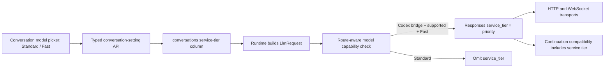

# Add Codex fast-mode service-tier support

## Observed journey

- A Phoenix user authenticated through the ChatGPT/Codex bridge can select a supported Codex model and reasoning effort, but cannot request Codex fast mode.
- The requested behavior is the upstream Codex fast mode, not Phoenix's unrelated “cheap/fast model” selection and not Responses Lite request shaping.
- Investigation used this worktree plus public `openai/codex` `main` at commit `c909d1bc0462d0b8bfd4525264cce938fd2475e8`; no additional repository access is required.

## Verified findings

- Upstream defines `ServiceTier::Fast.request_value()` as `"priority"` and treats `"default"` as a local sentinel meaning standard routing (`codex-rs/protocol/src/config_types.rs`).
- Upstream carries `service_tier` as an optional top-level Responses request field and includes it in request-compatibility checks for WebSocket continuation (`codex-rs/codex-api/src/common.rs`, `codex-rs/core/src/client.rs`).
- Upstream's model catalog advertises the `priority` tier as “Fast — 1.5x speed, increased usage” for `gpt-5.6-sol`, `gpt-5.6-luna`, `gpt-5.6-terra`, `gpt-5.5`, and `gpt-5.4` (`codex-rs/models-manager/models.json`).
- Upstream gates selection by model-catalog capabilities, sends no service tier for standard routing, and only shows the fast status for ChatGPT accounts (`codex-rs/tui/src/service_tier_resolution.rs`, `codex-rs/tui/src/chatwidget/service_tiers.rs`).
- Phoenix's `LlmRequest`, `ModelInfo`, and `ModelSpec` have no service-tier representation (`crates/phoenix-core/src/domain/llm_types.rs`, `crates/phoenix-llm/src/models.rs`).
- Phoenix's `ResponsesApiRequest` and `CodexResponsesLiteRequest` likewise omit `service_tier`, so neither HTTP nor WebSocket Codex requests can currently select fast routing (`crates/phoenix-llm/src/openai.rs`).
- Phoenix already has a per-conversation, atomically persisted model/effort setting and UI picker. This is the closest lifecycle precedent, but fast mode is independent of reasoning effort (`conversations.effort`, `update_conversation_model_and_effort`, `StateBar`).

## Inferences and boundaries

- Phoenix can support this directly: it already issues Responses requests to the Codex backend, and upstream implements fast mode as request data rather than as an inaccessible CLI-only mechanism.
- Fast mode must not be modeled as lower reasoning effort or a different model. It is the Codex `priority` service tier and carries increased usage cost.
- The smallest user-complete scope is a persisted per-conversation Standard/Fast selection, exposed only when the active built-in model is routed through the Codex bridge and advertises support.
- Generic Platform API-key Priority/Flex processing is tracked separately in task 24709. Arbitrary external-provider service-tier strings and importing Codex's entire remote model catalog remain non-goals.
- Sub-agent conversations independently default to Standard. They do not inherit a parent's Fast selection, and this scope does not add a fast-mode override to `spawn_agents`.

## Interaction map

## Proposed implementation

1. **Specify the behavior.** Add timeless LLM requirements for a distinct fast service tier: capability-gated visibility, per-conversation persistence, omission for standard routing, `priority` on supported Codex requests, increased-usage disclosure, and safe behavior on model/auth changes. Update the LLM executive after verification.
2. **Introduce typed capability and selection values.** Represent model support and the conversation's Standard/Fast choice explicitly rather than passing arbitrary strings. Surface route-aware fast-mode capability in `/api/models`; built-in Codex models must follow the upstream catalog list. Do not claim the capability for external OpenAI-compatible routes.
3. **Persist the selection relationally.** Add a checked nullable/enum-like `conversations` column (not JSON) and thread it through root-conversation creation/read/continuation projections. Existing rows mean Standard. Unlike explicit reasoning effort, sub-agent creation does not copy this preference: each child row starts Standard.
4. **Make updates atomic and validated.** Extend the root-conversation settings endpoint/runtime update so model, effort, and fast mode cannot be persisted in an incompatible combination. A model switch to an unsupported or non-Codex route resets fast mode to Standard. Reject direct attempts to enable it where unsupported. Keep sub-agent request construction unchanged except that its independently stored Standard value naturally omits `service_tier`.
5. **Thread the request value losslessly.** Carry the typed selection into request construction. On a supported Codex bridge request, Fast serializes as top-level `service_tier: "priority"`; Standard omits the field. Add it to both platform-shaped Codex requests and `CodexResponsesLiteRequest`. Ensure WebSocket continuation compatibility changes when the effective tier changes, matching upstream.
6. **Add the UI control.** Place a compact Standard/Fast choice with the model/effort controls, only for capability-advertising Codex routes. Label Fast with upstream's “1.5x speed, increased usage” disclosure and show the active status inline. Disable setting changes while a turn is pending if required to avoid mid-turn ambiguity.
7. **Add observability.** Include the effective service tier in provider request telemetry/log fields without storing secrets, so production traces can distinguish Standard from Fast and verify routing behavior.

## Acceptance evidence

- Golden wire tests prove supported Codex HTTP and WebSocket requests send `service_tier: "priority"` in Fast and omit it in Standard, for both Responses Lite and non-Lite Codex shapes.
- Continuation tests prove a service-tier change prevents reuse of an incompatible previous request, while an unchanged tier remains reusable.
- Capability tests cover all upstream-supported built-in model IDs and reject unsupported, external, API-key-only, and non-OpenAI routes for this Codex-scoped feature.
- DB/API tests prove root-conversation round-trip persistence, old-row Standard behavior, atomic model/effort/tier validation, and reset on an incompatible model change.
- Sub-agent spawn tests prove a Fast parent produces a Standard child even when the Work child uses the same model; no new field is added to `SubAgentSpec`, `SubAgentSpawnRequest`, or the `spawn_agents` schema.
- UI tests prove capability-gated visibility, increased-usage copy, active status, and reset behavior.
- A local Codex-authenticated smoke test captures sanitized request telemetry showing `priority` for Fast and omission for Standard; do not assert a latency improvement from one live request.
- Run `./dev.py codegen` if API/SSE generated types change, then `./dev.py check`.

## Risks

- Codex model capabilities evolve upstream. Keep the supported list in one typed model-metadata authority with a test that is easy to compare against `codex-rs/models-manager/models.json`.
- Fast consumes quota more quickly; the UI must disclose this before selection.
- A service-tier change during an active WebSocket conversation could incorrectly reuse prior-response state unless compatibility includes the tier.
- The backend may reject `priority` for an account lacking entitlement despite catalog support. Preserve the provider error and allow the user to return to Standard; do not silently retry at Standard because that would misrepresent the selected mode.

## Non-goals

- Responses Lite enablement (already separate and GPT-5.6-specific).
- Changing reasoning effort, output headroom, prompt caching, or model selection.
- Generic OpenAI Priority/Flex API support (task 24709).
- Parent-to-sub-agent Fast inheritance or a per-task service-tier override in `spawn_agents`.
- Mirroring the full upstream Codex model catalog.
- Automatically benchmarking or promising end-to-end 1.5x latency in Phoenix.
