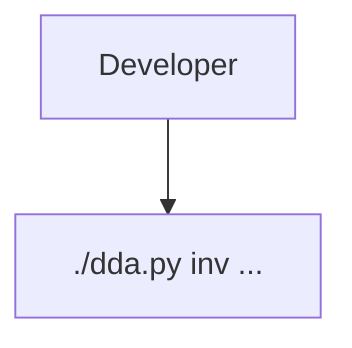

# Add polished Mermaid diagram rendering for markdown code fences

## Context

Agents may emit diagrams as fenced Markdown code blocks like:

````markdown

````

This notation is Mermaid: a text-based diagram DSL commonly used in Markdown systems for flowcharts, sequence diagrams, state diagrams, class diagrams, ER diagrams, Gantt charts, etc.

Phoenix currently treats fenced code blocks as syntax-highlighted code. A `mermaid` fence should render as a diagram while preserving access to the original source.

## Goals

- Render complete fenced code blocks whose language is `mermaid` as diagrams in conversation markdown and markdown file viewer surfaces.
- Keep rendering visually consistent with Phoenix rather than accepting Mermaid's defaults unchanged.
- Preserve source fidelity and graceful fallback: malformed diagrams must show the source/error, not break message rendering.
- Avoid expensive per-token work while streaming.

## Proposed behavior

1. Add Mermaid as a UI dependency and render with `startOnLoad: false` / explicit render calls.
2. Add a shared `MermaidDiagram` React component used by markdown code renderers.
3. Detect fenced code blocks with language `mermaid`.
4. For finalized assistant messages and markdown viewer content:
   - render the diagram in a Phoenix-styled container,
   - provide a `Source`/`Diagram` toggle,
   - provide copy-source support,
   - show a compact render error with source fallback when parsing fails.
5. For streaming messages:
   - do not attempt Mermaid rendering for incomplete fences,
   - render Mermaid only after the fence is complete, or leave streaming as source if that proves safer for frame budget.
6. Theme diagrams from Phoenix light/dark theme using Mermaid `themeVariables` and container CSS.
7. Add tests for:
   - ` ```mermaid ` fences render through `MermaidDiagram`,
   - non-mermaid code blocks still use syntax highlighting,
   - render errors fall back without throwing,
   - viewer markdown and conversation markdown share expected behavior.

## Styling controls to expose/standardize

- Mermaid global theme: `base` with Phoenix-specific `themeVariables` for background, text, line, primary/secondary node fills, borders, and cluster colors.
- Flowchart options: curve style, spacing, HTML labels policy, max width behavior.
- Phoenix container styling: border, background, padding, overflow, optional centered layout.
- Source/diagram toggle so users can edit or copy the original DSL when the rendered result is not useful.

## Non-goals

- Server-side rendering or storing rendered SVGs.
- Supporting every external diagram DSL in the first pass.
- Launching local files or relying on host-local tools.

## Notes

Mermaid gives decent convenience and broad familiarity, but not perfect aesthetics. The implementation should keep the source visible and themeable so users can iterate on diagram style. If Mermaid output remains too visually limited, later work can add an alternate DSL/rendering backend such as D2 or Graphviz behind the same fenced-code renderer shape.
