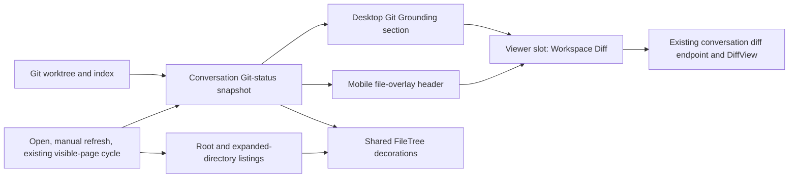

# Show live Git status in the file tree and grounding panel

## Observed journey

- A user opens the conversation file browser on mobile or the persistent Grounding panel on desktop.
- The shared file tree shows filesystem shape and whether an entry is gitignored, but it does not show which tracked or untracked paths differ from Git. On mobile this forces the user to leave the primary browsing flow to understand why the worktree is dirty.
- The requested journey is conventional VS Code-style Explorer decoration: changed files and their ancestor folders are recognizable in place, while a compact Git summary grounds the user in the live checkout. Selecting the desktop summary, or the compact mobile header summary, opens the existing **Workspace Diff** viewer.
- External changes should become visible through the file tree's existing open/manual-refresh/~10-second visible-page refresh behavior. This task must not add a watcher, SSE stream, or second faster timer.
- Environment verified at `task-pending-af855419` / `f4bff64d4`; the relevant recent precedent is `45de65fc8` (**Show live checkout status in workspace diffs**, PR #537).

## Verified findings

- `FileTree` is the shared desktop/mobile tree. `FileExplorerPanel` hosts it on desktop and `FileBrowserOverlay` hosts it on mobile (`ui/src/components/FileExplorer/`).
- `/api/files/list` already supplies filesystem metadata, viewer classification, and `is_gitignored`; `list_files` confines reads through `canonicalize_within_roots` (`crates/phoenix-ide/src/api/handlers.rs::list_files`). It has no tracked/untracked Git status contract.
- `FileTree` refreshes the root and visible expanded directories on explicit refresh and runs a jittered visible-page refresh at roughly ten seconds. There is no mutation event channel. Its request-generation guards already prevent stale directory responses from winning.
- The desktop Grounding shell already composes `GroundingSection`-based MCP, Skills, Tasks, and Work scope sections. Its header currently shows persisted/conversation `branchName`, not a live Git checkout.
- The mobile overlay header currently shows only the root path and close action. It has no explicit refresh control, but its `FileTree` uses the same automatic refresh behavior.
- Commit `45de65fc8` added typed `CheckoutStatus` / `BranchRemoteStatus` to both conversation diff endpoints. `get_conversation_diff` observes the live worktree, derives upstream or cached matching-remote ahead/behind state without network I/O, and protects diff capture against a changing checkout. `DiffView` renders named, detached, unborn, and unavailable states independently from the diff comparator.
- Phoenix has coarse `git status --porcelain` checks, but no reusable structured parser for per-path index/worktree status. The existing conversation diff payload contains patches and checkout state, not a complete file-status inventory.
- The existing Workspace Diff viewer is opened through the typed, URL-backed viewer slot (`useViewerSlotCommands().openDiff(...)`); Git grounding should use this route rather than create another diff surface.
- File Explorer has normative spEARS requirements and an executive table under `specs/file-explorer/`. This is read-only observation/presentation behavior, so no Allium lifecycle spec is warranted.

## Inferences and resolved product choices

- **Verified product choice:** desktop gets a compact Git Grounding section; selecting it opens Workspace Diff.
- **Verified product choice:** mobile gets the compact Git summary in the file-browser header; selecting it opens Workspace Diff.
- **Verified product choice:** Git status follows the existing file-tree refresh cycle; no near-real-time watcher is required.
- **Inference:** a conversation-scoped Git-status snapshot is the smallest truthful boundary. Re-running Git independently for every listed directory would be wasteful and could make the summary and decorations disagree. This inference is falsified if implementation discovers an existing typed snapshot with complete per-path porcelain semantics; reuse that instead.
- **Inference:** the live snapshot, not conversation creation metadata, must own checkout identity, matching the invariant established by REQ-PROJ-038 and commit `45de65fc8`.
- **Standard behavior:** use familiar Explorer badges and accessible labels: `M` modified, `A` added, `U` untracked, `D` deleted, `R` renamed, and `!` conflicted/unmerged. Ignored paths retain the existing dimmed treatment and do not count as dirty. Color supplements rather than replaces the badge/accessible text.
- **Standard behavior:** staged and unstaged state must both be preserved in the backend type; the row may derive one compact decoration using conflict first and the most immediate working-tree state before index state. Do not flatten porcelain's two columns into a lossy string at the API boundary.
- **Standard behavior:** ancestor directories receive an aggregate dirty decoration/count so changes under collapsed folders remain discoverable. A deleted path that no longer exists on disk contributes to the summary and ancestor aggregates but is not synthesized as a phantom filesystem row. Rename targets are decorated as renamed; provenance may be exposed accessibly without creating duplicate old/new rows.

## Interaction map

- Producer: one bounded read-only Git command/snapshot for the conversation's live worktree, with robust path parsing.
- Boundary: a typed response containing checkout state, per-path index/worktree state, rename provenance where applicable, aggregate counts, and a display-safe unavailable state.
- Consumers: one shared UI status owner feeds desktop summary, mobile header, and file-tree decorations. Directory listing remains the filesystem/openability source of truth.
- Refresh/recovery: key requests by conversation/root and ignore stale completions after conversation changes or newer refreshes. A transient Git observation failure must leave file browsing usable and show status as unavailable rather than retain misleading stale decorations.
- Navigation: summary activation opens `target='workspace'` through the existing viewer-slot command and respects its responsive pane/fullscreen behavior.

## Proposed scope

### Owning invariant

For a conversation with a Git worktree, every visible Git summary and file-tree decoration in one refresh generation must derive from the same live, read-only status snapshot. The UI must not substitute persisted branch metadata, infer Git state from modification timestamps, or claim remote freshness beyond locally cached refs.

### Backend and wire contract

1. Add a conversation-scoped read-only Git-status endpoint near the existing Git handlers. Resolve the conversation's current worktree through existing scope/path rules; do not accept an arbitrary repository path from the browser.
2. Extract/reuse the live checkout and remote relationship observation introduced by `45de65fc8` rather than create a second representation. Preserve named branch, detached HEAD, unborn, and unavailable states, and keep remote information explicitly last-fetched/network-free.
3. Capture per-path status with a machine-stable, NUL-delimited Git format (prefer porcelain v2 `-z` with all untracked files) so spaces, tabs, non-ASCII names, renames, conflicts, index state, and working-tree state parse without line/string heuristics. Disable optional locks where supported and never mutate the real index.
4. Introduce typed Rust and TypeScript status sums/records. Invalid combinations should be unrepresentable: index/worktree state remains distinct; rename/copy provenance belongs only to the relevant variant; unavailable Git observation is distinct from a clean snapshot.
5. Return aggregate changed-path counts and enough repo-relative path information for the UI to derive ancestor-folder state without embedding the same semantic value in every directory listing response. Bound command output and return a display-safe unavailable result on overflow/failure.
6. Keep ignored paths out of dirty counts/decorations. Preserve the existing `/api/files/list` filesystem, viewer, confinement, and `is_gitignored` contract unless a narrowly necessary typed adjustment is identified.

### Frontend behavior

1. Add a shared conversation Git-status owner/hook in the File Explorer feature. It must fetch on initial/open state, explicit desktop refresh, and the existing visible-page refresh cadence, abort/key stale requests, and provide one snapshot to all local consumers. Do not add another independent polling interval per consumer.
2. Decorate `FileTree` rows on desktop and mobile with conventional compact badges and theme-consistent colors. Include status text in `aria-label`/title so badges and color are not the only signal. Preserve active-file, focus, loading, disabled/opaque, drag/drop, context-menu, and gitignored styles.
3. Derive folder aggregate decorations from changed descendant paths, including changes below collapsed/unloaded folders. Keep row layout stable on narrow mobile widths and long/deep paths.
4. Add a compact desktop `Git` Grounding section near the file tree. Its collapsed/header summary should prioritize live branch or detached/unborn identity, total changed-path count (`clean` when zero), and concise upstream arrows/counts when available. Selecting it opens Workspace Diff. It is a summary/navigation affordance, not a second changed-file browser.
5. Add the same compact summary to the mobile `FileBrowserOverlay` header beneath/beside the displayed path. It must fit touch/narrow layouts, remain independently accessible, and open Workspace Diff while closing/replacing the file overlay through the existing viewer-slot navigation.
6. For non-Git roots or unavailable observation, keep file browsing fully functional and render a neutral, concise state without false `clean` claims.
7. Colocate new File Explorer/Git CSS with its owning components; do not expand the legacy File Explorer block in `ui/src/index.css` for new styles unless extraction would change existing source-order behavior.

### Specifications

- Add timeless File Explorer requirements covering live Git decorations, typed staged/unstaged/untracked/conflict semantics, ancestor folders, desktop/mobile Git grounding, Workspace Diff navigation, existing-cadence freshness, accessibility, and read-only/network-free behavior.
- Reuse/cross-reference the checkout truth from `specs/projects/requirements.md` REQ-PROJ-038 rather than duplicate or weaken it.
- Update `specs/file-explorer/executive.md` current reality and coverage table. While touching these docs, remove status-relative or stale claims that conflict with current mobile/shared Grounding behavior, per `specs/AUTHORING.md`; do not create a new `design.md` or extend the legacy one.

## Validation

### Backend regression coverage

Use real temporary repositories/worktrees to cover:

- clean, tracked modified, staged modified/added/deleted, untracked, and a path with both index and worktree changes;
- rename (including spaces/non-ASCII), deletion, and copied/renamed porcelain records without duplicate path representation;
- representative unmerged/conflict states and their typed mapping;
- nested changes producing stable repo-relative paths; all untracked files are enumerated rather than collapsed to an untracked directory;
- ignored files excluded from dirty totals while existing file-list ignore behavior remains intact;
- named, detached, unborn, non-Git, and display-safe unavailable/overflow states;
- configured upstream, matching non-upstream remote, ahead/behind/diverged, and no-known-remote behavior reused from the recent diff work;
- no fetch/network operation and no mutation of the real index;
- conversation/worktree confinement and stale/missing conversation behavior.

### Frontend/component coverage

- each badge/status class, staged plus unstaged precedence, accessible status text, and ignored/active/disabled styling coexistence;
- ancestor-folder aggregation for collapsed and expanded directories, including deleted descendants;
- initial status, explicit refresh, existing automatic refresh, stale-response suppression, transient failure, conversation switch, and recovery;
- desktop Git section summaries for clean/dirty/detached/unborn/unavailable and activation of Workspace Diff;
- mobile header summary, touch activation, overlay-to-diff transition, narrow viewport, and long branch/path handling;
- no extra Git request per expanded directory and no duplicate polling owner;
- existing FileTree refresh/race, keyboard, context-menu, drag/drop, file-open, and diff-viewer tests remain green.

### Visual/user-journey QA

Extend the existing Grounding Panel Ladle fixture/scenarios and mock API with clean, mixed dirty, conflicted, detached, unavailable, narrow-mobile, and collapsed-desktop cases. Validate at representative mobile and desktop widths that badges are scannable, do not obscure filenames, and the Git summary opens the existing Workspace Diff. Run focused tests, spec authoring pre-flight, then `./dev.py check`.

## Risks and explicit non-goals

- **Risk:** porcelain parsing is easy to get subtly wrong; NUL-delimited typed parsing and real-repository tests are required.
- **Risk:** Git state can change during a read. Treat the endpoint as one bounded best-effort snapshot and suppress stale generations; do not claim transactionality across later filesystem listing calls.
- **Risk:** adding status independently to directory-list responses would multiply Git commands and allow contradictory summaries. Keep one status snapshot per refresh generation.
- **Non-goal:** source-control actions such as stage, unstage, discard, commit, checkout, push, pull, or fetch.
- **Non-goal:** a second changed-files list in Grounding; Workspace Diff remains the detailed review surface.
- **Non-goal:** server filesystem watching, new SSE events, or near-real-time refresh beyond the existing file-tree cadence.
- **Non-goal:** synthesizing deleted files into the filesystem tree, decorating ignored files as dirty, or mirroring Git's full repository model.
- **Non-goal:** changing Workspace Diff comparator/patch semantics or duplicating its checkout panel.
