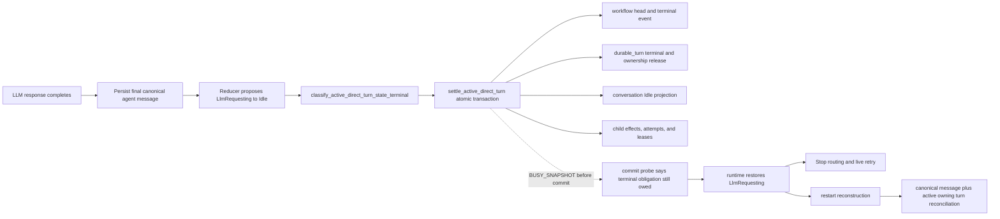

# Recover failed direct-turn terminal settlement

## Observed journey

A fresh production conversation (`prove-productconversation-presentation`, ID `80285aa2-6bae-4bf2-8c39-11d8e039500c`) visibly remained in an awaiting-LLM state after the assistant had already produced its final response.

On deployed commit `d97a251fa09f` (`0.11.2`, PR #693), at `2026-08-16 21:41:32 UTC`, the LLM request completed and the canonical final agent message was persisted, but the subsequent `LlmRequesting -> Idle` direct-turn settlement failed. Failure telemetry identified:

- operation `direct_turn.terminal_settlement`;
- phase `statement`;
- SQLite primary code `5` (`BUSY`);
- SQLite extended code `517` (`BUSY_SNAPSHOT`);
- total and phase elapsed time of `1 ms`.

The runtime then logged `Direct-turn settlement failed before commit; terminal obligation remains owed`. Durable conversation state remained `{"type":"llm_requesting","attempt":1}` with `state_updated_at = 2026-08-16T21:41:20.793474Z`. Durable turn `661` retained `terminal_kind = NULL`, `owns_conversation = 1`, and its canonical message identity. Production was otherwise healthy (PID `94750`).

Do not treat this as an LLM-provider hang: the final response exists and the failed boundary is durable terminal settlement.

## Verified findings

- `ConversationRuntime::settle_pending_direct_turn` sends the turn terminal classification and target reducer projection through `MessageStore::settle_active_direct_turn`; `WorkflowRepository::terminalize_authoritative_turn_at_cut` owns the observed telemetry operation.
- `WorkflowRepository::terminalize_authoritative_turn_in_tx` performs multiple reads before its first durable transition write, then updates the durable turn, optional conversation projection, child-attempt authority, leases, and nonterminal effects. The current `statement` phase encloses the whole sequence, so existing telemetry does not identify the exact failing statement.
- On an error known to be pre-commit, `reconcile_failed_direct_turn_settlement` restores `pending_direct_turn_terminal` and reports that the obligation remains owed.
- `apply_transition_result` restores the old reducer state when its state-persist/atomic-settlement effect fails. Its scheduled `TerminalTransitionRetry` path is limited to terminal sub-agent transitions; an ordinary parent direct turn does not receive that retry from this branch.
- After restart/runtime reconstruction, `determine_resume_state` preserves persisted `LlmRequesting` when a materialized active direct turn still owns the conversation. The recovered-turn settlement branch only terminalizes when recovery has already derived a rest or terminal state, so the incident shape is not demonstrably repaired by current startup logic.
- REQ-DWF-CHAT-013 requires a materialized turn's rest/terminal projection and ownership release to commit atomically, including when recovery derives the rest/terminal state. REQ-DWF-CHAT-014 requires deterministic cancellation, recovery, and interleaving verification without correctness depending on timing.
- Task 45007 fixed a different recovery shape: recovery had already derived a safe state and terminalized ownership but failed to repair the conversation projection in the same transaction. Here the live settlement did not commit, ownership remains, and persisted state is still `LlmRequesting`; equivalence to any earlier incident must be established from evidence rather than assumed.

## Inferences and unknowns

- **Leading failure model:** a deferred SQLite transaction established a read snapshot, another connection committed a write, and the terminal-settlement transaction then attempted to upgrade its stale snapshot to a writer, producing `BUSY_SNAPSHOT`. A deterministic two-connection reproduction or exact statement evidence must confirm or falsify this.
- The exact statement receiving code 517 and the concurrent writer are unknown. Correlate the narrow production trace/log window and collector warnings; if existing cardinality-safe telemetry cannot identify the competing statement, state that limitation rather than attaching SQL text or unbounded identifiers to telemetry.
- The runtime appears to retain the terminal classification in memory but lacks a parent-turn wake/retry path after the transition is rolled back. Prove this with a focused executor regression before choosing between a bounded fresh-transaction retry, durable reconstruction, or both.
- It is unknown whether Stop for turn `661` reached the existing runtime, replaced the owed `Completed` classification with `Cancelled`, retried settlement on a fresh transaction, was rejected by effective-state/admission routing, or never arrived. Trace the API-to-runtime path and preserve the canonical final response regardless of the answer.
- It is unknown whether process restart can infer completion from canonical final-message evidence without rerunning the LLM. Verify with read-only code/data inspection and deterministic tests; do not restart or mutate production to answer it.

## Interaction map

The producer is the final LLM outcome/reducer transition. The atomic SQLite terminal-settlement transaction is the authority boundary. Live observers, chat/Stop admission, startup reconstruction, and transcript recovery consume its projection and ownership result.

## Proposed scope

### Owning invariant

Once a materialized direct turn has a canonical final response and the reducer derives a rest or terminal state, a transient pre-commit SQLite failure must not strand the conversation in a false active-LLM state. The exact terminal obligation must remain typed and retryable across the live runtime and process reconstruction, and settlement must converge idempotently in one fresh atomic transaction without duplicating the final message, changing terminal meaning because of a late Stop, rerunning the completed LLM request, or releasing newer authority.

### Investigation and implementation

1. Map and label the bounded internal stages/statements of `terminalize_authoritative_turn_in_tx`, including helper writes in `WorkflowTx`, while preserving the closed telemetry vocabulary and avoiding SQL text/high-cardinality attributes.
2. Reproduce `SQLITE_BUSY_SNAPSHOT` deterministically with two SQLite connections and explicit synchronization: terminal settlement reads, a competing connection commits, then settlement attempts its first write. Identify the exact stale-snapshot upgrade and competing production writer where available.
3. Add a focused parent-runtime regression proving the incident sequence: final message persists; terminal settlement fails before commit; reducer returns to `LlmRequesting`; no LLM task remains; ownership and terminal obligation remain owed.
4. Trace the Stop handler through effective-state/admission routing and executor cancellation for this shape. Define precedence structurally so a late Stop cannot relabel an already-derived successful completion or lose its final canonical response merely because settlement storage was transiently unavailable.
5. Make live settlement retry/reconstruction restart the entire SQLite transaction on a fresh snapshot under an explicit bounded policy. Do not retry individual statements inside the invalid transaction. Preserve generation/identity fences and make stale/newer authority a typed no-op or conflict.
6. Extend runtime startup recovery to recognize the durable evidence for this exact half-settled shape and settle it without issuing another LLM request. Repeated live retries and repeated restarts must be idempotent.
7. Update the durable-workflow requirements/Allium/executive coverage only if investigation changes the normative recovery command or exposes spec drift; otherwise add traceability to the existing REQ-DWF-CHAT-013/014 contract.

Likely starting symbols:

- `ConversationRuntime::apply_transition_result`, `settle_pending_direct_turn`, and `reconcile_failed_direct_turn_settlement` in `crates/phoenix-ide/src/runtime/executor.rs`
- `RuntimeManager::determine_resume_state` and recovered `LoadedActiveDirectTurn` handling in `crates/phoenix-ide/src/runtime.rs`
- `WorkflowRepository::terminalize_authoritative_turn_at_cut` / `terminalize_authoritative_turn_in_tx` and `WorkflowTx` helpers in `crates/phoenix-db/src/workflow/`
- Stop/cancel admission in `crates/phoenix-ide/src/api/handlers.rs`
- REQ-DWF-CHAT-012 through REQ-DWF-CHAT-014 in `specs/durable-workflows/requirements.md`

## Acceptance criteria

- [ ] A deterministic two-connection test produces SQLite extended code 517 at the identified settlement stage without sleeps.
- [ ] A focused executor test reproduces the production shape after final-message persistence and proves there is no live LLM task despite restored `LlmRequesting`.
- [ ] A transient pre-commit settlement failure is retried from a fresh transaction and converges to the intended reducer projection, terminal kind, and `owns_conversation = 0` without a duplicate message.
- [ ] Exhausting the live retry bound leaves a reconstructable durable obligation; runtime/process reconstruction settles it from canonical evidence without reissuing the completed LLM request.
- [ ] Failure before commit, ambiguous error after commit, crash before retry, crash during retry, and repeated recovery are deterministic and idempotent.
- [ ] A stale retry cannot overwrite a newer owning turn, reducer projection, terminal result, or generation.
- [ ] Stop racing the failed completion is covered on both orderings and cannot discard/relabel the canonical successful response or create duplicate cancellation/terminal events.
- [ ] SSE/reconnect and chat admission observe the committed result only; after recovery the UI no longer presents an awaiting-LLM state or actionable Stop for the settled turn.
- [ ] Narrow production trace/log correlation records what can be established about the competing writer and whether this matches an earlier incident; uncertainty is explicit.
- [ ] Focused tests and `./dev.py check` pass.

## Risks and non-goals

- Keep the atomic projection/ownership boundary; do not work around the incident by independently setting `conversations.state = Idle`.
- Do not add broad blind retries to every SQLite operation, increase busy timeout as a substitute for correctness, or retry a statement within a stale transaction snapshot.
- Do not infer completion from arbitrary transcript tail text; recovery must use exact accepted-turn/canonical-message identity and generation authority.
- Do not mutate, restart, deploy, Stop, or manually repair production conversation `80285aa2-6bae-4bf2-8c39-11d8e039500c` as part of investigation without a separate explicit operational authorization.
- Do not bundle the independent `/pr-status` BUSY_SNAPSHOT task (45008) or the prior recovered-projection repair (45007).
