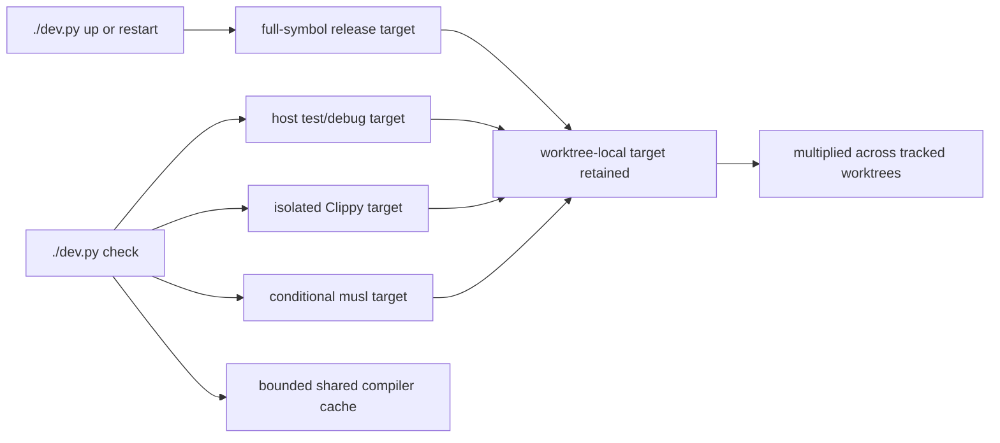

# Bound standard development build artifacts

## Goal

Reduce the recurring disk footprint produced by Phoenix IDE’s normal `./dev.py up` / `restart` / `check` workflow, with measured and deliberately small latency or debugging trade-offs. Preserve the correctness and safety of the local pre-push gate; do not trade disk savings for false-green checks.

## Observed journey

- A developer or agent creates an isolated Phoenix worktree, runs `./dev.py up`, iterates with `./dev.py restart`, and finishes with `./dev.py check`.
- `up` and `restart` build a full-symbol `release` graph. `check` then builds the host test/debug graph, a separate Clippy graph, and—on macOS with the cross toolchain installed—a musl graph.
- Each worktree owns its target directory, so these namespaces multiply across concurrent and retained worktrees.
- On this host, five Phoenix-managed worktrees currently contain **76.4 GiB** of Cargo targets; the compiler cache adds **7.6 GiB**. Only **47 GiB** remains free on the data volume.
- The representative worktree is **30.4 GiB**: about 24G host debug, 4.1G Clippy, and 1.9G musl.

## Verified findings

- `dev.py::cmd_up` and `cmd_restart` call `build_rust(release=True)`, and `[profile.release]` retains full debug symbols for production diagnosis. Ordinary dev-server launches therefore pay the same artifact policy as production-symbol builds.
- `cmd_check::lane_clippy` uses `target/clippy` to preserve parallelism and avoid Cargo lock/fingerprint contention with tests. This is intentional and should not simply be merged back into the main target.
- Clippy’s incremental directories are the majority of its retained footprint on this host: approximately **6.4 GiB of 8.8 GiB** across four populated worktrees (3.4G, 1.4G, 1.6G, and 0). An existing P0 task, `58023-p0-ready--devpy-check-clippy-stale-cache-misses-li.md`, independently identifies stale Clippy reuse as capable of producing false-green local gates and explicitly names disabling Clippy incremental compilation as a candidate fix.
- The conditional musl smoke build also retains substantial incremental state: approximately **3.2 GiB** across four worktrees, out of roughly 5.0G total musl targets. It is a portability check, not an edit/run artifact.
- Successful checks retain both secondary namespaces indefinitely. `./dev.py reap` safely removes deregistered worktree husks, but intentionally does not delete targets from live/tracked worktrees; `up` auto-reaps processes and orphan DBs only.
- Normal `up` also leaves a release namespace commonly around **4.3–4.5 GiB** per mature worktree; the executable itself is only about 70–76 MiB and most retained bytes are dependency artifacts.
- `SCCACHE_CACHE_SIZE=20G` is set only when `dev.py check` selects sccache. The currently running sccache reports a 10 GiB limit and occupies 7.6G, so it is bounded and materially smaller than worktree targets; it is not the first-order issue. Configuration should nevertheless be made effective and observable rather than assuming an environment variable reconfigures an already-running daemon.
- Datadog tracing is runtime-selected but always compiled. Its `datadog-opentelemetry` dependency is a credible graph trim, while `nono` already disables default features and has no demonstrated safe local trim.
- `opentelemetry_sdk` enables `testing` in normal dependencies although the identified testing-only API, `InMemorySpanExporter`, is used only by logging tests.

## Interaction map

This task reduces what the standard workflow creates and retains on future runs. It does not delete existing artifacts or infer whether tracked worktrees are abandoned.

## Proposed scope

### 1. Extend the existing dev tracing with artifact evidence

Use Phoenix’s existing `dev.build` and `dev.check.step` tracing rather than creating a parallel benchmark/reporting system. Add artifact-size attributes or correlated events at bounded workflow points for the relevant namespaces (`release`, host `debug`, `clippy`, cross-target, and their incremental children), with failed/timeout measurements represented explicitly. Keep recursive size collection outside the timed build span, and do not add an expensive filesystem walk to every fast no-op command.

Use the resulting traces to capture cold and warm timings and retained bytes before and after the changes. Retain raw evidence in this task or an appropriate trace/benchmark artifact. At minimum cover:

- a warm edit/recheck cycle;
- a fresh secondary target;
- a normal dev-server rebuild;
- retained size after two successful runs, so growth/reuse—not only first-run size—is visible.

### 2. Stop retaining incremental state for verification-only namespaces

- Run the dedicated Clippy lane with incremental compilation disabled, while retaining its separate target directory and parallel execution.
- Coordinate with/supersede the implementation portion of task 58023 rather than creating two competing Clippy-cache fixes. Add a regression test proving a newly introduced pedantic violation is detected on a normal second invocation without manually cleaning the entire target.
- Decide whether the macOS musl smoke check belongs in every local `./dev.py check`. Prefer moving it to an explicit lane and CI-only default if CI already provides equivalent portability coverage; otherwise run it locally with incremental compilation disabled. Preserve the checked surface somewhere in the required gate rather than silently dropping it.
- Do not remove legacy incremental directories in this task. The reduction applies to artifacts generated after the policy change; existing targets remain untouched.
- Compare warm-check latency against baseline and record the trade-off. Disabling retained incremental state in both verification namespaces would avoid approximately 9.6 GiB of the state observed across four populated worktrees after those namespaces are naturally rebuilt; moving musl out of the standard local gate also avoids generating its roughly 5.0 GiB total footprint there.

### 3. Stop using the production-symbol release profile for dev servers

Change `up` and `restart` to build and run a development artifact rather than `[profile.release]`. Start with the existing host debug profile so the server can reuse artifacts produced by normal development and tests. Validate cold link reliability, runtime behavior, and the standard seed/start/restart journey. Only introduce a dedicated optimized dev-server profile if measured linker reliability or runtime performance demonstrates that the existing debug profile is insufficient.

The selected development policy must:

- links reliably on a clean Phoenix worktree;
- starts Phoenix and supports the normal seed/start/restart journey;
- retains file/line backtraces needed during local development;
- does not alter the full-symbol production `release` contract or the `release-min` distributed-binary contract;
- materially reduces steady-state per-worktree bytes without an unacceptable warm restart regression.

Keep production deployment profiles structurally separate from the dev-server choice. If current debug linking still reproduces the documented linker/memory failure, retain optimized code but reduce debug information through a dedicated development profile rather than weakening production symbolication.

### 4. Apply low-risk graph hygiene

- Remove the `opentelemetry_sdk/testing` feature from the normal dependency edge and make the in-memory exporter available only to tests.
- Feature-gate `datadog-opentelemetry` only if the build/deployment contract can preserve Datadog support explicitly for artifacts that promise it. Measure the cold/retained delta first. A default local build must report a clear configuration error if Datadog is requested but unavailable; it must not silently ignore the exporter.
- Do not change `nono`, Chromiumoxide, forced dependency versions, or HTTP/WebSocket generations in this task without a separately demonstrated compatible upstream path.

Keep the sccache limit/report truthful for an already-running server, but do not add another cache backend or unbounded shared target.

## Validation

- Unit tests under `tests/devpy` cover trace attributes, compiler-cache limit handling, dev-server build selection, and environment passed to Clippy/musl where those lanes remain local.
- A Clippy cache-soundness regression demonstrates that a source edit introducing a denied lint fails on the next normal check.
- Run the standard journey in a fresh worktree: `./dev.py up`, edit/restart, `./dev.py check`, repeat check, report artifacts.
- Record before/after retained sizes and raw timings. Target a material reduction in the observed 30G mature-worktree shape; no claimed saving should be based only on deleting artifacts that immediately regrow to the same size on the second standard run.
- Run `./dev.py check` after implementation.

## Risks and explicit non-goals

- Cleaning all targets whenever `down` runs is out of scope: developers commonly stop servers while retaining active work.
- Sharing one mutable Cargo target across worktrees is out of scope due to lock contention, fingerprint/path coupling, and the existing REQ-PROJ-005A boundary.
- Cloning/copying Cargo targets during worktree creation is out of scope.
- Removing sandboxing, browser tooling, production symbolication, or Clippy parallelism is out of scope. Local musl coverage may move to an explicit lane or CI, but the portability check must retain a named owner and required execution path.
- Artifact cleanup is out of scope: do not add deletion commands, age-based reaping, disk-pressure cleanup, automatic target removal, or deletion of tracked worktrees. This task only reduces artifacts generated by future standard workflow runs.
- Dependency-version alignment and an upstream `nono` split remain opportunistic follow-ups, not acceptance requirements.
