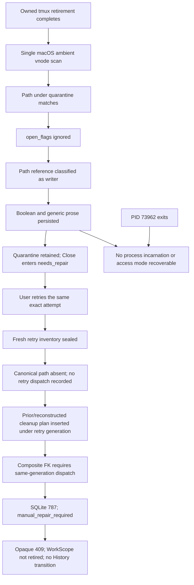

# Fix the exact-attempt Close-retirement incident

## Commission and hard safety boundary

Own the P1 incident for exact Close attempt `1a777b0f-42b8-4a88-bc90-e40dc664005a`, active transcript `d742662e-b7fc-4297-9c91-5a3b09a3fee6`, ProductConversation `25edc63f-e006-4477-87ea-5e53ace94b3f`, and WorkScope `3b221c34-ca3d-49d8-b916-168e9d8976ab`.

The production database, Close lifecycle rows, and retained quarantine are evidence, not repair targets. Throughout investigation and development:

- never retry this production attempt;
- never edit or delete its lifecycle, inventory, dispatch, cleanup-plan, evidence, or history rows;
- never mutate, remove, or reuse the retained path `/Users/scottopell/dev/phoenix-ide/.phoenix/worktrees/11839d75-ddae-46e2-92bc-c0dcc1e7fd58.phoenix-close-69cee69614d64134234c7a1aa6553a7fe67ecb8f27b66f6260c64b43c53613cb`;
- use production logs/traces and SQLite only through bounded read-only access (`mode=ro`, `immutable=1`, `query_only=ON` where applicable);
- reproduce only in disposable temporary directories and disposable test databases;
- do not deploy.

## Approval gate

This task is commissioned and in progress, but **implementation is blocked until the user approves this postmortem and reproduction plan**. Approval authorizes normative/spec changes and code/tests on a separate branch/PR; it does not authorize touching the production attempt or deploying.

## Normative authority reviewed first

- `specs/work-lifecycle/requirements.md` — REQ-WL-001, REQ-WL-002a/b, REQ-PROJ-028a
- `specs/work-lifecycle/work-lifecycle.allium` — exact-attempt inventory, dispatch evidence, retry generation, retained cleanup-plan adoption, and final WorkScope retirement
- `specs/bedrock/requirements.md` — REQ-BED-029 exact Close identity and History finalization
- `specs/bedrock/bedrock.allium` — `NeedsRepairRetryResumesSameAttempt`
- `specs/git-repository/requirements.md` and `git-repository.allium` — immutable, identity-bound retained repair evidence
- `specs/compatibility/requirements.md` — explicit compatibility/recovery guarantees and migration constraints
- `specs/api/requirements.md` — REQ-API-006 lifecycle surface
- ADR-026 and ADR-031 through ADR-035 — WorkScope ownership, aggregate identity, authority, compatibility, and durable workflow
- ADR-039 through ADR-042 — registered runtime ownership, exact resource identity, Close retirement evidence, and retirement permits

The existing normative retry rule already says a retry rotates inspection generation while preserving exact-attempt dispatch evidence and adopting a retained cleanup plan only under exact identity. The implementation does not satisfy that rule for the retained-state shape below. Typed ambient-writer evidence, bounded post-retirement quiescence, and structured needs-repair recovery guidance need explicit normative additions before behavior changes. Because these are recovery/compatibility guarantees, record the policy in a new ADR rather than rewriting historical ADRs.

# Postmortem

## Executive summary

Two separate defects composed into one unrecoverable user journey.

**Lane A — false/unauditable ambient-writer classification.** After Phoenix successfully retired the registered tmux server, its macOS vnode scan found a descriptor path under the quarantined worktree. The implementation read `proc_pidfdinfo` data including `open_flags`, but did not use those flags. Any matching vnode path became `PositiveWriterFound`, including a read-only descriptor. The result was immediately collapsed to a boolean and then to a prose residual. No detector category, PID with process incarnation/start time, executable, matched path and match kind, or descriptor access mode was persisted. PID `73962` disappeared before later inspection. Therefore the positive-writer decision is not auditable and attribution to tmux is unproven.

**Lane B — generation-inconsistent retry evidence.** Exact-attempt retry sealed a new `server_git_status_v2_retry_0511ce88-...` inventory. Because the canonical worktree path was already absent and quarantine was retained, retry did not create a retry-generation worktree dispatch. It then reconstructed a cleanup plan from the retained quarantine and attempted to insert that plan under the retry generation. `close_worktree_cleanup_plans` has a composite foreign key to a same-attempt/scope/generation/fingerprint/resource-identity row in `close_retirement_resource_dispatches`. The required retry-generation dispatch did not exist, so SQLite correctly rejected the insert with extended code 787. The runtime converted the raw database string into `manual_repair_required`, and the API returned an opaque 409 rather than identifying the violated invariant/table and recovery action.

Lane A caused the initial retained quarantine. Lane B independently prevented the intended exact-attempt recovery from consuming that retained state. Fixing either lane alone does not provide a complete recovery journey.

## Observed user journey

1. User requested Close through the compatibility archive path for the aggregate.
2. Phoenix admitted exact attempt `1a777b0f-42b8-4a88-bc90-e40dc664005a` and settled owned resources.
3. Registered tmux retirement completed.
4. Worktree quarantine occurred, but the ambient vnode scan reported a writer and retained the quarantine.
5. The user later invoked `POST /api/conversations/d742662e-b7fc-4297-9c91-5a3b09a3fee6/close/retry-retirement` with that exact attempt.
6. Retry returned HTTP 409 `close_retirement_needs_repair` with raw SQLite `(code: 787) FOREIGN KEY constraint failed`.
7. The ProductConversation remained Open/`needs_repair`; final WorkScope retirement and History transition did not occur. Existing UI/error copy did not provide the exact attempt, active transcript, or a usable retry action.

## Evidence timeline — verified facts only

All production DB observations below were made read-only from an immutable SQLite URI; no endpoint was called during this investigation.

| Time (UTC, 2026-09-13) | Verified event |
|---|---|
| 07:35:28.996044 | Close attempt and captured scope were admitted. |
| 07:35:32.065477 | Original `server_git_status_v2` inventory was captured and sealed. |
| 07:35:33.516374 | Original-generation `tmux_server` dispatch was recorded. |
| 07:35:33.529121 | `tmux_server` retirement evidence was recorded as `retired`, detail `exact registry permit retirement`. |
| 07:35:33.531072 | Original-generation `worktree` dispatch was recorded. |
| 07:35:33.543572 | The sole `close_worktree_cleanup_plans` row was recorded under the original generation. |
| 07:35:34.635417 | Worktree residual was recorded as `identity_not_proven`, saying an external process could still write the quarantined worktree. No normalized process/detector evidence was stored. |
| 07:35:34.636942 | The archive request returned HTTP 409 `close_settlement_in_progress`. |
| Before later manual inspection | PID `73962`, associated only ephemerally with the scan, had exited; its executable/incarnation and descriptor could no longer be inspected. |
| 13:03:08.909039 | Exact-attempt retry captured and sealed `server_git_status_v2_retry_0511ce88-63e4-4c7c-9070-cf00207900fe`. |
| 13:03:08.930717 | Retry recorded worktree residual `manual_repair_required` with raw SQLite 787. |
| 13:03:08.932480 | Retry endpoint returned HTTP 409 `close_retirement_needs_repair`. |

Retained database shape:

- original generation: sealed inventory; expected `tmux_server`, `work_scope`, `worktree`; dispatches for `tmux_server` and `worktree`; one worktree cleanup plan;
- retry generation: sealed inventory; expected `work_scope` and `worktree`; **no generation-bound dispatch and no cleanup plan**;
- current evidence: retry-generation worktree residual only;
- history: original tmux retired, original worktree residual, retry worktree manual-repair residual;
- `PRAGMA foreign_key_check` reports no stored violation because the failing insert was rejected atomically.

## Facts, causes, contributors, and unknowns

### Verified facts

- `macos_process_has_path_reference` receives `ProcFileInfo.open_flags` but ignores it; any vnode path under the quarantine returns `PositiveWriterFound`.
- `scan_macos_process_path_references` carries only the three-way result `PositiveWriterFound`, `NoWriterFound`, or `DetectorIndeterminate`; it does not return positive evidence.
- `ambient_worktree_writer_status` reduces that result to `Result<bool, String>`.
- `quarantine_and_delete_confirmed_worktree` persists only generic prose when the boolean is true.
- The worktree scanner runs after registered browser/tmux retirement, but it performs one immediate ambient decision; there is no evidence-bound quiescence/reinspection protocol.
- `retire_close_scope` records worktree dispatch only when the canonical worktree path exists.
- If the canonical path is absent, `retire_worktree_from_plan` may recover the original cleanup plan by identity or reconstruct one from quarantine.
- `record_close_worktree_cleanup_plan` inserts the recovered/reconstructed plan under the *current retry generation*.
- `close_worktree_cleanup_plans` requires a same-generation parent in `close_retirement_resource_dispatches` over `(attempt_id, scope, inspection_generation, inspection_fingerprint, resource_kind, identity_kind, identity_value)`.
- The retry generation has expected worktree inventory but no worktree dispatch, so the plan insert fails with SQLite 787.
- `retry_close_retirement` maps all retirement errors to a generic `ConflictErrorResponse`; that wire type has no attempt ID, active transcript, invariant/table identifier, or retry action.
- `WorkActions` displays generic error text and does not render a dedicated needs-repair recovery affordance.

### Root causes

**Lane A root cause:** the detector's evidence-classification boundary is wrongly placed. Path reference is treated as write authority before descriptor access mode and process identity are classified, and the typed evidence is discarded before persistence.

**Lane B root cause:** retry generation rotation and retained-evidence adoption are separate non-transactional operations. The runtime writes a child cleanup plan in the new generation without first carrying/adopting the generation-bound dispatch parent required by the schema and normative exact-attempt proof chain.

### Contributors

- `PositiveWriterFound` is an evidence-free enum variant, so the type cannot represent the facts needed to audit a positive result.
- A generic `bool` boundary makes “writer proved” indistinguishable from “some vnode reference matched.”
- PID without process start/incarnation permits PID reuse ambiguity and cannot support stable reinspection.
- The single ambient scan creates a race immediately after owned process retirement; transient helper/reference teardown can overlap it.
- Cleanup plan, dispatch, and generation are passed as loosely coordinated values across runtime/DB calls rather than adopted as one typed transaction.
- Raw `sqlx::Error` strings cross the domain/API boundary, hiding the failed invariant.
- Existing tests cover detector uncertainty and path matching, but not read-only access mode, transient disappearance, stable-writer persistence, or retained-plan exact-attempt retry through final History.

### Unknowns retained as unknowns

- Which executable owned PID `73962` at 07:35:34.635Z.
- PID `73962`'s process start time/incarnation.
- The exact matched vnode path and whether the match was cwd, root, or descriptor mapping.
- The descriptor access mode.
- Whether PID `73962` was tmux, a shell/editor/indexer, Phoenix itself, or another transient process.
- How long the reference survived after the scan.

The fix must not fabricate any of these values for historical evidence.

## Rejected hypotheses

| Hypothesis | Why rejected or unproven |
|---|---|
| The registered tmux server was still alive and caused the block. | Exact registry-permit retirement was durably recorded 1.106 seconds before the residual. The later PID vanished and no executable/incarnation was persisted. Tmux attribution is therefore unproven, not a fact. |
| Any open vnode below the quarantine can modify it. | A disposable macOS reproduction held an `O_RDONLY` descriptor under a temporary root; `lsof` reported access mode `r`, while the current path-only predicate maps the same match to `PositiveWriterFound`. Read-only access is not write authority. |
| SQLite 787 indicates corrupt retained production rows. | `PRAGMA foreign_key_check` is clean. SQLite rejected a new child insert whose same-generation dispatch parent was absent; rejected insertion preserves relational integrity. |
| Retry should reuse the old generation unchanged. | Normative behavior requires a fresh sealed retry inspection generation while preserving/adopting exact-attempt dispatch/cleanup evidence consistently. Reusing stale inspection truth would weaken the generation fence. |
| Deleting the cleanup-plan FK would repair retry. | The FK correctly enforces that destructive cleanup plans derive from authorized dispatch. Removing it would permit unauthorised plans and violate ADR-041/042. |
| A manual row edit or another retry is the right incident repair. | Both would mutate commissioned evidence and could trigger destructive retirement before the causal defects are fixed. They are expressly forbidden. |

## Causal graph



## Five whys

### Lane A

1. Why was the worktree retained? The ambient scan reported a positive writer.
2. Why did it report a writer? It found a vnode path below the quarantine.
3. Why was a path reference sufficient? The macOS implementation ignored `open_flags` and conflated reference with write authority.
4. Why could the decision not be audited/rechecked? Positive evidence was erased into an enum/boolean and generic prose before persistence.
5. Why did a transient overlap become terminal? There was no bounded, identity-aware quiescence/reinspection after owned resource retirement.

### Lane B

1. Why did retry return SQLite 787? A cleanup-plan insert violated its composite foreign key.
2. Why was its parent missing? The canonical path was absent, so retry skipped the worktree dispatch.
3. Why did it still insert a plan? Quarantine recovery/reconstruction found retained cleanup authority, but rebound only the child to the new generation.
4. Why were parent and child inconsistent? Generation rotation, dispatch adoption, and cleanup-plan adoption are not one transaction or typed operation.
5. Why did the user receive only raw SQL? Domain errors do not classify persistence invariants, and the conflict response lacks structured Close recovery fields.

## Blast radius and recurrence risk

- **Affected platform for Lane A:** macOS (`proc_pidinfo`/vnode path scanner). Linux's `/proc` path differs but must preserve the same typed evidence contract if it reports a writer.
- **Affected lifecycle shapes for Lane B:** any exact-attempt retry where a worktree has moved to retained quarantine, the canonical path is absent, an original cleanup plan/dispatch exists (or a plan can be reconstructed), and retry rotates inspection generation without adopting the dispatch parent.
- **User impact:** a valid Close can retain disk state and stay Open/`needs_repair`; the supported retry can deterministically fail; the UI provides no safe recovery path.
- **Data integrity:** no evidence of corrupt committed FK state or lost worktree data. The retained quarantine and rows remain evidence. The incident is availability/lifecycle completion plus observability, with destructive-risk prevention correctly failing closed.
- **Recurrence:** high for this retained-state shape until Lane B is fixed; Lane A can recur for any read-only/transient vnode reference on macOS.

## Deterministic reproductions completed before implementation

### Lane A: read-only descriptor and transient disappearance

A disposable temporary directory was created outside the retained quarantine. A child process opened a file below that root with `O_RDONLY` and held descriptor 3. While alive, `lsof -F pfan` reported `a r` and the path under the root. Applying the current path-only predicate produced:

```text
current_path_only_outcome = PositiveWriterFound
correct_write_authority = false
```

After the bounded holder exited, `kill -0` failed and the descriptor/process evidence was no longer inspectable. This deterministically demonstrates both read-only misclassification and transient reference disappearance without asserting that the incident PID had the same mode.

Implementation tests must replace shell timing with an injected detector/process inventory and controlled clock:

1. a vnode match with read-only flags is classified as `ReferenceWithoutWriteAuthority` and never authorizes `PositiveWriter`;
2. a positive writer identified by `(pid, start/incarnation, executable, matched path, match kind, access mode)` disappears during bounded reinspection, followed by the required clean observations, so retirement may continue;
3. the same stable writer incarnation remains across the bounded window, so exact evidence is persisted and retirement fails closed;
4. PID reuse (same PID, different start/incarnation) is not treated as the same writer;
5. detector indeterminacy remains fail-closed and is distinct from positive-writer evidence.

### Lane B: retained-state FK failure and transactional control

A disposable SQLite database recreated the production composite keys:

1. insert original-generation expected worktree, dispatch, and cleanup plan;
2. insert retry-generation expected worktree only;
3. begin a transaction and insert a retry-generation cleanup plan without retry dispatch;
4. SQLite deterministically returns `FOREIGN KEY constraint failed`, matching extended code 787;
5. rollback;
6. control transaction inserts/adopts retry-generation dispatch first, then cleanup plan, and commits with `foreign_key_check` clean.

The production schema identifies the exact failed invariant as:

```text
close_worktree_cleanup_plans
  (attempt_id, scope, inspection_generation, inspection_fingerprint,
   resource_kind, identity_kind, identity_value)
REFERENCES close_retirement_resource_dispatches(same composite key)
```

The code-level regression fixture must create the full retained Close shape transactionally through public DB/runtime helpers, not by disabling FKs or editing serialized blobs, and then exercise exact-attempt retry through final `work_scope` retirement and atomic History finalization.

## Observability and test gaps

- No normalized table/type stores a positive ambient writer's detector, PID+incarnation, executable, path+match kind, and access mode.
- No positive-evidence ID is linked from worktree residual history.
- Logs/API cannot distinguish `read_only_reference`, `stable_writer`, `transient_writer_disappeared`, and `detector_indeterminate`.
- Persistence errors expose SQLite codes instead of a typed invariant/table name.
- Retry tests do not cover an original-generation cleanup plan plus absent canonical path plus retry generation.
- End-to-end lifecycle tests stop short of validating retry evidence adoption, final WorkScope retirement, outcome message, aggregate History state, and retained historical evidence together.
- UI tests do not cover an existing needs-repair Close or inactive-transcript recovery guidance.

## Precise counterfactuals

- If descriptor access mode had been classified before `PositiveWriterFound`, a read-only descriptor could not have blocked retirement.
- If positive evidence had included process incarnation and executable, later inspection could have proved or rejected tmux attribution without relying on a vanished PID.
- If post-owned-resource retirement required bounded identity-aware reinspection, a transient writer/reference could disappear while a stable writer would still fail closed.
- If retry had atomically adopted both the prior exact-attempt dispatch authority and cleanup plan into the fresh generation, the cleanup-plan FK would have been satisfied and retirement could have proceeded.
- If the API had returned a typed invariant/table plus exact recovery coordinates, the user would not have received an unactionable raw 787.
- None of these counterfactuals proves that the incident descriptor was read-only; they identify conditions that would have prevented the failure or made it auditable.

# Implementation plan — only after postmortem approval

## 1. Update normative artifacts and decision record before code

1. Add a new ADR defining:
   - path reference versus write authority;
   - the minimum auditable positive-writer evidence identity;
   - bounded post-owned-resource quiescence/reinspection and stable-writer fail-closed behavior;
   - fresh-generation transactional adoption of same-attempt dispatch plus cleanup-plan evidence;
   - typed invariant failures and structured recovery guidance;
   - no automatic production retry, rollback guarantee, or retained-path deletion.
2. Amend `specs/work-lifecycle/requirements.md` (REQ-WL-002b / REQ-PROJ-028a or a narrowly named new requirement) so:
   - read-only vnode access is never write authority;
   - positive writers require detector, PID+process incarnation/start, executable, matched path+kind, and access mode;
   - owned retirement is followed by a specified bounded reinspection protocol;
   - stable writers and indeterminate detectors fail closed;
   - exact-attempt retry atomically adopts compatible prior dispatch and cleanup evidence into the new sealed generation.
3. Amend `work-lifecycle.allium` with precise rules for evidence classification, transient disappearance, stable retention, generation adoption, and final WorkScope retirement. Define the exact bounded protocol here, with a fake-clock test contract rather than sleeps.
4. Amend `bedrock` requirements/Allium so a Close/archive compatibility request encountering an existing `needs_repair` obligation either resumes that same exact attempt safely or returns structured recovery guidance; it must never create or imply a new attempt.
5. Amend `specs/api/requirements.md` for the structured conflict payload: exact attempt ID, active transcript ID, typed recovery action/endpoint, and typed failed invariant/table when applicable.
6. Update only `executive.md` status/current-reality text after implementation is verified. Run the `specs/AUTHORING.md` pre-flight and `allium check` before code changes continue.

## 2. Lane A — make evidence classification first-class

Starting symbols: `macos_process_has_path_reference`, `scan_macos_process_path_references`, `ambient_worktree_writer_status`, and `quarantine_and_delete_confirmed_worktree` in `crates/phoenix-ide/src/runtime/close_retirement.rs`.

- Replace evidence-free `PositiveWriterFound` and the boolean boundary with typed scan observations/outcomes.
- On macOS, interpret descriptor flags and require actual write authority before reporting a writer. A cwd/root/text/mapping/path reference without writable descriptor authority must have a distinct non-authorizing classification.
- Capture PID plus process start/incarnation, executable identity, exact matched path, match kind (`cwd`, root, vnode descriptor/mapping, etc.), and descriptor access mode. Treat unavailable mandatory identity as indeterminate, not as fabricated positive evidence.
- Normalize persisted positive-writer evidence in schema columns/rows keyed to exact attempt/scope/generation/resource evidence; do not hide structured evidence in prose/JSON or duplicate it in two representations.
- After registered owned resources retire, run the normatively specified bounded reinspection protocol. Use process incarnation to distinguish continuity, require clean observations before proceeding, and persist stable positive evidence on fail-closed exit. Detector failure/uncertainty remains a separate fail-closed outcome.
- Keep the retained path until a clean, authorized exact-attempt flow reaches deletion; tests use disposable paths only.

## 3. Lane B — atomic exact-attempt retained-evidence adoption

Starting symbols: `resume_close_retirement`, `retire_close_scope`, `retire_worktree_from_plan`, `record_close_retirement_dispatch`, and `record_close_worktree_cleanup_plan`.

- Introduce one DB transaction/API that validates and adopts the prior same-attempt worktree dispatch authority and cleanup plan into the current retry generation together.
- Validate exact attempt, scope, worktree identity, fingerprint, typed locator/admin-dir identity, sealed retry inventory, and compatible expected resource before adoption.
- Insert/adopt the retry-generation dispatch parent before its cleanup-plan child in the same transaction. Idempotent replay must return the identical adopted evidence; conflicting evidence must fail closed with a typed invariant.
- Do not mutate old generations. Preserve original dispatch/plan and retirement history as immutable evidence.
- Make impossible generation combinations structurally difficult to call: pass a typed adoption aggregate rather than independent generation/identity strings.
- Classify DB failures at the persistence boundary. Surface a stable error such as `close_evidence_invariant_violation` with table/invariant identity; do not send raw SQLite 787 as user guidance.
- Continue retirement through worktree proof, final `work_scope` retirement evidence, outcome message, and atomic ProductConversation History finalization.

## 4. Existing needs-repair archive/Close recovery and UI

- At the compatibility archive/Close entrypoint, detect an active `needs_repair` obligation under the same aggregate mutation-admission lock.
- If the request is safely eligible to resume, dispatch only that exact attempt. Otherwise return a structured 409 containing:
  - `error_type`;
  - exact `attempt_id`;
  - `active_transcript_id`;
  - typed `recovery_action` with the exact retry-retirement route/method (or explicit non-retryable repair guidance);
  - invariant/table identifier where a persistence invariant failed.
- An inactive transcript must be redirected/guided to the active transcript rather than losing recovery controls.
- Extend generated/wire-safe response types and valibot/client handling as required; avoid UI-only parsing of prose.
- Replace generic “archive failed” wording with Close/retirement language. Present one clear “Retry retirement” affordance only when the structured action authorizes it; otherwise show exact attempt and actionable repair guidance. Do not expose Archive as a new normative product concept.

## 5. Deterministic regression coverage

### macOS/unit

- synthetic read-only vnode descriptor under quarantine is not a writer;
- writable descriptor persists full normalized evidence;
- transient writer incarnation disappears during controlled bounded reinspection and clean observations permit progress;
- stable writer incarnation remains and retains quarantine/fails closed;
- PID reuse does not satisfy incarnation continuity;
- detector indeterminate remains fail-closed and is not recorded as a positive writer;
- no wall-clock sleeps: injected scanner and controlled clock/scheduler.

### DB/runtime/API end-to-end

- construct original sealed generation with worktree dispatch+plan and retained quarantine, then a fresh retry generation with expected inventory;
- exact-attempt retry adopts dispatch+plan atomically and idempotently;
- mismatched attempt/scope/identity/fingerprint cannot adopt evidence;
- injected failure between parent/child writes rolls back the whole adoption;
- errors name the invariant/table rather than exposing 787;
- retry retires worktree and then WorkScope, records exact evidence, writes one outcome, and transitions aggregate to History atomically;
- repeated safe replay does not duplicate retirement, message, or lifecycle announcement;
- existing needs-repair archive/Close resumes only the same attempt or returns structured attempt/active-transcript/retry guidance;
- inactive transcript and UI wording/recovery affordance are covered;
- stable writer path remains Open/needs-repair with quarantine retained.

## Validation and delivery gates

1. Preserve the production DB/quarantine read-only throughout; run no production retry and no deployment.
2. Validate normative artifacts first: `allium check` for touched specs and the `specs/AUTHORING.md` checklist.
3. Run focused Lane A, Lane B, DB, runtime, API, and UI tests.
4. Run `./dev.py check --all` after focused checks pass.
5. Run an independent adversarial review against the exact commit, explicitly challenging process-identity semantics, timer/quiescence races, transaction rollback, FK authorization, idempotence, wire compatibility, and final History atomicity. The pre-implementation delegation attempts failed at provider startup and do not count as this review.
6. Address findings and rerun focused plus full `--all` checks.
7. Create a separate PR for this incident fix; do not mix unrelated changes.
8. Require exact-HEAD CI and Codex review results before the merge decision. If HEAD changes, invalidate prior review/check evidence and rerun it.
9. Make an explicit merge decision from exact-HEAD evidence. Do not deploy.

## Acceptance criteria

- The user approves this postmortem before implementation begins.
- Production attempt `1a777b0f-42b8-4a88-bc90-e40dc664005a`, all its rows, and retained paths remain untouched.
- Normative requirements/Allium and a new ADR are updated before implementation behavior.
- Read-only macOS vnode access can never authorize `PositiveWriterFound`.
- Every persisted positive writer contains detector, PID+start/incarnation, executable, matched path+kind, and descriptor access mode.
- Bounded evidence-driven reinspection permits transient disappearance only after the specified clean evidence; stable writers and detector uncertainty fail closed with quarantine retained.
- Exact-attempt retry carries/adopts compatible prior dispatch and cleanup-plan evidence into the fresh generation consistently in one transaction and preserves old generations.
- The retained-state regression proceeds through final WorkScope retirement and atomic History finalization.
- Persistence errors identify a stable invariant/table and never expose raw SQLite 787 as user guidance.
- An archive/Close request encountering existing `needs_repair` either safely resumes that same exact attempt or returns structured actionable guidance with attempt ID, active transcript, and retry action.
- UI copy and affordances use Close/retirement language and are driven by typed recovery data, not prose parsing.
- Deterministic macOS/unit and end-to-end tests cover read-only descriptor, transient disappearance, stable writer retention, retry with retained evidence, and final retirement.
- Focused checks, `./dev.py check --all`, independent adversarial review, separate PR, exact-HEAD CI/Codex, and explicit merge decision complete.
- No deployment occurs.
