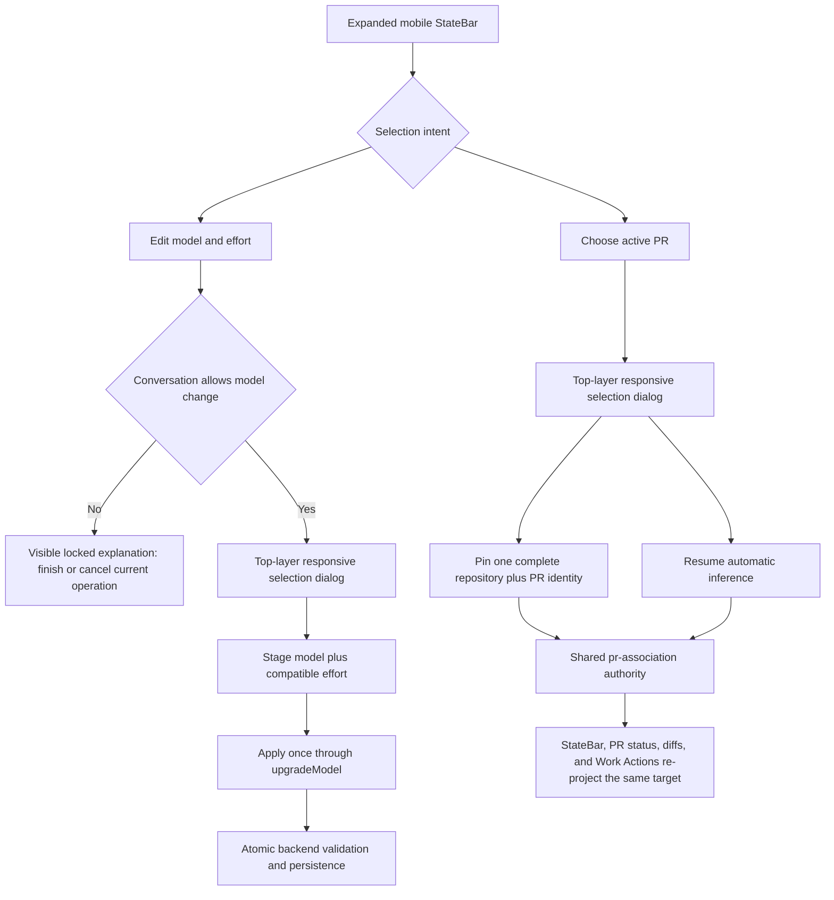

# Make mobile StateBar selection clear, touch-friendly, and structurally overlay-safe

## Observed journey

- On an iPhone-sized conversation view, the user expands the bottom StateBar to inspect the current work identity.
- The Model row shows the current model and effort as muted text but offers no usable or explanatory editing affordance. In the supplied capture the conversation is `awaiting LLM response`, so the user cannot tell whether the control is broken, disabled, or hidden.
- The Branch section shows the active-PR badge and the `#N Auto` selector. Opening that selector has a persistent paint-order/layering failure that makes it unusable.
- The desired outcome is not another z-index patch: model/effort and active-PR choice should use a pleasant, reliable selection pattern on touch devices while preserving their different domain semantics.

Reproduction target: compact/mobile conversation layout at approximately 390 CSS px wide, expanded StateBar, multiple associated PRs, with both idle and in-flight conversation phases represented.

## Verified findings

- `StateBar::renderModelControl` is the only existing-conversation model/effort editor. On compact layouts it is nested in the expanded drawer (`ui/src/components/StateBar.tsx`). When editable it opens `.model-picker`, a hand-rolled `position: fixed` listbox anchored by `bottom: calc(var(--state-bar-height, 42px) + 8px)` even though an expanded mobile StateBar is much taller than 42px (`ui/src/components/StateBar.css`).
- The screenshot's muted model text is intentional state gating, not a mobile-only missing handler: `canChangeModelInState` and backend `ConvState::allows_model_change` allow changes only from settled `idle`, `error`, and `recoverable_continuation_failure` states. `upgrade_model` rejects an update while an LLM request, tool, or other operation is in flight (`ui/src/api.ts`, `crates/phoenix-core/src/domain/sm_state.rs`, `crates/phoenix-ide/src/api/handlers.rs`). Existing tests explicitly require a read-only span during `llm_requesting`.
- That legal lock is invisible to the mobile user. The read-only span has only a model title; it does not explain that the current operation must finish or be cancelled before model/effort can change.
- `ActivePrSelector` renders its menu as an absolute descendant of the StateBar. The menu depends on local `z-index: 20`, while the StateBar and multiple ancestors/rows establish overflow and stacking boundaries (`ui/src/components/StateBar.tsx`, `ui/src/components/StateBar.css`, `ui/src/index.css`). Raising the descendant z-index cannot structurally escape ancestor clipping or sibling stacking contexts.
- The active-PR control is single-select despite having multiple candidates. Selecting a row pins one complete `owner/repository#number` identity immediately; `Resume automatic selection` clears pinned intent. It must not become a true multi-select or create a second selection authority (`specs/pr-association/requirements.md`, `specs/work-actions-bar/requirements.md`).
- Model and effort form one atomic setting. The API already accepts them together, and REQ-LLM-004c requires a model switch plus compatible replacement/reset effort to be one atomic transition (`specs/llm/requirements.md`). The current menu mutates immediately on each model or effort row, which is a poor fit for editing that tuple.
- Work Actions intentionally hides its mobile rail outside eligible settled phases. During the in-flight state shown by the user, the StateBar fallback is therefore the only active-PR chooser (`WorkControlBar`, `deriveWorkDisposition`, and `StateBar::workActionsPrRailOwnsSelection`).
- Existing `StateBar` tests cover callbacks and keyboard behavior in jsdom, but cannot prove paint order, viewport containment, safe-area behavior, or 44px touch targets.
- A deterministic `mobileMultiPrConversation` Ladle fixture exists, but its `chooser-open` scenario expands the Work Actions rail. It does not exercise the StateBar fallback selector during an in-flight phase—the exact reported journey.
- REQ-CONV-010 requires compact layouts through tablet width to use mobile patterns, expose at least 44px touch targets, and respect safe areas.

## Inferences and bounded unknowns

- The exact browser paint artifact was not reproduced in this read-only worktree because the local Ladle dependency install cannot run under the Explore sandbox. The structural failure is nevertheless bounded: both affected pickers are descendants that try to act as overlays from inside the StateBar layout, and the active-PR fallback fixture does not cover real geometry.
- Do not assume a larger numeric z-index is a fix. The implementation must move selection UI to a browser/app top-layer boundary that cannot be clipped by StateBar ancestors, then validate it in a real mobile viewport.
- Product direction is resolved: optimize all implicated user journeys rather than preserving the current dropdown interaction. No further choice between native selects, checkbox multi-select, and the existing menus is required.

## Interaction map

No new persistence or wire representation is needed. The model/effort update remains the existing atomic API operation; active-PR mutation remains the existing `pinActivePr` / `resumeInference` path. Loading, success, and error feedback must stay within the owning dialog and close only on successful mutation.

## Proposed scope

### 1. Add one small responsive selection-dialog shell

Create or extract a focused UI primitive for StateBar choice flows. It must:

- render at a structural browser/app top-layer boundary (prefer a native modal-dialog/top-layer solution where supported, or a body portal with equivalent structural isolation), never as a clipped StateBar descendant;
- present as a touch-friendly sheet/dialog on compact layouts and a contained dialog/popover on wider layouts without depending on guessed StateBar height;
- provide an accessible title, explicit close/cancel, Escape dismissal, focus containment while open, and focus restoration to the invoking trigger;
- make interactive rows and close/apply controls at least 44px high on compact/tablet layouts;
- respect viewport and safe-area insets, scroll long option lists internally, and prevent interaction with obscured background controls;
- allow in-place pending and error content without changing overlay ownership or falling behind the conversation UI.

Share only this presentation/focus shell. Do not create a generic selection state machine or force model configuration and PR targeting into one semantic abstraction.

Likely starting surfaces: a new colocated component/CSS under `ui/src/components/`, `StateBar.tsx`, and `StateBar.css`. Do not add an overlay library solely for these two dialogs unless implementation evidence proves the platform primitives insufficient.

### 2. Redesign model + effort as one atomic edit flow

- Keep the current model and effective/explicit effort visible in the expanded Model row.
- In eligible settled states, make the complete row an obvious >=44px trigger rather than a small text link.
- Open a single selection dialog with separate Model and Effort sections. Stage the pair locally; changing model must recompute the legal effort options and explicitly reset an incompatible staged override to model-native behavior.
- Include `Model default` with its known native level when available and preserve honest unknown/unsupported capability messaging.
- Commit only from an explicit Apply action, issuing exactly one `onUpgradeModel(model, effort)` call for the final compatible pair. Cancel/close must persist nothing.
- Keep `Show recommended` versus all-model disclosure usable without mixing checkbox semantics into the single-choice model list.
- During in-flight states, do not pretend the setting is editable and do not queue a hidden next-turn change. Show concise visible guidance such as “Locked while the current operation is running; finish or cancel it to change model or effort.” The current value must remain readable.
- Preserve error-state model switching as a recovery path and surface API failure without silently closing the dialog.

### 3. Replace the Active PR fallback dropdown with a single-select dialog

- Preserve one explicit active PR and complete repository-plus-number identity; this is not true multi-select.
- Open the responsive top-layer dialog from the StateBar trigger whenever Work Actions cannot own/represent selection, including in-flight phases and unresolved/terminal fallback states already covered by `derivePrRailAvailability`.
- Render actionable PR candidates as touch-sized radio-style rows with PR number, title, repository, head/base branch, open/draft status, and current active marker. Retain the ambiguity explanation.
- Selecting a different PR should invoke the existing pin operation immediately, show `Saving active PR…`, and close/restore focus only after success. Failure remains visible and retryable in the dialog.
- Preserve `Resume automatic selection` as a clearly separate action that explains the latest observed branch/repository basis; do not style `Auto` as another PR candidate.
- Keep Work Actions and StateBar availability derived from the existing shared authority. Do not render two simultaneous mobile PR selectors or add local/parallel active-PR state.

### 4. Make the exact mobile failure a first-class fixture journey

Update the mobile multi-PR fixture/story/capture path so it can deterministically represent:

- compact expanded StateBar while the conversation is in-flight;
- Work Actions rail absent and the StateBar active-PR fallback dialog open;
- idle expanded StateBar with the model/effort dialog open and staged selections;
- in-flight expanded StateBar with current model/effort plus the visible locked explanation;
- mutation pending and error states where practical without network timing.

The capture script must interact with the real triggers and assert dialog containment/visibility before screenshotting; a story named “chooser open” must not silently open the unrelated Work Actions expansion.

### 5. Align specifications and ownership

- Add timeless conversation-UI behavior for existing-conversation model/effort editability and explicit in-flight lock feedback, including compact touch/dialog behavior.
- Clarify the work-actions/PR-selection fallback obligation only as needed: when the rail cannot own selection, the StateBar must still provide an accessible, overlay-safe chooser while targeting the same `pr-association` authority.
- Update the relevant executive verification anchors after implementation. No new Allium spec is warranted for these local UI interactions.
- Run the `specs/AUTHORING.md` pre-flight checklist before pushing any spec edits.

## Acceptance evidence

1. At 390x844 and at tablet width, an idle user can expand the StateBar, open Model & Effort, select a different model and supported effort, and Apply. Exactly one atomic update callback/API call carries the final pair.
2. Cancelling after changing staged model/effort calls no mutation and restores focus to the trigger.
3. Selecting a model that cannot represent the previous explicit effort visibly resets the staged effort to model-native behavior before Apply; no invalid pair is submitted.
4. During `awaiting_llm`, `llm_requesting`, tool execution, or other in-flight states, the current model/effort remains visible with an explicit reason it cannot change. No chooser opens and no update is attempted.
5. During an in-flight mobile phase with multiple actionable PRs, Work Actions may remain hidden, but the StateBar active-PR dialog opens fully above all branch, terminal, runtime, composer, and browser chrome. No part is clipped or painted underneath a sibling card.
6. Each PR candidate is at least 44px high, identifies full repository-plus-PR context accessibly, and exactly one row is active. Choosing another row invokes the existing full-identity pin operation once.
7. Pending and failed PR mutations remain visible in the dialog; a failure does not close it or change the apparent active row. Success closes it and restores trigger focus.
8. `Resume automatic selection` remains distinct from candidate rows and uses the existing inference authority.
9. Escape, close/cancel, backdrop behavior, Tab containment, initial focus, and trigger focus restoration work for both dialogs. Background controls are not focusable or clickable while a modal sheet is open.
10. Long model names, many models, long PR titles/branches/repository names, iOS safe areas, and software-keyboard/viewport changes remain contained and scrollable without horizontal page overflow.
11. Desktop StateBar selection remains usable and cannot be clipped by `#state-bar-left`/line overflow. Existing Work Actions rail ownership and desktop/mobile availability rules remain unchanged.
12. Unit tests cover staged atomic model/effort behavior, in-flight lock copy, PR immediate-save/error behavior, ARIA semantics, and focus lifecycle. Ladle/browser QA captures the exact StateBar fallback and model/effort journeys at real compact geometry with no unexpected console errors.

Validation should include focused UI tests, `./dev.py qa mobile-multi-pr-conversation`, any new/extended StateBar selection QA target, CSS lint/typecheck, and the applicable `./dev.py check` lanes.

## Risks

- A top-layer dialog can conflict with existing terminal/viewer takeovers if ownership is not exclusive. Tests must verify one overlay closes or prevents opening another rather than relying on z-index ordering.
- Native modal-dialog behavior and focus restoration need explicit iOS Safari validation; a portal fallback must provide equivalent modality without introducing another z-index ladder.
- Staging model/effort changes alters when callbacks fire. Existing immediate-selection unit tests must be deliberately updated rather than weakened.
- The StateBar and Work Actions deliberately alternate ownership by phase and representability. Fixtures must cover that boundary so the fix does not produce duplicate selectors.

## Explicit non-goals

- Queueing a model/effort change to apply after an in-flight turn.
- Changing the backend legality rule for model swaps or cancelling the current operation automatically.
- Allowing several active PRs at once, batch PR operations, or creating a second active-PR authority.
- Redesigning new-conversation directory/project selection, sidebar project filters, or branch autocomplete.
- Reworking PR discovery, association persistence, inference order, Work Actions disposition, or provider effort semantics.
- Solving the issue by incrementing z-index values, adding viewport-specific magic offsets, or clipping/hiding neighboring StateBar cards.
