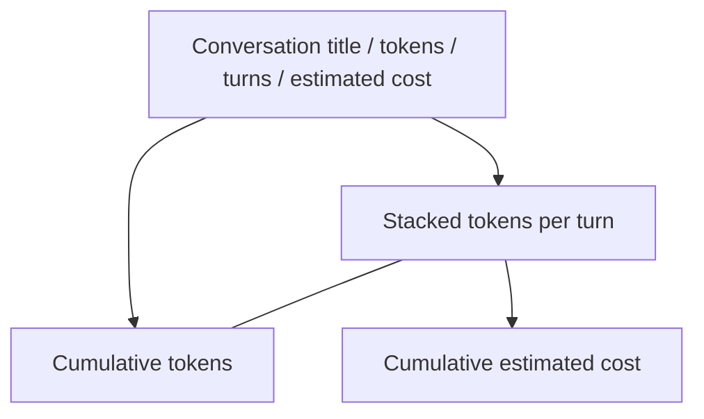

# Add cost estimates and richer conversation drill-down charts to /usage

## Goal

Improve the `/usage` conversation drill-down so token usage can be evaluated in cost terms, especially for cache/tool-compaction experiments.

The target experience when a user opens a specific conversation:

1. The existing “Tokens per turn” chart becomes a stacked bar chart broken down by:
   - uncached input tokens
   - output tokens
   - cache write / creation tokens, when present
   - cache read tokens
2. Add a cost estimate chart below it: a cumulative blended estimated spend line across turns.
3. Surface total estimated cost in the drill-down header and, where low-risk, in aggregate KPI cards/lists.

## Proposed design

Keep it KISS and avoid adding persisted cost columns. Token counts and model IDs are already persisted in `turn_usage`; cost is a derived presentation layer.

### Backend

Add a small typed pricing layer near the model registry or usage API:

- A per-model lookup table keyed by Phoenix model id.
- Prices are in USD per 1M tokens.
- Separate rates for token categories:
  - `input`
  - `output`
  - `cache_write`
  - `cache_read`
- `mock` should price to zero.
- Unknown models should remain representable: return tokens with cost fields as `null` or clearly mark `pricing_known: false`, rather than pretending the cost is zero.

Extend the `/api/usage` and `/api/usage/conversation/:id` payloads with cost fields derived from the same token rows:

- `Totals` gains estimated cost fields, or a nested `cost` object, for aggregate display.
- `TurnPoint` gains per-turn estimated cost and optionally per-category costs.
- Mixed-model days/conversations must compute cost per model row/turn before aggregating.

Do not migrate historical rows: the existing `turn_usage.model` value is sufficient for historical cost estimation.

### Frontend

In `ui/src/pages/UsagePage.tsx`:

- Replace the current single-series “Tokens per turn” drill chart with stacked bars using the existing per-turn fields:
  - `input_tokens`
  - `output_tokens`
  - `cache_write_tokens`
  - `cache_read_tokens`
- Keep the current cumulative token chart unless the new layout makes a better paired view obvious.
- Add a cumulative estimated cost line chart below the token charts.
- Format cost compactly (`$0.0123`, `$1.23`, etc.) and label it as estimated.
- Tooltip should show token category totals and estimated per-turn cost.
- If any turn has unknown pricing, show an inline muted warning such as “Cost estimate excludes N turns with unknown pricing.”

Suggested drill layout:

## Pricing table guidance

Start with a static table for the currently registered models:

- `claude-opus-4-8`
- `claude-opus-4-7`
- `claude-opus-4-6`
- `claude-sonnet-4-6`
- `claude-haiku-4-5`
- `gpt-5.5`
- `gpt-5.4`
- `gpt-5.4-mini`
- `gpt-5.3-codex`
- `mock`

Use provider public pricing if available, but keep the implementation easy to update. If prices are uncertain for any model, make that explicit in code and surface unknown pricing rather than silently guessing.

## Acceptance criteria

- Conversation drill-down stacked bars show cached vs uncached token categories per turn.
- Conversation drill-down includes a cumulative estimated cost chart.
- Drill-down header includes total estimated cost when all or some pricing is known.
- Mixed-model conversations calculate cost using each turn’s model, not a conversation-wide model assumption.
- Unknown/unpriced models do not show misleading zero-cost estimates.
- Generated TypeScript API types are updated via codegen.
- Unit tests cover:
  - cost calculation by token category
  - unknown model pricing behavior
  - mixed-model aggregation
- Run the appropriate checks (`./dev.py codegen` and targeted tests; `./dev.py check` if practical).
