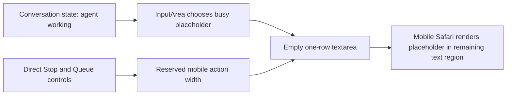

# Fit the busy composer placeholder in the compact mobile row

## Observed journey

- On a mobile-sized conversation while the agent is working and the draft is empty, the composer displays `Agent working... send to queue a follow-up`.
- Since the composer was intentionally reduced to one compact row, that placeholder wraps below the row and is visibly clipped instead of fitting within the text region.
- Reproduction: open a busy conversation at `<= 480px` with an empty draft and both Stop and Queue controls visible.

## Verified findings

- `InputArea` selects the long busy-state placeholder whenever `isAgentWorking(convState)` is true.
- `InputArea.css` intentionally overlays the compact action rail in the same mobile grid row and reserves its width through `--composer-controls-width`; with Stop and Queue present, the remaining textarea width is substantially narrower than the full composer.
- The textarea starts at `rows={1}`, has a 44px minimum control height, and auto-resizes from draft content only. A wrapping placeholder therefore does not trigger growth and its second line is clipped by the compact row.
- The one-row layout came from the intended mobile compaction change (`39c0247e9`, “Move mobile terminal into drawer and compact composer”). Reverting the reduced composer height would contradict that change and REQ-CONV-003.
- `specs/conversation-ui/requirements.md` REQ-CONV-003 requires an empty mobile composer to begin as one compact row with direct queue and cancellation controls.
- `ui/src/fixtures/coordinator/renderFixture.tsx` already exposes a `conversation-working` scenario with an empty Explore composer, quick action, Stop, and Queue controls; it can exercise the narrowest text region without adding a parallel fixture.
- Existing `InputArea.test.tsx` coverage checks one-row structure and accessible icon controls, but does not assert that state-dependent placeholder copy is concise enough for the compact presentation.

## Inferences and unknowns

- The failure is presentation-copy mismatch rather than an auto-resize failure: native textarea placeholders can wrap, while the resize effect measures draft content, not placeholder content.
- A concise busy placeholder such as `Queue a follow-up...` preserves the actionable purpose and fits the reduced text region more robustly than trying to force native textarea placeholder ellipsis, especially on mobile Safari.
- Exact rendered fit still depends on browser font metrics, so component assertions alone are insufficient; narrow-viewport browser evidence is required.

## Interaction map

- No persistence, wire, runtime, recovery, cancellation semantics, or reconnect behavior changes are involved.

## Proposed scope

1. Replace the verbose busy-state placeholder in `InputArea` with concise, action-oriented copy that fits the compact mobile text region while retaining the meaning that typing creates a queued follow-up.
2. Keep the intended one-row composer, 44px controls, direct Stop/Queue access, 120px content-growth cap, and all send/cancel gating unchanged.
3. Add focused `InputArea` regression coverage for the empty busy-state placeholder and preserve existing accessible names/tooltips on Stop and Queue.
4. Use the existing Coordinator `conversation-working` fixture at a narrow mobile viewport (including approximately 393 CSS pixels, matching the reported Safari layout) to verify visually that the placeholder remains on one line, does not collide with controls, and is not clipped. Also confirm typing multiline content still grows the composer normally.

## Acceptance journey

At a mobile viewport, open the working Coordinator conversation with an empty draft. The composer remains one compact row; its placeholder clearly invites a queued follow-up and is fully visible without wrapping, clipping, or overlapping the direct Stop and Queue controls. Type a multiline follow-up and confirm normal bounded auto-growth, then verify the desktop busy composer still communicates the same action.

## Risks and non-goals

- Risk: copy that fits the reported width may still fail at narrower supported widths or larger accessibility text settings; validate the narrow fixture rather than relying only on character count.
- Non-goals: increasing composer height, moving controls back to a second row, changing queue/cancel behavior, redesigning action controls, changing textarea auto-resize, or modifying backend state.
