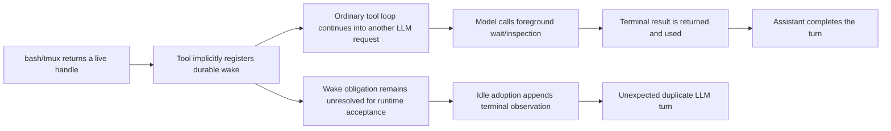

# Stop incorrect automatic wake creation and terminal replay turns

## Severity

**P0 correctness and cost bug.** Ordinary background-capable bash/tmux tool operations automatically create durable wake obligations without an explicit model request. The model then commonly consumes the same handle terminally through the normal foreground tool API, yet the unresolved wake still materializes after the assistant finishes and auto-resumes another LLM turn.

The durable workflow engine is storage-idempotent; the defect is semantic duplication and incorrect lifecycle ownership, not duplicate rows from one delivery.

## Production evidence

Read-only inspection of `~/.phoenix-ide/prod.db` found:

- Conversation `af855419-857c-4cf5-bea5-3ca0ceea28e4` (`add-git-gutter-file-tree`) registered bash `b-13` implicitly when the initial call returned `still_running`. A later `bash op=wait` consumed the tombstoned terminal result at sequence 3998. The assistant completed at 4266, then Phoenix appended `wake-98-1-result` at 4269 and auto-resumed.
- Conversation `4bc25992-7d14-4072-b63d-e4de94109176` (`compaction-bar-replaces-input`) registered bash `b-14`, consumed it through `bash op=wait` at sequence 806, completed at 1101, then received the semantically duplicate `wake-85-1-result` at 1105. An old tmux wake was delivered beside it at 1104.
- In a bounded sample of the 44 most recent fired wake deliveries, 43 had an earlier terminal foreground tool result for the same handle. The query matched typed terminal statuses parsed from persisted tool messages, not merely common text fragments.

## Verified failure model

- `bash::race_run_response` calls `background_run_response(..., register_wake: true)` when its bounded wait elapses. The analogous tmux path also registers automatically. This occurs as an implementation side effect of returning a live handle, not because the model called the explicit `wait_until` contract described by REQ-WAKE-001.
- The wake registration is embedded in JSON/display output under `wake_registration`; it is not a typed model choice or lifecycle disposition.
- Foreground bash `wait`/peek and tmux observation paths do not resolve or suppress the existing wake obligation when they return terminal evidence.
- `WakeRepository::adopt_materialized_pending_for_conversation` accepts every non-cancellation terminal observation when the conversation becomes Idle. Suppression only covers cancellation-only batches; it cannot know that a foreground tool already delivered the result.
- `WakeWorker` materialization and workflow resolution correctly prevent duplicate canonical rows. Those safeguards do not prevent the second semantic delivery and LLM invocation.

## Owning invariant

A terminal handle outcome must be delivered to the model at most once semantically:

- a foreground operation may return the terminal result in the active tool round; or
- an explicitly registered durable wait may deliver it in a later resumed turn;
- Phoenix must not create both obligations implicitly for the same interaction.

Automatic background execution and explicit durable waiting are separate capabilities. Returning a handle does not by itself mean the model has committed to a future auto-resume.

## Proposed scope

### 1. Remove incorrect implicit registration

Stop bash/tmux run-timeout/background response helpers from automatically registering durable wake obligations merely because they return a live handle. Preserve the handle, output, and normal foreground `peek`/`wait`/`kill` behavior.

Registration must be reachable only through an explicit typed durable-wait request. The separate follow-up task 44009 owns parking the LLM tool round on that explicit registration; this P0 must not implement or depend on parking.

Likely starting symbols:

- `race_run_response` / `background_run_response` in `crates/phoenix-tools/src/bash/operations.rs`
- tmux registration helper paths in `crates/phoenix-tools/src/tmux/run.rs`
- `WakeRegistrar`, `RegisterWakeInput`, and tool-context wake seams
- existing registration tests that currently expect `wake_registration` on an ordinary timed-out/background response

### 2. Handle already-created obligations safely

Define and implement rollout behavior for wake obligations created by the old automatic path:

- Because no explicit agent-facing registration path exists, do not start the wake worker.
- Retire and suppress all persisted automatic bindings through canonical workflow transitions before runtime bridges start, preserving workflow and message audit records while clearing owed-work gates.
- Do not add registration provenance or a schema migration solely for a future explicit tool; that tool will define its activation boundary when implemented.

### 3. Preserve the substrate for the intended agent-facing tool

The intended agent-facing `wait_until` tool did **not** land. Repository search finds it only in specs; `specs/wake-contracts/executive.md` still marks REQ-WAKE-016 as Proposed. Production registrations currently originate from implicit bash/tmux helper behavior, not from an explicit model call. Therefore this task has no shipped explicit wake-tool journey to preserve.

Remove the incorrect implicit producers without dismantling the reusable durable wake substrate: typed workflow profile, persistence, observation, terminal projection, restart recovery, continuation transfer, materialization, and acceptance idempotency. Task 44009 will connect that substrate to an explicit agent-facing wait and park behavior for bash handles and future tmux command-completion waits.

Update wake-contract executive/current-reality documentation and tests to state this boundary accurately: durable infrastructure exists, the implicit producer is removed, and the specified agent-facing tool remains unimplemented. Run the spec-authoring preflight for touched specs.

## Acceptance evidence

- An ordinary `bash op=run` that returns `still_running` creates a handle but no durable wake binding and no `wake_registration` payload.
- The equivalent ordinary tmux live-handle path creates no durable wake binding.
- Foreground `wait`/inspection returns terminal evidence normally and cannot cause a later synthetic wake message or auto-resumed LLM request.
- Persisted old-path obligations are non-owed and cannot produce terminal messages or resume turns; their audit records remain intact.
- The durable wake persistence/observation/delivery substrate retains its focused restart and idempotency coverage without claiming an agent-facing explicit contract exists.
- Regression tests cover bash/tmux no-registration behavior, legacy owed-work retirement, audit preservation, and the dormant worker startup boundary.
- A production-style journey reproducing the cited sequence yields one terminal delivery and no turn-end replay.
- `./dev.py check` passes.

## Risks and non-goals

- Do not implement park-on-wake behavior here; task 44009 owns that separate feature.
- Do not add `AwaitingWake`, alter generic `ConvState::is_busy()`, or redesign the durable workflow engine.
- Do not solve this by hiding all wake messages at turn end; preserve delivery machinery for the future explicit agent-facing wait surface.
- Do not delete audit records to make the duplicate disappear.
- Do not parse display strings or terminal tails to establish identity or consumption.
