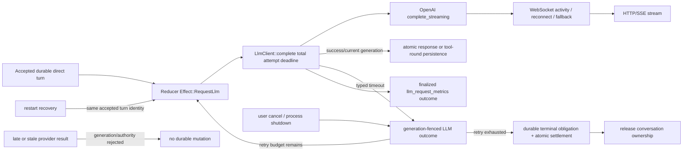

# Bound LLM request lifetime and durably terminalize every accepted turn

## Commission

Own LLM request liveness and terminalization end-to-end. An accepted direct turn must not retain conversation ownership indefinitely because a provider transport continues emitting non-visible events without reaching a terminal response.

Priority/status: **P0 / in-progress**.

Do not deploy as part of this task.

## Preserved incident evidence — read only

The following production artifacts are evidence only. Do not cancel, recover, retry, steer, edit, or otherwise mutate them:

- conversation `c4fa51ec-8853-4354-83a2-bc1631ca268c`
- its attached WorkScope (including its task branch/worktree)
- durable turn `1293`
- workflow `1471`
- OpenAI request `d0fbdd57-c131-4175-b4ab-e90b8be38613`

The request began at `2026-09-09T08:43:49Z`. The owning direct turn remained nonterminal for about 72.2 minutes while Phoenix stayed alive. It later completed without intervention. Final request metrics recorded:

- first provider event: `1642ms`
- first generation event: `22418ms`
- provider events: `288`
- generation events: `282`
- visible-text events: `0`
- maximum provider gap: `18733ms`
- maximum generation gap: `13731ms`
- total duration: `4329732ms`
- output kind: `mixed`
- stream completed: true
- outcome: success

The production sequence showed the request using OpenAI/Codex WebSocket, remaining active while events arrived within the per-frame timeout, then failing that transport near the end and falling back to HTTP/SSE before completion. This disproves an initial connection hang. The bounded failure model is a logical provider attempt whose per-operation/per-frame guards do not bound the total lifetime across WebSocket activity, reconnect/fallback, and SSE consumption.

No further production inspection is required for implementation, and no production mutation is permitted.

## Owning invariant

Every accepted LLM request has one explicit total deadline. Before that deadline it may produce one typed success or provider failure. At the deadline it produces one typed deadline outcome, releases/cancels process-local transport work, and enters the existing generation-fenced reducer path. That path either performs a bounded retry of the same durable turn or atomically persists the turn's terminal failure projection and releases conversation ownership. A timed-out, cancelled, stale, restarted, or late provider task can never commit a second response, execute tools, create another durable turn, or overwrite the winning terminal outcome.

Timeout and user cancellation are distinct typed outcomes. Neither is represented as a generic network string.

## Normative constraints

Read and preserve the current normative contracts before editing, especially:

- `specs/durable-workflows/requirements.md` and the direct-chat/core Allium specs
- `specs/llm/requirements.md`
- `specs/llm-retry-visibility/`
- `specs/compatibility/requirements.md`
- recovery and cancellation requirements linked from those artifacts
- ADR-014, ADR-020, ADR-024, ADR-025, ADR-034, ADR-036, ADR-037, and ADR-045

The implementation must retain these constraints:

- the conversation reducer owns semantic conversation state;
- the durable direct-turn aggregate owns acceptance, generation, terminal outcome, and conversation ownership;
- stale process-local results cannot commit after generation/authority loss;
- retry or restart may repeat remote computation, but Phoenix commits at most one logical response/terminal outcome for the accepted durable turn;
- terminal settlement atomically persists the reducer projection, establishes/consumes exact terminal evidence as required, and releases ownership before publication;
- SQLite ambiguity follows the exact-probe/fail-stop policy rather than being treated as a provider timeout;
- compatibility, migration, recovery, and persisted representation guarantees are explicit, never accidental.

Add or amend a timeless LLM requirement for bounded total request lifetime and typed deadline behavior. Amend precise Allium behavior only where the lifecycle gains a real state/rule. Record a new ADR if choosing the deadline origin, retry semantics, or persisted outcome changes architecture/policy. Update the compatibility contract or a feature-specific migration requirement before changing persisted enums/schema; do not silently widen `llm_request_metrics` or durable terminal semantics.

## Implementation scope

### 1. One typed total request deadline

Introduce one typed deadline policy/value at the LLM service/provider-attempt boundary used by `LlmClient::complete` and OpenAI `complete_streaming` rather than adding unrelated timers in individual parser loops.

- Define a production total-attempt duration once (initially matching the existing 10-minute streaming request policy unless the normative review establishes another explicit value).
- Inject the deadline/clock so tests can use virtual time and short synthetic deadlines without changing production constants.
- Start the deadline at provider-attempt dispatch.
- Cover the entire logical attempt: WebSocket lock/connect/send/frame loop, any fresh-socket retry, WebSocket-to-HTTP fallback, HTTP response headers, SSE body consumption, and response normalization.
- Do not reset or extend the deadline when provider events, keepalives, reasoning/tool deltas, reconnects, or transport fallback occur.
- Preserve narrower connect/frame/transport guards as diagnostics and early-failure mechanisms; they do not replace the total deadline.
- Apply the same owning service-level contract to every provider transport reached through `LlmClient::complete`, not only the incident's OpenAI WebSocket branch. Provider-specific code may clean up transport state but must not own competing deadline semantics.

Add explicit exhaustive variants such as `LlmErrorKind::TimedOut` and `LlmAttemptOutcome::TimedOut` (final names may follow existing vocabulary). Keep `Cancelled` separate. Ensure every conversion, retry-policy projection, wire reason, API aggregation, database codec, and exhaustive match handles the new type.

### 2. Cancellation-safe provider teardown and generation fencing

On deadline:

- cancel/drop the in-flight provider future and underlying HTTP/WebSocket stream;
- mark pooled WebSocket state dirty/unusable before reuse, using the existing cancellation-safe attempt marker/reset behavior;
- emit exactly one current-generation typed LLM outcome;
- ensure the runtime's existing `llm_request_generation` fencing rejects a late/stale completion or task-channel close from the timed-out attempt;
- ensure a racing user cancel wins or loses through typed, idempotent generation/terminal settlement rather than double-finalizing;
- prevent timeout teardown from being misread as an unclassified panic or generic synthetic network failure.

Do not create a second conversation-level timeout authority. The deadline belongs to the provider attempt; durable turn terminalization remains owned by the existing reducer and direct-turn settlement boundary.

### 3. Durable retry and terminalization without duplicate turns

Route deadline expiry through the existing bounded retry policy for the same accepted direct turn and generation-aware request flow.

- A retry must not accept/materialize another user turn or duplicate the canonical user message.
- Each provider attempt keeps a distinct request identity/attempt metric while all attempts remain part of the same durable direct turn.
- Before retry, the expired attempt must have lost process-local commit authority.
- A successful current attempt may commit one assistant response/tool round through existing atomic persistence.
- When retry budget is exhausted (or policy says not to retry), persist the typed timeout failure via the existing direct-turn terminal-obligation/atomic settlement path and release `owns_conversation`.
- A timeout racing success, cancellation, terminal settlement, process shutdown, or stale task delivery must have one durable winner.
- Do not infer success from partial provider output. Do not execute tool calls from an attempt that did not win with a complete current-generation response.

Keep crash recovery honest: a process crash during an uncommitted provider request may dispatch provider work again after restart, but exact durable turn identity, generation fencing, canonical message identity, and terminal settlement must make Phoenix-side response/turn commitment at-most-once.

### 4. Terminal request telemetry

Make `llm_request_metrics` record every begun attempt's explicit terminal classification when the attempt reaches Phoenix's typed result boundary:

- `success`
- provider failure classes
- `timed_out`
- `cancelled`

A deadline row must retain the latest content-free stream progress snapshot (`completed = false`), elapsed duration bounded around the configured deadline, provider/model/transport, request identity, retry attempt, event counts, first-event timings, and maximum gaps. A user cancellation row remains `cancelled`. Finalization must be idempotent under timeout/cancel/result races and must be persisted before the attempt capture is discarded.

If persisting a new outcome value requires a schema migration, update DDL, migration, codecs, fixtures, and compatibility requirements together. Do not use a serde default or map timeout to `network_error` as a rollout shortcut.

### 5. Deterministic regressions

Use injected clocks, paused Tokio time, channels/notifiers, explicit failpoints, and durable repository probes. Sleeps and elapsed wall-clock thresholds are not synchronization.

Add focused tests that prove:

1. **Total-lifetime liveness:** a scripted stream emits non-visible provider/generation events forever at intervals shorter than the frame/read timeout; advancing virtual time to the total deadline produces `TimedOut`, drops the stream, finalizes one non-completed timeout metric, and cannot remain in `LlmRequesting` indefinitely.
2. **Deadline covers fallback:** WebSocket activity/reconnect/fallback cannot reset the original deadline; HTTP/SSE receives only the remaining budget.
3. **Race matrix:** success-before-timeout, timeout-before-success, timeout-vs-user-cancel, and stale completion after a retry each produce one typed winner; stale generations cannot persist response/tool output or alter terminal state.
4. **Retry identity:** a timeout retries within the same accepted durable turn, with distinct attempt/request telemetry and no duplicate canonical user/assistant message or overlapping live LLM request.
5. **Exhaustion terminalizes:** after the bounded retry budget, the direct turn gets one durable failed terminal outcome/projection, releases conversation ownership, and reconnect/reload observes the stable error.
6. **Crash/recovery:** inject process-boundary interruption while a provider request is in flight and before any response commit; startup recovery redispatches only the existing accepted turn, then commits at most one response/terminal outcome. Cover a crash after terminal evidence commit but before in-memory acknowledgement so recovery settles without provider replay or duplicate messages.
7. **Metrics:** timeout and cancellation round-trip as distinct database outcomes, partial telemetry is preserved, and repeated finalization/upsert is idempotent.

Extend the existing mock/provider harness rather than adding timing sleeps. Where possible, exercise both the service boundary and the runtime/durable integration boundary so a provider-only timeout test cannot pass while a turn remains owned.

## Interaction map

## Likely code surfaces

Keep the patch narrow, following symbols rather than treating this as a mandatory file list:

- `phoenix-llm`: `LlmService::complete`, provider dispatch, OpenAI `complete_streaming` / WebSocket attempt handling, request/error/metric types, stream telemetry capture
- `phoenix-core`: exhaustive LLM error, request deadline, and attempt outcome vocabulary
- `phoenix-ide::runtime::executor`: `Effect::RequestLlm`, `dispatch_llm_request`, `AbortLlm`, `llm_request_generation`, metric persistence, continuation request parity, direct-turn terminal settlement
- `phoenix-state-machine`: typed timeout retry/exhaustion transitions and retry visibility projection
- `phoenix-db`: `llm_request_metrics` DDL/migration/codecs and direct-turn crash/recovery assertions if required
- normative LLM/durable-workflow/compatibility artifacts and one new ADR if policy changes demand it

Avoid a broad durable-workflow rewrite. The incident turn's workflow effect records runtime delivery; provider execution remains bounded at the existing request effect/service boundary while durable terminal meaning stays with the direct-turn aggregate.

## Acceptance criteria

- No provider attempt can remain live beyond its configured total deadline, even with frequent non-visible provider events or transport fallback.
- Deadline expiration is structurally distinct from user cancellation and generic network failure.
- Every begun attempt reaches one finalized metric outcome, including timeout/cancellation.
- A timed-out direct turn either safely retries under the existing finite budget or durably reaches a visible terminal failure and releases ownership.
- Timeout/cancel/success/restart races cannot commit duplicate turns, messages, tool execution, or terminal outcomes.
- Crash recovery preserves the same accepted durable turn and cannot replay after exact terminal evidence is already committed.
- Compatibility and migration semantics are specified explicitly before persisted values change.
- Production conversation `c4fa51ec-8853-4354-83a2-bc1631ca268c` and its WorkScope remain untouched.

## Validation and delivery

1. Run focused tests for `phoenix-llm`, state-machine retry/timeout behavior, `llm_request_metrics`, runtime generation fencing, direct-turn settlement, and crash recovery.
2. Run Allium validation and the spec-authoring pre-flight for changed normative artifacts.
3. Run `./dev.py check --all` (and codegen if typed wire types change).
4. Perform an independent adversarial review focused on timeout/success/cancel races, dropped futures, pooled WebSocket reuse, retry overlap, terminal-obligation establishment, SQLite ambiguity, and crash windows. Resolve every P0/P1 finding or document why it is invalid with evidence.
5. Commit logical units, push the owned branch, and open/update a PR with the production incident referenced only as evidence in the PR/task—not in timeless requirements or Allium.
6. Wait for exact-head CI and exact-head Codex review. Re-run review after any pushed fix that changes HEAD.
7. Report the exact tested/reviewed commit, check results, unresolved risks, and a clear merge/no-merge recommendation. Merge only if authorized by the active review/commission workflow; otherwise leave the PR ready with the decision requested.
8. Do not deploy.

## Non-goals

- Mutating or recovering the preserved production turn or WorkScope
- Inferring provider success from partial reasoning, tool, metadata, or text events
- Implementing provider-side exactly-once execution
- Replacing the durable workflow/direct-turn architecture
- Adding idle-gap heuristics as a substitute for a total deadline
- Adding a general database rollback or cross-version compatibility promise
- Deploying the result
