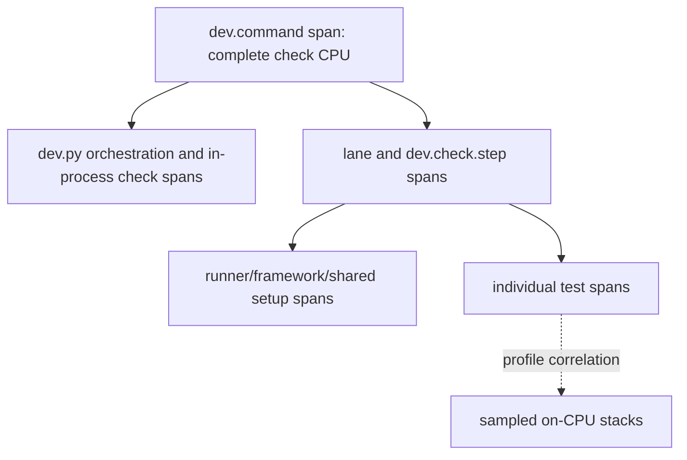

# Profile `dev.py check` CPU work and identify redundant QA coverage

## Goal

Reduce the **total CPU work** performed by the complete QA suite without optimizing for wall time and without weakening meaningful regression coverage.

Extend the existing OpenTelemetry instrumentation with hierarchical CPU accounting for a real `./dev.py check --all` run, add a correlated flamegraph, attribute test-runner work as far as individual tests, and turn the largest costs into evidence-backed consolidation candidates. VictoriaTraces is the primary query/reporting surface for timing and CPU records; files are reserved for profiler payloads, coverage sets, and portable report exports that do not fit sensibly in span attributes. Deliver the first baseline and candidate dossier; do not delete tests merely because they execute the same lines.

## Observed journey

- The normal journey is one reliable command, `./dev.py check`, which fans out the whole product QA suite across parallel lanes.
- Its intentional parallelism drives high CPU utilization and has already been optimized for wall time.
- Existing output reports wall-clock time by step/lane, not consumed CPU work or individual-test cost.
- The desired outcome is a work audit: find expensive checks/tests that add little protection beyond other coverage, then remove only proven redundancy.
- Primary profiling host is macOS arm64; Linux/CI should either work through an explicit backend or report an unsupported capability rather than fabricate zeroes.

## Verified findings

- `cmd_check` launches one thread per active lane and runs lanes concurrently (`dev.py::_lane_targets`, `cmd_check`).
- `run_step` is the shared subprocess boundary for most commands and already owns process-group launch, timeout handling, step wall timing, output capture, and trace spans (`dev.py::run_step`).
- Some checks execute inside the `dev.py` process or bypass `run_step`, notably task/spec checks and `check_allium`; they need explicit accounting rather than being silently omitted.
- The current lane inventory is Rust tests/codegen, clippy, rustfmt, TypeScript, ESLint/stylelint, Vitest, ast-grep plus Rust timing lint, Allium, spec shape plus `tests/devpy`, spec anchors, E2E, task validation, and the lockfile tripwire (`dev.py::_LANE_DEFS`, `_lane_targets`).
- Rust uses nextest when available. Its one-process-per-test execution boundary is suitable for per-test resource wrappers; plain `cargo test` is not equivalent and must be labeled lower-granularity or rejected by the detailed profiling mode.
- Vitest has no profiling or coverage reporter configured (`ui/vitest.config.ts`, `ui/package.json`). Tests execute in worker processes, so per-test worker CPU windows require runner hooks; coordinator CPU alone is insufficient.
- `tests/e2e/run.py` reports scenario wall time but not CPU. Its long-lived Phoenix server is shared across scenarios, so per-scenario accounting must sample cumulative harness/server CPU at scenario boundaries and keep shared startup/teardown separate.
- The repository has roughly 2,751 Rust test annotations, 1,999 Vitest cases across 130 files, and 238 Python `unittest` methods. A naive rerun-once-per-test coverage strategy would multiply suite work unacceptably.
- No repo-integrated `cargo llvm-cov`, Rust mutation runner, Vitest coverage command, or test-level coverage matrix exists. Optional Vitest coverage packages appear only as lockfile peers, not configured dependencies.
- macOS provides cumulative per-process CPU accounting and installed sampled profilers (`samply`, Instruments/xctrace). Exact CPU totals and sampled stack flamegraphs are different evidence and must not be represented as one metric.

## Measurement model

“Millicores” are an instantaneous rate. The additive measure of work is **CPU time**, reported as `cpu_ms` / core-seconds. A flamegraph distributes sampled on-CPU stacks; it does not provide exact accounting. The report must present both without conflating them.

Use the existing `dev.command` → `dev.check.step` trace as the backbone, extending it to a non-overlapping hierarchy:



The current `_DevTracing.start_span` parents every span directly to `dev.command`; extend its API to accept an explicit parent/context so lane, step, shared-overhead, and test spans form the hierarchy above. Propagate W3C trace context plus lane/step identity into runner subprocesses and their profiling wrappers rather than reconstructing parentage from timestamps after the run.

Each value carries a provenance tag:

- `exact_process_tree`: cumulative user + system CPU from a dedicated wrapper which waits for its command and descendants;
- `exact_process`: cumulative CPU for one process;
- `windowed_process`: process CPU delta while one logical test/scenario is active, including any same-process background work;
- `sampled_stack`: profiler sample weight, never summed as exact CPU;
- `unattributed`: measured parent cost not safely assignable to a child test, such as discovery, module initialization, worker setup, server startup, or teardown;
- `unavailable`: capability gap; never encoded as zero.

Parent totals are inclusive. Child rows partition or explain a parent but are never added to the parent again. Reports must expose reconciliation error: `parent cpu - attributed children - explicit shared/unattributed cpu`.

## Proposed scope

### 1. Extend existing tracing into an opt-in work profiler

Add a discoverable mode such as:

```bash
./dev.py check --all --profile-work
```

The mode extends the tracing already initialized by `_start_dev_command_tracing` and emitted to the configured `PHOENIX_DEV_TRACE_ENDPOINT` (local VictoriaTraces by default). Normal `./dev.py check` behavior and dependencies remain unchanged. Profiling mode should:

- preserve the production QA topology and concurrency rather than serializing to simplify measurement;
- keep `dev.command` as the root and add true child spans for lane, step, shared runner overhead, and tests;
- enrich `dev.command` and existing `dev.check.step` spans with cumulative user CPU, system CPU, total `cpu_ms`, accounting provenance, tree-closure state, and reconciliation fields;
- attach host/tool versions, git SHA, dirty state, lane selection, compiler-cache state, test concurrency, profiler sampling rate, and artifact paths to the command span or bounded child metadata spans;
- propagate trace context into subprocess wrappers so per-test spans are descendants of the owning step, including when tests run concurrently;
- use a dedicated resource wrapper for each `run_step` subprocess tree so parallel siblings cannot contaminate one another’s CPU counters;
- use thread/process CPU clocks for in-process lane work, and route subprocess-shaped exceptions through the common measured boundary where practical;
- retain existing timeout, output, failure, and process-group semantics;
- provide bounded TraceQL queries/report generation that derive the CPU ledger directly from the trace and link to profiler/coverage artifacts;
- write high-volume/non-span artifacts only under ignored `target/check-profile/<trace-id>/`.

Do not introduce a second authoritative timing event model. A small local export may serialize queried span rows for portability, but trace/span identity and attributes remain authoritative for timing and CPU accounting. Coverage bitsets and sampled-profiler payloads remain files because they are too large and structurally inappropriate for OpenTelemetry attributes.

The wrapper must include its command process and waited descendants, detect surviving/detached descendants before finalization, and label incomplete tree closure. Validate the OS accounting behavior with synthetic CPU burners, parallel siblings, a short-lived grandchild, and a deliberately detached child.

### 2. Attribute test work at runner-native boundaries

#### Rust / nextest

- Use an ephemeral nextest run-wrapper configuration in profiling mode so each test invocation is measured independently without changing test source.
- Identify tests from nextest/test invocation metadata rather than parsing human output.
- Record each test process tree’s user/system CPU, wall time, status, retry/attempt, package, binary, and test name.
- Keep nextest/cargo discovery, scheduling, and shared runner overhead as explicit remainder under the Rust test step.
- Detailed per-test mode requires nextest. If only libtest is available, report step/binary granularity and a visible capability warning; do not claim individual-test precision.

#### Vitest

- Add profiling-only setup/reporter hooks that record `process.cpuUsage()` deltas around individual tests inside each worker.
- Give every record a stable file + suite + test identity and worker PID; record retries and concurrent tests explicitly.
- Measure worker/module setup, `beforeAll`/`afterAll`, discovery, transform, and coordinator overhead separately where hooks permit, with the remaining CPU shown as shared/unattributed.
- Do not claim that a test window excludes leaked async/background work; provenance is `windowed_process`.

#### Python dev.py tests and E2E

- Use a profiling `unittest` result class to record process CPU plus waited-child CPU deltas for each sequential test.
- Instrument E2E scenario boundaries to separate harness CPU, long-lived Phoenix server CPU, startup, and teardown. Attribute only CPU deltas observed during a scenario; keep shared service costs separate.
- Preserve existing normal output when profiling is disabled.

### 3. Produce sampled stacks and flamegraphs

- Provide a documented sampled-profiler backend for the complete concurrent command on macOS, preferring the already-installed `samply` when it can follow launched descendants; probe and fail with an actionable message if unavailable.
- Save the raw profile in a standard viewable format and generate/open instructions rather than coupling the check command to a UI server.
- Include command arguments/test identities where safe so nextest test processes and lane tools can be distinguished.
- Store the raw profile path and correlation metadata on the owning command/step spans. Prefer trace ID plus propagated span identity or explicit profiler markers over timestamp-only joins.
- Correlate process lifetimes with lane/step/test spans. The flamegraph explains hot stacks; span CPU attributes remain authoritative for totals.
- Keep profiler overhead visible by comparing at least three unprofiled accounting runs with profiled runs. Never use sampled-run CPU as the sole before/after savings claim.

### 4. Build a coverage-overlap and test-value dossier

Do not attempt thousands of one-test-at-a-time reruns.

- For Rust, evaluate LLVM source coverage collected during the already process-isolated nextest run. Associate per-process raw profiles with stable test identity, then reduce them into sparse source region/branch sets rather than retaining thousands of expanded reports indefinitely.
- For Vitest, add V8 coverage only if per-worker/test boundaries can be collected without rerunning the suite per case. Otherwise begin at test-file granularity and clearly state that limitation instead of manufacturing test-level uniqueness.
- For Python/E2E, use scenario/test-level tracing only where it can be captured in the same run; user-journey and cross-boundary distinctions remain first-class even when source lines overlap.
- Rank candidates using CPU cost, uniquely covered regions/branches, overlap with other tests, assertion count/type, failure-mode or REQ anchors, and execution layer (unit/integration/E2E). Coverage overlap is a candidate generator, not deletion proof.
- For the highest-cost low-uniqueness candidates, run targeted mutation experiments or equivalent deliberate realistic faults against the claimed behavior. Record which remaining tests detect each mutation and whether they fail for the intended reason.
- Produce an initial reviewable dossier with at least the top 20 individual tests and top 10 shared/lane costs by CPU, plus a smaller set of concrete consolidation/deletion recommendations. Each recommendation names protected behavior, overlapping tests, unique coverage, mutation evidence, expected CPU saving, confidence, and risk.

### 5. Re-measure any approved reduction separately

This task’s default deliverable is instrumentation, baseline data, and recommendations—not bulk test deletion. If an obviously safe duplicate is removed while implementing the task, keep it as a separate commit and prove:

- the intended defect class remains caught by a named remaining test;
- targeted mutation evidence is unchanged or stronger;
- full `./dev.py check --all` still passes;
- median total CPU work improves across repeated unprofiled accounting runs, with raw samples retained;
- wall time may increase or decrease and is reported only as a secondary observation.

## Primary implementation surfaces

- `dev.py::_DevTracing`, `_begin_dev_span`, `_start_dev_command_tracing`, `_shutdown_dev_tracing`, `cmd_check`, `run_step`, `_finish_check_step_span`, in-process lane helpers, CLI parser, and tracing/check tests.
- A small reusable trace-aware command resource wrapper under `scripts/` with unit tests under `tests/devpy/`.
- Profiling-only nextest configuration/wrapper generated under `target/`; do not impose standing nextest behavior on normal runs.
- `ui/vitest.config.ts` plus a focused profiling reporter/setup module and tests.
- `tests/e2e/run.py` and the Python `unittest` runner boundary.
- Optional coverage reducers/report generation under `scripts/`, with versioned JSON schemas and fixture-based tests.

## Acceptance evidence

1. Running the opt-in profiler on a full suite produces one queryable trace whose `dev.command` root contains correctly parented lane, step, shared-overhead, and test spans, including:
   - exact whole-check, lane, and step CPU totals;
   - Rust individual-test CPU spans;
   - Vitest and Python individual-test CPU-window spans with honest provenance;
   - E2E scenario spans splitting harness/server CPU plus shared setup;
   - explicit shared/unattributed and unavailable values;
   - links to a raw sampled profile usable as a flamegraph and to coverage artifacts;
   - a ranked human-readable report derived from bounded TraceQL queries plus those artifacts.
2. Hierarchical totals reconcile within a documented tolerance and do not double-count children. Synthetic tests prove parallel sibling isolation and characterize short-lived/detached descendants.
3. Profiling disabled leaves normal check command shape, output semantics, lane concurrency, and pass/fail behavior unchanged.
4. At least three clean, unprofiled accounting runs and one sampled profile are retained for the baseline; raw samples are shown, not only averages.
5. The dossier distinguishes line/region overlap from assertion strength and includes targeted fault/mutation evidence before labeling any test redundant.
6. The first report identifies actionable CPU reduction opportunities while separately listing checks with high CPU but defensible unique coverage.
7. `./dev.py check --all` passes after the instrumentation work.

## Risks and explicit non-goals

- **Not a wall-time optimization:** do not reduce concurrency merely to improve attribution or optimize the critical path.
- **Not “coverage percentage goes up”:** aggregate coverage percentages are insufficient evidence for deletion.
- **Not an always-on profiler:** normal checks must not pay sampling, coverage, reporting, or new-tool startup costs.
- **Not exact stack accounting:** profiler stacks are sampled; exact CPU comes from OS cumulative accounting.
- **Not blind deduplication:** similar names, line coverage, snapshots, or hot stacks do not establish equivalent behavior.
- **Not a general observability platform:** build the smallest repeatable work-audit pipeline needed to rank and validate QA reductions.
- Compiler/cache warmness heavily affects compile/lint CPU. Record it and compare like-for-like rather than hiding it through averaging.
- Shared worker/server setup cannot always be honestly assigned to one test. Preserve it as explicit shared cost instead of prorating it arbitrarily.

## Initial baseline and candidate dossier

A successful full profiled run on macOS arm64 is retained locally at `target/check-profile/27fe2d71ac9340fe80123b53035f6990/` (5,131 records; 2,746 Rust tests, 2,096 Vitest tests, 253 dev.py tests, and 21 E2E role/scenario windows). Two additional full accounting runs are retained at `target/check-profile/d5d59175b39c4c10b0389ade1d6eaa4a/` and `target/check-profile/fd124a8a65ad497ba2c5d86648491d16/`; the former exposed one unrelated timing-sensitive Vitest failure while under profiler load, and the latter passed. A 23 MB Instruments Time Profiler recording is retained at `target/check-profile/sampled-baseline/full-check.trace`. The artifacts are intentionally ignored because they contain host-local paths and high-volume raw data.

### Step CPU ranking

| Step | Exact CPU work | Wall time | Initial interpretation |
|---|---:|---:|---|
| Rust test execution | 358.6 core-s | 85.5 s | Largest target; individual attribution available |
| Vitest | 124.2 core-s | 25.9 s | Second target; worker-window attribution available |
| Rust test compile | 31.9 core-s | 54.9 s | Shared build cost, not test redundancy |
| Codegen tests | 20.2 core-s | 11.4 s | Deliberately excluded from normal Rust test run; distinct side-effect contract |
| E2E | 19.6 core-s | 52.8 s | Distinct real-binary/API boundary; optimize scenarios only with journey evidence |
| Clippy | 19.5 core-s | 26.2 s | Static defect class, not test overlap |
| ESLint | 11.1 core-s | 14.9 s | Static defect class, not test overlap |
| musl smoke | 4.1 core-s | 8.6 s | Platform/build contract |
| Rust test timing lint | 3.5 core-s | 3.0 s | Static test-architecture guard |
| Stylelint | 2.4 core-s | 3.5 s | CSS defect class |
| dev.py unit tests | 2.0 core-s | 4.1 s | Individual attribution available |
| ast-grep | 2.0 core-s | 0.6 s | Structural defect classes |

### Highest-value investigations

1. **Git observation stress test — 16.2 core-s.** `observe_local_git_head_eventually_reports_consistent_snapshot_during_checkout` performs 400 real `git checkout` operations plus 200 observations. It is the single largest test and protects a real consistency race, so deletion is not justified. Investigate whether a deterministic seam can exercise the read-consistency algorithm while retaining one smaller real-git integration case.
2. **Wake race repetition family — about 11.0 core-s across five top cases.** The repeated cancel/expiry/terminal/transfer races each create fresh SQLite repositories ten times and assert related single-winner invariants. These are strong concurrency checks, not obvious duplicates. Candidate: factor a shared state-machine/property matrix or lower repeated integration count only after mutation/fault evidence shows equivalent loser/outcome coverage.
3. **Browser lifecycle family — at least 5.2 core-s in the top rows.** `cascade_last_restricted_owner...`, two `cascade_tears_down...` variants, and browser key/type tests launch browser resources. Similar teardown names suggest fixture/startup consolidation, but each ownership topology may be semantically unique; compare assertions before combining.
4. **Hard-delete latest-message boundary pair — 3.5 core-s.** The exact-ceiling accept and over-ceiling reject tests are adjacent boundary values and likely share expensive fixture creation. Preserve both outcomes; consolidate fixture/data setup rather than delete either assertion.
5. **Vitest output-accumulation case — 0.59 windowed core-s.** `ProcessInspectorPanel` scrollback-bound coverage is the highest UI test window in this run. Its semantic boundary appears unique; inspect rendering/setup overhead before treating it as redundant.
6. **E2E perf_stream scenario — 0.59 harness core-s plus server work.** It covers the real streaming boundary and should not be replaced by unit line overlap. Determine whether payload volume can shrink while preserving framing/backpressure assertions.

### Explicitly not deletion candidates from CPU data alone

- Codegen vs normal Rust tests: the check already excludes `export_bindings` from the normal run, so the 20.2 core-s is not duplicate execution.
- Compile, clippy, format, lint, spec, and platform lanes protect distinct build/static contracts even when they touch the same files.
- Concurrency stress and real-browser/E2E tests may have high source overlap with unit tests while uniquely covering scheduling, process, protocol, or platform behavior.

### Coverage/mutation status

The profile ranks candidates without rerunning each test. Per-test LLVM/V8 coverage collection is not enabled by the normal profile because doing so would materially alter CPU work and toolchain behavior. Before deleting or reducing any candidate above, collect focused source coverage for that candidate family and introduce a deliberate fault at the asserted invariant; retain the change only if a named remaining test fails for the intended reason. No tests were deleted in this task.

### Sampled-profile finding

`samply` cannot launch and retain a Mach task port for the system-signed Python used by `dev.py` on macOS, so the executable probe fails with an actionable platform explanation. Instruments `xctrace` with the Time Profiler template successfully recorded a complete passing check run instead. The implementation therefore recommends xctrace on macOS rather than claiming the installed samply backend works for this command tree.
