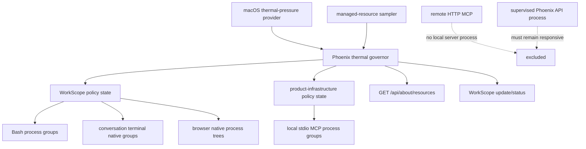

# Add a safety-first macOS thermal governor for Phoenix-owned workloads

## Observed journey

A user can run several conversations and Work-mode subagents concurrently. Each can start CPU-intensive commands such as Cargo builds through the Bash tool or a conversation terminal. Browser sessions and local stdio MCP integrations can also create local process trees. macOS manages its own fans and hardware protection, but Phoenix currently has no product-level thermal-pressure policy coordinating the workloads it launches.

The requested behavior is:

- report the safe thermal information macOS makes available;
- reduce Phoenix-generated load when the host is thermally stressed;
- coordinate work at the persisted WorkScope boundary where that ownership exists;
- leave fan control to macOS rather than writing undocumented SMC state;
- never claim that unavailable raw sensor values are zero or that best-effort scheduler hints are hard CPU quotas.

This task concerns processes launched or adopted by **phoenix-ide the product**. The command's purpose or repository is irrelevant: a Phoenix repository build run through Phoenix's Bash tool or conversation terminal is governed because Phoenix owns that process tree. A command launched independently from a host shell—including direct use of `dev.py` outside Phoenix—is not governed, and this task does not add coordination logic to `dev.py`.

## Verified findings

### Product workload ownership

- Every tool invocation receives the runtime's persisted `ResourceScopeKey` and authority through `ToolContext` (`phoenix-ide::runtime::executor` and `phoenix-tools::ToolContext`).
- A command invoked through the Bash tool—including `cargo build`, `cargo check`, tests, or deployment commands—is launched as `bash -c`, made a process-group leader with `setpgid(0, 0)`, and registered under its WorkScope with PID, PGID, creator conversation, and authority (`phoenix-tools::bash::operations`, `bash::handle`, and `bash::registry`). Group signaling already controls descendants that remain in the group.
- Work-mode subagents inherit the parent's WorkScope. Authority remains meaningful: restricted actors cannot control arbitrary same-scope resources. Thermal policy must be system-owned and must not accidentally become a user-facing authority bypass.
- Conversation terminal resources are WorkScope-keyed. Shell-mode terminal native processes are already sampled, while tmux server native identity is not fully surfaced.
- Browser sessions are keyed by WorkScope/session identity, but `BrowserSession::launch_and_init` delegates process creation to `chromiumoxide::Browser::launch`. Phoenix retains the browser/CDP object but no typed root PID, start identity, PGID, or descendant inventory. Existing close/kill behavior is therefore logical lifecycle control rather than independently verifiable native-tree control.
- Local stdio MCP servers are launched by `phoenix-mcp::StdioTransport::spawn` and retain a `tokio::process::Child`, but no dedicated process group is created and no native identity is exported. The MCP manager is product-global rather than WorkScope-owned. Remote HTTP MCP servers create no local server child.
- The deployment resource endpoint explicitly reports Browser and MCP native attribution as unavailable. That is an implementation gap in identity propagation, not evidence that Phoenix did not launch the local processes.

### macOS control capabilities

- macOS exposes supported public scheduling controls such as nice/`setpriority` and QoS/task-policy hints, but it does not expose a supported public facility that gives a third-party process Linux-cgroup-style CPU shares or quotas over arbitrary WorkScope process trees. OS-internal coalitions are not an application-controlled cgroup substitute, and user-space quota approximations depend on periodic process suspension, which this design forbids.
- Process groups provide native ownership and a target over which supported scheduler policy can be applied; they are not scheduler quotas.
- `setpriority`/nice and macOS task policy/QoS are therefore the applicable best-effort controls, not hard limits.
- Phoenix must not stop or suspend workloads as a thermal response. macOS remains responsible for fan control, thermal throttling, and emergency hardware protection.
- Raw temperatures and fan writes are not available through a stable, public API across supported Intel, T2, and Apple Silicon machines. Privileged utilities and direct SMC access are model-specific and can conflict with macOS's own cooling controller.

### Existing telemetry surface

- `GET /api/about/resources` already supplies fresh host and managed-process telemetry, uses explicit unavailable categories, and is polled while the About page is visible.
- WorkScope inventory and health already reach the conversation UI by pull plus `WorkScopeUpdate` SSE.
- Resource sampling already has deduplication, short freshness leasing, and native PID/start-identity safeguards that new thermal and child-process inventory must preserve.

## Owning invariants

1. **The operating system owns cooling.** Phoenix never writes fan speed, SMC keys, firmware state, or thermal trip points.
2. **No fabricated telemetry.** Thermal pressure and raw temperature are distinct typed capabilities. Unsupported raw temperature is unavailable, never `0`, inferred, or relabeled from pressure state.
3. **Only Phoenix-owned native processes are controlled.** A control target must carry typed ownership plus PID-reuse-safe native identity; no command-line matching, cwd matching, or guessed ancestry may authorize signaling.
4. **Scope and infrastructure remain distinct.** WorkScope-owned workloads receive per-scope policy. Product-global subprocesses such as stdio MCP servers receive only a product-infrastructure policy. The supervised Phoenix API process and remote HTTP MCP compute are not conversation control targets.
5. **Thermal response is system authority, not conversation authority.** Applying scheduler policy must not expose cross-conversation process control through tool APIs.
6. **Workloads are never stopped for thermal management.** The governor may adjust best-effort scheduling priority/QoS only; it must never use `SIGSTOP`, suspension, periodic pausing, or duty-cycle execution.
7. **Best effort is labeled best effort.** Phoenix must not describe nice/QoS as a cgroup, CPU quota, or guaranteed CPU percentage.
8. **macOS thermal response is the primary capability.** MacBooks are the primary deployment target for this feature. macOS pressure/provider gaps, unavailable native identities, failed policy application, and partial descendant coverage are represented in typed status and logged at debug level or above. Other operating systems continue operating without thermal intervention; cross-platform thermal policy is not required by this task.

## Interaction map

## Proposed scope

### 0. Define success and ship observation before intervention

Implement the macOS provider, native ownership inventory, decision engine, and UI in **observe-only mode first**. In this mode Phoenix samples real thermal pressure, identifies eligible native targets, and records the scheduler-policy action it would take, but makes no process policy changes. Enforcement must remain behind an explicit disabled-by-default capability until the observation phase meets the acceptance gates below.

#### Success metrics and enforcement gates

1. **Ownership correctness:** in integration scenarios for Bash, shell terminal, Browser, and local stdio MCP, every reported native target maps to its typed Phoenix owner and current PID/start identity; no unrelated process is ever reported as eligible. Any unsupported Chrome/tmux descendant topology is counted as uncovered rather than guessed.
2. **Observe-only safety:** native syscall spies and macOS integration tests show zero nice, QoS, stop, suspend, signal, or kill effects originating from thermal decisions while observe-only mode is active. Ordinary explicit lifecycle cleanup remains unchanged.
3. **Decision correctness:** deterministic thermal-provider tests produce the specified nominal/elevated/restored decisions, including hysteresis, with no flapping or duplicate actions. Dry-run decisions name the intended policy delta and target identity without applying it.
4. **Telemetry completeness:** every macOS sample reports pressure state or an explicit unavailable reason, sampling time, governor mode (`observe_only` or `enforcing`), eligible/covered target counts, and proposed/applied action. About Deployment retains the last good sample as stale on failure.
5. **Bounded overhead:** before enforcement, measure governor CPU, memory, sampling latency, and resource-endpoint latency under representative idle and multi-WorkScope load. Set and document numeric regression budgets from that baseline; enforcement cannot be enabled if continuous sampling materially increases host pressure or causes the existing resource endpoint to miss its approximately one-second visible refresh cadence.
6. **Enforcement targeting:** with the native-policy layer faked, every elevated-pressure action changes only eligible Phoenix-owned targets and restoration changes only policy previously changed by the governor. PID/start mismatch and capability failure are safe no-ops with visible reasons.
7. **Real macOS validation:** on supported Intel and Apple Silicon test hosts where available, verify the OS accepts the selected nice/QoS operation, descendants receive the documented effective policy coverage, Phoenix remains responsive, and workloads continue making progress. Thermal-pressure reduction is an evaluated outcome, not a promised hardware-temperature threshold; if observation shows that a control has no useful effect, do not enable it.

Capture observe-only counters and transition traces without high-cardinality per-sample logging. The implementation/PR must include the measured baseline, selected budgets, test-host coverage, uncovered native-resource categories, and evidence supporting any transition from observe-only to enforcement. If those gates are not met, ship telemetry and dry-run status only.

### 1. Specify the policy before implementing it

Add timeless requirements and an Allium behavioral spec because this is a stateful, multi-step safety controller with ordering and recovery obligations. Define:

- typed macOS thermal-pressure states, including unavailable;
- nominal, elevated-pressure, and unavailable governor states;
- entry/exit hysteresis so scheduler policy does not flap around a pressure boundary;
- target eligibility and the distinction between WorkScope workload and product-global subprocess infrastructure;
- spawn, exit, shutdown, cancellation, and policy-restoration transitions;
- status/freshness semantics;
- explicit non-guarantees around raw temperature, CPU quotas, and hardware condition.

Resolve policy constants from evidence and tests rather than scattering timers through launch paths. Keep sampling and transition logic centralized.

### 2. Add a typed macOS thermal-pressure provider

Introduce a platform-gated provider using a stable OS API for macOS thermal pressure. It must:

- expose the OS state as a typed enum plus sampling time/capability status;
- avoid shelling out to privileged commands;
- avoid private SMC APIs and fan writes;
- return unavailable on unsupported systems or provider failure;
- be mockable for deterministic transition tests;
- sample at a bounded cadence owned by the governor, with cancellation on shutdown.

If no stable raw-temperature API is available on a supported machine, report raw temperature as unavailable. Do not add a dependency on a privileged third-party sensor or fan utility.

### 3. Normalize Phoenix-launched child ownership

Create a shared typed native process-tree identity/control abstraction rather than parallel PID/PGID shapes in Bash, terminal, Browser, MCP, and deployment sampling. It should carry only data needed by distinct consumers, including:

- owner class: `WorkScope` or product infrastructure;
- resource kind and stable resource identity;
- root PID plus start identity for PID-reuse protection;
- process group/session identity where Phoenix establishes one;
- supported controls and explicit unsupported reason.

Integrate existing Bash process groups and shell-mode terminals first without weakening their authority or cleanup behavior.

For Browser:

- make native root identity available at the actual Chrome spawn boundary;
- establish a dedicated native control boundary compatible with Chrome/chromiumoxide on macOS;
- expose a live inventory from `BrowserSessionManager` keyed to the existing session/WorkScope owner;
- verify descendant membership rather than assuming all Chrome helpers remain in one PGID;
- unify explicit stop, idle reap, cascade cleanup, and shutdown on one strong lifecycle path with graceful close followed by bounded native escalation;
- update deployment attribution only when native identity is authoritative.

If `chromiumoxide` cannot expose/configure the launch boundary safely, adapt or upstream the minimal launch API rather than discovering Chrome by command line or profile path.

For MCP:

- distinguish `LocalStdio` structurally from `RemoteHttp` at the native-control layer;
- place each stdio child in a dedicated process group at spawn and retain PID/start/PGID identity;
- terminate the group, not only the direct child, on replacement, stale connection, reload removal, recovery, and shutdown;
- expose stdio identities as product infrastructure, not falsely as the calling WorkScope;
- never treat remote HTTP server compute as a local control target.

### 4. Implement a conservative macOS governor

Do not attempt a fake cgroup API. Run the same decision engine in observe-only and enforcing modes so dry-run behavior cannot drift from enforcement. Only the native-policy effect boundary differs: observe-only records the proposed change, while enforcing mode may apply it after the success gates are met.

Implement the macOS thermal-pressure response using best-effort scheduler policy:

- **Nominal:** leave eligible Phoenix-owned workloads at their ordinary scheduling policy while continuing thermal sampling and accounting.
- **Elevated pressure:** apply a lower-priority nice and/or supported macOS QoS/task policy to eligible running native process trees. Do not stop, suspend, duty-cycle, or kill work as a thermal response.
- **Recovered:** after hysteresis establishes a sustained safer pressure state, restore only policy changes made by this governor, after PID/start-identity revalidation.
- **Unavailable:** do not intervene; expose that macOS thermal state or native targeting is unavailable rather than inferring pressure from CPU usage.

Policy applies to eligible Phoenix-owned native workload, not to commands classified by parsing arbitrary shell strings. Measured CPU may inform which owned process trees receive lower priority, but it must not be presented as exact workload classification or a quota. The supervised Phoenix API process remains responsive and is never reprioritized as a conversation target.

Fairness and status aggregation are per `WorkScopeId`, not per conversation, because Work-mode subagents and continuations intentionally share work resources. Restricted-resource authority still applies to user/tool control; governor control remains internal system authority.

### 5. Surface status without duplicating semantics

Extend the existing resource surfaces rather than creating a disconnected dashboard:

- About Deployment host resources: macOS thermal pressure, capability, freshness, governor mode (`observe_only` or `enforcing`), proposed/applied policy state, affected WorkScope counts, and partial-coverage reasons.
- WorkScope UI: concise inline state when that scope is thermally deprioritized or returning to ordinary policy; distinguish thermal intervention from ordinary tool waiting.
- Logs/traces: transitions, reason, target count, policy action, failures, and duration, without noisy per-sample logs.

Preserve the existing stale-last-good-value behavior and approximately one-second visible resource-page refresh. Regenerate Rust-to-TypeScript wire types rather than hand-editing generated files.

## Validation

### Pure/state-machine coverage

- Every pressure transition, hysteresis boundary, unavailable-provider transition, and policy-restoration path produces the same decision in observe-only and enforcing modes.
- A target exiting or changing start identity between observation and scheduler-policy application is never modified.
- Only nice/QoS policy changes made by the governor are restored.
- Repeated identical samples/actions are idempotent.
- A WorkScope with multiple conversations/subagents is governed once as one scope.
- Restricted actor authority cannot be used to gain cross-resource control.
- Observe-only mode emits no native policy effects, and no thermal transition in either mode emits stop, suspend, kill, or duty-cycle effects.

### Native process integration coverage

On macOS, with deterministic provider and native-policy fakes for ordinary test runs:

- Bash descendants remain attributable through their existing group and receive/restored scheduler policy without being suspended.
- Browser root and helper processes are inventoried and terminated through unified lifecycle cleanup; unsupported descendant topology is reported rather than assumed.
- Stdio MCP descendants are killed on ordinary shutdown/reload/recovery, while HTTP MCP creates no native target; thermal response itself never kills either transport.
- PID reuse/start-identity mismatch causes a safe no-op plus a capability/error status.
- Phoenix API responsiveness and governor cancellation are maintained under elevated thermal pressure.
- Non-macOS builds and deployments retain existing behavior without requiring a thermal provider or governor effects.

### User journey coverage

1. Start CPU-intensive Bash work in two WorkScopes, including a Work-mode subagent sharing one scope.
2. Drive the mock macOS thermal provider from nominal to elevated pressure in observe-only mode.
3. Verify Phoenix reports the exact policy it would apply to eligible native workloads in the two WorkScopes, does not double-count the subagent, and performs no native policy syscall.
4. Repeat through the fake enforcing boundary and verify it deprioritizes only those eligible workloads without suspending work.
5. Verify About Deployment reports fresh host pressure, observe/enforce mode, proposed/applied action, and coverage gaps.
6. Return to a safer state and verify hysteretic recovery proposes/restores only scheduler policy attributed to the governor.
7. Exercise Browser and local stdio MCP lifecycle cleanup while thermal policy is active; verify remote HTTP MCP and the Phoenix API process are not conversation targets.

Run focused crate/UI tests, macOS integration tests, codegen, spec validation, and `./dev.py check`.

## Risks

- Browser launch ownership may require a narrow chromiumoxide API change or replacement of its implicit spawn path.
- Chrome helpers may not all remain in one process group; descendant control must be verified on supported macOS architectures.
- Nice/QoS policy is advisory and may not reduce heat immediately; Phoenix must defer to macOS's own thermal throttling and hardware protection rather than escalating to workload suspension.
- Persisting native identities across server restart is dangerous without start-identity revalidation. Recovery should favor safe policy reconciliation over modifying uncertain PIDs.
- MCP stdio servers are shared infrastructure; attributing their CPU to whichever conversation happens to call them would be misleading.
- Thermal state protects against sustained product-generated pressure but cannot guarantee hardware health or a specific temperature.

## Explicit non-goals

- Direct fan control, SMC writes, firmware manipulation, or privileged sensor utilities.
- Claiming raw numeric temperature when only thermal-pressure state is available.
- Stopping, suspending, duty-cycling, or killing workloads as a thermal-pressure response.
- Claiming Linux-cgroup-equivalent quotas or exact per-scope CPU percentages on macOS.
- Implementing equivalent thermal-pressure providers or scheduler policy on Linux or other non-macOS hosts.
- Governing commands launched outside the running Phoenix product, including direct host-shell use of `dev.py`; the same commands are in scope when Phoenix launches them through an owned Bash or terminal resource.
- Governing unrelated user processes.
- Attributing remote HTTP MCP server compute to the local host.
- Treating the supervised Phoenix API process as a conversation workload.
