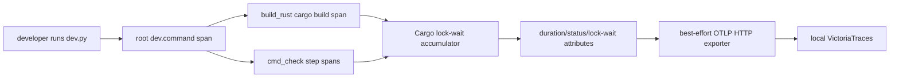

# Persist dev.py build timings to local VictoriaTraces

## Observed journey

A developer runs `./dev.py check`, `up`, or `restart` and sees elapsed build/check timings only in terminal output. In particular, `cmd_check.run_step` recognizes Cargo's `Blocking waiting for file lock` output and may print `X spent N seconds blocked on a cargo file lock`, but the measured `lock_wait` is discarded when the process exits. There is therefore no durable way to compare recurring dev-time costs or inspect which checks were actually compiling versus waiting for Cargo's shared target lock.

The intended destination is the local VictoriaTraces instance, not Datadog. Tracing must remain lightweight and must never turn an unavailable collector into a failed or materially delayed development command.

## Verified findings

- `dev.py` is a PEP 723 `uv` script whose only standing dependency is currently `taskmd`; optional `rich` is bootstrapped separately for `--pretty`.
- `cmd_check` already measures the whole check, each step's wall time, return code, lane, timeout state, and Cargo lock wait. The cache-lock timing is local to the nested `run_step` and only reported when it is at least one second.
- `up` and `restart` both call `build_rust`, which runs `cargo build --release` directly and records neither elapsed time nor Cargo lock wait. Thus instrumenting only `cmd_check` would miss a primary developer build journey.
- Production-build commands have separate subprocess orchestration and are not needed to make the common local loop observable.
- The host's VictoriaTraces process listens on `127.0.0.1:10428` for HTTP and `127.0.0.1:4317` for OTLP gRPC. Its own warning log confirms direct OTLP/HTTP ingestion at `http://127.0.0.1:10428/insert/opentelemetry/v1/traces`. The configured service is currently capable of entering read-only mode when its minimum-free-disk guard trips; exporter failure therefore must be non-fatal and validation must confirm writable ingestion rather than merely a listening socket.
- OpenTelemetry Python's HTTP/protobuf exporter needs only `opentelemetry-sdk` and `opentelemetry-exporter-otlp-proto-http`; it avoids the heavier gRPC transport and does not involve Datadog.

## Interaction map

Spans are the durable record; stdout remains immediate human feedback. There is no application database persistence, reconnect queue, or cross-process trace propagation in this scope.

## Proposed scope

### 1. Add a deliberately small dev tracing boundary

Add pinned-compatible PEP 723 dependencies for the OpenTelemetry SDK and OTLP HTTP/protobuf exporter. Introduce a small, dev.py-local tracing setup/teardown boundary that:

- uses a distinct low-cardinality service name such as `phoenix-dev`;
- defaults local interactive runs to VictoriaTraces' direct OTLP/HTTP endpoint at `http://127.0.0.1:10428/insert/opentelemetry/v1/traces`;
- supports an environment override and an explicit `off` value so another local endpoint can be selected or tracing can be disabled without code changes;
- is disabled by default in CI;
- applies a short export timeout, batches/flushes once at command shutdown, and treats connection, HTTP, read-only-storage, and shutdown errors as diagnostic-only rather than changing the command's exit status;
- initializes only after verbatim passthrough handling so `taskmd` and `drive-turn` retain their existing argument/exec semantics.

Keep this specific to OTLP HTTP. Do not copy Phoenix server's Datadog/OTLP exporter selection machinery.

### 2. Emit a bounded span model for the common dev loop

Create one root `dev.command` span around normal argparse-dispatched commands with bounded attributes for command name, success/failure/cancellation, and total duration. Under it:

- emit `dev.build` around `build_rust` for `up` and `restart`, including build profile, exit status, elapsed seconds, and `cargo.lock_wait_seconds` (including zero, so absence is not ambiguous);
- emit `dev.check.step` for each `cmd_check.run_step`, including stable step/lane names, exit status, timeout state, elapsed seconds, and `cargo.lock_wait_seconds`;
- preserve the existing terminal reporter and failure behavior exactly.

Do not attach command output, filesystem paths, environment values, source content, or full argument vectors to spans. Do not instrument every helper/subprocess in `dev.py`; root/build/check-step visibility is the smallest useful system.

### 3. Make Cargo lock timing reusable and testable

Extract the existing line-driven Cargo lock-wait accounting from `cmd_check.run_step` into a small helper that can be used by both check steps and `build_rust`. Preserve streamed Cargo output for `up`/`restart` while observing lock messages; do not switch those builds to fully buffered output.

The helper must correctly account for:

- one or multiple `Blocking waiting for file lock` intervals;
- acquisition indicated by the next output line;
- a process that exits or is terminated while still blocked;
- monotonic timing and a non-negative duration bounded by the subprocess wall time.

The existing one-second threshold remains only a stdout presentation choice; traces record the measured value even below one second.

### 4. Add focused regression coverage and end-to-end verification

Add dev.py tests using fake clocks/exporters/subprocess streams to prove:

- Cargo lock intervals are accumulated correctly, including an open interval at process exit;
- build and check-step spans carry elapsed, status, timeout where applicable, and lock-wait attributes;
- disabled tracing is a no-op;
- exporter failures do not alter a successful command's result and do not mask an existing command failure;
- CI does not export unless deliberately overridden by the selected configuration contract.

Then perform one local smoke journey against a writable VictoriaTraces instance:

1. run a bounded `dev.py` command that exercises a build/check step;
2. query Tempo/TraceQL under `http://127.0.0.1:10428/select/tempo` for `service.name = "phoenix-dev"`;
3. inspect the full identified trace and confirm the root/child hierarchy and numeric duration/lock-wait attributes;
4. stop or make the endpoint unreachable and confirm the same command still completes with its original exit semantics and without a long shutdown stall.

## Acceptance criteria

- Common `check`, `up`, and `restart` timing is queryable in VictoriaTraces as bounded OTLP spans.
- The currently ephemeral Cargo lock-wait statistic is present numerically on relevant build/check spans, including values below the stdout threshold.
- Tracing never exports command output or other high-cardinality/content-bearing payloads.
- Collector absence or rejection does not fail or materially delay `dev.py`.
- Existing stdout/pretty reporting and subprocess exit behavior remain unchanged.

## Risks and non-goals

- **Risk:** PEP 723 dependencies add a one-time `uv` resolve/download and a small cached startup cost. Measure the no-op command startup before/after and avoid automatic instrumentation packages.
- **Risk:** synchronous per-span export would distort the timings being measured. Export spans in a bounded batch at shutdown instead.
- **Environment note:** the local VictoriaTraces warning log has reported read-only storage due to its free-disk guard. Freeing space or adjusting that local service is required for smoke-test persistence, but managing VictoriaTraces storage is outside this task.
- No Datadog exporter or compatibility layer.
- No OTLP metrics/log export, dashboards, alerting, or collector installation/configuration.
- No trace-context propagation into Cargo, pnpm, Phoenix server processes, or CI jobs.
- No comprehensive instrumentation of production deploy, release, QA, graph generation, seeding, task management, or every subprocess in `dev.py`.
