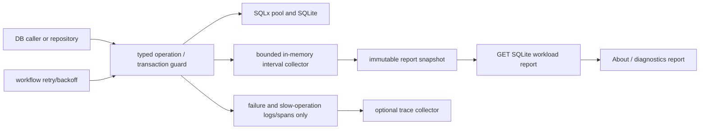

# Add comprehensive SQLite workload attribution

## Observed journey

- In production, SQLite becomes saturated and intermittently unresponsive.
- Existing observability reports selected failures and slow operations, including `fts.upsert` `SQLITE_BUSY`, but cannot show whether FTS causes material writer load or merely waits behind another subsystem.
- Operators need a simple local snapshot with selectable 1h, 6h, and 24h windows that attributes writer use, contention, and read load. It is computed from a fixed-size in-memory ring of aggregate counters, not from traces or a time-series database.

## Verified findings

- `crates/phoenix-db/src/sqlite_telemetry.rs` defines only eight `SqliteOperation` variants and constructs telemetry at roughly thirteen production call sites. Fast successes emit nothing; successful operations emit only after 100 ms pool wait or 250 ms transaction duration. Failures produce bounded log/trace events.
- SQLite access is much broader: direct `sqlx::query*` use spans `lib.rs`, `workflow.rs`, `workflow/wake.rs`, `workflow/direct_turn.rs`, `close_foundation.rs`, `git_repository_reconciliation.rs`, `retrieval.rs`, and migrations. A source census finds hundreds of query expressions and several manual `begin`, `BEGIN IMMEDIATE`, acquisition, commit, and rollback patterns.
- Busy handling is split across SQLx's configured five-second `busy_timeout` and workflow-level retry decisions (`is_sqlite_busy_retryable` and wake/direct-turn callers). Existing telemetry neither counts retry/backoff nor attributes most attempts.
- `Database::pool()` exposes the raw pool to retrieval, workflows, startup reconciliation, tests, and other consumers, so instrumenting only `Database` facade methods cannot establish comprehensive coverage.
- The on-disk pool uses WAL and multiple connections; in-memory tests use one connection. Concurrent read durations therefore must not be summed into writer occupancy.
- `/usage` is an existing analytics dashboard, while `/about` is the operator diagnostics surface with freshness/health conventions. No current endpoint exposes SQLite workload history.
- Trace export is optional and allowlisted. There is no local numeric SQLite collector or metrics backend. A report must not depend on an external collector being enabled or healthy.
- Production TraceQL had no `db.failure` matches in the bounded query attempted during exploration, which reinforces that exported spans cannot be the report's source of truth.

## Owning invariant

Every in-process SQLite attempt is assigned one bounded semantic category and one access kind, and contributes exactly once to the appropriate local aggregate. Writer occupancy includes only intervals during which an admitted write owns SQLite's single-writer position; it excludes pool wait, write-admission wait, busy timeout, retry backoff, caller work, and reads. Missing instrumentation remains visible as `other` or an explicit telemetry gap rather than being silently treated as zero.

## Metric contract (define normatively before implementation)

Add a small SQLite workload-attribution requirement set and executive status under a dedicated spec. Keep requirements timeless and run the spec authoring pre-flight before push. Do not add an ADR unless implementation uncovers a genuine policy choice that the requirements cannot own.

### Dimensions

Use closed enums/typed wrappers rather than arbitrary strings:

- Semantic category: `message_persistence`, `durable_workflows`, `fts`, `runtime_state`, `pr_project_data`, `maintenance`, `other`.
- Access kind: `read`, `write` (and, only if needed to preserve correctness, an explicitly non-capacity-bearing control kind).
- Outcome/error dimensions: success, SQLite `BUSY`, `LOCKED`, pool timeout, other timeout, and bounded other failure kinds. Preserve primary/extended SQLite codes internally where available without creating unbounded report labels.
- Operation names may remain a larger closed internal enum for coverage auditing, but the report groups by the stable category enum.

### Time boundaries

Use monotonic time for elapsed durations and integer Unix microseconds only for any new reported wall-clock timestamps.

For each attempt distinguish:

1. `pool_wait`: caller starts acquiring a pooled connection until acquisition succeeds/fails.
2. `write_admission_wait`: an acquired connection starts a write transaction/statement until SQLite admits the write, including time inside SQLite's busy handler before first successful admission. This is contention, not occupancy.
3. `writer_held`: successful admission until commit/rollback/autocommit write completion releases the writer. For a transaction, record the outer transaction envelope exactly once; nested statements must not add writer occupancy. For an autocommit write, record its admitted execution envelope once.
4. `read_connection_time`: successful read acquisition/execution envelope while its connection is held for the operation. Concurrent reads contribute connection-seconds and concurrency, not wall-clock writer occupancy.
5. `retry_backoff`: caller-controlled delay between attempts. It is contention impact, not SQLite occupancy.
6. End-to-end attempt/operation latency: reported independently so pool wait, admission wait, execution, and backoff remain reconcilable and are never relabeled as writer use.

If SQLx/SQLite cannot expose the exact instant write admission succeeds for an autocommit statement or `BEGIN IMMEDIATE`, report the measurable envelope with an explicit methodology/precision field; do not claim exact writer occupancy or fold busy wait into it. Prefer a structurally sound proxy (for example an admitted transaction guard whose lifetime ends on commit/rollback) over subtraction based on assumptions.

### Aggregation and boundedness

Keep the first version deliberately small:

- Record every success and failure into a fixed ring of one-minute, process-local aggregate buckets: 1,441 buckets (24 hours plus the active minute).
- Each bucket contains fixed arrays indexed by the closed category/outcome enums, plus fixed-bin latency histograms. There are no dynamic labels, stored events, SQL records, query language, background compaction, or persistence. This is not a time-series database.
- Do not read traces to build the report. Traces remain sparse incident evidence and may be disabled; the in-memory ring is the report source.
- Do not emit one span/log event per successful statement.
- Attribute counts and latency samples to the completion minute. Split writer-held and read-connection durations across the minute buckets they overlap so selectable-window occupancy is not inflated at boundaries.
- Snapshot the ring without holding locks across SQLite or API awaits. Prefer one short synchronous critical section or fixed atomic counters; benchmark the choice rather than introducing queues, async workers, or a metrics framework.
- The ring resets on process restart. Do not persist it anywhere, especially not into the SQLite database being measured.

### Report formulas

For requested window `W` clipped to available complete/active bucket coverage:

- Writer occupancy by category = non-overlapping `writer_held` duration attributed to that category divided by observed wall time. The total must not be calculated by summing overlapping caller envelopes. With a correct single-writer guard, category durations should be mutually exclusive and total occupancy must be <= 100%, apart from explicitly bounded bucket/clock precision.
- Contention by category = pool-wait and write-admission-wait histograms/percentiles, `BUSY`/`LOCKED` attempt counts, retry counts, retry-backoff duration, pool/write timeouts, and end-to-end latency percentiles.
- Read load by category = successful/error operation counts, read connection-seconds, duration percentiles, current/peak read concurrency. Make clear that summed connection-seconds can exceed wall time.
- Percentiles must report sample counts and return unavailable rather than fabricated zero when no samples exist.

### Minimal confidence fields

Keep confidence factual and compact. Return only:

- requested window, actual covered duration, and process uptime;
- whether restart truncated the requested window;
- classified operation count and `other` count/share;
- dropped/abandoned observation count, if nonzero.

Do not build exporter-health monitoring, a gap taxonomy, collector saturation states, schema negotiation, or a separate health subsystem in this first version. The UI shows unavailable rather than zero when the process has no samples for a metric.

### Privacy

Never collect, persist, log, export, or return SQL text/bindings, prompts, message content, paths, conversation/message/project/PR IDs, tool arguments, or call-site-derived user data. Category, closed operation identity, access kind, bounded outcomes/codes, timings, and aggregate counts are sufficient.

## Proposed implementation scope

### 1. Collector and typed instrumentation seam

- Replace/extend `SqliteTelemetry` with a cheap shared `SqliteWorkloadCollector` owned by `Database` and cloned with it.
- Introduce typed attempt/transaction guards whose construction encodes category and access kind and whose completion APIs encode success/failure, commit/rollback, retries, and backoff. Use drop only to record a bounded `abandoned`/gap outcome, not to infer successful completion.
- Preserve existing sparse failure/slow-operation logs and allowlisted spans as an alert/debug surface, fed from the same typed outcomes where possible; do not turn fast successes into spans.
- Add bounded histogram support or a purpose-built fixed-bin representation after measuring dependency/overhead tradeoffs.
- Prevent nested helpers (notably FTS inside message transactions) from double-counting transaction occupancy. Attribute one writer envelope according to a defined owning category while separately allowing bounded sub-operation counts if they do not masquerade as writer time.

### 2. Comprehensive access-path coverage

Inventory and classify all production SQLite access, including:

- message/conversation persistence and attachment/display-data work;
- durable workflow repository, wake, direct-turn, settlement, claims, schedules, and retries;
- runtime state/materialization and startup reconciliation;
- FTS reads, upserts, deletes, and reconciliation;
- PR, project, work-scope, git-repository reconciliation, auth/settings/admin data;
- migrations, checkpoints/cleanup, startup maintenance, and Coordinator read-only queries.

Refactor raw pool escape hatches so production consumers receive an instrumented repository/pool capability carrying the collector and category. Keep raw pool access structurally limited to migrations and test support, or require every constructed repository (`WorkflowRepository`, `WakeRepository`, `Fts5Retriever`, reconciliation helpers) to receive the shared collector. Add a source/compile-time coverage guard where practical so new raw production `sqlx` paths cannot silently bypass attribution.

Classify every access path deliberately; `other` is a visible temporary fallback, not a substitute for inventory. Count individual retry attempts while also preserving one logical-operation latency envelope.

### 3. API and operator report

- Add a read-only endpoint such as `GET /api/deployment/sqlite-workload?window=1h|6h|24h`, with a typed Rust response and generated TypeScript types. Reject unsupported windows structurally.
- Snapshot the in-memory collector only; the report endpoint must not query the measured SQLite database and thereby perturb its own report.
- Add a dense SQLite workload section to `/about`, not the user token-usage analytics page. Include a 1h/6h/24h selector, writer-occupancy breakdown, contention table, read-load table, and one compact coverage line (actual duration, uptime truncation, `other`, abandoned).
- Keep polling demand-driven/visibility-gated and non-overlapping if live refresh is added; a manual refresh is acceptable. Reuse existing settings/report styling and freshness conventions.

### 4. Preserve existing sparse observability

- Keep sparse `db.failure` and `db.slow_operation` events for incident correlation. Add only bounded category/access attributes consistent with the metric contract.
- Do not change or monitor the OpenTelemetry exporter in this task. The report neither reads from nor depends on traces.

## Interaction map

Persistence/recovery edge: collector history intentionally ends at process restart; the report states uptime and truncated coverage. SQLite remains authoritative for product data, never for its own workload buckets.

## Acceptance criteria

1. A normative metric contract defines all dimensions, clocks, interval boundaries, formulas, approximation limits, privacy exclusions, retention, restart behavior, and confidence semantics before report claims are implemented.
2. Every production SQLite access path is inventoried and either uses the typed collector seam or appears as a bounded explicit gap. A checked-in test/lint inventory prevents easy regression to silent raw access.
3. Every successful read and write operation contributes to a bounded local bucket without generating a per-success trace/log span.
4. Writer occupancy excludes pool wait, SQLite write-admission/busy wait, retry backoff, reads, and caller work; transaction statements do not double-count their enclosing writer hold.
5. Concurrent reads produce connection-seconds and peak concurrency without affecting writer occupancy. Tests demonstrate that connection-seconds may exceed wall time while occupancy remains <= 100%.
6. `BUSY` and `LOCKED` primary/extended outcomes, pool/write timeouts, retries, and backoff are attributed to semantic categories and reflected in counts/percentiles.
7. The 1h/6h/24h report returns actual coverage, uptime truncation, sample counts, `other` share, and any dropped/abandoned count. Missing data is unavailable rather than zero.
8. The report snapshot performs no SQLite query. A focused benchmark under representative fast read/write load demonstrates that the fixed-ring update is low-overhead and does not introduce async work or SQLite I/O.
9. API and UI tests cover all windows, invalid window rejection, no-data/restarted states, category ordering, percentile unavailability, and privacy-safe serialization.
10. Contention integration tests force pool exhaustion, `BEGIN IMMEDIATE`/autocommit writer contention, `SQLITE_BUSY`/`SQLITE_LOCKED` where supported, retry/backoff, rollback, abandoned guards, nested FTS/message work, and concurrent WAL reads, then assert attribution and non-double-counting.
11. Existing `db.failure` and `db.slow_operation` behavior remains available and privacy-safe. No SQL, bindings, IDs, paths, prompts, or contents appear in buckets, API responses, logs, or spans.
12. `./dev.py codegen`, focused Rust/UI tests, spec validation, and `./dev.py check` pass.

## Validation journey

- Start Phoenix with seeded data and open `/about`.
- Select 1h, 6h, and 24h; verify requested versus actual coverage and restart truncation.
- Generate ordinary reads, message persistence, workflow transitions, and FTS updates; verify all successful fast work appears in the matching categories.
- Force a held writer and concurrent work; verify the holder receives writer occupancy while victims receive admission wait/`BUSY`/retry/backoff, proving FTS can be distinguished as holder versus victim.
- Run concurrent reads; verify read connection-seconds/concurrency increase but writer occupancy does not.
- Disable trace export and verify the local report is unchanged because it does not read or depend on traces. Restart Phoenix and verify the report simply shows truncated coverage.
- Inspect serialized API/log/span fixtures for forbidden sensitive fields and confirm bucket cardinality remains fixed.

## Risks and explicit non-goals

### Risks

- SQLx does not expose every internal busy-handler/admission boundary directly. Any proxy must be named and its error bound surfaced rather than overstated as exact occupancy.
- Refactoring hundreds of raw query sites is broad and can introduce semantic transaction changes. Keep SQL and transaction ordering unchanged while adding typed envelopes, and land by category in independently testable commits.
- Instrumentation can itself contend if it uses a global async mutex or allocates on every operation. Favor fixed arrays, atomics or short non-async critical sections, and benchmark hot paths.
- Nested helper calls can double count. Make parent/child ownership structural rather than relying on comments or caller discipline.

### Non-goals

- Persisting raw statements, parameters, identifiers, or per-conversation attribution.
- Building a time-series database, metrics service, exporter-health monitor, or replacement for existing OpenTelemetry/logging.
- Claiming cross-restart 24-hour history; uptime and truncation are part of confidence.
- Diagnosing or changing SQLite tuning, pool size, WAL/checkpoint policy, busy timeout, or workflow retry policy before attribution data identifies a cause.
- Treating summed caller latency or read connection-seconds as single-writer occupancy.
