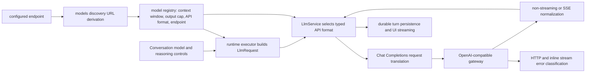

# Revitalize and land Chat Completions support from PR #573

## Observed journey

PR #573 adds OpenAI-compatible Chat Completions as a typed Phoenix LLM backend, but it is blocked by conflicts with current `main` and four unresolved Codex review findings. The desired outcome is to take ownership of the existing branch, preserve the feature's protocol and normalization work, integrate it with current Phoenix behavior, and land it with review feedback and checks resolved.

Environment and source:

- PR branch: `origin/feat/chat-completions-backend`
- Reviewed tip: `d2e6217f` (`fix(llm): harden chat completions compatibility`)
- Feature commits: `0ed5e9fe`, `d2e6217f`
- Current worktree base observed at investigation time: `main`
- GitHub reports conflicts in runtime, provider/model/registry code, and `specs/llm/executive.md`.

## Verified findings

- The feature branch is available locally and diverges from current main; its changes are concentrated in the LLM provider boundary, runtime request construction, registry/discovery, configuration documentation, and LLM specs.
- Current-main changes overlap the feature in model configuration and runtime behavior, including per-conversation reasoning effort and durable-turn work. Conflict resolution must preserve both sides semantically rather than selecting either side wholesale.
- The output-token review is valid: using a model's declared output cap unchanged for every request can violate providers' `input_tokens + max_tokens <= context_window` rule. The per-request maximum must respect both the configured model output cap and the request's remaining context, using the existing authoritative token/context accounting rather than introducing a parallel estimate.
- The discovery URL review is valid: an exact Chat Completions endpoint ending in `/chat/completions/` misses suffix recognition and can incorrectly derive `/chat/completions/models`. Endpoint normalization must handle trailing slashes before deriving the models URL.
- The HTTP error review is valid: a Chat Completions HTTP 4xx envelope may omit or null `error.code`; falling through to the Responses classifier's unknown-code server error makes a permanent client failure retryable. HTTP status and, where useful, envelope type must keep code-less 4xx failures terminal/client-classified while preserving auth and rate-limit handling.
- `specs/llm/chat-completions.allium` invokes central translation/normalization helpers without declaring their signatures and semantics. At minimum the helper contract must cover model wire naming, message translation, usage normalization, visible-text normalization, tool-call ID comparison/extraction, error classification, and length semantics. Logging/event vocabulary such as private-reasoning omission must also be structurally declared or expressed using an existing declared type.
- The Chat Completions path already intends to preserve model-issued tool-call IDs, normalize cached usage, maintain text/image order, reject incomplete streams, request terminal usage, omit private reasoning with capability-gap logging, and distinguish exact Responses and Chat Completions routes. Conflict resolution must retain these guarantees.

## Interaction map

The common `LlmRequest`/normalized response contract is the ownership boundary: provider-specific wire details stay below it, while current-main reasoning controls, token budgeting, retries, persistence, and durable-turn behavior remain authoritative above it.

## Proposed implementation

1. **Take over and refresh the PR branch**
   - Rebase or otherwise replay the two feature commits onto the latest target `main`, preserving reviewable history where practical.
   - Resolve conflicts in dependency order: model/API-format types and traits; provider adapters; service dispatch; registry/discovery/configuration; runtime consumers; specs/docs.
   - Preserve current-main reasoning-effort and durable-turn changes in every reconciled constructor, request, and dispatch path.
   - Push the revitalized branch and update PR #573 rather than creating a duplicate PR unless GitHub state makes reuse impossible.

2. **Integrate typed Chat Completions support**
   - Retain distinct exact endpoint configuration for Responses and Chat Completions so incompatible formats cannot accidentally share a route.
   - Keep model ownership independent from wire protocol and make API format/output limits explicit typed metadata.
   - Preserve request translation for system/user/assistant/tool messages, ordered multimodal content, tool definitions, model-issued call IDs, reasoning controls where supported, and terminal stream usage requests.
   - Preserve normalized response semantics for visible text, ordered images, tool calls, cached-token accounting, finish reasons, terminal stream completion, and private-reasoning omission/logging.
   - Log every provider capability gap at debug level or above; do not silently discard data.

3. **Resolve all four review findings**
   - Derive each request's output allowance from the lesser of the model's configured output cap and remaining context using the current authoritative token budget. Handle exhausted/insufficient context through the existing typed error path rather than underflowing or sending an invalid request.
   - Normalize endpoint path trailing slashes before recognizing `/chat/completions` and deriving the discovery models URL; retain query/authority correctness through the existing URL type.
   - Classify code-less/null-code HTTP 4xx Chat envelopes from HTTP status (and typed envelope fields where needed), ensuring permanent invalid requests are non-retryable while 401/403 and 429 retain auth/rate-limit classifications. Keep inline stream errors aligned with the same classification contract.
   - Add a complete Allium Helpers contract for every helper used by Chat Completions rules/guidance, with precise signatures and semantics. Declare logging/event vocabulary or reuse an existing declared capability-gap type. Ensure wire nesting such as cached prompt tokens and private reasoning field mapping is explicit without inventing parallel semantic representations.

4. **Add focused regression coverage**
   - Request budget tests covering a large nominal model output cap, non-empty prompt/history, near-exhausted context, and normal smaller-cap behavior.
   - URL derivation tests for exact Chat endpoints with and without trailing slash, including representative gateway path prefixes.
   - Non-streaming and streaming-setup HTTP tests for 400/404 envelopes with omitted and null codes; verify no retryable server classification. Retain 401/403/429 and known-code coverage.
   - Translation/normalization tests for tool-call ID preservation, cached-token subtraction/accounting, content ordering, terminal usage, private reasoning omission/logging, unknown/terminal finish behavior, inline stream errors, and unterminated streams.
   - Registry/service tests proving Responses and Chat formats dispatch to distinct configured endpoints and current-main reasoning controls remain threaded.

5. **Reconcile specifications and operator docs**
   - Treat `specs/llm/requirements.md` and the LLM Allium specs as normative; update `executive.md` only for accurate current implementation/verification status.
   - Run the full `specs/AUTHORING.md` pre-flight, remove any task/time-relative wording from timeless artifacts touched during conflict resolution, validate helper declarations, wire shapes, cross-spec references, and legacy `design.md` handling.
   - Keep README/config examples aligned with the final environment variable and endpoint names.

6. **Validate, review, and land**
   - Run targeted `phoenix-llm` tests and relevant runtime tests while iterating.
   - Run `allium check` for all affected LLM specs.
   - Run `./dev.py check`; investigate failures rather than accepting unexplained flaky exceptions.
   - Exercise a real or locally simulated Chat Completions conversation through Phoenix when credentials/configuration permit, verifying persisted input/output/cached usage and tool-call continuation. If external credentials are unavailable, document the bounded integration substitute.
   - Inspect the final PR diff against current main, update the PR title/body and review replies with the fixes and evidence, ensure checks pass, and merge PR #573 when green. Do not deploy production as part of this task.

## Acceptance criteria

- PR #573 is based on current `main`, has no merge conflicts, and preserves current-main reasoning and durable-turn behavior.
- A model configured for Chat Completions can complete normal and streaming turns through the shared normalized LLM contract without being treated as a Responses endpoint.
- Per-request output tokens never exceed either the model output cap or remaining context; regression tests cover the reviewer's large-cap example.
- Model discovery derives the correct `/models` URL for exact Chat endpoints both with and without a trailing slash.
- Code-less/null-code HTTP 4xx errors are terminal client/auth/rate-limit errors as appropriate and are not retried as server failures.
- Every Allium helper and event/type used by the Chat Completions spec is declared with semantics sufficient to check translation and normalization behavior; affected specs pass `allium check` and the authoring pre-flight.
- Targeted tests and `./dev.py check` pass, the four review threads are answered/resolved with evidence, and PR #573 is merged.

## Risks and non-goals

- **Risk:** Current-main trait and constructor evolution can make a syntactically clean conflict resolution semantically drop reasoning effort, token metadata, or durable-turn fields. Tests must assert these paths explicitly.
- **Risk:** Provider gateways vary in Chat Completions dialect. Support only wire shapes evidenced by the existing PR/spec/tests and review findings; log unsupported blocks rather than adding permissive untyped fallbacks.
- **Risk:** Context budgeting may expose pre-existing ambiguity between tokenizer estimates and provider-reported usage. Reuse the current authoritative mechanism and record a separate follow-up if a broader accounting redesign is required.
- **Non-goal:** Do not couple model family/display identity to API format.
- **Non-goal:** Do not unify Responses and Chat endpoints behind heuristic protocol detection.
- **Non-goal:** Do not mirror every vendor-specific Chat Completions extension or redesign the shared LLM response model beyond what correct typed integration requires.
- **Non-goal:** Do not perform a production deployment or release after merge.
