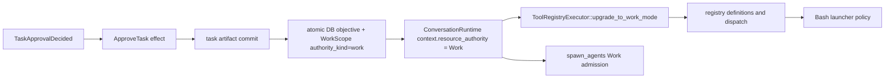

# Make Explore-to-Work approval one atomic capability transition

## Commission and preservation constraints

This P0 owns the product defect end-to-end and is separate from task 98016, whose implementation is already dirty in another WorkScope. Preserve incident conversation `6854e5c5-080d-4d3f-8874-75a08df7f051`, WorkScope `2c27bc33-3dcc-4f1b-ba2c-a7851fe50deb`, and worktree `.phoenix/worktrees/b4546ad2-138e-4c72-b527-9028428b16eb` read-only while fixing this defect: never discard/reset its changes, never manufacture context exhaustion, and never use child delegation as a rescue workaround. No deployment is authorized.

## Postmortem

### Observed timeline

- `13:19:31Z`: production created and started the incident conversation runtime in persisted Explore mode (`~/.phoenix-ide/prod.log:4285`; production DB `conversations.cm_kind=explore`).
- `13:24:37Z`: approval transitioned `AwaitingTaskApproval -> LlmRequesting`; at `13:24:39Z` the log says `Tool registry upgraded to Work mode` and `Task approved` (`prod.log:5704,5712-5713`). The same timestamp is stored in `conversation_approved_task_objectives` and `work_scope_approved_task_authorities`; WorkScope `2c27…` now has `authority_kind=work`, while conversation mode intentionally remains Explore per REQ-BED-028.
- Approval had already done the task-artifact mutation successfully: task 98016 is `in-progress`, and commit `b613d6bf0` contains only that approval artifact. Later source `patch` calls also succeeded, proving some write capability was present.
- Subsequent Bash invocations retained Explore policy: `PHOENIX_SANDBOX_SCRATCH` pointed under `explore-bash`; taskmd rename, Git common-dir `index.lock`, normal `target`/codegen, and uv/cache writes failed. The transcript later recorded Work-child rejection: `Work sub-agents require the parent to be in a write-capable mode` (production DB messages `1901-1902`, `14:00:08Z`).
- After supported cancellation, a fresh user message in the **same** approved conversation requested a non-mutating capability probe (message `1908`, `14:02:49Z`). Bash still reported non-empty sandbox scratch and could not create/remove a uniquely named harmless file in the Git common directory; the turn stopped before mutation. This rejects a one-command or one-turn stale session.
- Production is version `0.12.0`, Git `19fe992c72e5`; the process started before this conversation and no runtime reconstruction for this conversation appears in the incident interval. No matching bounded VictoriaTraces trace was retained; the production DB transcript and structured log are the independent evidence surfaces.

### Failure chain and first stale snapshot

- The durable transition is internally atomic: `Database::persist_approved_task_authority` writes the objective, WorkScope/objective relation, and `authority_kind='work'` in one SQLite transaction (`crates/phoenix-db/src/lib.rs:7244-7320`). It is not atomic with runtime reconfiguration.
- The state reducer enters `LlmRequesting` and emits `ApproveTask` before `PersistState` (`crates/phoenix-state-machine/src/transition.rs:1842-1856`). `execute_approve_task` performs Git/fs mutation, then durable authority persistence, then mutates `ConvContext.resource_authority`, invokes an untyped `upgrade_to_work_mode()` hook, refreshes one derived cache, and resumes (`crates/phoenix-ide/src/runtime/executor.rs:8393-8451`). Errors after the durable write can therefore leave a partially transitioned actor; the hook returns no success/error or capability generation with which to gate resumption.
- The **first observed stale authority snapshot** in this incident is the long-lived `ToolRegistryExecutor` selected when the actor materialized in Explore. The runtime log later claims its swap ran, but Bash behavior proves the actor's effective dispatch still reached `SandboxedBashTool -> BashSpawnMode::Sandboxed -> ExploreSandboxLauncher` (`crates/phoenix-tools/src/lib.rs:988-1061`; `crates/phoenix-tools/src/bash.rs:192-229`; `crates/phoenix-tools/src/bash/operations.rs:436-487`; `crates/phoenix-tools/src/bash/sandbox.rs:36-66`). Source patch succeeding is consistent with the registry being partly or incorrectly rebuilt rather than authority remaining wholly Explore.
- Work-child admission is an independent stale consumer: `handle_spawn_agents_tool` reads `self.context.resource_authority` directly and rejects unless it is `Work` (`crates/phoenix-ide/src/runtime/executor.rs:4774-4808`). The incident's Work-child rejection therefore proves the live actor's context authority was stale/reverted despite the durable WorkScope authority. Conversation mode is not the legitimate authority; the error wording obscures that distinction.
- Tool context is rebuilt per execution, but from actor-cached `self.context.resource_authority` and `resource_scope` (`ConversationRuntime::build_tool_context`, `executor.rs:7309-7349`). Fresh turns do not reload durable authority. `ConversationRuntime::new` also freezes `clearable_names` from the initial executor (`executor.rs:1872-1911`).
- LLM requests freeze tool definitions and Explore Bash prompt capability per request (`executor.rs:6915-6945`), and detached tool tasks clone the executor before spawning (`executor.rs:7410-7467`). A registry swap cannot retract an already-frozen provider request or a tool object already cloned from the registry. These precreated/in-flight cases need an explicit generation/barrier policy; they are not sufficient to explain the fresh-turn failure, but they can reproduce partial-transition races.
- A newly materialized runtime does use the correct durable sources: `RuntimeManager::build_runtime_from_db` resolves WorkScope authority, loads the typed approved objective, and selects a direct/Work registry for an Explore-mode approved conversation (`crates/phoenix-ide/src/runtime.rs:4929-4975,5060-5160`). Restart/rematerialization should heal this specific persisted incident state, but restart was not observed during the incident and is not an acceptable product fix.

### Rejected hypotheses

- **Conversation mode must become Work:** false. REQ-BED-028 requires mode to remain Explore; write authority belongs to the attached WorkScope/objective (`specs/bedrock/requirements.md:905-918`).
- **Approval persistence failed:** false. The objective, relation, WorkScope authority, and approval commit all exist.
- **Only one Bash handle/session was stale:** false. A supported cancel plus fresh same-conversation turn still dispatched sandboxed Bash.
- **Fresh user input reconstructs capability:** false. The actor survives turns and builds tool context from cached authority.
- **`/continue` is a rescue boundary:** false and unsafe. Continuation is defined only for context-exhausted conversations (REQ-BED-030, `specs/bedrock/requirements.md:1012-1049`); this parent is idle, not exhausted.
- **Child delegation can rescue task 98016:** false. Work spawn is correctly rejected from the stale Restricted parent, and delegation would avoid rather than repair the owning actor.
- **Deployment/restart caused the split:** not supported by evidence. Production started this actor before approval and kept it alive. Rematerialization is relevant as a recovery/test boundary, not the initial cause.

## Owning invariant and normative changes first

Before implementation, update the normative artifacts and add a superseding ADR rather than relying on comments:

1. Strengthen REQ-BED-027/028 and `specs/bedrock/bedrock.allium`: approval is one durable capability transition. Before any post-approval provider request or tool admission, all authority consumers—actor context, registry definitions/dispatch, Bash launcher policy, tool-context projection/caches, and sub-agent admission—must represent the same persisted authority generation. A partial runtime transition fails closed and does not resume.
2. Specify crash/restart behavior at the persistence/reconfiguration seam: once Work authority is durably committed, rematerialization derives all consumers from it; a still-live pre-transition actor cannot continue serving Restricted capabilities as if approval had completed.
3. Strengthen `specs/bash/requirements.md` / `bash.allium` so approved WorkScope Bash is structurally unsandboxed and Explore remains OS-sandboxed, including normal project `target`/codegen, uv/cache, worktree, task, and Git common-dir paths.
4. Strengthen `specs/subagents/requirements.md` / `subagents.allium` so Work-child admission derives from the same typed capability snapshot/generation rather than mode labels or an independently cached field.
5. Confirm WorkScope ownership/restart boundaries against `specs/work-lifecycle/*`, retired redirects in `specs/projects/*`, compatibility REQ-COMP-001/ADR-034, and runtime-resource fail-closed ADR-039. Add no broad compatibility or live-resource-replacement promise.
6. Add a new ADR recording why capability transitions use one typed snapshot/generation and one publish point, and why piecemeal mutable fields/untyped no-op upgrade hooks are rejected. Run `specs/AUTHORING.md` pre-flight and Allium validation before pushing.

## Proposed implementation scope

1. Introduce a correct-by-construction runtime capability representation whose Work variant carries everything needed to construct both registry and execution context. Remove or replace the independently mutable `context.resource_authority` + registry + derived-cache transition protocol; test doubles must not silently no-op on a security transition.
2. Make approval orchestration explicit and fallible:
   - perform approval artifact mutation and durable typed authority persistence;
   - build/validate the complete next capability consumer set;
   - publish it once behind an actor-local generation/barrier before any next LLM request or tool admission;
   - emit an observable structured transition event/log carrying conversation, WorkScope, old/new authority, and generation;
   - if publish cannot complete, do not resume with a mixed snapshot. Reconcile/rematerialize from durable authority or remain in a typed failed-closed recovery state.
3. Fence provider/tool snapshots. Define deterministic behavior for a provider request or checked/precreated tool at the approval boundary: pre-transition work may finish only under its admitted Restricted generation or be cancelled; it may never execute after being reinterpreted as Work. No post-transition call may use an older generation.
4. Ensure `build_tool_context`, tool definitions, dispatch, `clearable_names`, Bash tool/launcher choice, system-prompt capability, and `spawn_agents` Work admission consume the same published capability snapshot.
5. Keep mode/provenance/cwd/WorkScope identity unchanged per REQ-BED-028. Do not alter Bash sandbox policy itself, WorkScope retirement, continuation rules, or task 98016 implementation.

## Deterministic reproduction and regression matrix

Build the test around a real temporary Git repository/worktree, real taskmd artifact, production `ToolRegistryExecutor`, and controllable approval/runtime barriers—not log assertions or a mock executor whose upgrade defaults to no-op.

### Same actor, same conversation

1. Materialize one Explore conversation and actor; precreate/freeze an Explore tool definition/request snapshot to prove the old generation exists.
2. Before approval, assert Bash has non-empty `PHOENIX_SANDBOX_SCRATCH` and cannot write source/task/Git common-dir; assert Work-child admission is rejected.
3. Approve a task in that same conversation. Assert taskmd `ready -> in-progress` and the approval-only commit occur, mode remains Explore, WorkScope/objective authority is Work, and exactly one observable capability-generation transition is published.
4. Without evicting/restarting or creating another conversation, use the same actor to prove:
   - Bash has no Explore scratch marker;
   - a uniquely named harmless Git common-dir lock-like fixture can be created and removed;
   - a second taskmd-style fixture can be renamed without touching the approved artifact;
   - normal repository `target`/codegen and uv/cache paths are writable without sandbox redirects;
   - a harmless source fixture can be committed and cleaned up inside the disposable repository;
   - Work child admission succeeds against the same WorkScope (use a deterministic fake child execution after admission, not an LLM/network dependency).
5. Send another user turn through the same actor and repeat the Bash/common-dir and Work-child assertions. This is the incident regression.

### Crash/restart and partial transition

- Inject a crash/failure immediately after the durable authority transaction and before runtime publication. Rematerialize from the DB and prove the new actor is wholly Work; the old actor/generation cannot admit calls or publish a conflicting transition.
- Inject runtime-build/publication failure after durable persistence. Assert execution does not resume and no post-approval LLM/tool call runs under either a stale Restricted consumer or a partially built Work consumer.
- Restart/rematerialize from an Explore-mode row plus typed approved objective/Work WorkScope and prove every consumer is Work. Also test a genuinely unapproved Explore row remains fully sandboxed.

### In-flight and precreated snapshots

- Hold an Explore LLM request at the frozen-tool-surface barrier while approval is attempted; prove the ordering policy is deterministic and no old response can execute a Work-sensitive call after publication.
- Hold a prelooked-up `SandboxedBashTool`/checked call and a prebuilt tool context across the boundary; prove generation fencing cancels/rejects it rather than allowing stale dispatch.
- Exercise actor reuse after cancel, idle, and a subsequent user message. No session/handle cleanup alone may be credited as the fix.

## Safe rescue path for task 98016 (operationally separate)

The exact supported per-conversation replacement boundary is `POST /api/conversations/:id/upgrade-model`: for an idle/error-like conversation, `upgrade_conversation_model` persists model settings, calls `RuntimeManager::evict_runtime(..., ModelUpgrade)`, removes the actor from the runtime map, sends shutdown, waits for its task to exit, and retains the broadcaster for rematerialization (`crates/phoenix-ide/src/api/handlers.rs:5028-5129`; `crates/phoenix-ide/src/runtime.rs:4550-4707`). `build_runtime_from_db` then derives Work authority and the Work registry from the persisted objective/WorkScope.

For incident rescue only, after this P0 postmortem/task is approved by the user:

1. Keep task 98016's worktree untouched and verify the parent remains non-busy/idle, DB authority is Work, objective relation is intact, and the dirty status is unchanged.
2. Use the supported upgrade-model API on **the same conversation**, selecting the current configured model (`gpt-5.6-sol`) and current effort/tier so no product intent changes. This is an actor eviction/rematerialization, not a process restart or deployment. The endpoint does not alter cwd, WorkScope, worktree, Git state, transcript identity, or dirty files.
3. Re-open/rematerialize that same conversation, then run only the requested read/write capability probe. Proceed with task 98016 in the parent only if sandbox scratch is absent and the harmless Git common-dir fixture succeeds; otherwise stop and preserve all state.
4. Do not use `/continue`, fabricate context exhaustion, create a replacement conversation/worktree, or delegate to a child.

Caveat: same-model use is accepted by the handler/DB update path but is an operational recovery use of a model-upgrade endpoint, not a user-facing authority-repair contract. Do not encode it as the product fix or broaden compatibility guarantees around it.

## Validation and delivery

- Focused state-machine, DB, runtime, tool-registry, Bash, and sub-agent tests, including the deterministic end-to-end matrix above.
- `allium check` for touched Allium specs and the full spec-authoring pre-flight.
- `./dev.py check --all` on exact HEAD.
- Independent `phoenix-adversarial-review` focused on authority generations, crash windows, stale task execution, lock ordering, and test realism; resolve every finding.
- Commit this P0 separately from task 98016, push a separate branch/PR, use a concept-focused PR description, and wait for exact-head CI plus Codex review. Re-run required checks after any review change and make a concrete merge/no-merge decision from exact-head evidence.
- No production deployment.

## Risks and explicit non-goals

- **Privilege escalation:** generation fencing and pre-approval negative tests are mandatory; never infer Work merely from Explore mode plus a worktree.
- **Deadlock/race:** approval already crosses actor, blocking Git work, SQLite, registry locks, and detached request/tool tasks. Use an explicit transition boundary rather than nested ad hoc locks; exercise barriers deterministically.
- **Persisted Work with failed publication:** durable authority is canonical. Fail closed, then rematerialize/reconcile; never downgrade the DB to match a stale actor.
- **No incident mutation during product work:** production conversation/DB/logs and task 98016 worktree remain evidence only until the separately approved rescue step.
- No deployment, continuation redesign, Bash sandbox-policy weakening, WorkScope lifecycle redesign, child-delegation workaround, or implementation of task 98016 in this PR.
