# Expose existing `present_svg` to the real Global Coordinator

## Observed journey

- PR #793 merged as `87606f424`; current `origin/main` is `ce34111f1` after merged PR #789 and its durable SVG publication path is already deployed separately, but the actual Global Coordinator tool schema still omits `present_svg`.
- Ordinary Direct/Work publication has been verified independently, including artifact `b3447423-be2a-46dc-a7dd-e38036f5a669`. That evidence proves the existing publisher, not Global exposure.
- The requested journey is a disposable **development** Global Coordinator conversation that generates a static SVG through its existing explicitly WorkScope-targeted Bash capability, invokes the real `present_svg` tool, and owns the resulting durable artifact under the Global transcript and the exact Global assistant-message/tool-use invocation.
- The deployed devmbp binary at `d994…` predates current source and is not an acceptance target. Production exposure requires separate deployment authorization.

## Verified findings

- `specs/present-svg/requirements.md` and `generation-guide.md` currently advertise `present_svg` only for Direct/Work and explicitly exclude filesystem-free Coordinator contexts.
- `ToolRegistry::coordinator` accepts host-supplied tools. The real Global runtime supplies those through `coordinator_tools::tools(...)` and wraps the result with `ToolRegistryExecutor::builtin_only`; it does not use the ordinary Direct/Work registry.
- The actual Coordinator-supplied set is tested in `coordinator_tools::coordinator_bash_is_available_without_platform_sandbox_support` and currently contains global read/query/resolve/message tools plus targeted Bash, but not `present_svg`.
- `PresentSvgTool::run` currently requires a filesystem execution environment plus `ResourceAuthority::Work`. The Global runtime intentionally creates `ToolContext::new_without_filesystem`, so adding only a schema entry would advertise a tool that always rejects.
- Runtime tool dispatch already injects the durable SVG store, provider tool-use ID, and owning assistant-message ID for every conversation. `PresentSvgTool` publishes against `ToolContext.conversation_id`; preserving that context makes the Global transcript—not a selected ordinary ProductConversation or WorkScope owner—the artifact owner, while `SvgInvocationId` remains the exact Global assistant-message/tool-use pair.
- Existing storage and HTTP routes already snapshot validated bytes and require artifact ID plus owning conversation ID (or a valid share token) for preview, escaped source, and download. No new store, publisher, artifact API, or retrieval bypass is needed.
- No existing task or branch was found for Global `present_svg` exposure.
- Open PR #765 (`task-66005-atomic-explore-work-capability-transition`; roadmap owner reports local `b715c5a6`, remote ref inspected at `df64e3236`) actively changes resource-authority projection and adds a distinct attached-Work-child registry in `phoenix-tools::ToolRegistry`. Its attached-child registry/containment decision is owner work and must not be duplicated here.

## Interaction map

```mermaid
flowchart LR
    U["User asks the Global Coordinator for a visual"] --> P["Global prompt and actual tool schema"]
    P --> B["Coordinator Bash with explicit active work_scope_id"]
    B --> F["SVG staged inside the resolved active WorkScope root"]
    F --> A["Coordinator-only present_svg adapter"]
    A --> R["Server resolves the same active WorkScope and authorizes the contained source"]
    R --> V["Existing PresentSvg validator and publisher"]
    V --> D["Existing atomic SQLite SVG snapshot"]
    D --> O["Owner = Global transcript conversation; invocation = Global assistant message + provider tool-use ID"]
    O --> H["Existing authenticated history, preview, source, download and share rendering"]
```

The selected WorkScope is source-read authority only. It must not replace artifact ownership, mint ordinary-conversation authority, or grant the filesystem-free Global context generic filesystem access.

## Proposed scope

### Normative contract and prompt

- Amend `specs/present-svg/requirements.md`, `generation-guide.md`, and executive evidence so the singleton Global Coordinator is an explicit supported publisher only when it names an authoritative active WorkScope and the source is contained by that resolved WorkScope root.
- Align `specs/global-recall/requirements.md` with this one bounded read-and-publish capability. Preserve the prohibition on generic filesystem, browser, MCP, patch, task, project, workspace, and broad lifecycle tools.
- Update both Phoenix-native and Caveman Global prompts honestly: generate/stage under one selected active WorkScope through targeted Bash, retain staging until success, call `present_svg` with that same `work_scope_id`, and describe validation as static-policy validation rather than visual inspection.
- Do not add a generic framework or a second publication abstraction.

### Concrete integration seam

- Add a Coordinator-only adapter in `crates/phoenix-ide/src/coordinator_tools.rs` and include it only in `coordinator_tools::tools(...)`, the supplied tool list used by the real Global runtime. Do **not** add `present_svg` to generic `ToolRegistry::coordinator`, `new_with_options`, attached-child constructors, writing-conversation tools, MCP, or mode-wide sets.
- Give the adapter the existing `present_svg` fields plus a required `work_scope_id`. Resolve that ID through the same active persisted WorkScope authority used by Coordinator Bash and reject missing, stale, inactive, mismatched, or unresolvable scopes before reading.
- Add only the narrow typed source authorization needed in `crates/phoenix-tools/src/present_svg.rs`: publication from a canonical active WorkScope root with structural containment/no-follow enforcement. Do not make `ToolContext` globally filesystem-capable, expose a generic authority setter, accept arbitrary host paths from Global, or weaken the existing regular-file/size/SVG validator.
- Delegate to the existing validator, `RuntimeSvgArtifactStore`, compact result, replay, recovery, and authenticated route path. Keep `ToolContext.conversation_id`, `svg_assistant_message_id`, and `tool_use_id` unchanged so ownership and invocation identity are sourced from the executing Global transcript.
- Reuse the existing share behavior unchanged.

### #765 coordination gate

- Before implementation, obtain the #765 owner's exact patch seam/ownership response and inspect its current diff read-only. Do not modify the owner worktree or serialize unrelated portfolio work.
- Avoid edits to #765's attached-child registry/authority design. The intended seam above keeps Global registration in `coordinator_tools::tools` and source authorization in `present_svg.rs`, rather than competing in `ToolRegistry` constructors.
- Rebase onto the qualified #765 outcome when required, then preserve its attached-child capability matrix exactly. If the owner identifies a conflicting authority API seam, coordinate and adapt this task rather than landing a parallel authority refactor.

## Regression and acceptance validation

1. **Focused registry/schema tests**
   - The actual application Global tool set and emitted provider definitions include exactly one `present_svg` schema with required `work_scope_id`, `path`, `title`, and `description`.
   - The Global prompt permits and accurately explains this bounded workflow.
   - Ordinary Direct/Work behavior is unchanged; Explore and restricted subagents remain excluded; writing ordinary ProductConversations do not gain a second copy; attached-child behavior remains whatever #765's owning contract establishes.
2. **Authority and identity tests**
   - A source contained in the selected active WorkScope succeeds.
   - Missing/stale/wrong WorkScope, path escape, final symlink, wrong conversation/invocation identity, and cross-owner publication/retrieval fail closed.
   - The persisted artifact owner is the executing Global transcript conversation, and invocation identity is its exact assistant-message ID plus provider tool-use ID—not the selected WorkScope's ordinary conversation and not a child transcript.
3. **Existing SVG regressions**
   - Run the existing validator adversarial suite unchanged, plus focused `phoenix-tools`, database artifact, runtime recovery, router ownership/source/share, and Global registry/prompt tests. Do not weaken or rewrite hostile fixtures to obtain a pass.
4. **Real development Global journey**
   - In a disposable DEV Global conversation, inspect the actual provider tool schema, use real targeted Bash to create a static SVG inside an active WorkScope, and let the model invoke the real `present_svg` tool. SQL or an alternate HTTP endpoint is not a substitute.
   - Record schema evidence, tool-use/tool-result receipt, Global conversation ID, assistant-message ID, provider tool-use ID, artifact ID, durable history/reconstruction evidence, authenticated render and escaped-source evidence, and a denied cross-owner request.
   - Refresh/reopen/reconstruct through supported development paths and confirm the durable card/render/source survive. Do not restart or alter production, deploy, merge, or edit global configuration.
5. **Qualification and delivery**
   - Run focused tests and full `./dev.py check` (using devmbp for heavy validation where practical), inspect the complete diff, commit/push one narrow branch, open one qualified PR, obtain hosted CI, exact-head Codex review, and a full advancing-cursor review with all actionable findings resolved.

## Explicit non-goals

- No generic filesystem-authority grant to Global and no unrelated write tool.
- No new publisher, durable store, artifact API, route, DB/API bypass, or alternate execution endpoint.
- No validator relaxation, content stripping, broad tool enablement, automatic publication, or raw SVG arguments.
- No change to ordinary publication semantics, attached-child authority ownership, #765's active refactor, CRDT roadmap work, or unrelated roadmap reconciliation.
- No production acceptance against deployed `d994…`, production change, deployment, merge, restart, or global configuration edit.
