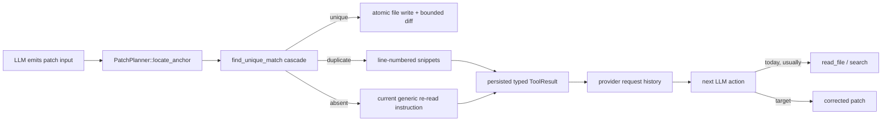

# Make patch not-found feedback actionable without another LLM read/search call

## Observed journey

- An LLM submits an anchor-based `patch` request (`replace`, `insert_before`, or `insert_after`).
- When `oldText` is stale or otherwise absent, the tool returns only: `Patch N (...) failed: oldText not found in file. Re-read the file and retry this patch with current text.`
- The next LLM call commonly spends a tool round on `read_file` or `search` before it can repair the patch. This is a regular loss of a model/tool call rather than evidence that the provider rejects the persisted tool-result history.
- Ground truth was gathered read-only from `~/.phoenix-ide/prod.db`; no production writes or process changes were made.

## Verified findings

### Production persistence

- The production DB contains 17,323 agent messages with a patch tool call.
- Persisted patch failures include 523 `AnchorNotFound` results and 423 `AnchorNotUnique` results.
- After the latest prior feedback fix landed (bounded window beginning 2026-07-13):
  - `AnchorNotFound`: 496 failures; the next agent action was `read_file`/`search` 417 times and an immediate corrected `patch` only 52 times.
  - `AnchorNotUnique`: 387 failures; the next action was an immediate corrected `patch` 324 times and `read_file`/`search` only 46 times.
- Across all persisted records, 522/523 not-found errors and 423/423 duplicate errors were followed by another agent message. This disfavors malformed tool history/provider rejection as the primary failure model: the provider usually accepts the next request, but not-found feedback lacks enough evidence to repair the request efficiently.
- The live DB has no `llm_request_metrics` table, so these measurements concern durable tool calls/results and next actions, not token/cost telemetry or provider HTTP outcomes.

### Previous fixes

- Commit `0796968474df10494d0c77d1f070b34cbe221a1c` (`Add locations to duplicate patch match errors (#378)`) added bounded line-numbered snippets to duplicate-anchor feedback.
- Commit `6e06b99257dc69cf226b0baa5b51e05ae8a8e17f` (`fix: identify failing patch anchors`) added the failing patch index and operation.
- Commit `0af1812d7374e8c59337addb40256a726bc8b756` carried that feedback work into the later runtime-driver change.
- Current code retains these protections in `PatchError::AnchorNotFound`, `PatchError::AnchorNotUnique`, `PatchPlanner::locate_anchor`, duplicate diagnostics, and their tests.
- The asymmetry remains structural: `AnchorNotUnique` carries `DuplicateMatchDiagnostics`; `AnchorNotFound` carries only patch number and operation. Its text instructs the model to perform another read without returning any current-file evidence.

### Current boundaries

- `find_unique_match` in `crates/phoenix-tools/src/patch/matching.rs` exhausts exact, dedent, trimmed-line, and Unicode-confusable matching before returning `MatchError::NotFound`.
- Patch feedback is persisted as a normal typed tool result and translated through the standard OpenAI/Anthropic tool-result paths.
- Tool rounds are transactionally checkpointed with pairing/count invariants, and patch success diffs are bounded and delimiter-neutralized. Do not weaken or duplicate those safeguards.

## Inferences and unknowns

- **Inference:** Returning bounded, advisory current-file candidate locations/snippets with a not-found result should let the model repair many stale anchors directly, as duplicate diagnostics already do. Validation must measure immediate corrected-patch behavior rather than assuming better prose is sufficient.
- **Unknown:** Historical production rows cannot prove which candidate-ranking heuristic would have selected the useful location. Build a representative replay corpus from redacted/synthetic stale-anchor shapes and test the chosen heuristic for determinism, bounds, and false-positive behavior.
- **Unknown:** Production lacks request metrics, so reduced token use/cost is not directly measurable in this task. The durable proxy is avoiding an intervening `read_file`/`search` call after `AnchorNotFound`.

## Interaction map

- Persistence/recovery: keep the existing typed `ToolResult` and atomic tool-round checkpoint path unchanged.
- Cancellation/reconnect: no new state or side effect is needed; diagnostics are computed from the same in-memory file snapshot used for planning.
- Safety: candidates are evidence only. They must never authorize a non-unique or approximate edit and must not change all-or-nothing patch semantics.

## Proposed scope

### Owning invariant

When an anchor-based patch cannot be applied, the result must identify the failing request and provide enough **bounded current-file evidence** to repair it when a credible candidate exists, while never guessing or applying an approximate edit.

### Implementation surfaces

1. Extend the internal not-found outcome/error with a typed, bounded diagnostic rather than embedding ad hoc prose:
   - likely starting points: `MatchError::NotFound`, `PatchError::AnchorNotFound`, and matching diagnostic types in `crates/phoenix-core/src/domain/patch_types.rs` / `crates/phoenix-tools/src/patch/matching.rs`;
   - preserve patch number and operation;
   - report a small deterministic set of line-numbered current-file snippets/candidate locations when confidence is useful;
   - explicitly distinguish “no useful candidate” from candidate-bearing feedback.
2. Choose a conservative candidate strategy suitable for stale multi-line anchors (for example, matching distinctive surviving lines and ranking bounded surrounding regions). The strategy must:
   - be deterministic;
   - operate within explicit work/size limits on large files and anchors;
   - avoid leaking whole-file content;
   - avoid treating a candidate as permission to edit;
   - return no candidate rather than low-confidence noise.
3. Shape the displayed error so the model can copy/widen current text directly when possible. Keep concise fallback guidance when no credible candidate exists.
4. Update normative patch requirements and executive verification mapping to cover actionable not-found diagnostics. Do not add rollout/status language to timeless requirements; follow `specs/AUTHORING.md` pre-flight rules.

### Regression coverage

- Unit tests for stale anchors with one clear nearby candidate, several candidates, no credible candidate, Unicode/whitespace cases already exhausted by fuzzy matching, very large files, very long lines, and UTF-8-safe truncation.
- Multi-patch tests proving the diagnostic belongs to the exact failing patch index/operation.
- Property tests proving diagnostic bounds, deterministic ordering, valid UTF-8, and that no not-found case mutates the file or clipboards.
- Preserve existing duplicate diagnostics, fuzzy matching, `replaceAll` exact-only behavior, overlapping-edit rejection, all-or-nothing writes, and bounded success diffs.
- Add a focused tool-level test asserting the complete LLM-visible error text and bounds, not only the internal matching enum.

### User-journey validation

- Replay a bounded corpus of representative stale-anchor cases through `PatchTool::run` and verify that candidate-bearing errors include enough exact current text to formulate a corrected patch without another file read.
- Compare the resulting next-step affordance with duplicate-anchor feedback; both failure classes should expose current line/location evidence when such evidence can be identified conservatively.
- Run the focused patch tests, then `./dev.py check`.

## Risks

- Similarity ranking can emit misleading candidates; conservative omission is preferable to false confidence.
- Candidate search can become expensive on large files; explicit input/work/output bounds are required and should be tested.
- Extra feedback consumes context; snippets and candidate counts must remain tightly bounded and use one canonical representation.
- Moving diagnostic types across crates may create unnecessary coupling. Keep provider/runtime layers unchanged unless tests expose an actual contract gap.

## Explicit non-goals

- Do not auto-apply approximate or non-unique edits.
- Do not change simultaneous multi-patch resolution or atomic write semantics.
- Do not redesign provider serializers, tool-round persistence, retry policy, or conversation recovery; production evidence does not implicate those as the primary issue.
- Do not add a general LLM telemetry system or migrate the production DB as part of this fix.
- Do not remove the requirement that exact/fuzzy matching produce one structurally valid edit before any write occurs.
