# Open conversation messages directly in fullscreen

## Observed journey

- In a live conversation, the user right-clicks a message and sees **Open in sidepanel**, then must use the viewer’s **Fullscreen** control to reach the focused review surface.
- The requested journey is one context-menu action: right-click a message → **Open in fullscreen** → the same message opens directly in the existing fullscreen viewer.
- This concerns the conversation message menu shown in the supplied desktop screenshot. Shared/read-only message surfaces must retain their existing viewer restrictions.

## Verified findings

- `MessageContextMenu` renders **Open in sidepanel** only when message-viewer opening is enabled and `getMessageMarkdown(message)` is non-empty. It dispatches `OPEN_MESSAGE_VIEWER_EVENT` with only `{ sequenceId }` (`ui/src/components/MessageContextMenu.tsx`).
- `ConversationPage` consumes that event and calls `viewerSlot.openMessage(sequenceId)` (`ui/src/pages/ConversationPage.tsx`).
- `ViewerSlotProvider.openMessage` always writes `viewer=message`, `presentation=pane`, and the message sequence ID. The existing slot already supports `presentation=fullscreen`, URL hydration, persistence, and presentation changes without changing message identity (`ui/src/contexts/ViewerSlotContext.tsx`).
- On wide desktop, `MessageViewer` renders the pane/fullscreen toggle and fullscreen takeover. Narrow layouts render the viewer as an overlay and intentionally omit the presentation toggle (`ConversationPage`, `MessageViewer`, and `specs/viewer_slot/executive.md`).
- Existing component coverage verifies the sidepanel menu item, event dispatch, markdown eligibility, and disabled/read-only behavior in `MessageComponents.test.tsx`. Viewer tests cover fullscreen behavior and pane/fullscreen continuity, but there is no direct-open-fullscreen context-menu journey.
- The normative Allium rule `UserOpensMessageViewer` currently fixes every user-opened message to `pane`; it must be generalized rather than leaving implementation and spec in conflict (`specs/viewer_slot/viewer_slot.allium`).

## Inferences and unknowns

- The direct action should target the existing message fullscreen presentation, not create a second modal/viewer implementation. This is falsified if product intent is a distinct browser-native fullscreen mode; the reported two-step workflow points to the existing viewer control instead.
- **Open in fullscreen** should be offered only when the wide-desktop fullscreen presentation is available. On narrow layouts, **Open in sidepanel** already produces the full overlay, so presenting both actions would be duplicate/misleading.
- The fullscreen item should use the same non-empty-markdown and live-conversation gates as **Open in sidepanel**. Tool-only messages and read-only/shared surfaces should not gain a bypass.

## Interaction map

```mermaid
flowchart LR
    A["Right-click eligible message"] --> B["MessageContextMenu: Open in fullscreen"]
    B --> C["OPEN_MESSAGE_VIEWER_EVENT with sequence ID + presentation"]
    C --> D["ConversationPage event consumer"]
    D --> E["ViewerSlot open-message command"]
    E --> F["URL: viewer=message, presentation=fullscreen, message=<sequence ID>"]
    F --> G["MessageViewer existing fullscreen takeover"]
    G --> H["Existing URL persistence, reload, note protection, and return-to-pane behavior"]
```

- No backend, SSE, or database boundary is involved. Message content continues to resolve from the loaded conversation by sequence ID.
- The URL remains the sole authoritative representation; the event is an imperative request and must not create parallel viewer state.

## Proposed scope

### Owning invariant

Opening a message from any supported UI entry point must atomically select both its identity and intended presentation in the single URL-driven viewer slot. A direct fullscreen open must never transiently open a pane first or require a second presentation mutation.

### Implementation

1. Generalize the typed open-message command/event contract to carry an explicit `pane | fullscreen` presentation (or provide presentation-specific commands backed by one typed implementation). Preserve current sidepanel behavior as `pane`; add direct fullscreen behavior as `fullscreen`.
2. Add **Open in fullscreen** adjacent to **Open in sidepanel** in `MessageContextMenu`, sharing the existing markdown/live-surface eligibility checks and closing the menu after activation.
3. Thread an explicit wide-desktop capability from the conversation layout through `MessageList` to the context menu so the fullscreen action is absent where the presentation toggle is intentionally unavailable. Keep `SharePage` and archived/terminal conversations unable to open either viewer action.
4. Update `viewer_slot.allium` so user-opened message transitions carry the requested presentation, and update the executive coverage description/anchor as needed. Keep timeless artifacts free of task references and run the spec authoring pre-flight when modifying the spec.

Likely starting symbols:

- `MessageContextMenu`, `OPEN_MESSAGE_VIEWER_EVENT`
- `MessageList` viewer capability props
- `ConversationPage` event handler and `isWideDesktop`/`canOpenMessageSidepanel` gates
- `ViewerSlotCommands.openMessage` and `ViewerSlotProvider.openMessage`
- `UserOpensMessageViewer` in `specs/viewer_slot/viewer_slot.allium`

### Regression and journey validation

- Extend `MessageComponents.test.tsx` to verify:
  - both menu items appear for an eligible message when fullscreen capability is enabled;
  - **Open in sidepanel** requests `pane` and **Open in fullscreen** requests `fullscreen` for the same sequence ID;
  - fullscreen is absent when the capability is disabled, for tool-only messages, and on read-only surfaces;
  - selecting either action closes the menu.
- Extend `ViewerSlotContext.test.tsx` to verify direct message opens produce canonical pane/fullscreen URLs and slots while preserving the sequence ID and clearing stale slot params.
- Add or extend a `ConversationPage`-level test if needed to prove the event presentation reaches the URL-driven slot rather than only testing producer and consumer separately.
- Manually validate on wide desktop: right-click message → **Open in fullscreen** → fullscreen takeover appears immediately; **Return to pane** retains the same message. Validate at a narrow viewport that the redundant fullscreen item is absent and existing overlay behavior is unchanged.
- Run focused UI tests, TypeScript/lint checks, Allium validation, then `./dev.py check`.

## Risks and non-goals

- Risk: changing the event shape without updating every producer/consumer could silently fall back to pane. Keep the payload typed and assert both presentations.
- Risk: opening pane and then calling `setPresentation` would introduce a transient two-step URL/render update. Write the requested presentation in the initial slot transition.
- Non-goals: redesigning the context menu, changing fullscreen viewer chrome/note protection, adding fullscreen to narrow layouts, changing message markdown extraction, or adding backend persistence/API work.
