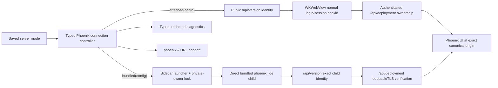

# Revive PA.app as a generic dual-mode Phoenix macOS host

Rework the imported `x-pa-app` prototype at commit `b8c9fc7df91b039c6f2fd1024ac9af3f8acdd59a` into a thin, generic **Phoenix.app** host. Preserve the native SwiftUI/AppKit/WKWebView shell, but remove the personal-assistant and owner-specific product assumptions. The app must make server ownership structural: it either attaches to an externally managed Phoenix deployment or launches and owns its bundled Phoenix sidecar. It must never infer ownership from a responsive port.

## Observed journey

- The prototype launches as PA.app, synchronously waits on a fixed localhost port, starts a user-selected `phoenix_ide` through a login shell, polls `/version`, and then swaps its single native window to a WKWebView.
- It stores PA-specific binary/database/provider defaults and a direct Anthropic key in UserDefaults, renders raw launch environment values in diagnostics, and stops its child with a five-second deadline.
- The desired product is a generic macOS Phoenix client with an explicit mode selector:
  - **Attach to managed Phoenix**: connect to a canonical configured origin, normally the `./dev.py prod deploy` launchd-managed deployment shared with browsers and mobile clients. Phoenix's deployment owns its process, data, credentials, and backend updates.
  - **Bundled Phoenix**: launch the app-bundled `phoenix_ide`, with private app data and loopback-only HTTP, and manage only that exact child process.

Environment verified:

- `x-pa-app` is a clean detached worktree at `b8c9fc7`.
- A clean unsigned Debug build succeeds with the current Xcode/macOS SDK (`xcodebuild ... CODE_SIGNING_ALLOWED=NO build`).
- No XCTest/UI-test target or test files are present.

## Verified findings

### Prototype

- `PA/ServerManager.swift::start` directly models only a child-process server and launches `/bin/zsh -l -c "exec '<binary>'"`; the path is shell-interpolated and the nearby `setsid` claim is false.
- `ServerManager.buildEnvironment` omits `PHOENIX_BIND_ADDR` and `PHOENIX_TLS`. Current Phoenix defaults a self-bound listener to `0.0.0.0` and rejects unauthenticated non-loopback startup.
- `ServerManager.stopSync`, `waitForPortFree`, and `restart` block/poll or sequence lifecycle by fixed delay. Its five-second force-kill deadline is shorter than Phoenix's 30-second bounded HTTP drain (`phoenix-ide/src/tls.rs::SHUTDOWN_GRACE`).
- The termination handler can classify an intentional stop/restart as failure because the state model has no stopping/restarting states.
- `Configuration.swift` hardcodes owner-specific paths and Datadog gateway defaults. `~/.pa/phoenix.db` also fragments state from `~/.phoenix-ide/prod.db`.
- `anthropicApiKey` is persisted via `@AppStorage`; diagnostics expose both current and launched environment dictionaries verbatim.
- `WebViewWrapper` recognizes only localhost/127.0.0.1 as internal and auto-grants microphone permission to those hosts. It has no configured-origin abstraction or TLS trust policy.
- `AppDelegate` hardcodes localhost URLs throughout WebView loading, model checks, conversation creation, and prompt handoff.
- URL registration and `pa://` prompt/status handling exist despite stale backlog/task text. The implementation creates a seeded Phoenix conversation and injects its draft with timed WebView lookup retries.
- The Xcode target has no bundled Phoenix executable or Copy Files phase for one. It is named PA, uses bundle identifier `com.scottopell.pa`, registers `pa://`, and targets macOS 15.0.

### Current Phoenix contract

- `GET /api/version` is a public, credential-exempt exact build identity endpoint; `/version` remains the text compatibility endpoint.
- `GET /api/deployment` returns typed build, actual listener, TLS, `local_access`, and `InstallationOwnership` facts. Ownership variants include `launchd_managed`, `development`, `unmanaged`, `ambiguous`, and `unsupported` (`api/deployment.rs`, `api/installation_ownership.rs`).
- `/api/deployment` is not auth-exempt. A password-protected deployment returns 401 until the browser establishes Phoenix's normal `phoenix-auth` session. Attach discovery must distinguish this from absence and defer ownership verification until authenticated.
- A self-bound Phoenix defaults `PHOENIX_PORT` to 8000 and `PHOENIX_BIND_ADDR` to `0.0.0.0`. A non-loopback listener without `PHOENIX_PASSWORD` is rejected unless the deliberate insecure-proxy override is set.
- `PHOENIX_TLS=off` disables TLS. Production launchd may expose HTTPS and password auth; the WKWebView should use the server's ordinary login/session-cookie flow.
- Release-update eligibility is derived from authoritative `InstallationOwnership`. Attached launchd Phoenix owns backend updates; an app-owned unmanaged/development sidecar must not claim that authority.

## Owning invariants

1. **Mode determines authority.** `attached(origin)` has no process, filesystem, credential, database, or backend-update controls. `bundled(configuration, ownedProcess?)` may control only the sidecar it launched.
2. **Service identity is not ownership.** Public version identity proves “Phoenix”; authenticated deployment metadata proves runtime ownership. Port/PID/process-name guesses prove neither.
3. **One canonical origin.** WebView navigation, API calls, permission decisions, URL handoff, diagnostics, and reconnect all derive from the selected mode's normalized origin (scheme + host + effective port), matched exactly.
4. **No shared database shortcut.** Attach mode uses APIs only. Bundled mode uses a private app-owned data root and must refuse a second app-owned owner rather than concurrently opening it.
5. **Secrets have one secure representation.** App-owned provider secrets live in Keychain, never UserDefaults, diagnostics, logs, crash text, or process arguments. Attached-mode credentials remain server-owned and flow through Phoenix login.
6. **Lifecycle completion, not delay, drives transitions.** Start/stop/restart states and process-exit events determine sequencing. Ordinary waits run off the main actor; force termination is an explicit bounded fallback.
7. **TLS remains fail-closed.** Use normal macOS trust for attached HTTPS (including an installed Phoenix local CA). Surface trust failures distinctly; never install a global trust bypass or accept arbitrary certificates.

## Interaction map



Persistence and recovery:

- Persist only the selected mode and non-secret settings in UserDefaults.
- Store app-owned secret values in Keychain and migrate/delete the legacy plaintext key.
- Store bundled runtime data under a Phoenix.app-specific Application Support root, with a single-owner lock/lease whose stale-owner recovery verifies process identity before reuse.
- On relaunch in attach mode, reconnect only. On relaunch in bundled mode, never adopt a process merely because its port responds; report a live conflicting owner or stale lock explicitly.

## Proposed implementation

### 1. Establish generic product identity and typed configuration

- Rename user-facing app/target/scheme/bundle identity from PA to Phoenix, including window/status titles, microphone text, logging prefixes, default directories, and `phoenix://` URL registration. Preserve a deliberate compatibility decision for legacy `pa://` (either a documented temporary alias with tests or remove it); do not leave accidental dual branding.
- Replace stringly launch-environment snapshots with a tagged mode model such as:

```swift
enum ServerMode: Equatable, Codable {
    case attached(AttachedServerConfiguration)
    case bundled(BundledServerConfiguration)
}
```

- Give each mode its own valid settings and command surface. Do not model attached binary/DB/LLM/restart values as optional fields on one universal settings struct.
- Normalize and validate attached origins as `http`/`https` URL origins with no credentials, query, fragment, or non-root path.
- Remove all checked-in user/corporate paths, commands, gateway URLs, and headers.

### 2. Add a connection/verification layer shared by UI and diagnostics

- Introduce typed version/deployment DTOs matching Phoenix's wire shape, including a tagged `InstallationOwnership` decoder that can preserve/display an unknown future kind without granting authority.
- Model visible connection states such as resolving, identity verified, authentication required, verifying deployment, ready, TLS failure, wrong service, unsupported ownership, unavailable, and failed.
- Probe public `/api/version` first. Treat 401/redirect on protected endpoints as auth-required, not absent.
- Load the WebView shell/login through Phoenix's normal cookie flow. After login, obtain `/api/deployment` through a cookie-consistent path (for example a same-origin WebView fetch/message bridge or explicit WK cookie synchronization); do not silently use an unrelated URLSession cookie jar.
- Require `launchd_managed` for the preferred managed-production attach posture. Render development/unmanaged/ambiguous/unsupported responses honestly and never expose management actions for them. If intentionally allowing attachment to a non-launchd Phoenix for viewing, keep it read-only and visibly non-managed.
- Derive all WebView/API/prompt URLs and exact internal-origin checks from the canonical origin. External activated links continue through `NSWorkspace`.
- Grant microphone capture only for the exact configured Phoenix origin after connection identity is established, not any localhost page.

### 3. Implement safe app-owned bundled sidecar lifecycle

- Add a signed/copyable Phoenix executable to the app bundle and resolve it via `Bundle`; retain an explicit development override only if it is clearly marked and cannot change production ownership semantics.
- Launch the executable directly with `Process.executableURL`. Materialize the intended Finder-safe environment without a login shell or command-string interpolation.
- Always set `PHOENIX_BIND_ADDR=127.0.0.1`, `PHOENIX_TLS=off`, a private `PHOENIX_DB_PATH`/data root, and the chosen port. Do not pass server passwords for loopback-only sidecar mode unless a separate requirement is introduced.
- Remove “wait for port free then launch.” Launch the exact child and let bind success/failure be authoritative. A busy port must never be adopted or killed.
- Add explicit starting/running/stopping/restarting/stopped/failed transitions tied to process and probe events. Suppress expected termination errors by operation identity rather than mutable timing assumptions.
- Run readiness and normal stop/restart asynchronously. Send SIGTERM only to the recorded live child, allow Phoenix's 30-second server drain plus a small host margin, then expose an explicit force-stop fallback. Do not guess a process group or signal a process found by port.
- Prevent concurrent use of the bundled private data root with an app-owned single-instance/owner lock and safe stale-owner handling.
- Decide quit behavior from observable active-work state where Phoenix exposes it; at minimum warn clearly that quitting bundled mode stops Phoenix, while attach mode only closes the client. Do not invent a detached sidecar that the app can no longer authoritatively own.
- Verify `/api/deployment` after readiness: actual bind IP is loopback, TLS is disabled, socket activation is false, and ownership cannot confer managed backend-update authority. Fail closed on mismatch.

### 4. Make configuration and diagnostics safe

- In attached mode, show origin, version, deployment ownership, network/TLS, and connection/auth state only. Remove native LLM, binary, DB, log, restart, and backend-update controls.
- In bundled mode, show only relevant sidecar controls and typed non-secret provider configuration. Store direct keys/tokens in Keychain; remove the legacy plaintext UserDefaults value after a safe one-time migration or explicit reset.
- Build diagnostics from typed allowlisted fields. Never render raw process environments. Redact secret headers/helper output and avoid including secrets in errors or logs.
- Update dirty/restart detection to compare typed bundled launch configuration, excluding attached-only and secret display artifacts.

### 5. Preserve and generalize native host behavior

- Preserve single-window hide-on-close, Dock/Cmd+Tab identity, global hotkey, Web Inspector, native loading/error/status surfaces, downloads/external links, and Phoenix transports in WKWebView.
- Surface hotkey registration failure instead of silently continuing.
- Generalize URL handoff to `phoenix://open`, `phoenix://status`, and `phoenix://new?prompt=...&cwd=...`; derive API/routes from the active canonical origin and respect authentication. Replace timed WebView lookup retries with observable WebView/readiness completion.
- Do not directly read Phoenix SQLite or map server filesystem paths into the client. Attached remote paths remain server-side handles; Phoenix's own `local_access` contract governs host-local actions.

### 6. Add repeatable compatibility coverage and reconcile documentation

- Add an XCTest target with protocol-injected process/network/keychain/origin dependencies. Cover mode authority, state transitions, intentional exits, bind conflict, stale/live owner lock, exact-origin navigation, auth-required classification, ownership decoding (including unknown kinds), redaction, Keychain migration, and URL parsing with Unicode/quotes/ampersands/long text/cwd.
- Add a controllable local fixture server/process for readiness, wrong identity, 401, deployment variants, delayed startup, crash, and graceful/forced termination without timer sleeps.
- Add a packaging assertion that the built app contains an executable sidecar with compatible architecture and that release signing covers it.
- Run a signed Finder/Dock smoke matrix against current Phoenix: attach to launchd with shared Safari/iOS conversations; bundled startup with private history; fetch/SSE/terminal WebSocket/browser-view WebSocket; login/session; TLS success/failure; downloads; external links; file reveal/locality; clipboard; drag/drop; notifications; voice; Inspector; offline/reconnect; no-model; backend exit; bind conflict; and quit behavior.
- Rewrite `DESIGN.md`, `TECHNICAL.md`, and the decision history for generic dual mode. Reconcile stale PA task files against implementation and preserve only real remaining gaps using current filename-based task metadata.
- Record the minimum macOS decision after API compatibility testing; do not lower 15.0 speculatively.

## Acceptance evidence

1. A clean signed build launched from Finder presents an explicit initial/Settings choice between **Managed deployment** and **Bundled Phoenix** and contains no PA/personal/corporate defaults.
2. Attach mode connects to a configured launchd Phoenix, uses its normal login screen/session cookie, verifies `/api/version` and authenticated `/api/deployment`, and shows the same conversations as Safari/iOS.
3. Quitting, reconnecting, changing settings, or opening diagnostics in attach mode never starts, stops, signals, restarts, reconfigures, updates, or opens the database of the attached deployment.
4. Auth-required, TLS trust failure, wrong service, unreachable, unmanaged, ambiguous, unsupported, and launchd-managed states are distinct and actionable.
5. Bundled mode launches the executable from the app bundle directly, reaches the WebView, and reports a loopback-only non-TLS listener through `/api/deployment`; another device cannot reach it.
6. Bundled mode uses a private Phoenix.app data root. A second owner or occupied port fails safely without adopting/killing the listener or concurrently opening the database.
7. Intentional stop/restart never flashes a crash state; UI remains responsive during startup and the full graceful-shutdown window; forced termination occurs only after the bounded fallback or explicit user action.
8. No provider key/token/password/custom secret header appears in UserDefaults, diagnostics, logs, crash/error text, or process arguments. Automated tests prove allowlist/redaction behavior.
9. Exact-origin navigation/permission tests prevent an arbitrary localhost or lookalike host from being treated as internal, while Phoenix fetch/SSE/WebSocket/login/download/voice journeys work.
10. `phoenix://` open/status/new flows work in both modes, including authenticated attach mode and encoded edge cases, without timer-based WebView discovery.
11. XCTest and fixture coverage runs in CI, the bundled executable/signing assertion passes, and the documented Finder smoke matrix is recorded against the current Phoenix release.

## Risks and sequencing

- This is a cross-repository compatibility surface: implement in coherent commits, keeping the app buildable after each stage (generic typed model → attach path → bundled lifecycle → secrets/diagnostics → URL/native polish → packaging/docs/tests).
- Authenticated `/api/deployment` is the main attach seam. WebKit and URLSession cookie stores must not be assumed identical.
- Bundling a Rust executable introduces architecture, signing, notarization, and release-pairing obligations. Treat the app and sidecar as one release artifact; Phoenix's managed release updater must remain unavailable for this sidecar.
- Phoenix wire evolution must fail closed for ownership decisions. Unknown ownership kinds are displayable but never manageable.
- Legacy PA preferences and URL registration may exist on developer machines. Migration must not carry plaintext secrets or silently point generic Phoenix at `~/.pa`.

## Explicit non-goals

- No Swift rewrite of Phoenix UI/backend and no native replacement for HTTP, SSE, or WebSocket transports.
- No Tauri port, non-macOS promise, App Store/sandbox target, or arbitrary remote filesystem mapping.
- No direct SQLite access and no attempt to make bundled mode share the production database.
- No app-owned management of launchd Phoenix and no launchd updater authority over the bundled sidecar.
- No unauthenticated LAN mode, global TLS-validation bypass, PID/port-based service adoption, or shell-interpolated executable launch.
