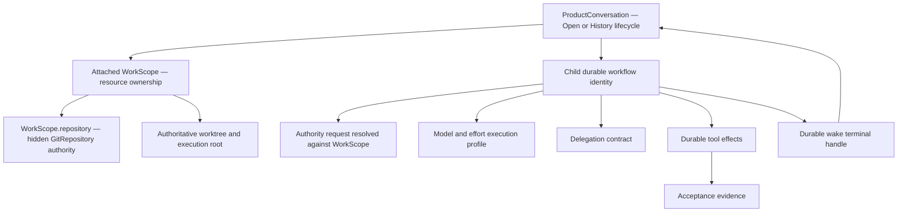
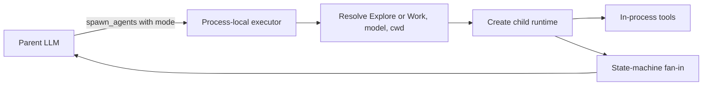
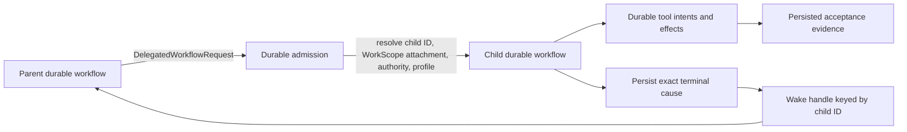
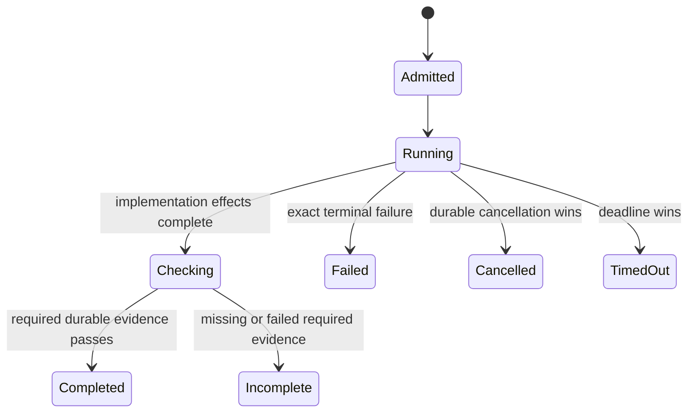

# General high-effort, low-cost implementation-worker design

## Outcome

**Recommendation:** implement this as a general **delegated workflow profile** above Phoenix's target authority stack, not as a special `coding-agent` and not as an extension of today's `Work`/`Explore` mode taxonomy.

The user-visible idea decomposes into four independent values:

1. **Role** — implementation-oriented instructions and expected behavior.
2. **Execution profile** — a registered model plus optional explicit reasoning effort.
3. **Authority request** — read-only or write-capable access to the parent's attached environment.
4. **Delegation contract** — a bounded objective plus an explicit acceptance method.

The target implementation worker is a first-class durable sub-agent workflow whose stable identity is its child conversation/agent ID. It attaches to the parent's `WorkScope`, derives repository and execution-root authority through that scope, executes tools through durable tool effects, and delivers one durable terminal outcome through the wake plane. Terra, GLM 5.2, or another model are configuration choices for the execution profile, never worker types.

This corrects an earlier version of this design that treated today's mode-oriented `SubAgentSpec` and one-writer executor as the enduring architecture. Those are compatibility implementation details, not the stack new work should design against.

## Evidence classification

- **Target authority** means accepted normative specifications or active roadmap delivery authority.
- **Current compatibility** means behavior in today's runtime that may remain temporarily but must not shape the new domain model.
- **Recommendation** means a proposed design choice.

Upstream Codex citations are pinned to `openai/codex@f898ebcafdeb0052abc844d9e11b5e754b8ec4af`.

---

## 1. Roadmap position and dependency stack

Issue #651 currently places this work above several active or sequenced authorities:

| Layer | Roadmap authority | Consequence for this design |
|---|---|---|
| Hidden repository substrate | R1, task 55006 / PR #677 | Repository identity and observations become typed hidden infrastructure. |
| Repository authority cutover | R2, task 59004 | Correctness-sensitive repository decisions flow through `ProductConversation → WorkScope.repository → hidden GitRepository`; Project/path fallback is forbidden. |
| Product lifecycle | ProductConversation task 92009 and ADR-026 | ProductConversation owns Open/History; WorkScope owns resources; transcript rows own execution history. |
| Durable workflow authority | durable-workflow roadmap, including tasks 47007 and 78009 | Child lifecycle and tool execution move to durable workflow claims/effects rather than process-local orchestration. |
| Parallel write-capable children | task 14003 | Multiple implementation children require a structural conflict boundary; today's single-writer rule is not the final product architecture. |

The roadmap reports R1 implementation active, R2 planned and blocked on R1, ProductConversation implementation intentionally paused for sequencing, and the durable-workflow program active. Therefore this task should define a consumer of those target boundaries, not add another mode-owned authority that R2/ProductConversation/durable-workflow must later unwind.

### Target authority graph



### Ownership boundaries

- **ProductConversation** owns the user-facing Open/History lifecycle and Close orchestration.
- **Conversation rows** remain transcript/execution segments; continuation topology is `continued_in_conv_id`.
- **WorkScope** owns worktrees, terminals, processes, browser state, and equivalent resources.
- **WorkScope.repository → hidden GitRepository** is the sole repository authority after R2. Paths, branches, remotes, slugs, and legacy Project values are observations/projections, never identity.
- **Child conversation/agent ID** is the durable sub-agent workflow identity. Parent WorkScope is attachment/authority metadata, not child identity.
- **Durable workflow claims and effects** own attempts, deadlines, cancellation, terminal cause, and tool execution/recovery.
- **Model adapters** translate the resolved model/effort request; they do not select roles, authority, or delegation policy.

Sources:

- Issue #651 current roadmap projection.
- R1 task 55006 / PR #677.
- R2 task 59004: atomic authority path `ProductConversation → WorkScope.repository → hidden GitRepository`.
- `specs/adrs/026_workscope-owned-lifecycle-unifies-conversation-handoffs.md`.
- `tasks/92009-p1-in-progress--unify-conversation-workstream-lifecycle.md`.
- `tasks/47007-p1-ready--durable-subagent-workflow-migration.md`.
- `tasks/78009-p0-ready--durable-turn-tool-effects.md`.
- `tasks/14003-p1-blocked--parallel-work-subagent-lifecycle.md`.

---

## 2. Provider- and model-neutral concept model

| Concept | Question answered | Authoritative owner | Example |
|---|---|---|---|
| **Role** | What behavior/expertise should the child apply? | Named-agent definition | `implementation-worker` |
| **Execution profile** | Which registered model and explicit effort run it? | Resolved workflow input | Terra + medium; GLM 5.2 + high |
| **Authority request** | Which capabilities does this child need? | Workflow admission against attached WorkScope | read-only; write-capable |
| **Delegation contract** | What bounded outcome is requested? | Persisted child workflow input | implement parser behavior X |
| **Acceptance method** | What observable evidence demonstrates completion? | Delegation contract | test argv, check target, typed predicate |
| **Resource budget** | How much may the workflow consume? | Durable workflow policy | deadline, max turns, attempts, concurrency |
| **Terminal outcome** | How did execution end? | Durable child terminal cause | completed, error, timeout, cancellation |
| **Acceptance evidence** | What did authoritative effects observe? | Durable tool-effect results | command, exit code, bounded output |

### Critical distinctions

- Role is not model identity.
- Model identity is not economic classification. “Cheap” and “fast” remain operator judgments until Phoenix has measured or operator-authored routing metadata.
- Authority is not a conversation mode.
- WorkScope attachment is not child identity or lifecycle ownership.
- A worker's prose claim is not acceptance evidence. A persisted durable tool result can be evidence.
- A branch, PR, path, or legacy Project ID never grants repository authority.

---

## 3. Current compatibility model versus target model

### Current compatibility flow



Today:

- `spawn_agents` exposes `mode: explore | work`.
- write-capable admission is expressed through Work mode and a process-local active-writer count;
- model defaults are mode-derived;
- spawn/fan-in is special-cased in the executor;
- in-flight child runtimes do not survive restart;
- restart synthesis converts unfinished children to interrupted fan-in outcomes.

These facts remain relevant for compatibility and migration tests, but they are not the proposed domain vocabulary.

### Target flow



The current `spawn_agents` tool can remain compatibility sugar and lower onto this flow, as REQ-SA-009 already permits. It should not remain the lifecycle authority.

---

## 4. General delegated-workflow request

The request should be typed around durable workflow semantics rather than modes:

```rust
pub struct DelegatedWorkflowRequest {
    pub role: Option<AgentRoleId>,
    pub objective: NonEmptyString,
    pub capability: RequestedCapability,
    pub execution: ExecutionProfileOverride,
    pub acceptance: AcceptanceRequirement,
}

pub enum RequestedCapability {
    ReadOnly,
    WriteAttachedEnvironment,
}

pub struct ExecutionProfileOverride {
    pub model: Option<RegisteredModelId>,
    pub reasoning_effort: Option<ModelEffort>,
}

pub enum AcceptanceRequirement {
    Narrative,
    Deterministic(NonEmpty<AcceptanceCheck>),
}

pub enum AcceptanceCheck {
    Command {
        program: String,
        args: Vec<String>,
        cwd: WorkScopeRelativePath,
        timeout: BoundedDuration,
    },
}
```

### Why this is not another parallel representation

- This request becomes the authoritative persisted input to the child durable workflow.
- The model prompt is rendered from it; prompt prose is a view, not a second authority.
- `spawn_agents` compatibility input is translated once at admission and discarded as authority.
- The request expresses intent only. The admitted durable workflow snapshot—not this request—owns concrete model, effort, granted authority, attached WorkScope identity/generation, execution root, attempt/deadline, and role version.
- Repository identity is not present in the LLM-visible/tool input. Runtime authority resolves it internally through the exact WorkScope attachment.

### Role definition

A named implementation role can remain a discovered configuration artifact:

```yaml
---
name: implementation-worker
description: Implements a bounded objective with an explicit acceptance method
model: gpt-5.6-terra
reasoning_effort: medium
---
Implement the supplied objective within granted authority.
Use the supplied acceptance method and report incomplete work as incomplete.
```

An operator can choose GLM 5.2 instead without changing the role or runtime:

```yaml
model: gateway-provider/z-ai/glm-5.2
reasoning_effort: high
```

Role files supply defaults and behavior, never authority. They cannot grant write access, select a WorkScope, identify a repository, extend deadlines, or redefine terminal success.

---

## 5. Atomic model and effort resolution

Codex's strongest reusable idea is that role defaults and spawn overrides may jointly select model and reasoning effort. Phoenix should adopt that configuration capability at the durable workflow admission boundary, not its recursive agent control plane.

Recommended precedence:

```text
model = request override
     ?? role default
     ?? authority-policy default

effort = request override
      ?? role default
      ?? explicit parent override required by REQ-LLM-004d
      ?? selected model native default or omission

validate final pair against the frozen model registry snapshot
persist the resolved pair and provenance on the child workflow/conversation
```

The authority-policy default is phrased without modes:

- read-only delegation may default to the configured low-cost model for the provider family;
- write-capable delegation may default to the parent's model;
- either can be overridden with a registered model.

### Capability handling

| Effort capability | Explicit effort | Admission/translation |
|---|---|---|
| Supported and level allowed | present | Accept and translate |
| Supported but level invalid | present | Reject with allowed levels |
| Unsupported | present | Reject; do not silently erase requested semantics |
| Unknown | present | Preserve internal selection, omit native field, emit structured omission provenance |
| Any | absent | Use existing native-default/omission behavior |

This preserves the `Supported` / `Unknown` / `Unsupported` distinction and REQ-LLM-004e behavior. The adapter owns only native field translation and capability-gap telemetry.

---

## 6. Acceptance without a second validation engine

The previous design proposed a new post-worker validator subsystem too early. The durable-effects roadmap provides a smaller and stronger boundary.

### Recommended first contract

For an implementation role, admission requires `AcceptanceRequirement::Deterministic` with at least one check. The worker receives a rendered view of those checks and executes them through ordinary durable tool intents. Completion admission then requires persisted matching tool-effect evidence.



The worker may decide when to run checks, but it cannot manufacture the authoritative result: the tool-effect lifecycle persists command identity, completion, exit status, and bounded output. The terminal reducer admits `Completed` only when every required check has lineage-proven passing evidence: durable tool-effect references must match the admitted child ID, exact attempt ID, acceptance-check identity, and authoritative WorkScope generation. “Any passing command from this child” is never sufficient.

This avoids:

- trusting a prose claim that tests passed;
- running every validator twice;
- introducing a separate validation process/lifecycle/table before durable tool effects land;
- allowing stale evidence from another attempt or worktree generation to count.

### Later independent verification

If product evidence shows that independent re-verification is valuable, model it as another durable workflow/effect consuming the same typed acceptance contract. Do not embed an ad hoc validator loop in the sub-agent executor.

### When no deterministic method exists

Use a different contract/role:

- exploratory or advisory delegation may use `AcceptanceRequirement::Narrative`;
- an implementation-worker request is rejected if deterministic acceptance is absent;
- the coordinator can perform the trivial edit directly or reformulate a bounded acceptance method.

This makes the prior-art requirement structural for the implementation role without imposing command validation on every sub-agent.

---

## 7. Repository, WorkScope, and filesystem authority

After R2, a write-capable child is admitted only when the parent ProductConversation has an attached WorkScope with:

1. a present authoritative worktree identity/execution root;
2. a `WorkScope.repository` attachment to hidden GitRepository authority where Git-backed;
3. an authority generation valid for the child claim;
4. no unresolved, stale, inaccessible, or conflicting identity evidence.

The child receives a capability to the attached environment, not repository IDs or path-derived authority.

### Required invariants

- Every tool execution root derives from the exact WorkScope and authoritative worktree registry.
- `cwd` overrides are WorkScope-relative typed paths, never arbitrary authority-bearing strings.
- Path canonicalization and containment are revalidated before persistence/execution.
- A Direct non-repository scope remains an explicit typed case; it never fabricates Git authority.
- A repository created after scope creation uses R2's shared typed WorkScope attachment transition before repository-sensitive capabilities execute.
- Hidden GitRepository IDs never enter agent prompts, tool schemas, public DTOs, or compatibility projections.
- Branches and PRs remain observed artifacts. The implementation worker may operate Git normally within authority, but its workflow does not own branch/PR lifecycle.
- Close settles/cancels child workflows through one typed durable operation before WorkScope retirement.

---

## 8. Concurrency and write-conflict policy

Today's one-write-child rule is a safe compatibility policy, not the final abstraction.

The durable request expresses `WriteAttachedWorkScope`; a separate admission policy decides how concurrent write-capable children are made safe. Task 14003 requires one structural boundary covering patch, bash, Git, and every writable path:

1. serialize write effects;
2. isolate children into distinct write targets and reconcile;
3. use enforceable ownership/leases over disjoint paths/resources; or
4. detect and reject conflicts before mutation.

Prompt instructions and “these tasks touch different files” are not correctness boundaries.

### Recommended delivery posture

- Initially lower write-capable workflows onto serialization while the durable child/result-delivery migration lands.
- Do **not** encode `max_one_writer` into role, request, persisted identity, or product vocabulary.
- Let task 14003 choose the eventual write-conflict boundary after the ProductConversation Close/sub-agent settlement seam stabilizes.
- Read-only workflows remain independently parallel subject to session/resource budgets.

This lets the implementation-worker design survive the desired parallel-work-child feature rather than opposing it.

---

## 9. Durable lifecycle, persistence, and recovery

Build on task 47007's sub-agent durable workflow profile:

- child conversation/agent ID is stable resource identity;
- parent ID and WorkScope are routing/ownership metadata;
- child materialization has one typed completion and exactly-once objective bootstrap;
- claims, attempts, deadlines, cancellation, continuation, and runtime acceptance use durable workflow authority;
- exact terminal causes persist across restart/replay;
- parent result delivery remains durable until exact parent acceptance;
- route replacement/reconstruction cannot lose terminal delivery;
- `spawn_agents` fan-in becomes a projection over durable wake contracts.

### Suggested persisted responsibilities

Use the existing durable workflow/child/effect schemas as they land; do not pre-freeze duplicate tables in this task. The authoritative records must nevertheless represent:

- immutable admitted request and role/version snapshot;
- resolved model/effort and provenance;
- child ID, parent ID, attached WorkScope identity and authority generation;
- attempt, deadline, cancellation, and exact terminal cause;
- durable acceptance checks;
- matching durable tool intents/results used as evidence;
- parent delivery ownership and acceptance.

Acceptance checks form an addressable child collection and therefore belong in rows if persistence is added; never serialize them as a JSON array blob.

### Restart rules

1. Persisted terminal outcome remains deliverable after restart.
2. A running process disappearing is not automatically success or generic failure; recovery resolves from durable claim/effect state and exact terminal taxonomy.
3. Acceptance evidence counts only for the admitted attempt and WorkScope authority generation.
4. A claimed tool effect with uncertain completion follows durable tool-effect recovery; no duplicate command is launched merely because the process restarted.
5. Close and cancellation use the same durable child settlement operation; no parallel cancellation lifecycle is introduced.

---

## 10. Codex comparison and translation boundary

### Confirmed upstream behavior

Codex provides useful configuration evidence:

- `[agents]` supports a session thread limit, default sub-agent model, and default sub-agent reasoning effort in [`AgentsToml`](https://github.com/openai/codex/blob/f898ebcafdeb0052abc844d9e11b5e754b8ec4af/codex-rs/config/src/config_toml.rs#L660-L695).
- Named roles are layered config files in [`AgentRoleToml`](https://github.com/openai/codex/blob/f898ebcafdeb0052abc844d9e11b5e754b8ec4af/codex-rs/config/src/config_toml.rs#L697-L710) and [`apply_role_to_config`](https://github.com/openai/codex/blob/f898ebcafdeb0052abc844d9e11b5e754b8ec4af/codex-rs/core/src/agent/role.rs).
- `spawn_agent` accepts role, model, reasoning effort, service tier, and optional context fork in [`SpawnAgentArgs`](https://github.com/openai/codex/blob/f898ebcafdeb0052abc844d9e11b5e754b8ec4af/codex-rs/core/src/tools/handlers/multi_agents/spawn.rs).
- Model and effort defaults/overrides are validated together in [`multi_agents_common.rs`](https://github.com/openai/codex/blob/f898ebcafdeb0052abc844d9e11b5e754b8ec4af/codex-rs/core/src/tools/handlers/multi_agents_common.rs).
- Codex has a session-scoped collaboration control plane with spawn edges, messaging, waiting, resumption, closure, and resource limits in [`AgentControl`](https://github.com/openai/codex/blob/f898ebcafdeb0052abc844d9e11b5e754b8ec4af/codex-rs/core/src/agent/control.rs) and [`AgentRegistry`](https://github.com/openai/codex/blob/f898ebcafdeb0052abc844d9e11b5e754b8ec4af/codex-rs/core/src/agent/registry.rs).
- Lifecycle status is thread-oriented in [`AgentStatus`](https://github.com/openai/codex/blob/f898ebcafdeb0052abc844d9e11b5e754b8ec4af/codex-rs/protocol/src/protocol.rs#L1736-L1755).

### Responsibility matrix

| Concern | Phoenix target stack | Codex/provider adapter |
|---|---|---|
| Product lifecycle and Close | Owns | No |
| WorkScope/resource authority | Owns | No |
| Hidden repository identity and worktree root | Owns | No |
| Role selection and delegation contract | Owns | No |
| Child durable identity/claims/wake delivery | Owns | No |
| Tool-effect durability and acceptance evidence | Owns | No |
| Concurrency/write-conflict policy | Owns | No |
| Internal effort selection/provenance | Owns | No |
| Native reasoning field/value mapping | No | Owns |
| Provider auth, wire events, stream normalization | No | Owns |
| Codex AgentControl/thread graph | Do not import as authority | Upstream implementation detail |

**Translation boundary:** durable workflow admission resolves one concrete model and `EffectiveEffort`. `LlmService` receives those values. The provider adapter translates supported native fields or emits structured omission provenance. It never decides whether a child may write, which WorkScope/repository it targets, whether acceptance passed, or how results are delivered.

---

## 11. Architecture options

### Option A — Persona-only compatibility configuration

Add an implementation persona with model and effort defaults and instruct it to require tests.

**Advantages:** quick experiment; no workflow change.

**Problems:** authority remains mode-shaped; acceptance remains prompt discipline; terminal claims are not bound to durable evidence; migration debt is created against tasks 47007/78009.

**Use:** temporary dogfood only, not the target implementation.

### Option B — Extend today's mode-oriented spawn executor

Add `reasoning_effort` to `TaskSpec`, resolve it beside model, and preserve the current special-cased fan-in/one-writer runtime.

**Advantages:** smallest code diff today.

**Problems:** designs directly against compatibility boundaries the roadmap is replacing; encodes mode defaults and process-local admission more deeply; still lacks durable effect evidence and restart-safe delivery.

**Recommendation:** do not choose as the implementation architecture. A narrow compatibility adapter may temporarily translate this schema to Option C.

### Option C — Durable delegated workflow profile (**recommended**)

Add role/model/effort/authority/acceptance fields to the durable sub-agent workflow input, lower existing `spawn_agents` onto it, and use durable tool effects as acceptance evidence.

**Advantages:** aligned with roadmap authorities; provider-neutral; correct-by-construction implementation contract; restart-safe terminal delivery; compatible with future parallel write policy; no second validator engine.

**Cost:** must sequence after or with the relevant durable sub-agent/tool-effect boundaries and consume the post-R2 WorkScope repository API rather than freezing current names.

### Rejected — Import Codex collaboration runtime

Making Codex AgentControl authoritative would duplicate Phoenix lifecycle, WorkScope, repository, effect, cancellation, and wake authorities and would exclude non-Codex providers. Codex remains provider/runtime evidence, not Phoenix orchestration authority.

---

## 12. Incremental delivery plan

### Slice 0 — Compatibility preparation and guardrails

Before implementation:

1. Re-read Issue #651 and consume whichever R1/R2, ProductConversation, durable child-workflow, and durable tool-effect APIs have landed.
2. Update `specs/agents`, `specs/subagents`, and `specs/llm` to remove mode wording from this path and define role/profile/capability/acceptance precedence.
3. Add or amend Allium for durable child admission, evidence-bound completion, and terminal delivery.
4. Confirm the stable ProductConversation Close/sub-agent settlement seam with task 14003/Close owners.

This is a non-blocking preparation slice, not a new authority or a requirement to wait for the entire roadmap. Model/effort parsing and compatibility translation may land independently, but this slice must not add lifecycle authority, freeze duplicate persistence structures, or deepen mode-owned runtime semantics.

### Slice 1 — Model/effort role configuration

**User value:** operators can define an implementation role using Terra, GLM 5.2, or any registered model at an explicit supported effort.

- add optional `reasoning_effort` beside existing named-agent model defaults;
- validate model/effort atomically against one frozen registry snapshot;
- persist resolved pair/provenance in the durable child input;
- expose effective model/effort in bounded diagnostics.

**Tests:** role parsing; override precedence; invalid pair rejection; unknown/unsupported behavior; external GLM-style fixture and Terra fixture use the same code path; restart reproduces the resolved pair without rereading mutable role files.

### Slice 2 — Implementation delegation contract

**User value:** coordinators can delegate a bounded implementation only with an explicit deterministic acceptance method.

- add requested capability and `AcceptanceRequirement` intent to durable workflow input; admission resolves the actual authority;
- make implementation role admission reject narrative-only acceptance;
- render the authoritative contract into the child prompt;
- resolve attached WorkScope and generation through post-R2 authority;
- initially serialize write-capable child execution as policy, without encoding serialization into domain identity.

**Tests:** no-check implementation request unconstructable/rejected; role cannot escalate authority; stale/missing/conflicting WorkScope/repository evidence fails closed; Direct non-Git remains typed; hidden repository identity never reaches prompt/tool wire.

### Slice 3 — Evidence-bound completion

**Hard dependency:** durable tool-effect persistence and child-ID wake/result delivery must already be authoritative. Otherwise this slice would create a process-local compatibility authority and must not land.

**User value:** Phoenix reports completion only when the configured acceptance checks have authoritative passing tool-effect evidence.

- bind acceptance checks to durable tool intents/results;
- admit successful terminal completion only with current-attempt/current-generation evidence;
- preserve failed/missing checks as typed incomplete outcomes;
- deliver through child-ID wake contracts and durable parent result sink.

**Tests:** crash at each claim/effect/terminal/delivery boundary; duplicate suppression; stale attempt/generation evidence rejection; timeout/cancel/result deterministic winner; parent reconstruction does not lose delivery; Close settles through one operation.

### Slice 4 — Parallel write policy integration

Owned primarily by task 14003. Replace initial serialization only after an enforceable conflict/isolation boundary covers all writable tools. The implementation-worker request shape remains unchanged.

---

## 13. Product choices

Recommended choices are bold.

### A. Where does the feature live?

1. Special coding-agent runtime.
2. Today's Work-mode spawn executor.
3. **Durable delegated sub-agent workflow profile.**

### B. What identifies a worker?

1. Parent WorkScope.
2. Role name.
3. **Stable child conversation/agent ID; role and WorkScope are metadata.**

### C. What grants write access?

1. Persona prose.
2. Work mode.
3. **Typed authority request admitted against the exact attached WorkScope and authority generation.**

### D. What proves implementation completion?

1. Worker prose.
2. Always rerun validators in a new subsystem.
3. **Persisted matching durable tool-effect evidence; independent re-verification may be another workflow later.**

### E. What if no deterministic acceptance method exists?

1. Let implementation role proceed anyway.
2. **Reject that role contract; use exploratory delegation or execute directly after reformulation.**
3. Invent a generic test automatically.

### F. How is “cheap/fast” selected?

1. Hard-coded model list.
2. Model-name/provider heuristics.
3. **Operator-selected registered model/effort now; measured or operator-authored routing metadata only if automatic policy is later justified.**

### G. What is the write concurrency rule?

1. Permanent one-writer domain invariant.
2. Prompt-assigned disjoint files.
3. **Policy-backed serialization initially; task 14003 may replace it with a structural conflict/isolation boundary without changing the request model.**

---

## 14. Final recommendation

Build the idea on the target stack:

```text
ProductConversation parent
→ attached WorkScope
→ WorkScope.repository / authoritative worktree root
→ durable child workflow keyed by child ID
→ role + registered model + explicit effort
→ requested capability resolved to typed authority + deterministic acceptance contract
→ durable tool effects as acceptance evidence
→ durable terminal cause and wake delivery
```

Do not add a special `coding-agent`, a model-name branch, a Work-mode-owned execution profile, a second validator lifecycle, or a Codex-owned collaboration runtime.

This preserves the useful part of the prior art—coordinator-directed bounded implementation on a cost-effective model at deliberate reasoning effort—while composing with Phoenix's planned repository authority, ProductConversation lifecycle, durable child workflow, durable tool-effect, and future parallel-write architecture.
