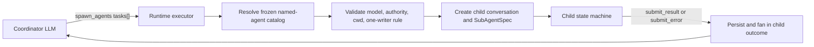
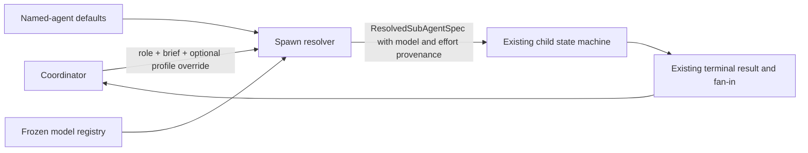
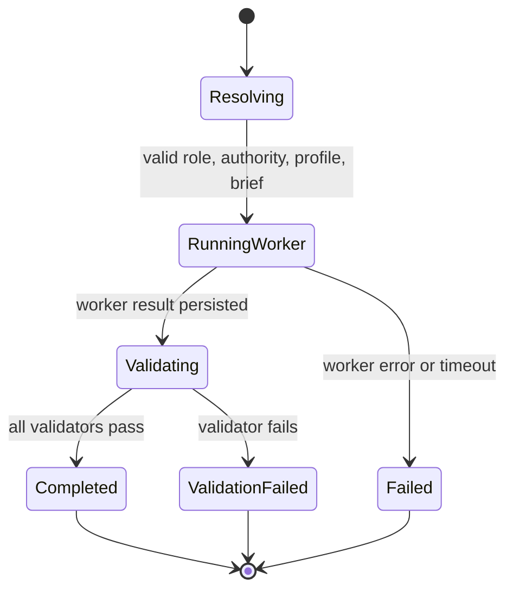
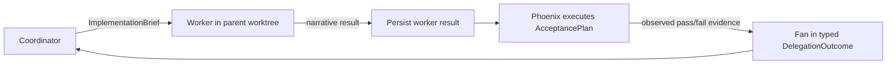

# General high-effort, low-cost coding-worker design

## Outcome

**Recommendation:** do not add a special `coding-agent` runtime and do not make Codex's collaboration control plane authoritative for Phoenix lifecycle. Extend Phoenix's existing named-agent and sub-agent model in two independent increments:

1. Add optional explicit reasoning effort beside the existing model field in named-agent defaults and per-spawn overrides, then resolve the pair atomically into Phoenix's existing child conversation fields. “Execution profile” is useful terminology for that pair, not a required new runtime aggregate. This is the smallest change that expresses “run this role on Terra at medium effort” or “run this role on GLM 5.2 at high effort.”
2. If deterministic implementation delegation proves useful, add a typed **implementation brief** whose validation plan is structurally required, then let the Phoenix state machine execute that plan after the worker returns. Do not treat developer-instruction prose or a worker's claim that tests passed as deterministic validation.

The first increment supplies the requested model/effort behavior. The second is a separate workflow capability and should not block the first.

The terms “cheap” and “fast” remain operator judgments, not Phoenix domain values. Phoenix selects a configured model ID and effort; it does not infer price or quality from model names.

## Evidence classification

- **Confirmed** statements below are backed by current Phoenix specs/code or pinned upstream Codex code.
- **Recommended** statements are proposed design choices, not current behavior.

Upstream Codex citations are pinned to `openai/codex@f898ebcafdeb0052abc844d9e11b5e754b8ec4af`.

---

## 1. Concept model

The prior art combines several independent dimensions. Phoenix should name them separately:

| Concept | Question answered | Owner | Example |
|---|---|---|---|
| **Agent role** | What behavior and expertise should the child have? | Named-agent catalog | `implementation-worker` |
| **Execution authority** | May it write, and where? | Phoenix mode/worktree policy | `write_capable` in parent's worktree |
| **Execution profile** | Which model and explicit reasoning setting should run it? | Registry-validated spawn resolution | Terra + medium; GLM 5.2 + high |
| **Delegation brief** | What outcome is delegated? | Coordinator/tool call | “Implement parser behavior X” |
| **Acceptance plan** | What machine-observable condition proves the outcome? | Delegation workflow | selected test/check commands |
| **Resource budget** | How much execution may it consume? | Parent/session policy | max turns, timeout, concurrency |
| **Result** | What did the child report? | Child terminal lifecycle | summary/error |
| **Validation evidence** | What did Phoenix independently observe? | Validation effect | command, exit status, bounded output |

Two distinctions are especially important:

- A role is not a model. `implementation-worker` can run on Terra, GLM 5.2, or a future model.
- A result is not validation evidence. A model-generated statement such as “all tests pass” is useful narrative, but only a Phoenix-observed validator result is deterministic evidence.

Suggested terminology avoids “cheap model agent” in persisted/API types:

```text
NamedAgentDefinition
  ├── role instructions
  ├── default execution authority
  └── default execution profile

DelegationBrief
  ├── ExploratoryBrief
  └── ImplementationBrief + AcceptancePlan
```

---

## 2. Current Phoenix model

### Confirmed flow



- `SpawnAgentsTool` exposes a dynamically typed `agent_type` enum and known model IDs. The tool parser itself does not spawn; `ToolRegistryExecutor::handle_spawn_agents_tool` performs authoritative resolution and dispatch (`crates/phoenix-tools/src/subagent.rs`, `crates/phoenix-ide/src/runtime/executor.rs`).
- Named agents are discovered once and frozen per conversation. `AgentDefinition` currently carries name, description, persona body, optional model, optional authority/mode compatibility data, and parsed-but-inert tools (`crates/phoenix-agents/src/lib.rs`; `specs/agents/agents.allium`, `InjectAgentTypeEnum`).
- A named persona replaces only the generic prompt preamble; grounding and the terminal submission suffix remain (`specs/agents/agents.allium`, `ComposeSubAgentPersona`; `crates/phoenix-ide/src/system_prompt.rs`).
- Spawn resolution already separates authority and model. Read-only children default to a provider-associated cheap model; write-capable children default to the parent model. Explicit model overrides must exist in the frozen registry (`specs/subagents/subagents.allium`, `SubAgentSpecsResolved`; `ToolRegistryExecutor::handle_spawn_agents_tool`).
- Write-capable children inherit the parent's worktree authority. Phoenix allows at most one active writer per parent, while read-only children may run concurrently (`specs/subagents/subagents.allium`, `SpawnRejectedMultipleWorkInBatch` and `SpawnRejectedWorkSubAgentAlreadyActive`).
- A child must terminate through `submit_result` or `submit_error`; fan-in is part of the parent state machine (`specs/subagents/requirements.md`, REQ-SA-003/004; `phoenix-state-machine/src/transition.rs`).
- Child persona and conversation state are persisted. On process restart, currently running children do not continue executing; Phoenix synthesizes interrupted fan-in outcomes while preserving already-finished outcomes (`crates/phoenix-db/src/lib.rs`, `set_sub_agent_persona`, `synthesize_spawn_fan_ins`; `specs/subagents/subagents.allium`).

### Current model/effort behavior

Phoenix already has the provider-neutral effort vocabulary and conversation/provider plumbing needed as a base, but it does **not** yet expose sub-agent role defaults or spawn overrides for effort:

- `EffortCapabilities` distinguishes `Supported`, `Unknown`, and `Unsupported` (`crates/phoenix-llm/src/models.rs`; REQ-LLM-003b).
- `EffectiveEffort` records value and provenance (`crates/phoenix-core/src/domain/llm_types.rs`).
- Provider translation emits a native effort field only for known support and records omission reasons (REQ-LLM-004a/e/f and REQ-LLM-008a).
- A child inherits only an explicit parent effort override, not the parent's resolved model-native default (REQ-LLM-004d).

What is missing for the requested use case is a named-agent effort default or per-task effort override. Today a named agent can select a model and authority, but cannot independently say “use this explicit effort when this role is spawned.”

### Current gaps relevant to this design

1. **No role-level effort default.** The requested pairing can only be approximated by changing parent state or model defaults.
2. **Task intent is unstructured.** The surrounding spawn shape and terminal lifecycle are already typed, but `TaskSpec.task` and terminal output remain strings; Phoenix cannot structurally distinguish an implementation brief with required acceptance from ordinary research.
3. **Validation is model-owned.** A persona can ask the worker to run tests, but the state machine does not independently execute or persist an acceptance plan.
4. **Persona is opaque prompt text.** This is appropriate for behavioral guidance, but it must not become the authority for execution permissions or validation requirements.
5. **Model economics are not registry facts.** `cheap_model_id_for_provider` is a built-in routing convenience, not a general cost/latency policy for external models.

---

## 3. What Codex's agent model demonstrates

### Confirmed upstream behavior

Codex has a session-scoped collaboration control plane with recursive thread-spawn support:

- `[agents]` supports a session thread limit, default sub-agent model, and default sub-agent reasoning effort in `codex-rs/config/src/config_toml.rs` (`AgentsToml` fields `max_concurrent_threads_per_session`, `default_subagent_model`, and `default_subagent_reasoning_effort`).
- Named roles are config layers. `AgentRoleToml` points to a role-specific config file. `apply_role_to_config*` overlays that layer while preserving caller-owned provider, service tier, model, effort, base instructions, sandbox, approval policy, and cwd unless overridden. Developer-instruction preservation differs between the standard and multi-agent-v2 paths (`codex-rs/core/src/agent/role.rs`; `codex-rs/core/src/tools/handlers/multi_agents_common.rs`).
- `spawn_agent` accepts an `agent_type`, model, reasoning effort, service tier, and optional history fork. Call overrides fall back to configured sub-agent defaults; when a model changes without explicit effort, its native default is selected, while explicit effort is validated against the selected model (`codex-rs/core/src/tools/handlers/multi_agents/spawn.rs`, `SpawnAgentArgs`; `multi_agents_common.rs`, `apply_requested_spawn_agent_model_overrides`).
- `AgentControl` is session-shared and persists parent/child spawn edges. The collaboration tool surface can spawn descendants, send input, wait, resume, and close agents (`codex-rs/core/src/agent/control.rs`; `codex-rs/core/src/tools/handlers/multi_agents.rs`).
- Agent lifecycle is thread-oriented: `PendingInit`, `Running`, `Interrupted`, `Completed`, `Errored`, `Shutdown`, or `NotFound` (`codex-rs/protocol/src/protocol.rs`, `AgentStatus`).
- Spawn edges and role metadata are persisted, and Codex can reload/resume descendants (`codex-rs/core/src/agent/control/spawn.rs`).
- A session-wide spawn-count reservation and a separate execution-capacity limiter bound different resource dimensions (`codex-rs/core/src/agent/registry.rs`; `codex-rs/core/src/agent/control/execution.rs`).
- Multi-agent usage hints are conditional developer messages and can vary between root and child sessions; disabled/empty hints are omitted (`codex-rs/core/src/session/multi_agents.rs`; `codex-rs/core/src/session/world_state.rs`). `effective_multi_agent_mode` selects proactive mode at `Ultra` effort when no explicit mode hint is configured, and suppresses collaboration mode for non-thread-spawn sub-agents.

Stable source examples:

- [`AgentsToml`](https://github.com/openai/codex/blob/f898ebcafdeb0052abc844d9e11b5e754b8ec4af/codex-rs/config/src/config_toml.rs#L660-L695)
- [`AgentRoleToml`](https://github.com/openai/codex/blob/f898ebcafdeb0052abc844d9e11b5e754b8ec4af/codex-rs/config/src/config_toml.rs#L697-L710)
- [`apply_role_to_config`](https://github.com/openai/codex/blob/f898ebcafdeb0052abc844d9e11b5e754b8ec4af/codex-rs/core/src/agent/role.rs)
- [`SpawnAgentArgs` and spawn flow](https://github.com/openai/codex/blob/f898ebcafdeb0052abc844d9e11b5e754b8ec4af/codex-rs/core/src/tools/handlers/multi_agents/spawn.rs)
- [`build_agent_spawn_config` and effort validation](https://github.com/openai/codex/blob/f898ebcafdeb0052abc844d9e11b5e754b8ec4af/codex-rs/core/src/tools/handlers/multi_agents_common.rs)
- [`AgentControl`](https://github.com/openai/codex/blob/f898ebcafdeb0052abc844d9e11b5e754b8ec4af/codex-rs/core/src/agent/control.rs)
- [`AgentRegistry`](https://github.com/openai/codex/blob/f898ebcafdeb0052abc844d9e11b5e754b8ec4af/codex-rs/core/src/agent/registry.rs)
- [`AgentStatus`](https://github.com/openai/codex/blob/f898ebcafdeb0052abc844d9e11b5e754b8ec4af/codex-rs/protocol/src/protocol.rs#L1736-L1755)

### Important lesson, not a template

Codex confirms that model and effort are useful role defaults and spawn overrides. It does **not** establish that Phoenix should adopt Codex's recursive spawn-edge control plane, history forking, inter-agent messaging, or layered TOML config as domain concepts.

Phoenix deliberately has a different model:

- children cannot recursively spawn children (REQ-BED-009);
- the parent awaits bounded fan-in rather than managing an open-ended agent graph;
- write authority is tied to Phoenix-owned worktrees and one-writer invariants;
- lifecycle is driven by pure state-machine transitions and effects;
- provider translation is behind `LlmService`, including Phoenix's Codex bridge.

### Responsibility matrix

| Concern | Phoenix domain/runtime | Provider or Codex adapter |
|---|---|---|
| Role discovery and selection | Owns | No |
| Delegation brief and acceptance plan | Owns | No |
| Worktree/write authority | Owns | No |
| Child lifecycle, persistence, cancellation, fan-in | Owns | No |
| Concurrency and max-turn/timeout budgets | Owns | No |
| Internal effort selection and provenance | Owns | No |
| Supported/unknown/unsupported capability | Owns registry classification | Adapter reports/translates facts |
| Native effort field/value vocabulary | No | Owns |
| OpenAI Responses/Codex auth and wire events | No | Owns |
| Provider-specific omission/fallback logging | Requires observable behavior | Performs translation/logging |
| Codex `AgentControl`, role layers, thread graph | Do not import | Remains an upstream Codex runtime detail |

**Translation boundary:** Phoenix resolves one concrete child `ExecutionProfile` before invoking the LLM service. The adapter receives the resolved internal effort and capability classification, translates it if supported, or omits it with structured telemetry if unknown/unsupported. The adapter never selects the worker role or decides whether to delegate.

---

## 4. Proposed flow

### Minimal execution-profile increment



This changes resolution, not lifecycle.

### Later validated-implementation increment





The validator runs only after the worker terminal transition, so there is still one writer. It uses the same bounded worktree/cwd authority as the child and is a state-machine effect, not an ad hoc loop.

---

## 5. Architecture options

### Option A — Persona prose only

Create an `implementation-worker` named agent with Terra or GLM 5.2 as its default model and instructions requiring a task plus deterministic validation.

**Pros**
- Almost no runtime change.
- Immediately improves coordinator behavior.
- Existing named-agent selection, worktree isolation, and fan-in remain intact.

**Cons**
- Current Phoenix named agents cannot set explicit effort.
- “Require validation” is only prompt discipline.
- The task and validation method remain one opaque string.
- A worker can incorrectly claim success and Phoenix cannot distinguish it from observed success.

**Use:** local experiment or bootstrap fixture, not the final general abstraction.

### Option B — General execution profiles on existing named agents (**recommended first**)

Add optional effort to named-agent defaults and per-spawn overrides. Resolve model and effort atomically into `SubAgentSpec`; keep the existing child lifecycle.

**Pros**
- Directly enables Terra/medium, GLM 5.2/high, and future combinations.
- Provider-neutral and small.
- Uses Phoenix's existing effort capability model and observability.
- Role, authority, and profile remain independent.
- No new persistence aggregate or agent runtime.

**Cons**
- Validation is still worker-directed unless Option C follows.
- Requires careful precedence and capability tests.
- A named role with an unsupported effort must produce a visible, defined result.

**Use:** default next implementation.

### Option C — Typed implementation brief with orchestrator-owned validation (**recommended later, evidence-gated**)

Extend delegation with a sum type that distinguishes open-ended work from implementation work. Implementation work requires a non-empty acceptance plan. Persist and execute validators after the worker completes.

**Pros**
- Makes “implementation requires validation” structurally true.
- Produces trustworthy, durable evidence.
- Supports retries and clear `validation_failed` outcomes without prompt parsing.
- General across roles and models.

**Cons**
- Adds state-machine states/effects, persistence, tool schema, result UI, and security policy.
- Commands are executable authority and need strict cwd/environment/output bounds.
- Substantially more work than selecting a high-effort fast model.

**Use:** only after Option B usage shows value in first-class validated delegation.

### Rejected option — Import or wrap Codex multi-agent runtime

This would create two orchestration authorities: Phoenix's durable conversation state machine and Codex's thread/agent graph. Cancellation, worktree ownership, persistence, concurrency, and recovery would have parallel representations. It also would not serve non-Codex providers such as GLM. Keep Codex as an LLM/provider transport, not Phoenix's coordinator runtime.

---

## 6. Proposed typed shapes

These are illustrative Rust domain shapes; exact crate placement should follow the implementation phase's spec work.

### Model and effort fields

The minimal Phase 1 shape is one new optional value at each existing boundary, not three new wrapper types:

```rust
pub struct AgentDefinition {
    // existing fields
    pub model: Option<String>,
    pub reasoning_effort: Option<ModelEffort>,
}

pub struct SpawnTask {
    // existing fields
    pub model: Option<String>,
    pub reasoning_effort: Option<ModelEffort>,
}

pub struct SubAgentSpec {
    // existing resolved fields
    pub model_id: String,
    pub effort: EffectiveEffort,
}
```

`model` and `reasoning_effort` are complementary dimensions, not parallel representations. The authoritative execution-time representation is the resolved pair on the existing `SubAgentSpec`/child conversation, not an additional profile object.

Suggested agent file:

```yaml
---
name: implementation-worker
description: Implements a bounded task with an explicit acceptance method
execution_authority: write_capable
model: gpt-5.6-terra
reasoning_effort: medium
---
Implement only the supplied task. Run the supplied acceptance method before reporting.
```

Equivalent GLM configuration changes only the data:

```yaml
model: gateway-provider/z-ai/glm-5.2
reasoning_effort: high
```

No model-specific branch is introduced.

### Resolution precedence

Recommended single atomic resolver:

```text
model = spawn override
     ?? named-agent default
     ?? authority-derived default (read-only cheap model or write-capable parent model)

effort = spawn override
      ?? named-agent default
      ?? explicit parent override (existing REQ-LLM-004d behavior)
      ?? selected model native default/omission

then validate the final pair against the frozen model registry
```

The resolver validates the final `(model, effort)` pair against the frozen registry. Model selection and effort reset/replacement happen together, matching REQ-LLM-004c's atomicity principle.

### Capability handling

Recommended behavior:

| Capability | Explicit role/spawn effort | Result |
|---|---|---|
| Known supported and level allowed | present | Resolve and translate |
| Known supported but level invalid | present | Reject spawn with allowed levels |
| Unsupported | present | Reject spawn; do not silently erase requested semantics |
| Unknown | present | Permit internal selection but omit native provider field, emit structured debug/warn telemetry, and return omission provenance in the resolved snapshot |
| Any | absent | Use existing native-default/omission rules |

There is a product choice around `Unknown`; the recommendation above preserves Phoenix's existing REQ-LLM-004e semantics. Rejection would be stricter but would prevent useful external models whose metadata is incomplete.

### Typed delegation brief (speculative later option)

If pursued, this must **replace** the string-only task as the authoritative input variant, not accompany a duplicate task description side-channel. The worker prompt is a rendered view of this typed source.

```rust
pub enum DelegationBrief {
    Exploratory {
        objective: NonEmptyString,
    },
    Implementation {
        objective: NonEmptyString,
        acceptance: NonEmpty<AcceptanceCheck>,
    },
}

pub enum AcceptanceCheck {
    Command {
        program: String,
        args: Vec<String>,
        cwd: ValidatedRelativePath,
        timeout: BoundedDuration,
    },
}

pub enum DelegationOutcome {
    Completed {
        worker_summary: String,
        validation: NonEmpty<ValidationEvidence>,
    },
    ValidationFailed {
        worker_summary: String,
        validation: NonEmpty<ValidationEvidence>,
    },
    WorkerFailed(SubAgentFailure),
}
```

Why not `validation_command: Option<String>`:

- `None` would make invalid implementation tasks representable.
- A shell string introduces quoting and injection ambiguity.
- A typed argv plus validated relative cwd is easier to authorize and replay.
- `DelegationOutcome` prevents “completed but no validation evidence.”

The acceptance plan must not be duplicated into persona text as an authoritative representation. The prompt can render the typed plan for worker context, while the typed value remains authoritative for execution.

---

## 7. Persistence and crash recovery

### Option B

No new lifecycle table is needed.

- Persist the resolved model and explicit effort/provenance on the child conversation using existing conversation effort fields.
- Persist agent identity/persona as today.
- On resume, reconstruct the child from persisted resolved values, not from re-reading mutable agent files.
- Existing restart behavior remains: in-flight workers become interrupted fan-in outcomes; completed workers remain completed.

This avoids storing both unresolved defaults and resolved values as competing authorities. The named-agent catalog is the spawn-time source; the child conversation's resolved profile is the execution-time source.

### Option C

Validation introduces durable addressable structure and therefore belongs in relational tables, not a JSON array:

```text
delegations
  id, parent_conversation_id, child_conversation_id,
  kind, state, worker_summary, created_at, updated_at

delegation_acceptance_checks
  delegation_id, ordinal, kind, program, cwd, timeout_ms

delegation_validation_runs
  delegation_id, check_ordinal, attempt, status,
  exit_code, bounded_output, started_at, finished_at
```

Required recovery rules:

1. A persisted worker terminal result and pending checks resume at the first check without terminal evidence.
2. A validation run is committed exactly once per `(delegation, check, attempt)`.
3. Restart during a command produces an interrupted validation outcome or a new explicitly numbered attempt; it must not fabricate pass/fail.
4. Parent fan-in occurs only after the delegation has one terminal `DelegationOutcome`.
5. Cancellation terminates worker or validator effects and persists a terminal cancellation/interruption outcome.

The current string-based synthesized spawn fan-in should not be extended to infer acceptance state. A typed delegation identity must link parent, child, checks, and evidence.

---

## 8. Security, authority, concurrency, retries, and cost

### Tool and filesystem authority

- Role config never grants authority. The parent mode plus resolved `execution_authority` remains the authority source.
- An implementation worker uses `for_subagent_work`; it does not gain recursive spawn, task approval, or user-question tools.
- Validation runs inside the parent's owned worktree and under the same path containment checks.
- Validators should initially be argv-based commands, not arbitrary shell scripts. Environment inheritance must be bounded and explicit.
- Validator output is bounded and content-sensitive telemetry remains excluded, consistent with LLM/tool observability policy.

### Concurrency

- Preserve the one-writer invariant. A worker and its validator are consecutive phases of the same write-capable delegation slot.
- Do not release `active_work_subagents` between worker completion and validator completion if Option C is implemented.
- Read-only exploration fan-out remains independent.
- A configurable global/session child limit is reasonable later, but is orthogonal to model price. Codex's thread limiter is useful evidence, not a reason to weaken Phoenix's one-writer rule.

### Retry semantics

- Model/provider retry remains owned by the LLM runtime.
- Worker retry should create an explicit attempt tied to the same delegation or a new delegation; it must not silently overwrite prior evidence.
- Validation failure is not provider failure and should not trigger automatic LLM retries by default.
- A future “repair after validation failure” loop must be bounded by an explicit attempt budget and represented in state. Do not add it in the first validation increment.

### Cost and latency control

- Do not add `cheap: bool`, `fast: bool`, or model-name tests.
- Initially, users/operators choose concrete role defaults.
- Existing max turns and timeout cap runaway work.
- Record model, effective effort, token usage, and elapsed time so later routing policy can use evidence.
- If automatic routing is later desired, add measured model metadata or an operator-defined routing class in one registry source of truth. Do not infer economics from `terra`, `glm`, or provider prefixes.

### Delegation guidance

Prompt guidance remains useful for a judgment that cannot be made purely structural:

> Delegate a write-capable implementation only when the task is bounded, acceptance is explicit, and parallel setup cost is justified. Perform trivial edits directly.

However, Phoenix should also provide structural friction:

- named work roles are explicit tool enum choices;
- only one write-capable child can run;
- Option C requires a non-empty acceptance plan;
- max turns and timeout are bounded.

Do not attempt to encode “long enough to delegate” as a hard line-count or token-count heuristic. That would be brittle and easy to game.

---

## 9. Incremental delivery and verification

### Phase 1 — Execution-profile defaults (first user value)

**User journey:** define one named implementation worker with a chosen model and effort; coordinators can select it through the existing `agent_type` enum.

1. Amend agents/subagents/LLM requirements and Allium before code.
2. Add `reasoning_effort` to agent discovery and schema validation.
3. Add optional effort to the spawn task schema.
4. Introduce one atomic resolver for model + effort precedence/capability validation.
5. Store resolved explicit effort on the child conversation and expose it in traces/tool result diagnostics.
6. Add a project fixture named `implementation-worker`; keep its model configurable rather than hard-coded as a product default.

**Tests:**

- discovery parses valid effort and rejects malformed/blank values visibly;
- schema advertises supported effort values without duplicating the agent catalog in prompt prose;
- per-spawn override beats agent default;
- agent default beats explicit parent inheritance according to the chosen precedence;
- model override with incompatible effort rejects atomically;
- unsupported effort rejects; unknown effort omits provider field and logs provenance;
- Terra and an external GLM-style registry fixture follow the same resolver path;
- restart reconstructs the resolved child profile;
- existing anonymous-agent behavior and one-writer tests remain unchanged.

### Post-launch observation (not a separate delivery phase)

Refine tool/persona guidance, include effective model/effort in spawn diagnostics, and dogfood bounded repository tasks. Compare direct execution with delegation setup cost, latency, and quality. This evidence determines whether first-class validation is warranted.

**Tests:** schema snapshot/cache stability, no duplicate role representation, telemetry contains no prompt contents.

### Phase 2 — Typed implementation briefs (only if evidence supports it)

**User journey:** coordinator supplies objective plus acceptance checks; Phoenix reports independently observed evidence.

1. Add spEARS requirements and an Allium lifecycle before implementation.
2. Add normalized delegation/check/run tables and migration tests.
3. Extend the state machine with validation effects and terminal outcomes.
4. Add bounded argv validator execution under inherited worktree authority.
5. Render validation state/evidence in fan-in and UI.

**Tests:** property tests for terminality/exactly-once fan-in; restart at every worker/validation boundary; cancellation; path traversal/symlink escape; timeout as liveness guard; output truncation; validator failure; no-check implementation rejected by deserialization/construction.

### Phase 3 — Optional repair loop

Only after validated delegation exists and failure data justifies it: return failed evidence to the worker for a bounded repair attempt. This is explicitly not part of the minimal design.

---

## 10. Concrete product choices

These choices are presented explicitly rather than hidden as unresolved prose. Recommended defaults are bold.

### Choice A — What ships first?

1. Persona prose only.
2. **Execution-profile defaults on existing named agents.**
3. Full typed validated delegation.

Recommendation: 2. It directly solves model + effort pairing without pretending prose is validation or committing to a new workflow.

### Choice B — What happens when explicit effort capability is unknown?

1. Reject spawn.
2. **Preserve internal effort, omit provider-native field, and expose omission provenance.**
3. Silently omit.

Recommendation: 2, matching REQ-LLM-004e. Option 3 is prohibited by Phoenix's capability-gap observability principle.

### Choice C — Is deterministic validation required for every write-capable child?

1. Yes, immediately.
2. **No for the execution-profile increment; yes only for the later `ImplementationBrief` variant.**
3. Never; leave it to prompts.

Recommendation: 2. Existing generic work sub-agents have valid uses without command-based acceptance, while a type named `ImplementationBrief` can enforce the stronger contract.

### Choice D — Who executes acceptance checks?

1. Worker only.
2. **Worker may run them for feedback, but Phoenix independently runs the authoritative plan after worker completion.**
3. Coordinator after fan-in.

Recommendation: 2. It yields deterministic evidence without trusting narration and preserves one-writer sequencing.

### Choice E — How is “fast/cheap” selected?

1. Phoenix hard-coded model list.
2. Automatic model-name/provider heuristics.
3. **Operator-chosen concrete execution profile, with evidence collected for a future typed routing policy.**

Recommendation: 3. It works for Terra, GLM 5.2, and future providers without subjective labels in domain types.

---

## 11. Final recommendation

Implement Phase 1 as a general extension of named-agent spawn resolution:

```text
implementation-worker role
+ operator-selected model
+ explicit supported reasoning effort
+ existing write authority and one-writer lifecycle
```

Keep the supplied prior-art persona as guidance, but do not mistake it for an enforced task contract. If dogfooding shows that coordinator/worker handoffs routinely need trustworthy acceptance, implement `ImplementationBrief` and orchestrator-owned validation as a separate durable state-machine feature.

This approach reuses Phoenix's strongest existing boundaries—frozen named-agent catalogs, typed model capability metadata, worktree authority, one-writer enforcement, terminal child tools, and durable fan-in—while learning from Codex's model/effort role configuration without importing Codex's provider-specific recursive agent runtime.
