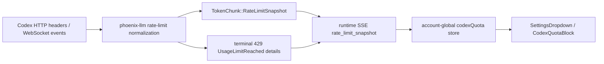

# Fix Codex rate-limit tracking against upstream codex-rs

## Observed journey

- In the LLM Provider settings panel, a signed-in Codex account shows a weekly window at 4% with a reset timestamp, while also showing “No credits remaining.”
- The combination is misleading or incorrect for an account that still has ordinary plan quota available.
- Phoenix mirrors Codex protocol structures locally rather than depending on an upstream `codex-rs` crate, so the local parser can drift as upstream evolves.

## Verified findings

- `crates/phoenix-llm/src/rate_limit.rs` independently models and parses both `codex.rate_limits` WebSocket events and `x-codex-*` HTTP response headers into `QuotaDetails`.
- `CodexRateLimitEventCredits` and `CreditsSnapshot` currently require boolean `has_credits` and `unlimited` fields; `ui/src/components/CodexQuotaBlock.tsx` renders `has_credits == false` as the unconditional statement “No credits remaining.”
- Successful response snapshots and terminal usage-limit snapshots are carried through `TokenChunk::RateLimitSnapshot`, runtime SSE, `ui/src/hooks/useConnection.ts`, and the account-global store in `ui/src/codexQuota.ts`.
- Existing parser tests use locally invented fixtures. They do not establish parity with the current upstream `openai/codex` wire contract or its display semantics.
- Existing repository research was pinned to historical upstream commits, and there is no Cargo dependency that automatically keeps this copied contract synchronized.

## Inferences and unknowns

- The most likely failure boundary is local interpretation of upstream quota/credit data, not missing provider-to-UI plumbing.
- The exact upstream change must be established from a fresh clone and history inspection before choosing the final data model. In particular, determine whether `has_credits: false` means a depleted purchased-credit balance, credits unavailable/not applicable for the plan, or another state that must not be rendered as “remaining = zero.”
- Also verify current locations and precedence of plan/window/credit fields in HTTP headers and `codex.rate_limits` events; do not assume historical Phoenix comments or fixtures remain authoritative.

## Interaction map

Snapshots are ephemeral and account-global; they are not persisted across process restarts. Preserve sequence handling and terminal-429 behavior while correcting the contract.

## Proposed work

1. Clone the current `openai/codex` repository in a disposable/reference location and identify the authoritative `RateLimitSnapshot`, credits model, header/event parsing, merge/precedence behavior, and TUI display wording. Record the upstream commit SHA used for comparison in a stable test or concise source reference where useful.
2. Compare upstream current behavior and relevant history with:
   - `crates/phoenix-llm/src/rate_limit.rs`
   - Codex response handling in `crates/phoenix-llm/src/openai.rs`
   - `crates/phoenix-core/src/domain/quota_details.rs`
   - generated/SSE schemas and `ui/src/codexQuota.ts`
   - `ui/src/components/CodexQuotaBlock.tsx`
3. Correct the smallest owning contract so invalid or ambiguous credit states cannot be presented as definite depletion. Prefer a typed representation that distinguishes unavailable/not-applicable, available balance, unlimited, and depleted states if upstream semantics require those distinctions; do not paper over a backend ambiguity with UI string heuristics.
4. Align event/header field locations, optionality, normalization, and precedence with upstream where the comparison identifies drift. Preserve total, lossless threading through Rust types, SSE schemas/codegen, and UI consumers.
5. Add regression fixtures derived from actual current upstream payload structures for:
   - ordinary plan quota with no purchased-credit balance;
   - genuinely depleted credits;
   - positive and unlimited credits where supported;
   - primary/weekly window percentage and reset timestamp;
   - both WebSocket-event and HTTP-header paths that remain supported.
6. Add UI coverage proving the settings panel never says “No credits remaining” merely because credits are unavailable/not applicable, while still showing a true depleted-credit state accurately.
7. Run targeted Rust/UI tests, `./dev.py codegen` if wire types change, and `./dev.py check`. Validate the signed-in settings journey with a real or captured Codex quota snapshot.

## Acceptance criteria

- Phoenix’s normalized quota model and parsing match the inspected current upstream Codex contract, with the comparison anchored to an identified upstream commit.
- A Codex account with remaining weekly plan quota does not receive a false “No credits remaining” assertion solely because purchased credits are absent or unavailable.
- Genuine credit depletion, available balance, and unlimited-credit states render accurately when upstream provides them.
- Weekly usage and reset time remain correct through both supported transport paths.
- Regression tests exercise provider payload parsing through the resulting UI semantics, including the screenshot’s contradictory-state case.
- Generated wire types are regenerated rather than hand-edited, and the full repository check passes.

## Risks and non-goals

- Upstream may have multiple server/CLI versions in flight; use tolerant parsing only where upstream evidence demonstrates compatibility needs, and log unsupported capability gaps rather than silently discarding data.
- Do not vendor or add `codex-rs` as a production dependency unless comparison proves that is the minimal maintainable solution.
- Do not redesign unrelated provider quota UI, persist ephemeral snapshots, or change retry/sweep policy unless upstream parity exposes a directly coupled correctness defect.

## Verification

- Compared against `openai/codex` commit `250de82bfb51a210325e88bfe1f7c30b0fa514f0`.
- Upstream treats `has_credits` as credit tracking/availability, hides the row when false, displays `Available` for an enabled hidden balance, and uses `x-codex-rate-limit-reached-type` to distinguish actual workspace credit depletion.
- Focused Phoenix Rust parser/error tests and `CodexQuotaBlock` Vitest regressions pass.
- `./dev.py check`: all 19 applicable lanes pass.

### Current-period follow-up

- Verified against the live authenticated `GET /backend-api/wham/usage` response that Codex can return both its primary/current and secondary/weekly windows independently of turn response headers.
- Added an authenticated Phoenix quota endpoint and upstream-shaped parser so opening settings obtains the authoritative account snapshot without requiring a completed turn.
- Partial per-turn snapshots now merge into the account snapshot instead of erasing an omitted current or weekly window.
- Live dev endpoint verification returned the account quota successfully; focused parser/store/component tests and all 19 `./dev.py check` lanes pass.

### Native-auth simplification

- Removed Codex CLI piggyback authentication and the `OPENAI_USE_CODEX_AUTH` behavior flag; Phoenix's native OAuth credential is now the sole Codex bridge identity.
- Simplified settings quota state to a complete ephemeral snapshot from the authoritative account usage endpoint. Per-turn quota events remain available to runtime/error handling but no longer merge into the settings store.
- Sign-out clears the same credential and quota snapshot that own model access; quota snapshots remain non-persistent.
- Focused native-auth/quota tests pass and `./dev.py check` passes all 20 checks.
