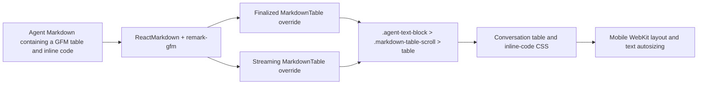

# Normalize font sizing in conversation Markdown tables

## Observed journey

- On a narrow iPhone/Safari conversation view, an agent response contains a GFM Markdown table with ordinary prose and inline-code values.
- The inline-code values render visibly larger than the surrounding cell text, making rows inconsistent and consuming excessive horizontal space inside the table’s local scroller.
- The supplied screenshot shows the finalized conversation surface. The same Markdown table renderer and CSS scope are also used while an agent response is streaming, so both paths must retain matching typography.

## Verified findings

- Finalized conversation Markdown is rendered by `AgentMessage` through `ReactMarkdown` in `ui/src/components/MessageComponents.tsx`; its table override wraps the semantic table in `.markdown-table-scroll`.
- Streaming conversation Markdown independently uses the same wrapper shape in `ui/src/components/StreamingMessage.tsx`.
- Conversation CSS in `ui/src/index.css` currently sets `.agent-text-block table` to `14px` while `.message-content code` has an absolute `13px` size. There is no table-cell-specific rule establishing the intended relationship between inline code and neighboring table text.
- The authored cascade therefore does not explain code becoming visibly larger. The symptom is consistent with mobile WebKit text autosizing/font inflation acting differently on descendants of an intrinsic-width (`width: max-content`), horizontally scrollable table.
- Existing tests prove finalized and streaming tables receive the local scroll wrapper (`ui/src/components/MessageComponents.test.tsx`) and preserve chat/table overflow ownership (`ui/src/components/MessageList.test.tsx`), but they do not exercise inline code in cells or assert typographic parity.
- Existing dark/light Ladle fixtures and browser QA (`wide-markdown-table` in `ui/src/fixtures/messageList/scenarios.ts` and `verifyWideTable` in `ui/scripts/capture-message-list.mjs`) cover desktop breakout, mobile containment, local overflow, and painted surfaces. Their table content contains no inline Markdown code and the QA records no computed font sizes.
- `specs/conversation-ui/requirements.md` REQ-CONV-002 owns rendered agent Markdown. This is a presentation defect within that existing requirement; no new product behavior or spec change is needed.

## Inferences and unknowns

- **Leading failure model:** fixed, independent pixel sizes for table prose and inline code leave mobile WebKit free to autosize the two text runs inconsistently inside the scrollable intrinsic-width table.
- **What would falsify it:** a representative iOS/WebKit reproduction showing equal effective text sizes after a table-scoped inherited font-size rule, but continued visible inflation caused by another selector or font loading. If that occurs, inspect computed styles and WebKit text autosizing before broadening the fix.
- A global `text-size-adjust` override would alter mobile readability and accessibility across the app. It is not justified by the current evidence and is not the starting fix.

## Interaction map

- No persistence, API, SSE wire-shape, reconnect, cancellation, or runtime behavior is involved. Streaming/finalized parity is a render/CSS obligation only.

## Proposed scope

### 1. Establish one table-local typography relationship

- Update the conversation-owned Markdown table styles in `ui/src/index.css` so inline code in `th`/`td` derives its size from the table cell instead of retaining an unrelated absolute message-code size.
- Keep the monospace family, inline-code background, padding, and code affordance unchanged.
- Scope the rule to conversation agent Markdown tables; do not change code sizing in prose, tool output, viewers, task approval, or other ReactMarkdown surfaces.
- Prefer the smallest inherited/relative sizing rule that makes code and cell text effectively consistent. Do not add a global or app-wide `text-size-adjust` override. Add a tightly scoped WebKit adjustment only if real WebKit verification proves inheritance alone insufficient.

### 2. Make the regression visible in the existing fixture

- Extend `wideMarkdownTableMessages` in `ui/src/fixtures/messageList/scenarios.ts` with representative inline-code values inside table cells, matching the failing content shape rather than creating a parallel fixture.
- Preserve the fixture’s wide-table geometry, dark/light variants, and prose before/after the table.

### 3. Add focused automated coverage

- Extend the existing Markdown table component tests to prove inline code remains a real `code` descendant inside cells for finalized content and is rendered through the same table/CSS structure while streaming.
- Extend the existing style/QA assertions to enforce the table-scoped sizing contract. In `verifyWideTable`, inspect a cell and its inline-code descendant after the 375px resize and fail when their computed font sizes differ from the intended relationship.
- Keep the existing local-scroll and no-document-overflow assertions intact.

### 4. Validate the user journey

- Run focused Vitest coverage and CSS lint/type checks, then the MessageList Ladle browser QA at desktop and 375px widths in dark and light themes.
- At mobile width, confirm ordinary and inline-code cell text have consistent visual sizing, remain readable, and the table alone scrolls horizontally without document overflow.
- Verify the same representative Markdown in finalized and streaming render paths.
- Where an iOS/WebKit target is available, verify there as the browser-specific acceptance surface; Chromium computed-style checks are a regression guard but do not independently prove WebKit no longer inflates text.

## Acceptance criteria

- Inline code in conversation Markdown table headers/cells no longer appears larger than surrounding table text on the reported mobile layout.
- Inline code remains monospace and retains its existing inline-code visual treatment.
- Finalized and streaming tables obey the same typography contract.
- Dark and light table fixtures continue to stay within mobile message bounds, use local horizontal scrolling, and create no document-level horizontal overflow.
- Conversation prose code and Markdown/code surfaces outside agent conversation tables are unchanged.

## Risks and non-goals

- **Risk:** matching CSS pixel sizes may still look slightly different because sans and monospace fonts have different metrics; verify visually rather than compensating with an unexplained global size.
- **Risk:** disabling text autosizing broadly can reduce accessibility. Any fallback must be table-scoped and evidence-driven.
- **Non-goals:** redesigning Markdown tables, changing their breakout width or scrolling architecture, changing bundled fonts, modifying general heading/prose typography, or altering Markdown parsing/data transport.
