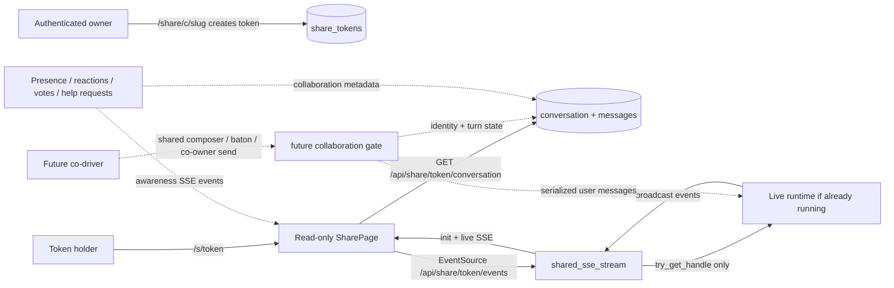

# Plan native multiplayer mode from share-mode foundation

## Observed journey
- User thesis: the future of working with LLM agents is collaborative. Phoenix should plan native multiplayer as modern pair/trio programming: two humans on a call co-driving one LLM agent session, not merely a passive demo link.
- Existing reproduction/environment: Phoenix already has share mode via owner-created links. Authenticated owner navigates to `/share/c/{slug}`, backend creates/reuses a per-conversation opaque share token, redirects to `/s/{token}`, and the share page renders a token-gated read-only conversation view.
- Current viewer experience: viewers see full history plus live SSE updates, but no input, mutation controls, settings, or owner actions.

## Verified findings
- Share mode is specified in `specs/auth/requirements.md` REQ-AUTH-004 through REQ-AUTH-008: create/reuse token, read-only shared view, auth exemption, multiple simultaneous viewers, persisted tokens.
- `specs/auth/auth.allium` defines two actors: `Owner` and `Viewer`. `SharedConversation` exposes status/mode/messages/context usage and deliberately has no `provides` block.
- Backend routes are in `crates/phoenix-ide/src/api/handlers.rs`: `/share/c/:slug`, `/s/:token`, `/api/share/:token/conversation`, `/api/share/:token/events`.
- `shared_sse_stream` validates the token, loads DB history, and uses `try_get_handle` only. If no runtime is already live, it creates a static broadcaster seeded at the persisted sequence id rather than starting work.
- Frontend share route is `ui/src/App.tsx` → `ui/src/pages/SharePage.tsx`; it skips password auth for `/s/*`, subscribes to `/api/share/:token/events`, validates init/message/state/token events, renders `MessageList`, and omits composer/actions.
- `share_tokens` is normalized in `crates/phoenix-db/src/ddl.rs` with `conversation_id`, opaque unique `token`, and `created_at`.

## Inferences and unknowns
- Inference: the target experience is strong collaborative interaction: at least two humans can intentionally co-drive one LLM conversation, discuss on a call, take turns steering, and share responsibility for approvals and agent direction. Presence/reactions/help signals are supporting affordances, not the goal.
- Inference: the existing read-only share mode is a useful distribution and live-sync foundation, but it is not sufficient for multiplayer because it has no concept of co-drivers, turn ownership, contributor identity, or shared mutation authority.
- Product question to resolve in planning: what is the first co-driving contract? Candidate options are (A) shared composer with visible “who is typing / who sent this” identity, (B) explicit baton/turn-taking where only the current driver can send to the agent, or (C) co-owner authenticated sessions where any participant can send while Phoenix serializes messages by persisted sequence order.

## Interaction map

## Proposed scope
Create a grounded multiplayer planning artifact and spec direction, not a large feature implementation yet.

### Deliverables
1. Define the multiplayer product thesis for Phoenix in user-journey terms:
   - Phoenix becomes the shared cockpit for a human pair/trio plus an LLM agent;
   - participants can see the same transcript and live agent state while on a call;
   - participants can take turns steering the agent or intentionally hand off the driver role;
   - Phoenix records who contributed each human instruction or approval so the conversation remains accountable.
2. Inventory strong collaborative opportunities in the existing app, anchored to current share mode:
   - co-driver join flow from the existing share URL or a new invite URL;
   - shared composer and/or baton-based turn-taking for sending user messages;
   - visible contributor identity on human messages, approvals, and queued steering;
   - shared approval flows for task proposals, commission reviews, and continuation decisions;
   - presence, reactions, “look here,” and help requests as secondary awareness tools;
   - “fork from this point” as a breakout workflow when collaborators choose to diverge.
3. Write the first MVP recommendation with acceptance criteria:
   - likely MVP should enable real co-driving, not only advisory signals. Candidate MVP: two browser sessions on one conversation, both seeing the same live transcript, one visible driver at a time, explicit baton handoff, and messages/approvals attributed to the active driver.
4. Identify required spec changes:
   - extend `specs/auth/` or create a new collaboration spec to distinguish read-only viewers from co-drivers;
   - define how a share link becomes a co-driving session, or whether co-drivers require authenticated access;
   - define driver/baton state, contributor identity, message attribution, and conflict handling for simultaneous sends;
   - define persistence/replay for collaboration state and awareness events;
   - define SSE event shape and UI behavior for owner, co-driver, and read-only viewer surfaces.
5. Identify non-goals and hard boundaries:
   - do not accidentally let legacy read-only share-token viewers mutate conversations;
   - do not let unauthenticated traffic start runtimes without an explicit accepted collaboration/auth design;
   - no CRDT/OT/editor-style collaboration unless shared text editing becomes a requirement;
   - no broad role matrix until the co-driver model proves it needs one;
   - no SSE reverse-control channel.

### Likely starting files/symbols
- Specs: `specs/auth/requirements.md`, `specs/auth/auth.allium`, `specs/auth/executive.md`; possible new `specs/collaboration/`.
- Backend: `create_or_redirect_share`, `get_shared_conversation`, `shared_sse_stream` in `crates/phoenix-ide/src/api/handlers.rs`; `SseEvent`/`SseWireEvent`; `share_tokens` DB helpers.
- Frontend: `ui/src/pages/SharePage.tsx`, `ui/src/App.tsx`, `ui/src/sseSchemas.ts`, shared `MessageList` surfaces, owner-side conversation header/action surfaces.

### Validation journey for the resulting plan/spec
- A reviewer can trace each proposed multiplayer capability to a pair/trio-programming user journey and a current extension point.
- The plan states exactly who may co-drive, how they join, how they acquire/release the driver role, and how their messages/approvals are attributed.
- The plan separates read-only sharing from co-driving so the existing share-mode invariants are not accidentally weakened.
- The MVP can be implemented and tested with two browser sessions actively taking turns in one live conversation.

### Risks
- Designing for advisory signals first would miss the thesis; planning must center on co-driving and use awareness signals only to support that experience.
- Co-driving touches auth, runtime wake/start, send-chat idempotency, queued steering, and approval semantics; the plan must identify these seams before proposing implementation.
- Owner UI could become noisy; proposed multiplayer controls need density and progressive disclosure consistent with Phoenix UI guidance.

### Explicit non-goals for this task
- Do not implement multiplayer features yet.
- Do not add new auth roles or identity provider integration unless the plan concludes they are required for co-driving.
- Do not weaken the existing read-only share route by accident; if share-token co-driving is proposed, it must be explicit, scoped, and justified.
- Do not redesign the core conversation state machine for arbitrary concurrent writers without first evaluating simpler baton/serialized-message contracts.
