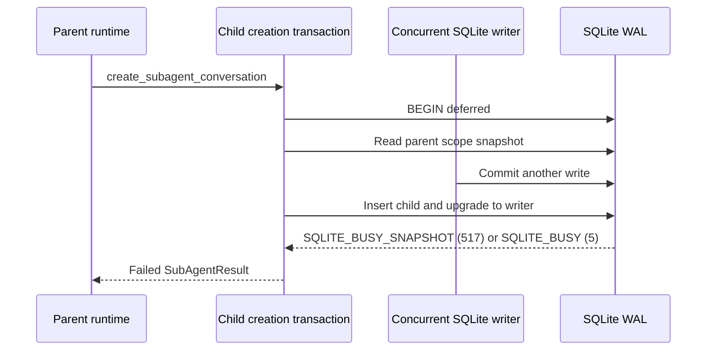

# Prevent SQLite lock failures during parallel sub-agent creation

## Observed journey

- A parent conversation invokes `spawn_agents` with multiple tasks.
- The tool enters `AwaitingSubAgents`, but child conversations fail before their runtimes start. The UI reports `Failed to create conversation: Database error: ... (code: 5) database is locked` and/or code `517`.
- The failure reproduced in production on 2026-08-21: all three exploration agents launched while investigating this issue failed at child-conversation creation with code 5.
- Production logs show the same failure repeatedly for batches of one or more children, including both primary code 5 and extended code 517. This is not limited to the mobile UI; the UI is accurately displaying a runtime persistence failure.
- This became a child-creation regression at a precise deployment boundary: before the 2026-08-16 21:11 UTC deploy, the same production log contains 46 child spawn attempts and zero child-creation failures; after that deploy it contains 28 attempts and 27 failures (96%).

## Verified findings

- `RuntimeManager::handle_spawn_request` reads the parent and then calls `Database::create_subagent_conversation`; on any DB error it emits a failed `SubAgentResult`, so the child never starts (`crates/phoenix-ide/src/runtime.rs`, `handle_spawn_request`).
- `create_subagent_conversation` delegates to `create_conversation_with_project_inner` with `ExpectedParentScope::Snapshot` (`crates/phoenix-db/src/lib.rs`).
- That inner operation opens a normal deferred transaction, reads the parent scope in that transaction, and then attempts to insert the child. This is a read-to-write transaction upgrade (`create_conversation_with_project_inner`).
- The 2026-08-16 production deploy first included commit `a8d2566b1` (`Add dormant ProductConversation Close persistence foundation`). That commit introduced `create_subagent_conversation` and the exact parent-`WorkScope` revalidation `SELECT` inside the deferred transaction. Before it, the parent inheritance read occurred outside the transaction and the transaction's first SQLite statement on this path was a write; child spawns in the retained production logs did not fail at creation.
- The exact parent-scope revalidation is required by the WorkScope ownership contract and must not be reverted. The regression is its placement in a transaction that does not acquire write intent before taking the validated snapshot.
- The file-backed production pool uses WAL and a five-second busy timeout (`Database::open`). A timeout does not repair `SQLITE_BUSY_SNAPSHOT`: under WAL, a transaction whose read snapshot was invalidated by another commit cannot upgrade and must restart or acquire write intent before reading.
- Code 517 is SQLite's extended `SQLITE_BUSY_SNAPSHOT`; code 5 is its primary `SQLITE_BUSY`. Existing Phoenix SQLite diagnostics already recognize this mapping (`coordinator_query.rs`, `sqlite_telemetry.rs`, and workflow busy classification).
- Production evidence shows failures within milliseconds of `Spawning sub-agent`, including mixed 5/517 results in the same batch. The configured five-second timeout is therefore present but cannot protect the deferred upgrade path.
- `REQ-SA-001` requires an independent conversation for every accepted task and parallel execution. `subagents.allium` also requires each child to mirror the parent's exact durable `WorkScope` identity. Failing persistence under ordinary parallel writes violates that journey.
- Existing child-creation tests are single-connection/in-memory and verify inheritance semantics, not file-backed multi-connection contention. No deterministic regression covers a writer committing between the parent snapshot read and child insertion.

## Regression provenance

| Production interval | Deployed relationship | Child spawn attempts | Child-creation failures |
|---|---|---:|---:|
| Before 2026-08-16 21:11 UTC deploy | Does not contain `a8d2566b1` | 46 | 0 |
| After 2026-08-16 21:11 UTC deploy | First retained deploy containing `a8d2566b1` | 28 | 27 |

The causal code delta and the observed SQLite extended code agree: the deploy added a transactional read before the child insert, creating a deferred WAL read-to-write upgrade. This explains why general SQLite contention warnings existed earlier while `Failed to create sub-agent conversation` began abruptly at this deploy.

## Failure model and interaction map

The owning invariant is: once a spawn batch passes validation, normal SQLite write contention must not cause child creation to fail, and the parent-scope check plus child insert must observe one atomic parent state.

## Proposed scope

1. Change the child-conversation persistence transaction so it acquires SQLite write intent before taking the parent snapshot used for validation/inheritance and before inserting the child (for example, the established `BEGIN IMMEDIATE` transaction pattern).
2. Keep the exact parent `WorkScope` revalidation introduced by `a8d2566b1` and the child insert in the same transaction; do not restore the pre-change TOCTOU gap. Move all parent-derived scope and effort reads into that authoritative write-intent transaction snapshot.
3. Preserve slug-collision handling and typed `CloseFoundationConflict` behavior. Ensure every error branch rolls back/releases the immediate transaction before retrying or returning.
4. Add deterministic file-backed, multi-connection DB regressions that force the relevant interleaving/contending writers and prove:
   - parallel sub-agent conversation creation completes without code 5/517;
   - each child receives the exact expected parent scope and inherited values;
   - a genuine parent-scope change is still rejected rather than hidden by lock handling;
   - no partial child or generated scope row remains after failure.
5. Add or extend a runtime-level spawn regression showing an accepted parallel batch creates and starts every child instead of reporting persistence failures.
6. Add bounded DB-operation observability around child creation if needed to make future lock failures identify the phase and SQLite extended code, following the existing SQLite telemetry conventions.
7. Run focused `phoenix-db` and sub-agent/runtime tests, then `./dev.py check`.

## Acceptance evidence

- A deterministic regression fails against the post-`a8d2566b1` deferred read-then-write implementation with code 5/517 and passes with the corrected transaction ownership while still rejecting a changed parent `WorkScope`.
- Repeated file-backed parallel creation (at least the supported maximum batch size of 10) produces all child rows and no lock errors.
- The user journey `spawn_agents` with two or more Explore tasks reaches running/completed child conversations under concurrent parent/runtime DB activity.
- Logs no longer show `Failed to create sub-agent conversation` with SQLite code 5/517 for that journey.

## Risks and non-goals

- Avoid a generic retry around the entire spawn workflow: retries could duplicate partially completed side effects and do not address transaction ownership structurally.
- Do not merely increase `busy_timeout`; it cannot make an invalid WAL snapshot upgradeable.
- Do not serialize agent execution. Only the short SQLite creation transaction should serialize write ownership; children must still execute in parallel.
- This task owns the child-creation contention bug. Other production lock errors (for example, PR-status refresh, direct-turn worker, or FTS indexing) are evidence of broader contention but should only be changed here if they share the same proven deferred-upgrade defect; otherwise capture separate follow-up work.
- No schema or compatibility change is expected.
