# Prevent stale browser-view restoration and make mobile exit actions trustworthy

## Observed journey

- On mobile/narrow layouts, `viewer=browser` occupies a fixed full-screen overlay, hiding the conversation until the viewer is dismissed.
- A browser session can be stopped from the viewer, but after switching conversations and returning, the original conversation can reopen in the browser viewer even though its browser session has ended.
- The close/dismiss control can feel ineffective, while **Stop browser** can appear to do nothing or finish too early.
- This investigation was grounded against current `main` and the implementation from `76e8137b0` (`Add explicit work-scope control to stop browser sessions`). The local dev server was unavailable and production required sign-in, so interactive authenticated reproduction was not possible; the stale restoration sequence is nevertheless deterministic from the state transitions below.

## Verified findings

- `ViewerSlotProvider` persists every non-empty viewer URL to `phoenix:lastviewer:<scopeKey>` (`ui/src/contexts/ViewerSlotContext.tsx`, REQ-VS-014 persistence effect).
- A browser-session falling edge calls `clearSlot(false)`: it removes `viewer=browser` from the URL but intentionally preserves the stored last-viewer snapshot (`ViewerSlotProvider` browser edge effect).
- On a later in-app conversation entry with a bare URL, the restore effect blindly restores that snapshot. It does not check `browserSessionActive` or special-case the ephemeral browser viewer.
- Entry reseeds the browser edge detector to the destination conversation's current flag without firing an edge. Therefore, when the restored browser snapshot is already inactive, there is no later falling edge to remove it. The full sequence is:

  1. conversation A has `viewer=browser`; persistence stores `viewer=browser`;
  2. stopping/cleanup changes `browserSessionActive` to false and clears only the URL;
  3. navigate to conversation B;
  4. return to A on a bare URL;
  5. restore rehydrates `viewer=browser` while the edge tracker is seeded false;
  6. the inactive browser viewer remains open indefinitely until explicitly closed.

- Existing browser-edge tests cover isolated rising/falling edges, but not browser open → stop/falling edge → conversation switch → return. Existing restoration tests are primarily prose-oriented.
- The Allium guidance acknowledges that `?viewer=browser` may hydrate after the session dies and says a “subsequent server signal” will close it. That is false for in-app restoration after the false state is already established; this is normative spec drift, not merely an implementation race.
- The viewer × button invokes `viewerSlot.close` synchronously and clears last-viewer storage. It performs no API request. If its click is delivered, the URL and overlay should close immediately.
- The bespoke browser close control has a small visual/tap area (`padding: 2px 6px`, 16px glyph) in a 32px header and does not use the shared mobile viewer-shell back affordance. This makes missed or ambiguous taps plausible on mobile.
- **Stop browser** calls `DELETE /api/conversations/:id/browser-session`. The endpoint awaits only `request_kill_session`, which queues teardown and returns before Chromium exits, the manager entry is removed, and the lifecycle false edge is emitted.
- `BrowserViewPanel` sets `stopping=true` only for that short HTTP request. It resets to false as soon as the queued response arrives, so the button can revert from “Stopping…” to “Stop browser” while teardown is still underway and the live canvas remains visible.
- Component tests assert endpoint invocation and failure text, but do not assert durable stopping feedback, lifecycle confirmation, mobile-sized dismissal, or the complete navigation/restoration journey.

## Interaction map

```mermaid
flowchart LR
    U["Mobile user taps Stop browser"] --> P["BrowserViewPanel local action state"]
    P --> API["DELETE conversation browser-session"]
    API --> Q["BrowserSessionManager.request_kill_session queues teardown"]
    Q --> K["Chrome exits and manager removes session"]
    K --> SSE["browser_session_state = false"]
    SSE --> V["ViewerSlotProvider falling-edge close"]
    V --> URL["URL becomes bare"]
    V -. currently preserved .-> LS["lastViewer remains viewer=browser"]
    LS --> R["In-app return restores viewer=browser"]
    R --> O["Full-screen inactive browser overlay"]
```

## Owning invariant

A browser viewer restored from per-conversation convenience storage must never cover the conversation when no browser session is live. Explicit close/back-to-chat must take effect immediately. A queued stop must remain visibly pending until server-authoritative lifecycle state confirms the session ended (or a real failure is surfaced).

This does not weaken URL authority for explicit cold reload/shared-link URLs unless implementation evidence shows that the initial conversation state can distinguish “not loaded yet” from “loaded and inactive.” The required fix is specifically for convenience restoration and user/session lifecycle transitions.

## Proposed scope

### 1. Make browser last-viewer storage lifecycle-aware

Update `ViewerSlotProvider` and the viewer-slot specification so ephemeral browser restoration differs structurally from durable prose/diff/message viewer restoration:

- On a browser-session falling edge, invalidate the stored browser snapshot as well as clearing the URL.
- On in-app entry, if storage contains `viewer=browser` but `browserSessionActive` is false, discard/ignore that snapshot and remain in chat. This defensive gate handles sessions that ended while the conversation was not mounted and stale entries written by older versions.
- Preserve existing behavior for non-browser viewer kinds.
- Preserve explicit user close semantics: close remains immediate and clears storage.
- Avoid solving this with timing delays or by relying on a future false edge that may never occur.
- Amend `specs/viewer_slot/viewer_slot.allium`, `requirements.md` if applicable, and `executive.md` so they state the standing lifecycle invariant rather than the currently incorrect “subsequent signal” assumption. Run the spec authoring pre-flight and `allium check` where available.

Likely starting symbols:

- `ViewerSlotProvider.clearSlot`
- the REQ-VS-014 persistence/restore effects
- the REQ-VS-008/009 browser edge effect
- `lastViewerStorage`
- `UrlHydratesBrowser`, `BrowserSessionFellAutoClosesSlot`, and last-viewer rules in `viewer_slot.allium`

### 2. Give mobile an unmistakable immediate exit

Polish the browser overlay header without conflating “hide viewer” and “terminate session”:

- Replace or augment the tiny × with the established viewer-shell-style back-to-chat affordance and a mobile-appropriate minimum hit target (at least 44×44 CSS px), accessible name, and safe-area-aware placement.
- Keep **Back/Close view** synchronous and independent of the stop API.
- Keep **Stop browser** semantically distinct and destructive; labels must make “return to chat” versus “terminate agent browser” clear at a glance.
- Prefer shared viewer chrome/primitives where practical, but do not broaden this into a full `BrowserViewPanel` redesign.

### 3. Represent queued teardown honestly

- Do not clear the local stopping indication merely because the fire-and-forget DELETE returned 2xx.
- Keep a visible `stopping`/“Stopping browser…” state until `browserSessionActive=false` causes the parent/slot lifecycle to close the viewer, while still allowing an immediate Back to chat action.
- Ensure a request failure restores an actionable stop control and displays the error.
- Prevent the WebSocket reconnect presentation from making a user-requested stop look live again while teardown is pending.
- Do not change the backend endpoint to block on `kill_session`; it intentionally avoids blocking behind an in-flight browser tool guard. The UI should model accepted/pending teardown rather than pretending the response means teardown completed.

Likely starting symbols:

- `BrowserViewPanel.stopBrowserSession`
- `BrowserViewPanel` status/reconnect rendering
- browser panel/overlay CSS (colocate component-specific CSS if extracting touched rules from `index.css`)
- `ConversationPage` browser overlay wiring

## Regression coverage

Add focused coverage for:

1. browser rises and opens → falls/stops → URL closes and browser snapshot is invalidated;
2. stale stored `viewer=browser` + inactive session + in-app entry → chat remains visible and stale storage is removed/ignored;
3. stored `viewer=browser` + active session + in-app entry → intended restoration remains available;
4. switch A → B → A after A's session ended → A does not reopen the browser overlay;
5. explicit close/back-to-chat immediately clears URL and storage without invoking the stop endpoint;
6. stop 2xx leaves visible pending teardown state rather than reverting to an apparently idle Stop button;
7. stop failure restores retryability and reports the failure;
8. mobile/narrow browser journey verifies a reachable, adequately sized Back to chat control and return to the transcript.

Use component/state tests for deterministic transitions and a browser/Ladle or authenticated app journey at a narrow viewport for the tap-target/full-screen behavior. Avoid timer-based assertions; drive lifecycle confirmation explicitly.

## Risks and non-goals

- **Risk:** clearing all last-viewer storage on every system-driven close would change durable viewers. Restrict invalidation to the browser snapshot/lifecycle.
- **Risk:** treating an initial placeholder `browserSessionActive=false` as authoritative could erase an active viewer before conversation state loads. Apply the inactivity gate only where server state is known, or preserve the current typed loading boundary; do not add a timeout.
- **Risk:** unmounting immediately after Stop can hide API errors. Back-to-chat may unmount by explicit user choice, but Stop itself should retain pending/error feedback until navigation or lifecycle confirmation.
- **Non-goal:** making the browser mirror interactive.
- **Non-goal:** changing Chromium teardown ordering or making the stop endpoint synchronous.
- **Non-goal:** redesigning persistence for all viewer kinds.
- **Non-goal:** changing explicit shared-link/cold-reload URL authority without a separately justified product decision and a loaded-vs-inactive state model.

## Acceptance evidence

- On a mobile-width viewport, stopping a browser never leaves or later restores a full-screen dead browser viewer over the conversation.
- Returning to a conversation whose browser has ended lands in chat without manual cleanup.
- Back to chat reacts immediately and is visibly/tactually distinct from Stop browser.
- Stop provides truthful pending feedback through server lifecycle convergence.
- Viewer-slot state tests, browser-panel tests, narrow-viewport journey, Allium validation, and the relevant `./dev.py check` lanes pass.
