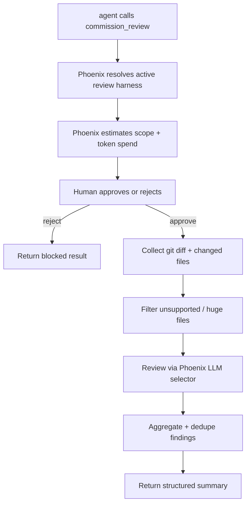

# Add Phoenix-native commission review tool

Build a `commission_review` feature that lets an agent request an independent code review using Phoenix's configured LLM provider stack.

## Goal

Give agents a high-signal review path for the active Phoenix task/worktree, with human approval before Phoenix spends a large review budget.

## Direction

Build an in-house Phoenix review orchestrator. `./x-open-code-review/` is useful reference material for review flow, file filtering, prompts, JSON shape, and rule ideas.

The review target should be inferred by Phoenix from conversation/worktree state. The agent should not need to supply refs, commits, or diff plumbing in the normal path.

## Proposed tool contract

Tool name: `commission_review`

This is a capital-spend request, not a normal cheap tool call. It must block for human approval in the conversation, similar in spirit to `propose_task`: the agent asks to commission review, Phoenix shows what will be reviewed and the estimated cost, and work only starts after the user approves.

Inputs should follow the pit of success:

- `brief`: required executive capital brief; concise but information-dense explanation of why the current work is ready for review and why spending review tokens is useful now
- `focus`: optional short free-text focus, e.g. “security and correctness”
- `allow_dirty_working_tree`: optional boolean, default `false`; required to review a git-aware task/worktree when uncommitted changes are present

Phoenix owns the review harness:

- Work/task conversation: review the active task branch/worktree against its base when the worktree is clean, or when the request explicitly sets `allow_dirty_working_tree: true`.
- Direct conversation in a git repo with workspace changes: review current workspace changes.
- Unsupported states do not expose `commission_review`; the tool registry/runtime makes an invalid request structurally unavailable rather than returning a late “unsupported” result.

Approval surface should show:

- inferred target and base/head if applicable
- git cleanliness state, including whether dirty worktree review was explicitly allowed
- changed file count and rough insert/delete count
- files excluded from review
- estimated model/token budget or coarse cost class
- brief/focus supplied by the agent, with the brief shown as the justification for the spend

Output after approval:

- `status`: `success` | `skipped` | `completed_with_warnings` | `rejected` | `failed`
- `summary`: files reviewed, comments, token usage if available, elapsed
- `findings`: array of `{severity, confidence, file, line, title, rationale, suggested_fix}`
- `warnings`: skipped files, truncation, model failures

## Implementation plan

1. Add spec docs under `specs/commission-review/` before code:
   - Requirement: reviews use Phoenix LLM selection and never require external provider credentials.
   - Requirement: `brief` is mandatory and explains why review is useful at this point in the work.
   - Requirement: review execution is human-approved because it is a significant token spend.
   - Requirement: the review target is inferred from Phoenix conversation/worktree state.
   - Requirement: git-aware task/worktree review requires a clean worktree unless `allow_dirty_working_tree` is explicitly true.
   - Requirement: dirty state is shown on the approval surface when dirty review is allowed.
   - Requirement: unsupported states do not expose the tool; invalid review states are not representable as a normal tool call.
   - Requirement: the feature is read-only; it must not edit files, stage changes, or move refs.
   - Requirement: long runs honor cancellation.
   - Requirement: large or unsupported files are reported as warnings, not silently ignored.
2. Add a commission-review approval flow to the runtime/state machine rather than making the tool immediately call the LLM.
3. Add `crates/phoenix-tools/src/commission_review.rs` implementing the request tool.
4. Add a typed review harness that resolves the target from `ToolContext` / conversation mode:
   - Work/task: active worktree diff against known base, gated on clean worktree unless dirty review was explicitly allowed.
   - Direct: current workspace diff.
5. Register the request tool only in supported contexts. Update registry matrix tests so unsupported contexts cannot see or call it.
6. Implement git collection with safe read-only commands only.
7. Build a small typed review model in Rust. Avoid parallel untyped JSON blobs for findings.
8. Use Phoenix's configured model via `ctx.llm_selector().default_service()` or a runtime-selected review model.
9. Review file/hunk chunks with bounded concurrency and per-file size caps. Aggregate results in a final LLM pass or deterministic sorter/deduper.
10. Add tests:
   - mandatory brief validation
   - approval required before LLM calls
   - rejection returns `status: rejected`
   - clean worktree required for git-aware task review by default
   - dirty task review requires explicit opt-in and appears in approval details
   - no LLM configured returns actionable error after approval
   - skipped/unsupported files produce warnings
   - cancellation path for long-running reviews
11. Consider later UI affordance only after the tool works: a compact finding list rendered like other tool outputs.

## Reference notes

Useful ideas from `./x-open-code-review/`:

- machine-readable review output shape
- background context field
- per-file concurrency and timeout caps
- warning status when some subtasks fail
