# Make spawn_agents terminal and defaults correct by construction

## Observed journey

- A parent calls `spawn_agents`, usually with generic Explore children on the registry-selected cheap model.
- The child performs useful research through repeated `search`, `read_file`, and other tool calls.
- At `max_turns`, Phoenix adds a grace prompt telling the child that only `submit_result` or `submit_error` can complete the run.
- The grace LLM response nevertheless calls another ordinary research tool. Phoenix rejects that response before normal reduction and returns `Sub-agent exceeded turn limit with no terminal output` to the parent, discarding the child's useful findings from the fan-in result.
- This is recurrent in production, including multiple failures in the same spawn batch.

## Verified findings

### Production DB ground truth (read-only)

Queries used `file:~/.phoenix-ide/prod.db?mode=ro` plus `PRAGMA query_only=on`; no production rows were modified.

- Phoenix has 1,315 non-user child conversations identified by `parent_conversation_id`; `spawned_from_conversation_id` is not the active relation for these children.
- Since 2026-07-17, `gpt-5.4-mini` has 377 terminal child runs: 295 completed and 72 ended as `turn_limit_exhausted` (19.1%). In the same bounded period, `gpt-5.4` has 192 terminal child runs: 131 completed and 3 turn-limit failures (1.6%). These populations have different mode/budget/task mixes, so this is evidence of concentration, not a causal model comparison.
- Daily turn-limit failures remain active: 21 on July 21, 8 on July 22, 6 on July 23, and 7 in the partial July 24 data.
- All 75 turn-limit failures since July 17 have a normal non-terminal tool call as their last persisted assistant response: 37 `search`, 35 `read_file`, and one each of `think`, `patch`, and `bash`. Zero ended with a persisted terminal tool response.
- Recent examples include children ending after exactly 10, 15, 18, or 20 assistant turns with the last response still requesting `search`/`read_file`, matching configured/default turn budgets rather than a provider transport failure.
- Actual provider/runtime error outcomes are rare in the same child population: two `invalid_request` policy rejections and one `context_exhausted`; the dominant recurring failure signature is the application-generated turn-limit outcome.

A second bounded query classified 361 persisted `spawn_agents` calls since July 17 by their immediate tool result:

- 305 proceeded to spawn/pending fan-in, 49 were rejected as `Unknown model`, and 7 were rejected as `Invalid sub-agent working directory`.
- The model supplied every optional per-task field in the sampled calls rather than omitting defaults. Across the tasks, `model` was the empty string 151 times. Those empty strings account for nearly all unknown-model rejections; the remaining stale explicit IDs included `gpt-5.3-codex-spark`, `gpt-5.1-codex-mini`, and `claude-haiku-4-5` when absent from that deployment's registry.
- `cwd` was the empty string 13 times and `"."` 8 times in rejected batches. Empty cwd produced `Working directory cannot be empty`; relative `"."` was canonicalized relative to the production process directory (filesystem root), not the parent conversation, and produced the root-cwd rejection.
- These are caller-shape/defaulting failures, not evidence that the intended runtime defaults are bad: when `model` or `cwd` is truly absent, `handle_spawn_agents_tool` already defaults Explore to the provider-family cheap model, Work to the parent model, and cwd to the parent conversation's working directory. The interface makes “default” easy to encode as an invalid empty string or process-relative path instead of structurally representing inheritance.

### Runtime and specification

- `ConversationRuntime::dispatch_llm_request` increments `llm_turn_count`, grants one grace request after the configured limit, and persists a strong terminal-only meta prompt (`crates/phoenix-ide/src/runtime/executor.rs`).
- The same method then obtains the ordinary full sub-agent tool definitions and sends them on the grace request. The prompt says ordinary tools cannot help, but the request schema still makes them valid choices.
- `grace_response_can_enter_reducer` admits only text-only completion or a sole `submit_result`/`submit_error`. A grace response containing `search`, `read_file`, or any other ordinary tool is intercepted and converted directly to `GraceTurnExhausted`; the requested ordinary tool is not executed.
- `transition_sub_agent` already supports both text-only implicit completion and sole terminal tools. The reducer is not missing a terminal path; dispatch advertises a capability that the reducer will reject.
- REQ-SA-010 defines the grace turn as a terminal-output opportunity. The current prose-only restriction leaves an invalid grace response structurally representable, contrary to the repository's correct-by-construction principle.
- `SubAgentTask` models `cwd` and `model` as `Option<String>`, but nonblank override semantics are not represented in the type. `Some("")` survives deserialization and bypasses defaulting before failing later in cwd/model validation.
- `handle_spawn_agents_tool` canonicalizes any explicit cwd directly. Relative overrides therefore resolve against the Phoenix server process cwd rather than `parent.working_dir`; `"."` does not mean “the parent cwd,” despite being the natural caller encoding.
- The `spawn_agents` schema describes both fields as optional but gives `model` an unconstrained string schema and does not define relative cwd resolution. Unlike the frozen named-agent enum, it does not expose the deployment's available model IDs even though runtime validation uses that exact registry.
- Production traces from VictoriaTraces confirm deployed service version `0.10.0` emits correlated LLM/tool spans with `conv_id`, `root_conv_id`, model, transport, retry attempt, and token fields. The retained trace search did not return the selected older failed child IDs, so persisted child state/transcripts—not guessed trace behavior—are the authoritative failure evidence for those runs. `~/.phoenix-ide/prod.log` had already rotated and contained no useful historical diagnostics.

### Previous fixes reviewed

- `41e5d8735` added text-only implicit sub-agent completion.
- `7fbea00a6`, `b00685891`, and `bd4e07ca8` added the one-turn grace/hard-stop flow after task 08645.
- `6865e39e8` required fresh grace-turn terminal output and explicitly rejects ordinary/mixed tool responses before reduction.
- `63c394433` / `f276a69d9` restored generic Work sub-agent spawn guidance.
- `482a317b9` restored safe Explore delegation with sandboxed bash.
- `5d0894f61`, `1fef565e7`, `887b25186`, and `f1a3060a6` fixed mixed wake rounds, durable wake outcomes, SQLite turn stranding, and durable LLM dispatch ownership.

Those fixes explain why spawning, dispatch, persistence, and fan-in now generally work. None makes the grace request's advertised tool capability match its reducer admission rule.

## Inferences and unknowns

- **High-confidence failure model:** the model follows the machine-readable full tool surface over (or despite) the prose instruction, especially during long Explore loops. The 75/75 non-terminal final response signature would be falsified by a meaningful population of provider errors or terminal responses being misclassified; neither appears in the bounded production data.
- **Unknown to validate during implementation:** provider adapters may impose constraints on retaining historical tool-use/result blocks when the current request advertises only terminal tools. The implementation must preserve valid prior research context while changing only what the grace request can newly call.
- **High-confidence defaulting failure model:** generated calls use empty strings as placeholders for optional/defaulted fields. Rust interprets those as explicit overrides, making valid defaults unreachable for that call. Relative cwd is independently resolved in the wrong coordinate system for a conversation-scoped tool.
- **Design constraint:** model availability must come from the same registry snapshot used for spawn-time validation; do not introduce a second hardcoded list or provider-specific aliases in schema prose.
- **Not inferred:** the model-rate comparison does not prove `gpt-5.4-mini` is intrinsically unreliable; Explore defaults, turn budgets, and task mix are confounders. The intended mode defaults remain unchanged.

## Interaction map

```mermaid
flowchart LR
    P["Parent spawn_agents call"] --> S["RuntimeManager creates child conversation"]
    S --> L["Child normal LLM/tool loop"]
    L --> B{"max_turns exceeded"}
    B --> G["Persist terminal-only grace prompt"]
    G --> D["Build grace LLM request"]
    D --> F["Full ordinary tool definitions currently advertised"]
    F --> N["Model calls search/read_file"]
    N --> A["grace_response_can_enter_reducer rejects response"]
    A --> X["Persist failed: turn_limit_exhausted"]
    X --> R["Notify parent and aggregate failure"]

    D -. "fix: terminal capability only" .-> T["submit_result / submit_error or text-only response"]
    T --> C["Completed/Failed typed terminal outcome"]
    C --> R
```

Persistence/recovery remains the existing child conversation state plus parent fan-in path. Cancellation, wake delivery, and spawn batching are adjacent consumers but are not the cause of this failure.

## Proposed scope

### Owning invariants

1. A sub-agent grace request must advertise only actions whose response the grace reducer can accept. Ordinary research/write tools must be unrepresentable as new grace-turn calls, while previously persisted tool history remains available as context.
2. Omitting or leaving a spawn override blank must select the documented mode/parent default, never create an invalid explicit override.
3. A relative cwd override is conversation-relative, never server-process-relative. The resolved effective cwd must still satisfy existing/non-root and Work-worktree containment rules.
4. The model override surface must advertise the same available model IDs that spawn-time validation accepts; stale provider-specific guesses should not be the easy path.

### Implementation

1. Introduce an explicit typed request/tool-surface phase for sub-agent grace dispatch rather than another loosely coupled boolean/convention.
2. Build the grace request with only `submit_result` and `submit_error` definitions (while continuing to permit text-only implicit completion).
3. Keep normal sub-agent requests unchanged.
4. Separate historical-message normalization from the callable grace tool surface if necessary so narrowing callable tools does not delete or corrupt prior valid `search`/`read_file`/bash/etc. rounds.
5. Preserve the defensive `grace_response_can_enter_reducer` guard for malformed, stale, replayed, server-tool, or provider-invalid responses; it remains a backstop, not the primary enforcement mechanism.
6. Normalize blank/whitespace-only `model` and `cwd` at the typed spawn-input boundary to absence, so the existing mode/parent defaults apply. Do not scatter empty-string checks through validation branches.
7. Resolve non-absolute cwd overrides against `parent.working_dir` before canonicalization and policy checks. Preserve the existing rejection of missing paths, filesystem root, symlink escapes, and Work cwd outside the parent worktree.
8. Make model override selection deployment-aware in the LLM-visible schema, using the same registry-backed IDs accepted by executor validation (analogous to the frozen named-agent catalog). Keep omission as the recommended path and retain a runtime rejection backstop for malformed/stale calls.
9. Represent resolved spawn inputs with validated types (for example, a nonblank registered model ID and a canonical effective cwd) before any spawn request is sent. Downstream `SubAgentSpec` construction must not carry raw optional strings whose validity depends on convention.
10. Add structured diagnostics for grace dispatch/outcome and spawn-default resolution: child/root conversation IDs, mode, whether model/cwd were inherited or overridden, configured budget, and terminal mechanism (`submit_result`, `submit_error`, implicit text, rejected malformed response), without logging prompts/results or duplicating persisted semantic data.
11. Update normative sub-agent behavior/spec for the terminal-only grace surface, blank-as-omitted compatibility, relative-cwd base, and registry-backed model choices; update the executive verification map. Follow `specs/AUTHORING.md` pre-flight because normative specs are touched.

Likely starting symbols:

- `ConversationRuntime::dispatch_llm_request`
- `grace_response_can_enter_reducer`
- request construction around `ToolExecutor::definitions_for_language`
- `strip_unavailable_tool_blocks` / message normalization
- `transition_sub_agent` terminal and implicit-completion branches
- `SubAgentTask` / `SpawnAgentsInput` typed parsing and resolution
- `SpawnAgentsTool::input_schema` and registry construction
- `ModelRegistry::available_models` / `cheap_model_id_for_provider`
- `validate_subagent_cwd` / `path_is_within`
- sub-agent executor/state-machine tests
- `specs/subagents/requirements.md`, `specs/subagents/subagents.allium`, and `specs/subagents/executive.md`

## Acceptance and regression validation

- A normal Explore or Work child request still receives its full mode-appropriate registry.
- On the first over-budget request, the captured LLM request advertises exactly `submit_result` and `submit_error`; `search`, `read_file`, `bash`, `patch`, browser tools, and other ordinary tools are absent.
- The grace request still contains coherent prior research history, including completed calls/results for tools no longer callable during grace.
- A sole `submit_result` completes successfully and notifies/fans into the parent.
- A sole `submit_error` produces a typed failure with the supplied useful findings/blocker.
- A nonblank text-only grace response completes implicitly.
- Blank text, mixed terminal calls, ordinary/stale tool calls, and server-tool-only responses still take the typed hard-stop failure path.
- Retryable provider errors during the grace LLM request retain existing retry semantics; a successful retry still uses the terminal-only surface.
- Focused runtime tests capture the actual `LlmRequest`, not just prompt text, so schema/prompt drift cannot reintroduce this bug.
- Omitting, using `null` where provider/schema transport permits it, or supplying blank/whitespace-only `model` produces the documented mode default; it does not return `Unknown model`.
- Omitting or supplying blank/whitespace-only `cwd` inherits the parent cwd. A relative override such as `.` or `crates/phoenix-tools` resolves under the parent cwd, not the server process cwd.
- Absolute cwd overrides remain supported and all existing root, existence, symlink, traversal, and Work containment guards remain effective after resolution.
- The captured `spawn_agents` schema exposes only currently registered model override IDs, recommends omission, and is generated from the same registry truth used by executor validation. An injected stale/unknown ID is still rejected before any task in the batch spawns.
- Multi-task batches may mix inherited and explicit model/cwd choices; all tasks are normalized and validated atomically before spawn side effects.
- Run focused state-machine/runtime tests, Allium validation, spec pre-flight, then `./dev.py check`.

## Risks

- Narrowing the request's current tool definitions may interact with provider validation of historical tool blocks. Tests must cover multi-round history containing several ordinary tool types.
- Treating the grace turn as a separate tool surface must not alter normal retries, context-exhaustion precedence, cancellation, or parent conversations.
- Trace/log cardinality must remain bounded; use existing conversation/model fields rather than embedding prompts or results.
- Dynamically exposing model IDs must not create schema/runtime drift during a conversation. Freeze or share registry truth using the same lifecycle as spawn validation.
- Treating blank strings as omission is intentionally compatibility-oriented; normalization must occur once before validated types are built so empty remains unrepresentable downstream.
- Changing relative cwd semantics can affect callers that accidentally relied on the service process cwd. That behavior is unsafe and undocumented; pin the parent-relative contract in tests/specs.

## Explicit non-goals

- Do not change which models Explore/Work default to, or their turn budgets, based on the confounded production rate comparison. This task makes the existing defaults reachable and discoverable.
- Do not broaden provider retry policy; provider-call failures are not the dominant observed signature.
- Do not redesign spawn batching, cancellation, wake contracts, fan-in persistence, or the two-write summary update in this task.
- Do not remove the hard-stop fallback or reinterpret incomplete Work implementation as success.
