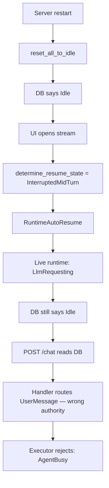
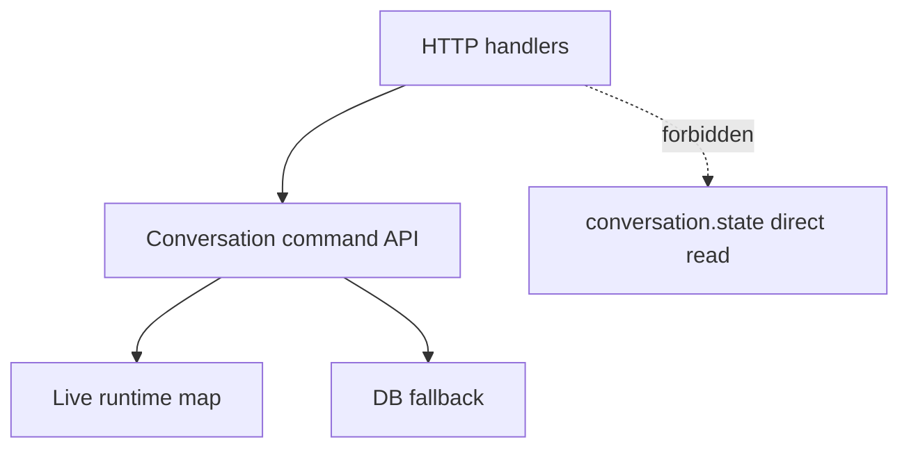

# Fix chat acceptance to use live runtime state as authority

## Problem

Production logs confirmed a restart auto-continue split-brain:

- Startup `reset_all_to_idle` set the persisted conversation state to `Idle`
- Stream-attach called `get_or_create`, which invoked `determine_resume_state`, detected
  `InterruptedMidTurn`, and created a live runtime in `LlmRequesting`
- `POST /chat` read the persisted DB state, saw `Idle`, and routed the payload as a plain
  `Event::UserMessage` — no steering, no conflict
- The executor rejected that event as `AgentBusy` (it was in `LlmRequesting`)
- The client received `200 OK` (`queued=true, steering=false`) and then saw an `Agent is busy`
  error in the conversation stream, even though auto-resume continued normally



The visible bug starts at `RuntimeAutoResume`. The design flaw is that state authority splits
there: the live runtime has entered a transient state the DB row has not yet reflected, and
the handler consults the wrong authority.

## Background: The Restart Lifecycle

The divergence is not accidental — it is the intended design of the startup + auto-resume
pipeline, but the chat handler was never wired to respect it.

`reset_all_to_idle` runs once on every startup (REQ-BED-007). It materializes any
in-flight tool-round data held only in state JSON, repairs orphaned tool-use blocks, then
rewrites every non-terminal transient conversation to `Idle`. This safe rest state makes
the persisted row consistent before any client attaches.

When a client opens an SSE stream for an interrupted conversation, `get_or_create` calls
`determine_resume_state`. This reads the now-`Idle` DB row, then examines message history
via `recovery::should_auto_continue`. An unanswered LLM request produces decision
`InterruptedMidTurn`: the live runtime is initialized in `LlmRequesting`. The DB row still
says `Idle` because no state transition has been persisted yet — the first persist happens
when the auto-continue LLM round completes.

During the auto-continue LLM call there is always a window where:

| Layer | State |
|---|---|
| DB persisted row | `Idle` |
| Live executor | `LlmRequesting` |

`POST /chat` that arrives in this window reads the DB row, routes a plain `UserMessage`,
and gets a post-200 `AgentBusy` rejection from the executor.

## Invariants

### Authority is split by state class

Not all state is equal. The codebase deliberately splits authority:

- **DB persisted state is authoritative for lifecycle liveness** — whether a conversation
  is non-terminal, `AwaitingTaskApproval`, `AwaitingUserResponse`, `ContextExhausted`,
  `Terminal`, etc. These states survive restart because they are user-visible or structurally
  stable. `reset_all_to_idle` explicitly preserves them.
- **Live runtime state is authoritative for transient in-flight state** — `LlmRequesting`,
  `ToolExecuting`, `CancellingTool`, `AwaitingSubAgents`, `CancellingSubAgents`,
  `AwaitingContinuation`, `AwaitingRecovery`. These are reset to `Idle` on startup by
  design, then re-derived by `determine_resume_state` when the runtime is created.

A handler that reads only the DB row to decide `UserMessage` vs. `SteerMessage` is reading
the wrong authority for the transient-state class.

### Primary invariant: live runtime wins for event routing

> If a live runtime exists for conversation C, no HTTP handler may decide transition
> acceptability for C using only the persisted DB state.

### Corollary: the authority rule must live in one place

The live-runtime-first / DB-fallback rule is a correctness invariant, not a convention. If
it lives in each handler's body it will be missed, violated by copy-paste, or re-litigated
on every new handler. It must live in a single API that all lifecycle-sensitive handlers
call.

The "forbidden" access pattern:



## Failure Mode: FM-7 — HTTP Handler Authority Gap

This bug class extends the FM taxonomy in `specs/bedrock/design.md`:

**FM-7: HTTP handler reads only persisted state to decide event acceptability, ignoring
live runtime state.**

A lifecycle-sensitive handler checks `conversation.state` from the DB to decide routing. The
live runtime may have entered a transient state via auto-resume that the DB row does not yet
reflect. The handler routes based on stale data; the executor rejects the event; the client
receives a post-200 error.

*Contract violated: for transient in-flight state, the live runtime is authoritative. The DB
row is the safe rest state, not the current operational state.*

**Prevention:** A command API (`runtime.accept_chat`) that owns the live-runtime-first /
DB-fallback rule. HTTP handlers do not inspect DB state for routing; they call the command
and receive a typed disposition.

## Connection to Correct-by-Construction

FM-4's prevention eliminated a parallel representation of tool-result state by making
`completed_results` the single owner. This bug is the same class one layer up: two
representations of the same conversation's transient operational state (DB row vs. live
runtime) with conflicting values, and no enforcement of which one wins.

The correct-by-construction endpoint is structural: HTTP handlers should not be *able* to
read DB state for routing without going through the runtime's authority boundary. Today the
type system allows it — `AppState::db()` is accessible in any handler. The command API
closes this at the API level by making the routing decision opaque to the caller.

## Design Space

Five fixes were evaluated; two are adopted.

### Option 1 — Handler consults live runtime state first ✅ Adopt (immediate)

Change `POST /chat`: ask `RuntimeManager` if a live runtime exists; if yes, use its state;
if no, fall back to DB state.

**Pros:** smallest change, fixes the incident, preserves DB recovery behavior.
**Cons:** correctness still depends on every future handler remembering the rule — not
true CBC unless the check is hidden behind a single helper.

**Verdict:** good tactical fix. Implement as `runtime.effective_conversation_state(conv_id)`
so the pattern does not spread.

### Option 2 — Typed command API ✅ Adopt (follow-up)

Route all lifecycle-sensitive commands through one authority:

```rust
pub async fn accept_chat(
    &self,
    conv_id: &str,
    input: ChatInput,
) -> Result<ChatDisposition, ChatError>

pub enum ChatDisposition {
    AcceptedUserMessage,
    QueuedSteering,
    Rejected(ChatRejectReason),
}
```

Handlers no longer read raw DB state for routing.

**Pros:** strongest CBC; authority rule lives in one place; easy to test; audit forces every
other handler to the same boundary.
**Cons:** larger refactor; requires auditing cancel, approve-task, abandon, retry flows.

**Verdict:** best medium-term fix. Implement after Option 1 stabilizes.

### Option 3 — Persist auto-resume state immediately ❌ Rejected

When `RuntimeAutoResume` starts, write `LlmRequesting` to DB before runtime begins
processing so the DB row matches.

**Rejected because:** introduces a new race (DB says busy but runtime creation fails);
re-introduces persisted transient state that `reset_all_to_idle` was designed to avoid;
does not eliminate the two-representation problem, only narrows the window.

### Option 4 — Explicit `Interrupted` state ❌ Insufficient alone

Add `ConvState::Interrupted { previous: InterruptedActivity }` so startup reset does not
lie and say `Idle`. DB state becomes honest after restart.

**Not chosen as main fix:** larger state-machine change with migration needs; still does not
solve "live runtime is authoritative while running" without a command API companion.
Revisit as a model improvement after Option 2 lands.

### Option 5 — Synchronous transition acceptance ✅ Valuable, pair with Option 2

Make `RuntimeManager::send_event` synchronous for acceptability:

```rust
enum SendEventResult { Accepted, Rejected(TransitionError) }
```

`POST /chat` then returns 409 instead of "200 then later toast." For `AgentBusy`
specifically, the result should route to steering rather than surface as a raw conflict.

**Verdict:** prevents the post-200 rejection class broadly. Pair with Option 2 rather than
shipping alone.

## Recommended Plan

### Step 1 — Immediate: `effective_conversation_state` helper

1. Add `RuntimeManager::effective_conversation_state(conv_id)` that:
   - Checks `runtimes.read()` for an existing handle
   - If a handle exists, returns its current executor state (via snapshot channel or
     dedicated query on the handle)
   - Falls through to `db.get_conversation().state` when no handle exists
2. Update `POST /chat` to call this helper instead of reading `conversation.state` directly.
   Routing logic — `UserMessage` vs. steering vs. 409 — is otherwise unchanged.
3. Preserve existing routing:
   - `Idle` / restartable-terminal → `Event::UserMessage`
   - `LlmRequesting`, `ToolExecuting`, `CancellingTool`, `AwaitingSubAgents`,
     `CancellingSubAgents` → steering queue
   - `AwaitingTaskApproval`, `AwaitingUserResponse`, `ContextExhausted`, `HandedOff`,
     `Terminal`, `AwaitingContinuation` → 409
4. Add regression test:
   - Persisted DB state: `Idle` — Live runtime state: `LlmRequesting`
   - `POST /chat` → `queued=true, steering=true`
   - No asynchronous `AgentBusy` rejection for the accepted request

### Step 2 — Follow-up: typed command API (Option 2 + 5)

Refactor toward `runtime.accept_chat(conv_id, ChatInput) -> ChatDisposition`. The helper
from Step 1 becomes an internal detail of this API. Add synchronous rejection (`SendEventResult`)
so `AgentBusy` routes to steering rather than surfacing post-200. Audit other
lifecycle-sensitive handlers (cancel, approve-task, abandon, retry) and route them through
the same boundary.

### Step 3 — Documentation

Add FM-7 to `specs/bedrock/design.md` with its prevention contract and the command API as
the structural solution.

## Acceptance Criteria

- [ ] `POST /chat` uses live runtime state when a runtime handle exists.
- [ ] Restart auto-continue + immediate user `continue` queues steering or returns a typed
  rejection; no post-200 `AgentBusy` executor error.
- [ ] Regression test: persisted `Idle` + live `LlmRequesting` → `queued=true, steering=true`.
- [ ] The live-runtime-first / DB-fallback rule lives in a single site (`effective_conversation_state`
  or the future `accept_chat` command).
- [ ] Existing chat steering and rejection behavior remains covered.
- [ ] FM-7 is documented in `specs/bedrock/design.md`.
