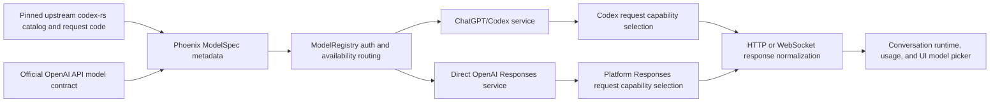

# Add upstream GPT-6 Astra models to Codex and direct API backends

## Observed journey

- The requested work is to unlock Work-mode network access, clone the current upstream `openai/codex` repository, determine the authoritative GPT-6 Astra model contract, and begin implementing those models in both Phoenix OpenAI routes: ChatGPT/Codex authentication and direct OpenAI Responses API authentication.
- This Explore session is running in the isolated `task-pending-aafddf8d` worktree. Its network sandbox blocks GitHub access, so neither upstream `codex-rs` nor roadmap issue #651 could be refreshed before proposal approval.
- The local checkout contains no intentional `Astra` or `gpt-6` model references. Exact model IDs, wire names, variants, availability rules, and capabilities are therefore unknown and must not be inferred from GPT-5.6 naming.

## Verified findings

- `crates/phoenix-llm/src/models.rs::all_models` is the built-in model metadata authority. Its OpenAI `ModelSpec`s currently end at GPT-5.6 variants and carry the API name, context window, recommendation flag, effort capabilities, and service-tier capability.
- `crates/phoenix-llm/src/registry.rs::ModelRegistry` registers built-in OpenAI Responses models through either direct API auth or the Codex bridge. Default, mid-tier, and cheap-model preference lists contain explicit model IDs.
- `crates/phoenix-llm/src/openai.rs` shares core Responses translation but selects Codex-only wire behavior by model family. In particular, `supports_responses_lite` and `supports_explicit_prompt_cache` currently recognize only GPT-5.6; Codex requests may use a structurally distinct Responses Lite body and WebSocket continuation, while direct API requests retain platform shape.
- `crates/phoenix-ide/src/api/usage.rs` has explicit per-model direct-API pricing. Existing model-update precedent requires unknown pricing to remain explicit rather than guessed.
- `specs/llm/requirements.md`, `responses.allium`, and `executive.md` govern backend routing, Codex authentication, request shape, streaming, effort, caching, and service tiers. The timeless requirements are intentionally model-list agnostic unless Astra introduces a new behavioral contract.
- Existing task `36008-p1-ready--codex-model-availability-discovery.md` records a current correctness gap: Phoenix registers every built-in Codex model even when a particular ChatGPT account cannot use it. Adding Astra entries blindly would expand that false-advertising risk.
- Repository precedent compares Phoenix against a pinned upstream Codex commit and mirrors only the needed protocol behavior; it does not add `codex-rs` as a production dependency by default.

## Inferences and unknowns

- **Inference:** Astra may require more than registry entries because Phoenix gates Responses Lite, explicit prompt caching, WebSocket continuation, effort, context, and service tier by model metadata or model-name predicates. This is falsified if the pinned upstream catalog and request code prove Astra uses an already-supported contract unchanged.
- **Unknown:** Exact public and Codex wire IDs, number of Astra variants, context/output limits, effort levels/default, Responses Lite support, preferred transport, service tiers, tool capabilities, and deprecation/replacement status.
- **Unknown:** Whether direct OpenAI API availability and ChatGPT/Codex availability launch simultaneously. Upstream Codex is authoritative for the Codex route; current official OpenAI API documentation and/or authenticated API discovery is authoritative for the direct paid API route.
- **Unknown:** Whether Astra requires account-scoped Codex discovery before it can be safely exposed. The implementation must resolve this against task 36008 rather than silently advertising catalog membership as account availability.

## Interaction map

- Persisted conversations store model IDs, so any replacement/alias behavior must preserve exact registered routes and follow the explicit compatibility policy; do not add an alias without evidence and a normative compatibility decision.
- Codex credential reload/account switching re-registers bridge services. Any Astra availability filter must be refreshed on the same lifecycle and must not affect direct API registration.
- WebSocket continuation compatibility includes model-sensitive request properties; Astra support must preserve full-request fallback whenever reuse is unsafe.

## Proposed scope

### 1. Pin and inspect upstream evidence

- After approval enables network access, clone or fetch `https://github.com/openai/codex` into an untracked temporary location and record the exact commit SHA used.
- Inspect at minimum `codex-rs/models-manager/models.json` and the model manager, request builder, Responses Lite, WebSocket continuation, effort, service-tier, and model-discovery code that consumes its Astra entries.
- Consult current official OpenAI API documentation or authenticated model discovery separately for direct API support. Do not treat Codex catalog presence as proof of direct API availability, pricing, or billing semantics.
- Record a compact evidence matrix covering every discovered Astra variant: Phoenix ID, wire ID per route, context/output limits, reasoning effort levels/default, Responses Lite, transport preference, service tier, tool support, recommendation/default status, account visibility, and direct-API pricing availability.

### 2. Implement the smallest verified model support

- Add only confirmed Astra variants to `all_models()` with evidence-backed metadata.
- Keep direct API and Codex transport capabilities structurally distinct. Replace model-name predicates with typed model/route capabilities if Astra demonstrates that version-prefix inference would permit invalid request shapes.
- Extend Codex Responses Lite/header selection, WebSocket continuation, reasoning translation, prompt caching, context caps, and Fast service-tier support only where upstream evidence requires it.
- Register direct API Astra routes only where the direct API authority confirms availability. Preserve exact `api_name` routing and existing authentication separation so Codex intent cannot fall through to bill an API key.
- Reconcile task 36008 before exposing Astra through Codex: implement/reuse account-scoped model filtering, or conservatively withhold Astra from the picker when account availability cannot be established. Do not claim account availability solely because Astra exists in the upstream catalog.
- Update default/recommended/mid-tier/cheap selection only if product positioning is explicit in authoritative metadata; otherwise leave existing preferences unchanged.
- Add direct-API pricing only from a current authoritative price source. Unknown pricing must remain unknown, not estimated from another model.

### 3. Specify and verify the contracts

- Update `specs/llm/responses.allium` and `specs/llm/executive.md` if Astra changes current request/capability behavior. Change model-agnostic requirements only if a new user-visible invariant is needed. Follow `specs/AUTHORING.md` pre-flight checks for any spec change.
- Add focused tests for:
  - exact registry IDs, API wire names, context/output metadata, effort capabilities, recommendation flags, and auth-route independence;
  - Codex versus direct API golden request shapes for every distinct Astra capability class;
  - Responses Lite compatibility headers and typed body selection;
  - HTTP/WebSocket selection, continuation compatibility, and safe full-request fallback;
  - Standard/Fast service-tier encoding and unsupported-tier rejection;
  - account-unavailable Codex models not being advertised, including credential refresh/account switch behavior;
  - direct API discovery and registration remaining independent from Codex availability;
  - usage pricing behavior when pricing is known versus unknown.
- Run focused `phoenix-llm` and API tests, spec validation where touched, then `./dev.py check`.
- Perform an authenticated smoke test on each available route without logging credentials, prompts, response bodies, or reconstructable wire payloads. If credentials/account entitlement are unavailable, document that limitation and retain deterministic fixture coverage.

## Acceptance criteria

- [ ] The implementation records the exact upstream Codex commit and authoritative direct-API sources used for every Astra model/capability decision.
- [ ] Every supported GPT-6 Astra variant appears under its verified Phoenix and wire IDs; no speculative variants or aliases are added.
- [ ] Supported Astra models are selectable and complete a tool-using streamed turn through both the Codex and direct API backends where each route is actually available.
- [ ] Codex-only and direct-API request shapes remain independent, typed, and covered by golden tests; unsupported fields are omitted rather than sent optimistically.
- [ ] Responses Lite, prompt caching, transport preference, continuation fallback, effort, service tier, context/output limits, and tool capabilities match the pinned authorities.
- [ ] A ChatGPT account is not shown an Astra model merely because it is a built-in catalog entry; refresh/account switching cannot retain stale availability.
- [ ] Direct API registration never depends on Codex account availability and Codex auth intent never silently falls through to API-key billing.
- [ ] Pricing is sourced authoritatively or explicitly remains unknown.
- [ ] Existing GPT-5.6 behavior and persisted model routing remain regression-covered.
- [ ] Relevant specs accurately describe any new behavior and `./dev.py check` passes.

## Risks and explicit non-goals

- Upstream model metadata may be staged, account-gated, or change during rollout. Pinning the inspected revision and separating catalog membership from observed account availability bounds that risk.
- Do not vendor `codex-rs`, add it as a production dependency, or mirror its full model catalog unless comparison proves that to be the smallest maintainable design.
- Do not infer platform pricing, availability, or request semantics from ChatGPT/Codex behavior.
- Do not redesign the provider abstraction, model picker, usage dashboard, or model-discovery system beyond what is required to expose Astra truthfully.
- Do not retire GPT-5.6 models, rewrite persisted model IDs, or change Phoenix’s global default without separate explicit evidence and compatibility/product decisions.
