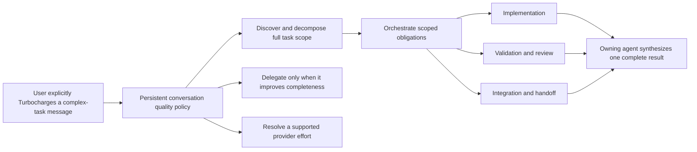

# Evaluate Codex Ultra semantics for Phoenix Turbocharge

## Product intent

Turbocharge addresses incomplete execution of complex tasks. Its promise is: **use more agent capacity when useful to produce the strongest complete result Phoenix can**. A Turbocharged result must identify the full task scope, break it into coherent obligations, orchestrate those obligations through implementation, validation, and handoff, and synthesize one complete outcome without requiring the user to manage the decomposition.

Delegation is a means, not the product promise. Phoenix may assign complementary investigation, implementation, or review roles when they improve completeness, but a Turbocharged task may proceed with the owning agent alone when delegation adds no material value.

Turbocharge is not a bespoke multi-agent UI. It should use Phoenix's existing subagent interfaces and tools as they exist today. New interfaces or tools are justified only when a concrete Turbocharge behavior cannot be expressed correctly through the current system.

Turbocharge begins through an explicit user action on a message containing a sufficiently complex task. Once enabled, its quality policy persists for subsequent turns in that conversation until the user disables it. It is not activated implicitly by Phoenix.

OpenAI Codex commit `654b0a77d0d2f81aa21f61caf7af4be88fe550bb` supplies useful implementation evidence: its `ultra` choice couples proactive multi-agent orchestration to a real provider effort. Phoenix should evaluate that mechanism under the **Turbocharge** brand without adopting Ultra as a misleading provider effort.

The official GPT-6 Astra API model contract supports provider efforts `low`, `medium`, `high`, `xhigh`, and `max`; it does not list `ultra`.

## Verified upstream behavior

- The Codex model catalog includes `ultra` in Astra's displayed `supported_reasoning_levels` and declares `multi_agent_reasoning_effort: "xhigh"`. The per-model mapping is useful beyond Astra: Phoenix supports models with uneven orchestration ability, so Turbocharge needs catalog metadata that can select an appropriate provider effort without trusting every model to coordinate many agents equally well.
- `ModelInfo::resolve_reasoning_effort` intercepts selected `Ultra` before ordinary inference. For Astra it serializes provider-facing `reasoning.effort: "xhigh"`, not `"ultra"`.
- If the model override is missing or invalid, Codex falls back to `max`, then the highest non-Ultra supported effort, then `medium`.
- `effective_multi_agent_mode` independently interprets selected Ultra as `MultiAgentMode::Proactive`; other efforts use explicit-request-only multi-agent behavior.
- The catalog can supply proactive/explicit mode prompts. Codex also changes multi-agent concurrency affordances and suppresses proactive inheritance for internal and spawned-agent session classes.
- The Codex TUI warns that Ultra may proactively use multiple agents and treats Max/Ultra as expensive choices requiring explicit selection.

Primary upstream anchors:

- `codex-rs/protocol/src/openai_models/reasoning_effort.rs`
- `codex-rs/core/src/client_tests.rs::reasoning_effort_for_requests_uses_multi_agent_override_for_ultra`
- `codex-rs/core/src/session/multi_agents.rs::effective_multi_agent_mode`
- `codex-rs/models-manager/models.json`
- `codex-rs/tui/src/chatwidget/model_popups.rs::ultra_reasoning_concurrency_warning`

## Proposed product model

Treat Turbocharge as a quality-seeking orchestration intent separate from provider effort:

Scope decomposition and orchestration are mandatory; role count and parallelism are adaptive. Phoenix should spend additional agent capacity only on complementary work that can materially improve completeness. The owning agent remains responsible for tracking every scoped obligation, resolving gaps and disagreements, and producing the final coherent result. If no complementary delegation would help, Turbocharge remains active and the owning agent proceeds solo.

A typed design should prevent `Turbocharge` from being serialized as `reasoning.effort: "ultra"`. The initial design should reuse current subagent visibility and controls, then identify concrete missing primitives rather than introducing a parallel UI.

## Product decisions

- **Quality target:** prevent incomplete work by discovering the full task scope, decomposing it, and closing implementation, validation, integration, and handoff obligations.
- **Activation:** an explicit, easy inline affordance on the message that introduces the complex task, analogous to an `ultrathink` marker. The final interaction may be a keyword, compose-message chrome, or another message-bound control; Phoenix does not activate Turbocharge implicitly.
- **Lifecycle:** v1 has a one-way `off → on` transition for a conversation. Once activated, Turbocharge cannot be disabled in that conversation; future versions may add explicit deactivation.
- **Compaction:** Turbocharge is durable structured conversation state and always survives compaction. Its persistence must not depend on retained prompt text or a compacted summary mentioning the mode.
- **Scope authority:** the user's triggering message supplies the goal; Phoenix infers, owns, and continuously refines the decomposition without requiring plan approval.
- **Scope growth:** Phoenix completes on-path and adjacent obligations a reasonable user would expect. It asks before broadening the user's product goal.
- **Later messages:** clear follow-ups revise the owning agent's living decomposition; ambiguous pivots are clarified through ordinary LLM conversation. Task scope and decomposition do not introduce special state-machine states or transitions.
- **Completion:** the owning agent exercises higher-effort judgment using normal Phoenix validation and reports the completed result. Turbocharge does not require a new scope ledger, approval gate, or mandatory independent-review verdict.
- **Delegation:** optional and adaptive. Turbocharge may proceed solo when additional agents would not materially improve completeness.
- **Presentation:** reuse current subagent interfaces rather than creating bespoke team-management UI.
- **Handoff:** use the normal Phoenix handoff with complete context on scope, done criteria, validation, limitations, and remaining work. Do not add a separate “what Turbocharge changed” explanation or orchestration report.
- **Synthesis judgment:** the owning model evaluates delegated evidence using normal model judgment. Agent disagreement is not a separate product concept and does not require voting, tie-breakers, or special workflow state.

## Engineering questions after product intent is settled

- Which current subagent interfaces already support the required investigation, implementation, review, and synthesis roles?
- What missing tool or lifecycle primitive, if any, prevents those roles from being orchestrated correctly?
- How do cancellation, retry, crash recovery, and partially completed roles converge without duplicate work?
- How does Turbocharge avoid recursive proactive fan-out while still allowing useful delegated work?
- How does the model catalog represent a Turbocharge orchestration-effort mapping so weaker models receive enough inference effort without being expected to orchestrate agents themselves?

## Acceptance criteria

- [ ] Write normative requirements centered on the strongest-result user promise and an ADR for the orchestration-versus-provider-effort distinction.
- [ ] Persist message-bound activation as a one-way v1 conversation transition; preserve it structurally across compaction without relying on summary text.
- [ ] Require an owning-agent decomposition without introducing a user approval gate or formal scope ledger, while allowing zero delegated agents when delegation adds no material value.
- [ ] Keep decomposition and later scope refinement in ordinary LLM interaction; do not add task-scope lifecycle states to the conversation state machine.
- [ ] Inventory current subagent capabilities against the required complementary roles; add no bespoke UI or tool without a demonstrated gap.
- [ ] Add or extend Allium for the resulting orchestration lifecycle, including role selection, synthesis, cancellation, retry, recovery, and bounded delegation.
- [ ] Represent Turbocharge separately from `ModelEffort`; impossible provider effort values cannot be serialized.
- [ ] Add an evidence-backed per-model Turbocharge orchestration-effort capability, including behavior for models that should not be trusted to coordinate many agents and fallback when metadata is absent.
- [ ] Add deterministic tests for role selection, synthesis, cancellation, retry/recovery, recursion bounds, and unsupported-model fallback.
- [ ] Compare against a newly pinned upstream Codex revision before implementation because the Ultra contract may change during rollout.

## Non-goals

- Do not send `reasoning.effort: "ultra"` unless a future provider contract explicitly documents that wire value.
- Do not rename Phoenix's existing explicit subagent tools to Turbocharge.
- Do not build a bespoke subagent dashboard or duplicate interfaces that already express the needed work.
- Do not define Turbocharge by a minimum agent count, mandatory parallelism, or automatic activation.
- Do not require task-plan approval, a new completion artifact, or an independent-review verdict for every Turbocharged request.
- Do not add Turbocharge-specific orchestration reporting, agent voting, tie-breakers, or disagreement state.
- Do not add Turbocharge deactivation in v1 or encode the owning agent's living task decomposition as special state-machine state.
- Do not copy Codex prompts or limits without reviewing licensing, product fit, and Phoenix's own state-machine/recovery invariants.
