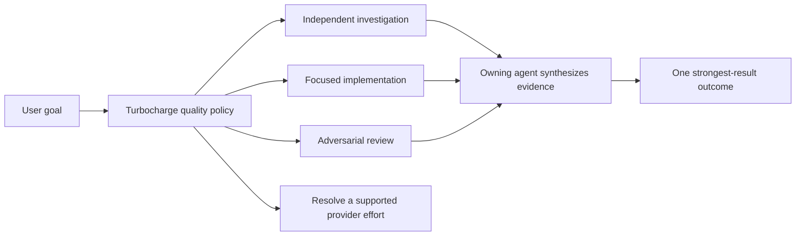

# Evaluate Codex Ultra semantics for Phoenix Turbocharge

## Product intent

Turbocharge addresses uneven result quality. Its promise is: **use more agent capacity to produce the strongest result Phoenix can**. Phoenix should automatically assign complementary investigation, implementation, and review roles so the user receives one stronger, confidence-inspiring outcome without having to orchestrate those roles manually.

Turbocharge is not a bespoke multi-agent UI. It should use Phoenix's existing subagent interfaces and tools as they exist today. New interfaces or tools are justified only when a concrete Turbocharge behavior cannot be expressed correctly through the current system.

OpenAI Codex commit `654b0a77d0d2f81aa21f61caf7af4be88fe550bb` supplies useful implementation evidence: its `ultra` choice couples proactive multi-agent orchestration to a real provider effort. Phoenix should evaluate that mechanism under the **Turbocharge** brand without adopting Ultra as a misleading provider effort.

The official GPT-6 Astra API model contract supports provider efforts `low`, `medium`, `high`, `xhigh`, and `max`; it does not list `ultra`.

## Verified upstream behavior

- The Codex model catalog includes `ultra` in Astra's displayed `supported_reasoning_levels` and declares `multi_agent_reasoning_effort: "xhigh"`.
- `ModelInfo::resolve_reasoning_effort` intercepts selected `Ultra` before ordinary inference. For Astra it serializes provider-facing `reasoning.effort: "xhigh"`, not `"ultra"`.
- If the model override is missing or invalid, Codex falls back to `max`, then the highest non-Ultra supported effort, then `medium`.
- `effective_multi_agent_mode` independently interprets selected Ultra as `MultiAgentMode::Proactive`; other efforts use explicit-request-only multi-agent behavior.
- The catalog can supply proactive/explicit mode prompts. Codex also changes multi-agent concurrency affordances and suppresses proactive inheritance for internal and spawned-agent session classes.
- App-server protocol comments describe older collaboration-mode switches as deprecated and direct clients to select Ultra for proactive multi-agent behavior.
- The Codex TUI warns that Ultra may proactively use multiple agents and treats Max/Ultra as expensive choices requiring explicit selection.

Primary upstream anchors:

- `codex-rs/protocol/src/openai_models/reasoning_effort.rs`
- `codex-rs/core/src/client_tests.rs::reasoning_effort_for_requests_uses_multi_agent_override_for_ultra`
- `codex-rs/core/src/session/multi_agents.rs::effective_multi_agent_mode`
- `codex-rs/models-manager/models.json`
- `codex-rs/tui/src/chatwidget/model_popups.rs::ultra_reasoning_concurrency_warning`

## Proposed product model

Treat Turbocharge as a quality-seeking orchestration intent separate from provider effort:

Role selection should be adaptive rather than a fixed three-agent ritual: Phoenix should spend additional agent capacity only on complementary work that can materially improve the result. The owning agent remains responsible for synthesis and final coherence.

A typed design should prevent `Turbocharge` from being serialized as `reasoning.effort: "ultra"`. The initial design should reuse current subagent visibility and controls, then identify concrete missing primitives rather than introducing a parallel UI.

## Product questions to resolve

- What observable qualities distinguish a successful Turbocharged result: broader option search, independent falsification, stronger evidence, implementation completeness, or another standard?
- Which work should Turbocharge decline because extra agents would add ceremony rather than improve the result?
- Is Turbocharge explicitly selected, recommended by Phoenix, automatically activated by policy, or some combination?
- Is the choice scoped to one turn, a conversation, a task/workstream, or another user concept?
- How should Phoenix explain what additional quality work occurred without creating bespoke team-management UI?
- When complementary agents disagree, what evidence and synthesis obligations determine the owning agent's final answer?

## Engineering questions after product intent is settled

- Which current subagent interfaces already support the required investigation, implementation, review, and synthesis roles?
- What missing tool or lifecycle primitive, if any, prevents those roles from being orchestrated correctly?
- How do cancellation, retry, crash recovery, and partially completed roles converge without duplicate work?
- How does Turbocharge avoid recursive proactive fan-out while still allowing useful delegated work?
- How is Turbocharge mapped to real provider effort independently for each model?

## Acceptance criteria

- [ ] Complete product discovery for Turbocharge's activation, scope, quality standard, and refusal criteria.
- [ ] Write normative requirements centered on the strongest-result user promise and an ADR for the orchestration-versus-provider-effort distinction.
- [ ] Inventory current subagent capabilities against the required complementary roles; add no bespoke UI or tool without a demonstrated gap.
- [ ] Add or extend Allium for the resulting orchestration lifecycle, including role selection, synthesis, cancellation, retry, recovery, and bounded delegation.
- [ ] Represent Turbocharge separately from `ModelEffort`; impossible provider effort values cannot be serialized.
- [ ] Define an evidence-backed mapping from Turbocharge to each supported model's real provider effort, including fallback behavior.
- [ ] Define how the owning agent resolves disagreement and demonstrates that independent work improved the final result.
- [ ] Add deterministic tests for role selection, synthesis, cancellation, retry/recovery, recursion bounds, and unsupported-model fallback.
- [ ] Compare against a newly pinned upstream Codex revision before implementation because the Ultra contract may change during rollout.

## Non-goals

- Do not send `reasoning.effort: "ultra"` unless a future provider contract explicitly documents that wire value.
- Do not rename Phoenix's existing explicit subagent tools to Turbocharge.
- Do not build a bespoke subagent dashboard or duplicate interfaces that already express the needed work.
- Do not copy Codex prompts or limits without reviewing licensing, product fit, and Phoenix's own state-machine/recovery invariants.
