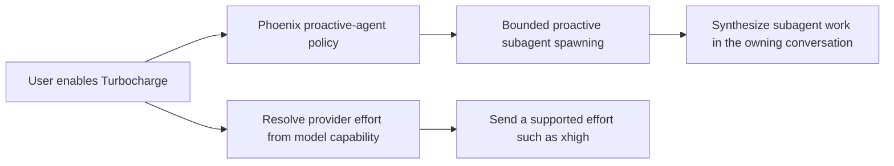

# Evaluate Codex Ultra semantics for Phoenix Turbocharge

## Why

OpenAI Codex commit `654b0a77d0d2f81aa21f61caf7af4be88fe550bb` exposes `ultra` as a user-facing reasoning choice, but it is not an ordinary Responses API reasoning-effort value. Phoenix should evaluate the same product shape under the **Turbocharge** brand rather than adding a misleading provider effort.

The official GPT-6 Astra API model contract supports provider efforts `low`, `medium`, `high`, `xhigh`, and `max`; it does not list `ultra`.

## Verified upstream behavior

- The Codex model catalog includes `ultra` in Astra's displayed `supported_reasoning_levels` and declares `multi_agent_reasoning_effort: "xhigh"`.
- `ModelInfo::resolve_reasoning_effort` intercepts selected `Ultra` before ordinary inference. For Astra it serializes provider-facing `reasoning.effort: "xhigh"`, not `"ultra"`.
- If the model override is missing or invalid, Codex falls back to `max`, then the highest non-Ultra supported effort, then `medium`.
- `effective_multi_agent_mode` independently interprets selected Ultra as `MultiAgentMode::Proactive`; other efforts use explicit-request-only multi-agent behavior.
- The catalog can supply proactive/explicit mode prompts. Codex also changes multi-agent concurrency affordances and suppresses proactive inheritance for internal and spawned-agent session classes.
- App-server protocol comments describe older collaboration-mode switches as deprecated and direct clients to select Ultra for proactive multi-agent behavior.
- The Codex TUI warns that Ultra may proactively use multiple agents and treats Max/Ultra as expensive choices requiring explicit selection.

Primary upstream anchors:

- `codex-rs/protocol/src/openai_models/reasoning_effort.rs`
- `codex-rs/core/src/client_tests.rs::reasoning_effort_for_requests_uses_multi_agent_override_for_ultra`
- `codex-rs/core/src/session/multi_agents.rs::effective_multi_agent_mode`
- `codex-rs/models-manager/models.json`
- `codex-rs/tui/src/chatwidget/model_popups.rs::ultra_reasoning_concurrency_warning`

## Proposed product model

Treat Turbocharge as an orchestration intent separate from provider effort:

A typed design should prevent `Turbocharge` from being serialized as `reasoning.effort: "ultra"`. It should also make root-versus-subagent eligibility, inheritance, limits, cancellation, accounting, and model fallback explicit.

## Questions to resolve

- Is Turbocharge a conversation setting, a per-turn mode, or both?
- Which user/model combinations expose it, and is its backing provider effort catalog-driven or Phoenix-owned?
- When may Phoenix spawn agents proactively rather than only through explicit model tool calls?
- What are the global, per-conversation, depth, and per-turn concurrency/budget limits?
- Do Turbocharge instructions come from Phoenix, provider model metadata, or a versioned prompt snapshot?
- How do cancellation, retry, crash recovery, and partially completed subagents converge without duplicate work?
- How are subagent token/cost/quota usage attributed and disclosed before selection?
- Does a Turbocharge root pass the setting to subagents, or must spawned agents always use ordinary explicit-request-only behavior?
- What UI warning and explicit confirmation are required for potentially expensive proactive behavior?

## Acceptance criteria

- [ ] Write normative requirements for user-visible Turbocharge behavior and an ADR for the orchestration-versus-provider-effort distinction.
- [ ] Add or extend Allium for proactive-agent lifecycle, including eligibility, bounds, cancellation, retry, recovery, and synthesis ordering.
- [ ] Represent Turbocharge separately from `ModelEffort`; impossible provider effort values cannot be serialized.
- [ ] Define an evidence-backed mapping from Turbocharge to each supported model's real provider effort, including fallback behavior.
- [ ] Define root/subagent inheritance and prevent recursive proactive fan-out unless explicitly bounded by the contract.
- [ ] Define account/model availability and behavior when the provider catalog does not advertise the feature.
- [ ] Surface cost/concurrency implications before activation and preserve user choice durably at the selected scope.
- [ ] Add deterministic tests for proactive spawning, concurrency/depth caps, cancellation, retry/recovery, accounting, and unsupported-model fallback.
- [ ] Compare against a newly pinned upstream Codex revision before implementation because the Ultra contract may change during rollout.

## Non-goals

- Do not send `reasoning.effort: "ultra"` unless a future provider contract explicitly documents that wire value.
- Do not rename Phoenix's existing explicit subagent tools to Turbocharge.
- Do not copy Codex prompts or limits without reviewing licensing, product fit, and Phoenix's own state-machine/recovery invariants.
