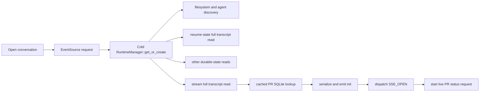

# Remove conversation-open blockers from the SSE connection critical path

## Observed journey

- Opening a conversation can leave the StateBar showing `connecting...` for a long interval.
- During that interval, the selected conversation's WorkScope PR controls and associated-PR summary are unavailable.
- The reported surface is the production deployment on port 8031, currently version `0.10.0` at deployed commit `38be61647c94`.

## Verified findings

- `StateBar` renders `connecting...` solely from the connection machine's `disconnected` / `connecting` states. PR state is not an input to that label.
- `useConnection` does not dispatch `SSE_OPEN` when the native EventSource transport opens. It waits for a valid named `init` event. The UI therefore calls all server-side pre-init hydration time “connecting.”
- The durable conversation already exists when this symptom occurs. The lazy object is its in-memory runtime: in deployed `v0.10.0`, `stream_conversation` waits for `RuntimeManager::get_or_create` to materialize that runtime before returning the SSE response. A cold runtime materialization performs filesystem discovery, agent catalog discovery, several SQLite reads, and resume-state reconstruction. Idle conversations cause resume reconstruction to read and deserialize the full transcript.
- The primary bottleneck matching the reported usage is transcript hydration: after runtime materialization, deployed `stream_conversation` reads and deserializes the same existing conversation's full transcript again before constructing `init`. Thus a cold open can perform two full transcript reads before the UI leaves `connecting`. This contradicts the current normative requirement that newest messages appear without waiting for the complete transcript (`REQ-CONV-002`).
- Cached PR summary is also included in `init`, but this is a local SQLite read via `primary_work_scope_pr_association`; it is not a live GitHub request. On the production database, the entire association table has only 196 rows and the tested scope lookup completed in roughly 0.05 ms. This is not a credible explanation for long delays.
- Rich/live PR status starts in `useConversationPrStatus` only after the conversation metadata from init supplies conversation mode and branch identity. Thus PR unavailability is mainly downstream of delayed init. The live PR request can have its own later latency, but it is not what keeps the connection machine in `connecting`.
- Production scale is material: `prod.db` is about 1.7 GB with 235,703 messages; individual conversations reach 2,157 messages / about 3.3 MB of serialized content. A read-only aggregate over all message rows took about 275 ms, while an unindexed grouping query used during diagnosis took about 10 seconds. Direct indexed reads for sampled conversations were fast while the host was quiet, confirming the symptom is intermittent/load-sensitive rather than a fixed PR delay.
- Browser measurements while the deployment was quiet showed EventSource init in about 121–404 ms for sampled conversations, so the reported long stalls were not reproduced continuously.
- Existing production traces do not currently expose time-to-first-init breakdown. Streaming root spans remain open for the life of EventSource and no child spans identify runtime creation, transcript hydration, serialization, or init emission. This prevents historical slow opens from being assigned to a specific pre-init phase.
- Current main has partial improvements not present in the deployment: terminal conversations no longer start runtimes and incremental transcript sync exists. Non-terminal cold runtime materialization remains on the init critical path.

## Failure model

`connecting...` currently means “waiting for a complete, valid init snapshot,” not merely “establishing SSE.” For an already-durable conversation, the server withholds that snapshot behind lazy in-memory runtime materialization and—most importantly for production-sized histories—complete transcript hydration, potentially twice on a cold open. PR UI cannot initialize until the same snapshot arrives, creating the appearance that connection establishment is blocked on PR data. Cached PR data is technically serialized into init, but its measured local lookup cost is negligible; it is collateral in an over-broad initialization barrier, not the root bottleneck.

## Owning invariant

A conversation's transport readiness and newest useful view must not wait for complete historical transcript hydration, cold runtime construction, or informational enrichment. PR metadata may enrich the view independently; failure or slowness in that enrichment must not hold the connection state open.

## Proposed scope

1. Add bounded, exportable time-to-init instrumentation around the conversation stream opening path:
   - request accepted to broadcaster subscription;
   - cold runtime acquisition/materialization;
   - resume-state reconstruction;
   - initial message selection/read;
   - cached PR lookup and browser-session lookup;
   - init serialization / first emission.
   Record conversation/message counts as bounded numeric attributes, not IDs or content. Ensure the measurement span completes when init is emitted rather than when the long-lived stream closes.
2. Remove lazy in-memory runtime materialization from the SSE-init critical path while preserving subscribe-before-snapshot replay correctness. Introduce a per-conversation single-flight owner that coalesces concurrent requests for the same absent runtime into one typed materialization operation and returns the same eventual handle/result to all runtime-requiring callers. Establish the SSE broadcaster/subscription independently so opening the existing durable conversation does not await that operation. Runtime materialization failure must be delivered explicitly rather than hidden in a detached best-effort task. Do not serialize unrelated conversations behind one global creation lock.
3. Make the first init obey `REQ-CONV-002`: send only the newest bounded transcript slice and use the existing incremental-history contract for older messages. Treat elimination of the deployed double full-transcript read as the primary latency fix. Replace resume recovery's complete-history dependency with a typed bounded recovery projection/query that contains exactly the tail evidence needed by `should_auto_continue`; do not merely truncate an input whose semantics require older history.
4. Keep cached PR summary as optional local enrichment, but do not let PR data define connection readiness. If even local enrichment is unavailable or unexpectedly slow, emit init without it and let the existing `useConversationPrStatus` refresh path populate the PR rail after connection.
5. Clarify the frontend lifecycle so transport/open/init phases are truthful. At minimum, keep `ready` tied to a usable init while exposing instrumentation; preferably distinguish “stream connected, loading conversation” from network “connecting” if the server can open the transport before usable init.
6. Preserve replay ordering, stable transcript snapshot semantics, reconnect cursor behavior, runtime recovery, and stale-owner guards.

## Starting symbols

- `crates/phoenix-ide/src/api/handlers.rs::stream_conversation`
- `crates/phoenix-ide/src/api/handlers.rs::read_stream_init_messages_with_tail`
- `crates/phoenix-ide/src/runtime.rs::RuntimeManager::get_or_create`
- `crates/phoenix-ide/src/runtime.rs::RuntimeManager::determine_resume_state`
- `crates/phoenix-ide/src/api/sse.rs::sse_stream`
- `ui/src/hooks/useConnection.ts` (`OPEN_SSE`, `init` listener)
- `ui/src/hooks/connectionMachine.ts`
- `ui/src/hooks/useConversationPrStatus.ts`
- `specs/conversation-ui/requirements.md` (`REQ-CONV-002`, `REQ-CONV-005`, `REQ-CONV-006`)

## Regression and journey validation

- Backend test: an existing durable, non-terminal conversation with no resident runtime can produce its first usable init without awaiting runtime materialization completion.
- Backend concurrency test: multiple runtime-requiring callers for one conversation coalesce into exactly one materialization and observe the same typed result; callers for different conversations are not serialized behind each other.
- Backend test: a large transcript's first init is bounded to the newest slice, performs no complete-history read, and earlier history remains gap-free through incremental acquisition.
- Backend recovery tests: the bounded recovery projection preserves every `should_auto_continue` decision and restart-loop guard previously derived from full history.
- Backend test: runtime materialization failure after init is surfaced deterministically and does not corrupt replay sequencing.
- Backend test: delayed/failing cached PR enrichment does not delay init or fail the stream.
- Backend concurrency tests preserve subscribe-before-snapshot ordering and reconnect deduplication.
- UI test: `connecting` is not coupled to PR loading; PR controls transition independently after usable init.
- Production-scale fixture/browser journey: measure click-to-native-open, click-to-init, click-to-newest-messages, and click-to-cached/live-PR on a cold runtime and a 2,000+ message transcript.
- Trace verification: every conversation open emits a completed time-to-init span with phase durations even while the SSE remains connected. A production trace must distinguish runtime materialization wait, recovery projection, transcript slice read, PR cache lookup, serialization, and first init emission so a future slow open has an attributable phase.

## Risks

- Materializing an absent runtime after init introduces races with messages/state changes; broadcaster subscription and replay floors must be established before either snapshotting or starting recovery. The single-flight owner must also handle cancellation, failed materialization, and removal/retry without leaving a permanently pending slot.
- Resume-state logic currently consumes complete message history. Replacing it requires a typed bounded recovery query, not an arbitrary truncation that changes crash-recovery decisions.
- Partial transcript init must retain exact message identity and sequence invariants across reconnects and history pagination.

## Explicit non-goals

- Do not optimize live GitHub API latency in this task unless the new phase instrumentation proves it delays a post-init PR refresh.
- Do not add sleeps, optimistic fake-ready states, or hide genuine network reconnect failures.
- Do not rewrite the broader conversation runtime lifecycle or PR association model beyond what is required to remove these initialization barriers.
